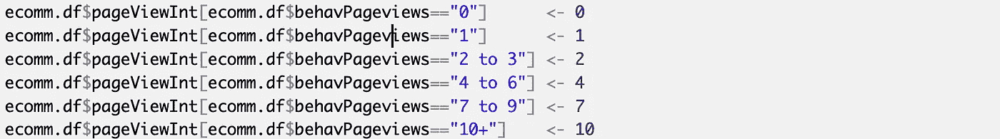
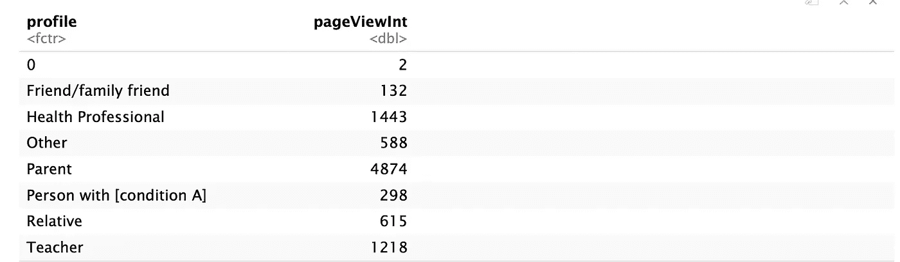
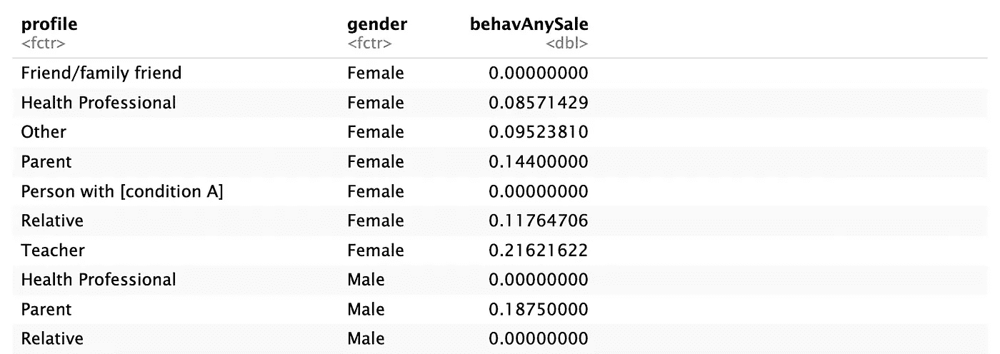
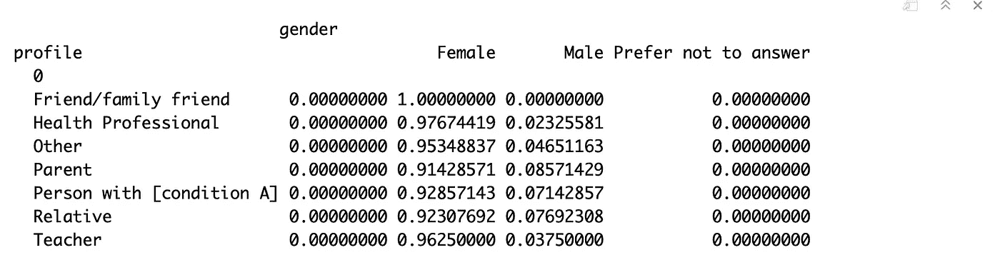
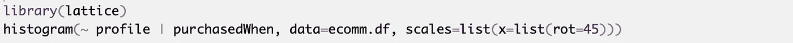
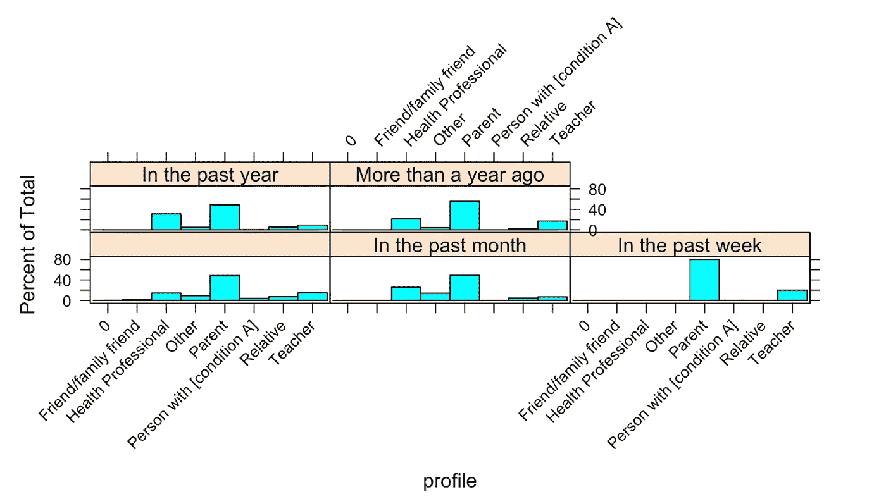

# 使用 R part3 进行营销分析

> 原文：<https://medium.com/analytics-vidhya/marketing-analysis-using-r-part3-36e5f4896dbe?source=collection_archive---------26----------------------->

调查群体/细分市场之间的差异有助于我们更好地了解市场。这里有一些有用的工具，我们可以用来做一些描述性的分析和可视化分组。

我仍然使用我第一篇文章中的数据集。在进行组间分析之前，我首先为页面视图创建了一个名为 pageViewInt 的整型变量。

当你试图了解市场时，你可能会问这样的问题:父母、老师和健康专家等有多少网页浏览量。

我推荐使用 aggregate()，因为它是解决这个问题的一个非常强大和简单的工具。

正如您所看到的，上面的行看起来很熟悉 y ~ x，一个公式使用波浪号运算符来分隔左边的响应变量和右边的解释变量。在 aggregate()的情况下，效果是根据配置文件的级别来聚合 pageViewInt。最后，我们将“sum”放入函数中，这样我们可以将每个组的页面浏览量相加。

我们甚至可以指定多个解释变量:y ~ x1 + x2 + …并在 aggregate()中使用这种格式。例如，如果您想知道哪种个人资料和性别的组合相对于观察总数的购买率最高。可以把性别加到“x”上，把函数改成“mean”。

既然我们提到了比率，您可能还想知道每个单元格相对于行或列的比例。例如，在各种访问者中，男女比例是多少？

在这里，我要介绍一下 prop.table():

如果你看过我的上一篇文章，你会知道 table(profile，gender)创建了一个双向频率表，margin = 1 指的是行。因此，prop.table()会自动计算每个性别相对于行(profile)的比例。

最后但同样重要的是，分组可视化在营销分析中也非常重要。如果您想查看哪个档案最近的购买量最大，该怎么办？

有一个有用的包叫做 lattice，它提供了一个有用的解决方案:histogram()

上面的函数理解公式符号，包括对因子的条件“|”，这意味着根据该因子将图分成多个窗格。您可能会注意到，波形符之前没有响应变量，后面只有解释变量(purchasedWhen ),因为 histogram()自动假设我们绘制了每个级别的个人资料的比例。因此，这个函数意味着我们根据 purchasedWhen 来调整绘图，告诉 histogram 为每个段生成一个单独的直方图。

非常感谢您的阅读！下次我会分享更多有趣有用的工具。