# 使用 R part4 进行营销分析

> 原文：<https://medium.com/analytics-vidhya/marketing-analysis-using-r-part4-1a06d7b7f51f?source=collection_archive---------25----------------------->

今天，我将分享一些有用的工具来比较组使用统计测试:卡方，t 测试，方差分析(ANOVA)和贝叶斯方差分析。

卡方检验用于如表()所示的频率计数。例如，如果您想知道以前的产品知识(变量 productKnewWhatWanted)在统计上对于教师和家长有显著的不同。您可以首先制作一个计数表，然后只选择测试所需的行和列。

我仍然在使用来自 https://goo.gl/hzRyFd 的数据集，并将其命名为 ecomm.df

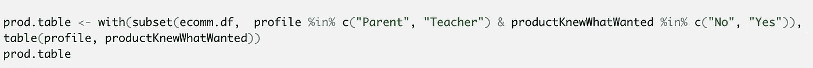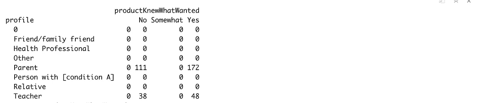

一般来说，chisq.test()对表进行操作。您可以看到，我创建的 prod.table 只包含家长和教师配置文件的计数。然后我应用了 chisq.test():

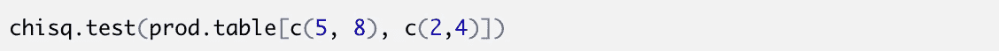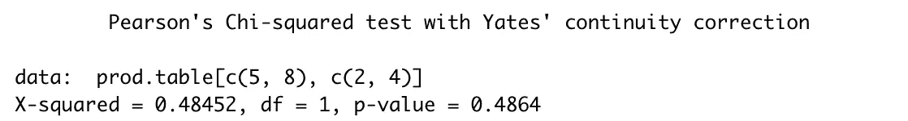

这里的无效假设是，教师和家长之间没有产品知识的先验差异。一般来说，小于 0.10 或 0.005 的 p 值表明组间存在差异。因此，p 值 0.4864 告诉我们，我们不能拒绝零假设。因此，我们的结论是，在卡方检验的假设下，我们的表格没有表明家长和教师群体之间在先前产品知识方面的真正差异。

t 检验将一个样本的平均值与另一个样本的平均值或特定值进行比较。重要的一点是，它比较的是两组数据的平均值。例如，如果我们想要比较家长和教师的平均页面浏览量(我在上一篇文章中创建的 pageViewInt ),我们可以使用 t.test()来了解他们的差异是否具有统计显著性以及差异的置信区间。

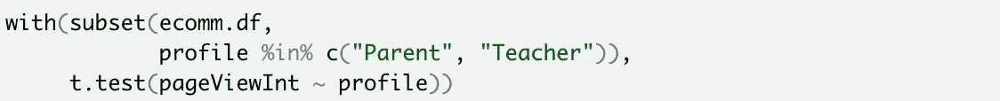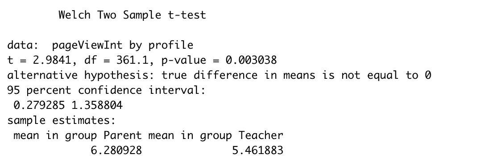

我们看到 t 统计量为 2.9841，p 值为 0.003038。这意味着否定了按档案组(家长和教师)划分的页面浏览量无差异的零假设。数据表明，母组的页面浏览量更高。接下来我们看到差异的 95%置信区间是 0.279285 到 1.368804。如果这些是较大人群的代表性数据，我们可以有 95%的置信度认为组间差异在这些值之间。

但是，如果我们想比较所有配置文件组的 pageViewInt 呢？然后我们需要使用方差分析测试。它比较多个组的平均值，假设各组具有相似的方差。

我们使用 aov()来建立模型，然后调用 anova()来显示标准的 ANOVA 汇总:

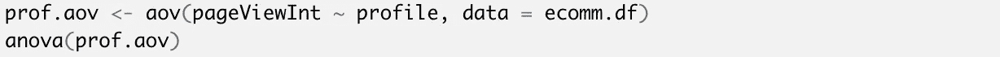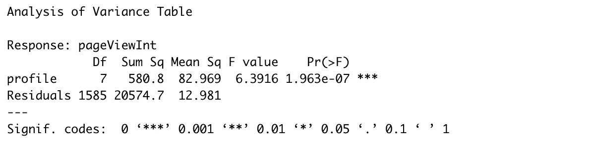

我们看到 Pr(>F)的值非常接近于 0，这证实了页面浏览量因档案而异。

我想分享的最后一个有用的工具叫做贝叶斯方差分析。让我们重复之前对教师和家长页面浏览量的比较。我们使用 lmBF()来指定我们的模型并设置一个伪随机数种子，因为该函数将从后验分布中提取。

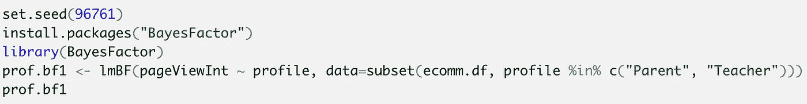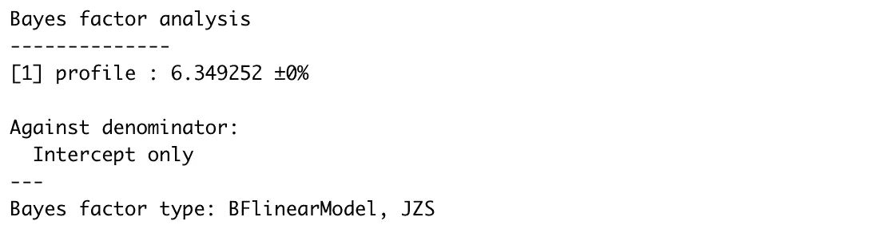

为了找到模型参数及其可信范围，我们使用后验()从模型 prof.bf1 中抽取 10000 个可能参数的样本。这些抽取被称为链，因为它们是由马尔可夫链过程估计的。我们应该首先使用 chain 对象上的 plot()检查绘制是否收敛到稳定值，然后我们可以使用 summary()检查参数:

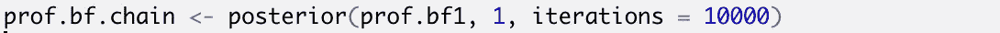

我们从图中选择 1:4 列，因为我们关心 4 个参数:总体均值和方差(mu 和 sigma)以及 2 个概况(教师和家长)的均值估计

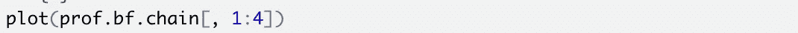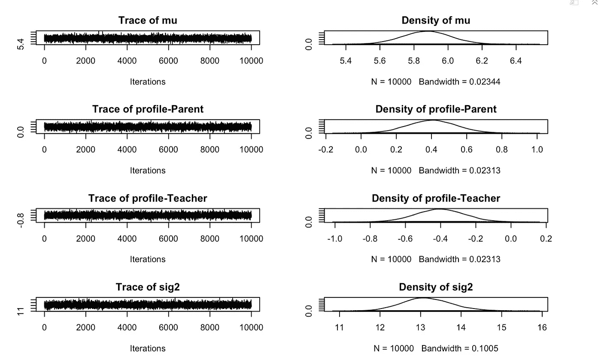

我们看到估计的参数值(y 轴)相对于绘制顺序(x 轴)绘制。这些形成了一条粗而直的线，这意味着估计值围绕一个稳定的中心点变化；他们就这样汇合了。在右边，我们可以看到这些值的密度图。密度形状近似正态，符合回归模型的假设。因此，图表证实了模型是稳定和收敛的。

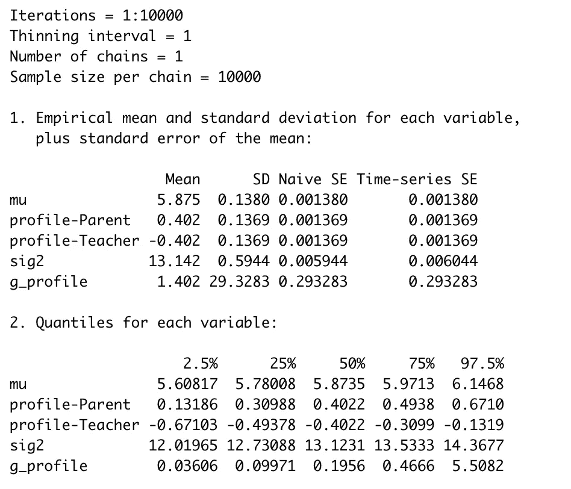

摘要的第一部分()给出了链中每个参数的 10000 次抽取的算术估计。第二部分是我们更喜欢使用的，它报告每个参数的实际观察分位数。

为了找到轮廓总数的最佳估计值，在每个绘图中找到轮廓总数。我们需要计算该级别的配置文件值，然后汇总这些估计值。为了理解这一点，让我们首先检查链对象:

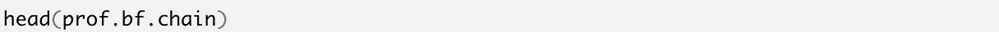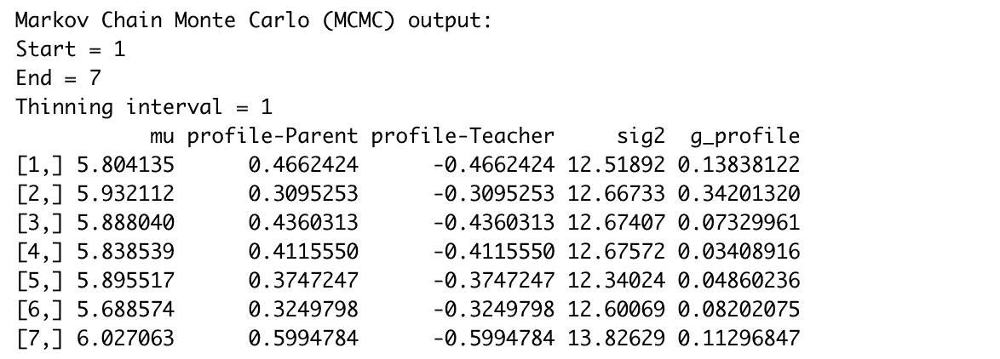

我们看到绘制的行(总共 10000 行)和每个概要文件的估计的列。然后，我们需要通过将第 1 列(人口估计 mu)添加到其他第 2-3 列(父母和教师)来计算概况的总数:

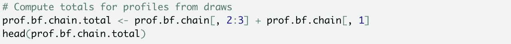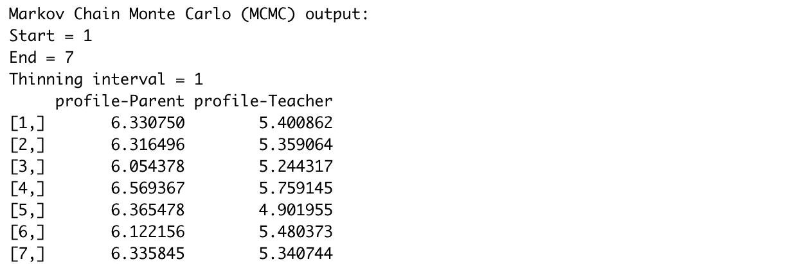

这是可行的，因此现在我们可以获得 95%可信范围的最佳估计值。对于按配置文件建模的平均页面浏览量的估计值，我们对每一列使用 apply()和 quantile()，以获得我们希望的 95%可信区间的概率:

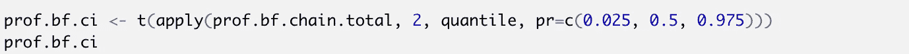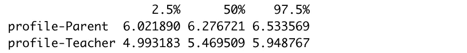

正如您所看到的，我们使用 2 表示按列操作，并使用 t()来转置结果，以便于阅读。

非常感谢您的阅读。下次我会分享更多有用的工具。长周末快乐！