# 营销分析:RFM 建模

> 原文：<https://medium.com/analytics-vidhya/marketing-analytics-rfm-modeling-855ebec18014?source=collection_archive---------3----------------------->

来源:https://swastikweb.com/assets/images/design-new1.png

说到营销，如果你试图和每个人交谈，你将很难接触到任何人。与具体、直接的沟通相比，模糊和笼统的信息更不容易引起受众的共鸣——这就是为什么在营销中锁定目标如此重要。

聪明的营销人员明白“了解你的客户”的重要性。营销人员必须遵循从增加点击率(点击率)到保留、忠诚和建立客户关系的范式转变，而不是简单地关注产生更多的点击。

与其将整个客户群作为一个整体来分析，不如将他们分成同类群体，了解每个群体的特征/行为，并让他们参与相关的有针对性的活动。

RFM 细分法是最受欢迎、最易于使用、最有效的细分方法之一，它使营销人员能够分析客户行为。

## 目录:

1.  介绍
2.  数据预处理
3.  探索性分析
4.  RFM 造型
5.  结论

# 1.介绍

RFM 代表新近性、频率和货币价值，每一个都对应一些关键的客户特征。这些 RFM 指标是客户行为的重要指标，因为频率和货币价值会影响客户的终身价值，而新近性会影响保留率，即参与度的衡量标准。

缺乏金钱方面的业务，如观众人数、读者人数或以冲浪为导向的产品，可以使用参与度参数而不是金钱参数。这导致使用 **RFE** (新近性、频率、参与度)——RFM 的变体。此外，该参与度参数可以被定义为基于诸如跳出率、访问持续时间、访问的页数、每页花费的时间等度量的合成值。

在本文中，我们将使用来自 UCI 机器学习知识库的在线零售数据集。

**数据集信息:**

这是一个跨国数据集，包含 2010 年 1 月 12 日和 2011 年 9 月 12 日之间发生的所有英国注册无店铺在线零售交易。该公司主要销售独特的适合各种场合的礼品。这家公司的许多客户都是批发商。

属性信息:

1.  *发票号*:发票号。名义上，分配给每笔交易的 6 位整数。如果此代码以字母“c”开头，则表示取消。
2.  *库存代码*:产品(项目)代码。名义上，一个 5 位数的整数，唯一分配给每个不同的产品。
3.  *描述*:产品(物品)名称。名义上。
4.  *数量*:每笔交易每种产品(物品)的数量。数字。
5.  *发票日期*:发票日期和时间。数字，每笔交易生成的日期和时间。
6.  *单价*:单价。数字，单位为英镑的产品价格。
7.  *CustomerID* :客户编号。名义上，一个唯一分配给每个客户的 5 位整数。
8.  *国家*:国家名称。名义上，每个客户居住的国家的名称。

在本文中，我将指导您完成 RFM 建模和分析的完整过程，根据客户的交易行为对他们进行细分。

# 2.数据预处理

任何建模/分析的首要步骤都是数据预处理。

为了进行分析，我们需要数据。这是数据集的链接。

首先，导入所有必要的库，加载数据并检查数据类型和缺失值。

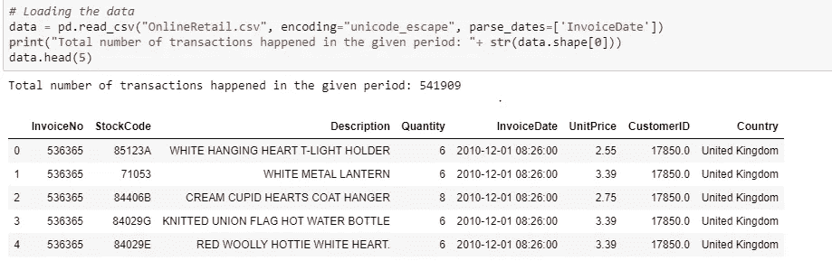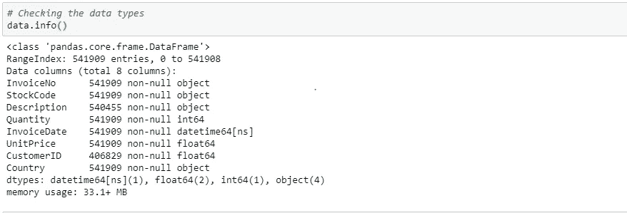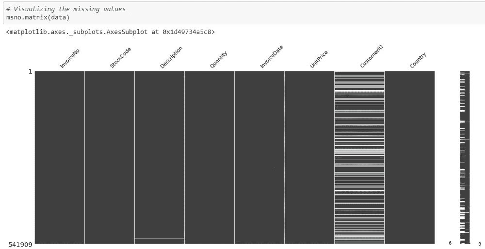

Description 和 CustomerID 列中似乎缺少值。

因为我们的分析目标是识别客户群，所以列 CustomerID 应该包含客户的唯一标识符。因此，我们可以删除 NA 值，因为没有 CustomerID 的数据对我们的任务没有太大帮助。

下面是删除 CustomerID 列中的 NA 值后的描述性统计信息。

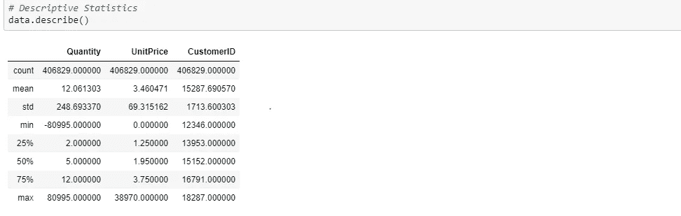

从描述性统计中，我们可以看到数量有负值。这可能意味着产品被退回/退款。

此外，购买的最大数量是 80.9K，但如果仔细检查，75%的数量值小于或等于 10。数量上的大值在这里是可能的，因为电子商务平台是面向批发商的。

单价的最大值是 13.5K，但是 75%的价格低于 5。让我们进一步探究这些高值的原因。

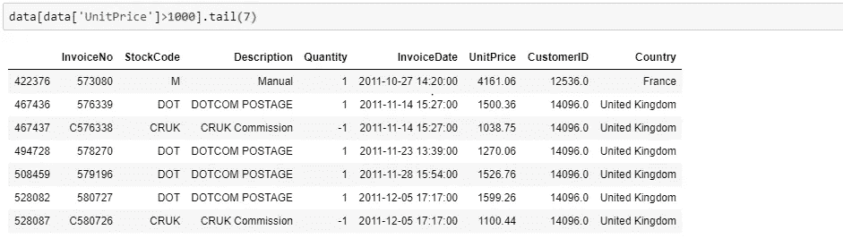

有一些奇怪的描述，如手册，邮费，网络邮费，克鲁克委员会，和折扣。让我们检查一下这些是什么意思:

1.  *邮费/网络邮费*:用户在邮费上花费的金额。
2.  CRUK 委员会:向英国癌症研究中心(CRUK)支付部分销售额的倡议。
3.  *人工*:由于没有合适的定义，我们可以认为这是为购买物品提供的人工服务。
4.  *折扣*:说明产品提供的折扣。

除了折扣，其他所有类别都不会直接影响销售。因此，我们可以将它们从数据中移除。

让我们从数量和单价来计算每笔交易的总销售额。

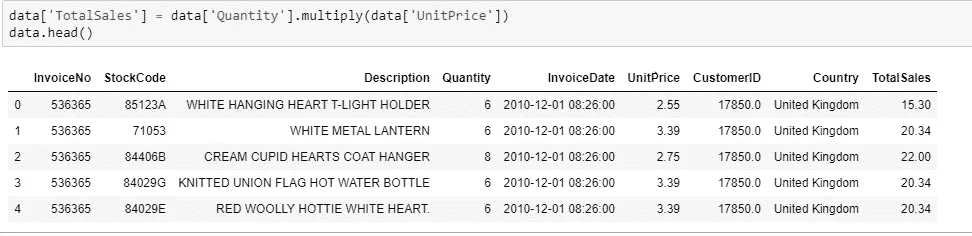

现在，数据已经被完全处理，以供进一步分析。让我们来看看数据的汇总。

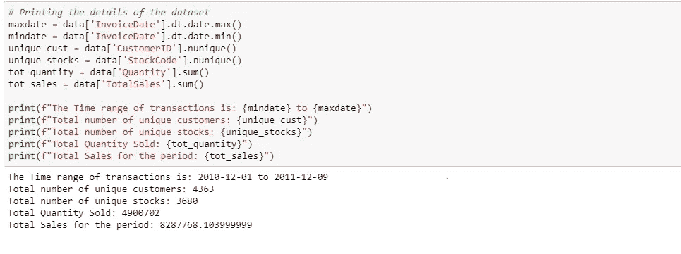

# 3.探索性分析

在开始建模之前，探索数据总是重要且必要的。这有助于我们更好地理解数据和我们试图解决的业务问题。

探索性数据分析有助于我们回答以下问题:

1.  平台中购买最多的产品有哪些？

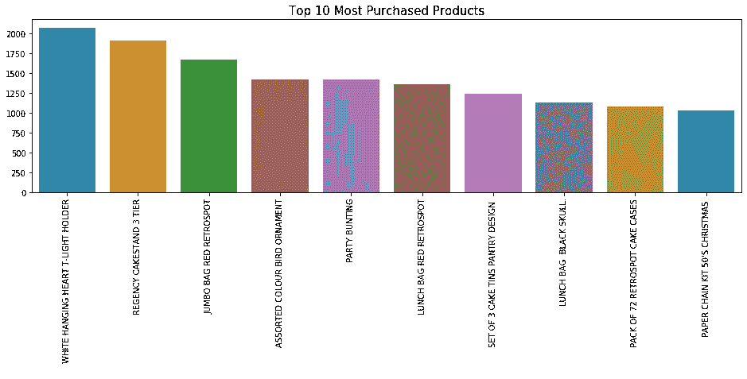

2.哪个国家的人交易更多？

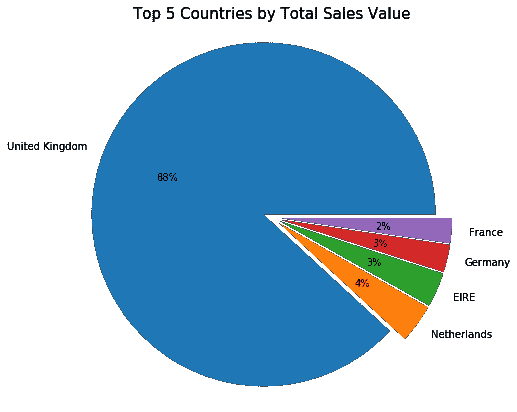

3.一周中的哪一天的哪一个小时是大多数交易发生的时间？

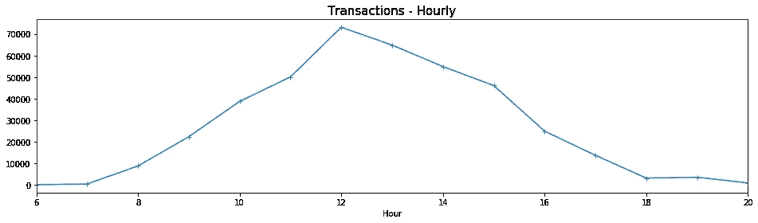

网站上的交易在早上 7 点左右开始增加，中午达到高峰。然后趋势慢慢降低，下午 6 点结束。

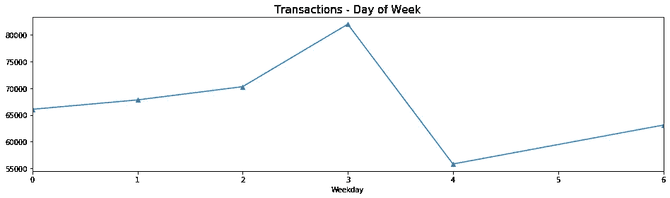

人们倾向于在周一到周四购买更多的东西。令人惊讶的是，数据中没有给定时间段内发生在星期六的交易。

4.给定期间的交易趋势是什么？

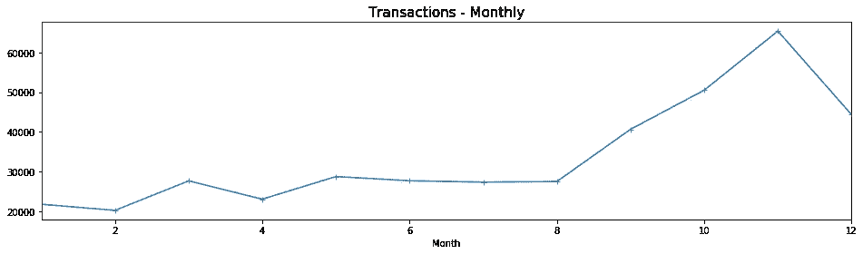

月度趋势显示，使用该平台的人数呈上升趋势。此外，增长率在 2011 年 8 月之前保持不变，从 2011 年 9 月开始快速上升。

12 月份的突然下降是因为我们只有截至 12 月 9 日的数据。

# 4.RFM 造型

为了进行 RFM 分析，我们需要从数据中创建 3 个要素:

1.  ***新近度*** *:* 最晚日期-最后一次发票日期。(自上次购买日期以来的天数)
2.  ***频率*** *: C* 发票号码的数量。(唯一客户进行的交易总数)
3.  ***货币*** *:* 销售总额。(每个客户的交易销售总值)

现在，让我们创建一个可用于生成 RFM 要素的函数。

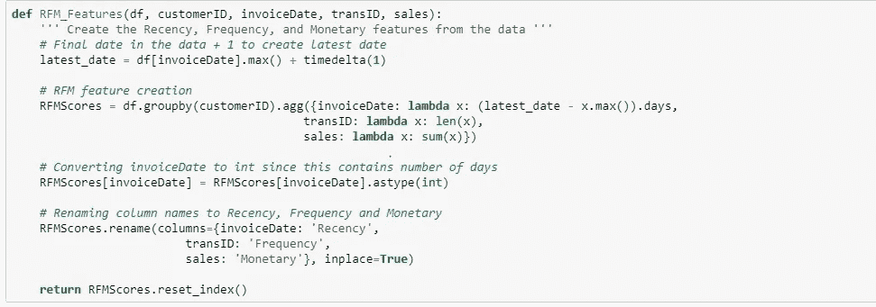

通过指定您正在处理的数据集中相应列的实际名称，上述函数可用于为任何数据集创建 RFM 要素。现在，使用此函数创建 RFM 要素。

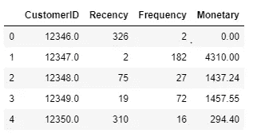

为了进行 RFM 分析，我们需要根据每个 RFM 属性分别对客户进行排名。

假设我们使用 RFM 值将这些客户从 1 到 4 进行排名。(1-低分和 4-高分)

**RFM 排名需要遵循的步骤:**

1.  按顶部的**最近购买的商品对最近一栏进行排序。对于频率和货币特征，按照顶部的**最频繁的**和**最有价值的**购买进行排序。**
2.  如果您使用 N 标度排序对客户进行排序，那么您必须将特性的排序值分成 1/N 组。在这里，我们使用 4 级排名，因此我们需要将值分为 4 组。

我们可以使用 pandas***df . quantile***方法，通过以列表形式提供分位数的数量来进行排序和分组。

**注意**:N 的值决定了您想要创建的不同 RFM 等级组的数量。对于所有三个 RFM 特征，从 1 到 N 的所有可能的等级组合导致从 111(最低)到 NNN(最高)的 N 个等级组。

在我们的例子中，N=4，因此我们可以有最多⁴ = 64 个等级组，得分从 111 到 444。

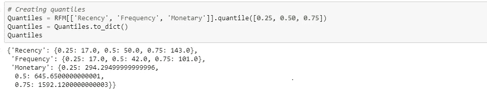

现在，我们将创建一个函数来给出每个属性的等级。

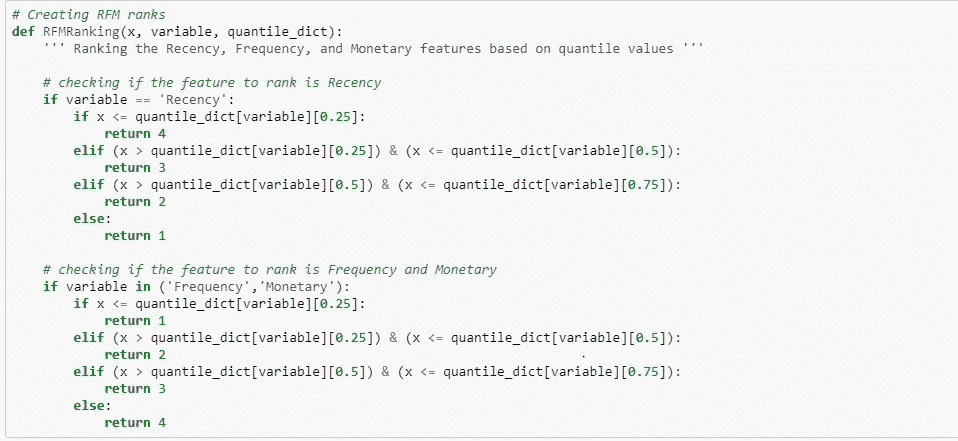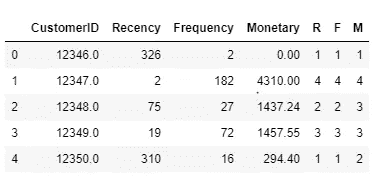

我们计算了 RFM 在客户层面的各项属性的排名。我们可以使用它来查找基于我们的排名尺度创建的排名组的总数。

为此，您可以简单地组合所有的 R、F 和 M 等级，以检查创建了多少个组以及每个组中的客户份额。

对于我们的例子，最大组数应该是⁴ = 64。

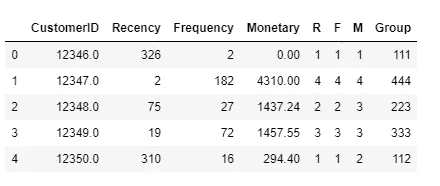

请注意，创建的总排名组是 62，这是有意义的，因为基于我们的排名尺度的最大组数是 64。

得到 62 个而不是 64 个等级组的原因是因为在 R、F 和 m 的等级中可能有一些丢失的组合。

最后，我们可以通过组合这些客户的 R、F 和 M 等级来为他们创建一个综合分数，从而得出一个总的 RFM 分数。下表中显示的 RFM 分数是通过对每个 RFM 属性赋予相等的权重而获得的单个 R、F 和 M 等级的平均值。

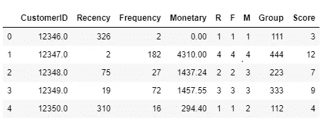

我们现在可以使用这个分数来为每个客户分配忠诚度级别，而不是处理 N 个等级组。忠诚度级别将捕捉客户的不同行为，并有助于根据他们的行为分析和锁定每个客户群。

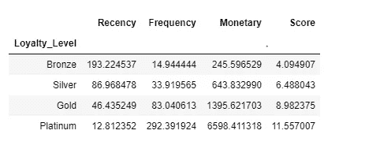

因此，我们成功地将基于个人 R、F、M 分数的 62 个细分市场分为 4 个宽泛的忠诚度等级。让我们探讨一下每个忠诚度级别的特征。

**每个忠诚度级别的客户行为和潜在目标技术:**

1.  **白金:**这一组人是更频繁的买家，自上次购买以来的平均天数为 13 天，他们在过去 1 年中在平台上交易的平均次数约为 292 次。此外，他们的平均销售额为 65000 英镑。
    *这些是你最忠实的顾客，他们最近购买，最经常购买，并且是大买家。奖励这些客户，让他们成为你未来产品的早期采用者，帮助推广你的品牌。*
2.  **金:**本组平均出现次数 83 次，近度 46 天。这个群体也是高消费群体，平均销售额约为 13000 英镑。
    *这些是你最近的顾客，他们平均消费了一大笔钱。提供会员或忠诚度计划，或推荐相关产品进行追加销售，帮助他们成为您的白金会员*。
3.  **白银:**这个群体的人大约在 87 天前在平台上有过一次交易。它们的频率和货币价值分别是 34 倍和 644 磅。
    *这些是你的顾客，他们购买了很多次，花了很多钱，但最近没有购买。向他们发送个性化的活动、优惠和产品推荐将有助于与他们重新建立联系。*
4.  **青铜级:**这是休眠组，自上次购买以来的平均天数为 193 天。他们在这个平台上交易了大约 15 次，平均销售额为 245 英镑。
    *这些是曾经在你的平台上访问和购买，但最近没有访问的客户。用相关的促销活动把他们带回来，进行调查，找出问题所在，避免他们被竞争对手抢走*。

# 5.结论

RFM 是一种数据驱动的客户细分技术，使营销人员能够做出明智的决策。它使营销人员能够快速识别用户并将其划分为同类群体，并针对他们制定差异化和个性化的营销策略。这反过来又提高了用户的参与度和忠诚度。

在这个分析中，我对每个 RFM 变量使用了等权重方案。但是，根据你的业务性质，你可以增加或减少每个 RFM 变量的相对重要性，以达到最终的分数。例如:

1.  在 ***耐用消费品*** 业务中，每笔交易的货币价值通常较高，但频率和新近性较低。例如，你不能指望客户每个月都购买一台冰箱或空调。在这种情况下，营销人员可以更加重视货币和近期因素，而不是频率因素。
2.  在 ***零售*** 业务中，客户每月或每周购买产品，因此他们将拥有比货币分数更高的新近度和频率分数。因此，可以通过给予 R 和 F 分数比 m 更大的权重来计算 RFM 分数
3.  对于像 Hotstar 或网飞这样的 ***流媒体*** 业务来说，一个狂热的观看者会比一个定期观看的主流消费者有更长的会话长度。对于 bingers 来说，参与度和频率可能比新近更重要，而对于主流者来说，新近和频率可能比参与度具有更高的权重，以得出 RFE 分数。

谢谢你读到这里。我希望这篇文章能够帮助您理解创建 RFM 模型背后的概念和过程。您可以按照以下步骤创建您的 RFM 模型来细分客户。

这里是完整的[代码](https://github.com/hariharan2305/Applied-Data-Science/blob/master/Marketing%20Analytics%20-%20RFM%20Modelling.ipynb)的链接。

快乐学习！！