# 营销分析|功能工程、模型选择和超参数调整的重要性

> 原文：<https://medium.com/analytics-vidhya/marketing-analytics-significance-of-feature-engineering-model-selection-and-hyper-parameter-53d34b57bc55?source=collection_archive---------12----------------------->

# 介绍

在本文中，我们将使用一个营销分析项目来执行**数据清理、特征工程、模型选择和超参数调整，并解释为什么使用**意义重大，让我们看看营销问题陈述来了解我们的数据集。

## 项目摘要:

网上购物的日益流行导致了新的经济活动的出现。要在竞争激烈的电子商务环境中取得成功，了解消费者意图至关重要。了解消费者意图的动机至关重要，因为这种意图是在这个快节奏和高度竞争的环境中生存的关键。先前的研究最多尝试对信息系统成功模型进行有限的调整，我们提出了一个全面的经验模型，将“使用”结构分为“使用意图”和“实际使用”。这使得测试用户意图在决定其网上购物行为中的重要性成为可能。我们的结果表明，消费者的使用意图是非常重要的，并准确地预测了消费者的使用行为。相比之下，消费者满意度对使用意向有显著影响，但与实际使用没有直接的因果关系。

# 目标:

1.  满足和清理数据
2.  特征工程
3.  使用机器学习对数据建模
4.  解决问题的策略陈述

该数据集也在 Kaggle: [***网上购物者的意向***](https://www.kaggle.com/roshansharma/online-shoppers-intention) 的金盘 csv 文件中提供给我们

# 迎接数据

收集数据

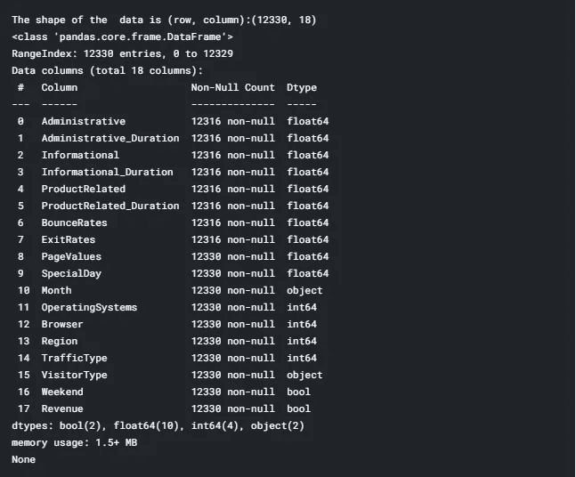

***数据集:***

数据集由属于 12，330 个会话的特征向量组成。数据集的形成使得每个会话在一年的时间内属于不同的用户，以避免任何倾向于特定的活动、特殊的日子、用户简档或时期。

***属性:***

*   **收入** = >类是否能创造收入
*   **管理、管理持续时间、信息、信息持续时间、产品相关和产品相关持续时间** = >表示访问者在该会话中访问的不同类型页面的数量以及在每个页面类别中花费的总时间。
*   **跳出率** = >从该页面进入网站，然后离开(“跳出率”)而没有在该会话期间向分析服务器触发任何其他请求的访问者的百分比
*   退出率在会话中最后退出的百分比
*   **页面价值** = >特征表示用户在完成电子商务交易之前访问的网页的平均值
*   **特殊日** = >表示现场访问时间与特定特殊日(如母亲节、情人节)的接近程度，在该特殊日，会议更有可能最终达成交易。例如，对于情人节，该值在 2 月 2 日和 2 月 12 日之间取一个非零值，在该日期之前和之后取零，除非它接近另一个特殊的日子，其最大值为 2 月 8 日的 1
*   **操作系统、浏览器、地区、流量类型** = >不同类型的操作系统、浏览器、地区和流量类型用于访问网站
*   **访客类型** = >顾客是回头客还是新访客
*   **周末** = >一个布尔值，表示访问的日期是否是周末
*   **月** = >一年中的哪个月

# 数据清理

让我们检查缺失的值

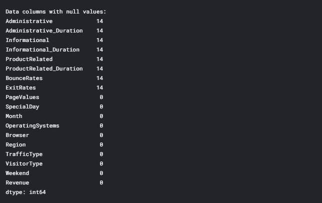

如果你已经注意到在图中，没有空值显示。但是在检查每条记录时，我们在 8 个特征中有 **14 条空记录。让我们决定如何处理这些丢失的记录**

# 处理缺失值

**第一部分**

管理、信息和产品相关功能是页面类型，从技术上讲，它们是名义数据。所以我想我们用中值来估算数据，在此之前，我们将最小值设为 0(页面类型设为 0 意味着它应该是空值)也应该被视为 NaN 值，所以我们将其转换为 NaN 值并估算。

我们现在已经找出了隐藏在数据集中的实数空值。让我们用中位数来估算它们

**第二部分**

我们只剩下页面持续时间跳出率和退出率，其中-1 是持续时间的最小值(时间不能为负),它应被视为空值，而 0 持续时间(时间不能为零)发生在页面类型为 0 时，这是我们之前估算的，因此我们可以将其转换为 NaN 并估算。
对于比率，我们可以直接估算 NaN 值(这里我们不需要担心比率的跳出率为 0，因为在许多情况下，跳出率可能为 0，因为用户肯定喜欢该网站并转向其他网页进行交易)

我们现在已经找出了隐藏在数据集中的实数空值。让我们用平均值来估算它们

我们已经处理了所有的空值。让我们进入特征工程

# 特征工程

现在让我们稍微处理一下数据，然后进入特征工程。

## 处理异常值

异常值增加了数据的可变性，从而降低了统计能力。因此，排除异常值会使您的结果具有统计学意义。让我们通过箱线图来检查我们的数值特征异常值

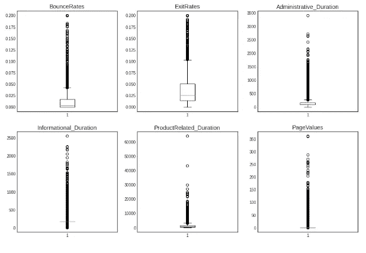

OOF，我们有很多异常值，如果你注意到 informational_duration 和 page 值，它们没有任何分布，如果你移除异常值，就会剩下一个值。因此，除了这两个特征，我们正在通过 IQR 方法去除异常值

## IQR 方法-去除异常值

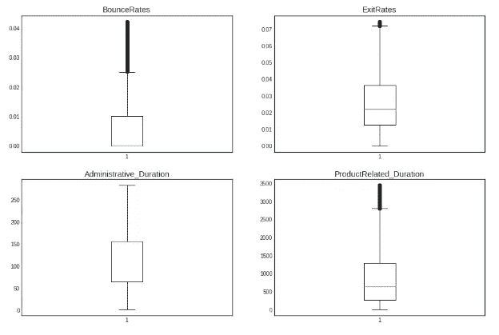

我们已经去除了大量的异常值！

## “特殊的一天”——特色俱乐部！

这里我打算加入 ***特殊日*** 特性，它有 0.2，0.4，0.6，0.8，1。因此，让我们将这些值组合起来，并基于一个条件替换这些值。这些是概率值，所以

*   如果大于 0.4，则为“1”，表示这是一个“特殊的日子”。
*   如果小于或等于 0.4，则为 0，表示“不是特殊的一天”

现在，让我们将值改为布尔值，因为这样更有意义

*   1-真-特殊的一天
*   0-假-不是一个特殊的日子

## 转换 d 型

因为我们有被识别为数字的分类变量。我想最好将它们转换成类别

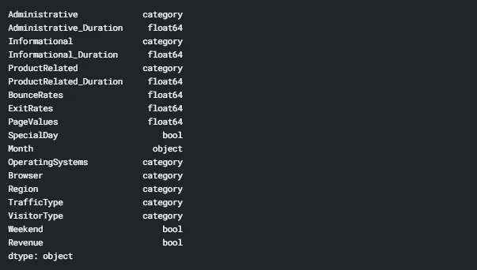

## 特征缩放

真实世界数据集包含在量值、单位和范围上有很大差异的要素。当要素的比例不相关或具有误导性时，应执行归一化；当比例有意义时，不应进行归一化。

使用欧几里德距离度量的算法对幅度敏感。在这里，特征缩放有助于对所有特征进行同等加权。

从形式上来说，如果数据集中的某个要素与其他要素相比规模较大，那么在测量欧几里德距离的算法中，这个大规模的要素将占主导地位，需要进行归一化。

**特征缩放至关重要的算法示例**
1。 **K-Means** 在这里使用欧几里德距离度量特征缩放关系重大。
2。 **K 近邻**也需要特征缩放。
3。**主成分分析(PCA)** :试图得到方差最大的特征，这里也需要进行特征缩放。
4。**梯度下降**:随着特征缩放后θ计算变得更快，计算速度增加。查看本文了解更多: [*分析 Vidhya*](https://www.analyticsvidhya.com/blog/2020/04/feature-scaling-machine-learning-normalization-standardization/)

**注意:**朴素贝叶斯、线性判别分析和基于树的模型不受特征缩放的影响。简而言之，任何不是基于**距离的算法都不会受到特征缩放的**影响。**对于我们的问题陈述，这是可选的，因为我们将使用随机森林模型(您可以跳过这一步)******

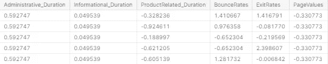

我们已经使用标准缩放器缩放了我们的数字特征

## 标签编码

使用 Sklearn 库可以实现 Python 中的标签编码。Sklearn 提供了一个非常有效的工具，用于将分类特征的级别编码成数值。用 0 和 n_classes-1 之间的值对标签进行编码，其中 n 是不同标签的数量。如果某个标签重复，它会将之前分配的相同值分配给。查看此博客了解更多: [*分析 Vidhya*](https://www.analyticsvidhya.com/blog/2020/03/one-hot-encoding-vs-label-encoding-using-scikit-learn/)

让我们使用标签编码器对月份特性进行编码

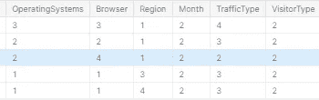

我们已经编码了所需的特性，让我们通过特性选择来修剪我们的特性

## 特征选择

**极度随机化树分类器(Extra Trees Classifier)** 是一种集成学习技术，它将收集在“森林”中的多个去相关决策树的结果聚合起来，以输出其分类结果。在概念上，它与随机森林分类器非常相似，只是在森林中构造决策树的方式上有所不同。查看本文了解更多详情: [*分析 Vidhya*](https://www.analyticsvidhya.com/blog/2016/12/introduction-to-feature-selection-methods-with-an-example-or-how-to-select-the-right-variables/)

让我们检查特征的重要性，并修剪我们的特征，使我们的模型表现良好。

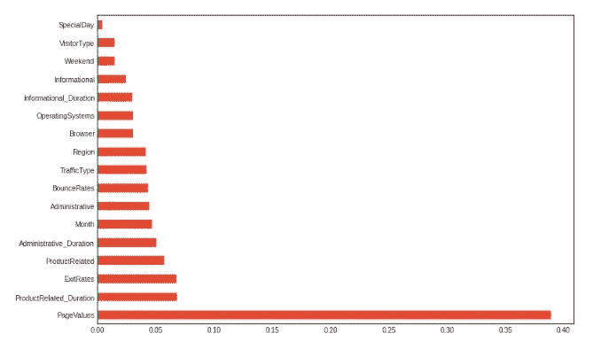

从柱状图中，我们可以看到基于其对输出的影响的特性的重要性。让我们来看看前 14 个特性

## 培训和测试分离(80:20)

让我们删除所需的特性，将数据分成训练和测试两部分

# 模拟我们的数据

让我们进入构建机器学习模型的关键阶段。在检查“什么可能是预测的最佳算法”之前，我们必须决定“为什么”。这非常重要。

## 为什么？

我们的主要目的是预测是否有由于这些特性的值而产生的收入交易。输出要么是 0，要么是 1。所以我们可以决定我们可以使用分类模型来解决我们的问题

## 什么？

为了决定什么可能是最好的分类模型，让我们不要浪费时间运行模型。相反，我们通过创建管道来编写质量代码，并一次检查所有模型的准确性。之后，我们将根据它的准确性选择一个模型。

# 型号选择

## 使用交叉验证

**交叉** - **验证**是一个重采样过程，用于在有限的数据样本上评估机器学习模型。该过程有一个称为 k 的参数，它指的是给定数据样本要被分成的组的数量。因此，该程序通常被称为 k 倍**交叉** - **验证。**阅读本文了解更多: [*分析 Vidhya*](https://www.analyticsvidhya.com/blog/2018/05/improve-model-performance-cross-validation-in-python-r/)

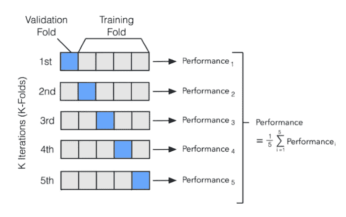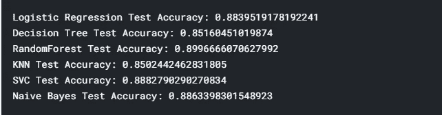

从测试结果来看，我们可以选择**随机森林**作为我们的模型。它给了我们更准确的结果，因为它是一个集合模型。接下来，我们还将通过管道测试我们的选择。

## 使用管道

一个**机器学习管道**用于帮助自动化**机器学习**工作流程。它们通过使一系列数据在一个模型中进行转换和关联来运行，该模型可以被测试和评估以获得结果，无论是积极的还是消极的。阅读本文更多内容:[分析 Vidhya](/analytics-vidhya/what-is-a-pipeline-in-machine-learning-how-to-create-one-bda91d0ceaca#:~:text=A%20machine%20learning%20pipeline%20is,outcome%2C%20whether%20positive%20or%20negative.)

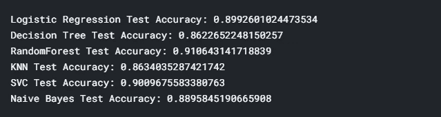

太好了。我们从模型中得到了相当精确的结果。我们可以看到**随机森林**作为集合模型具有最高的准确性。它通常具有更高的精确度。让我们选择最好的模型

# 具有超参数调整的随机森林

在**机器学习**中，**超参数优化**或**调优**就是为一个**学习**算法选择一组最优的**超参数**的问题。这些度量被称为**超参数**，并且必须被**调整**，以便模型能够最优地解决**机器学习**问题。你可以从这个博客中读到更多的细节

让我们建立一个带有超参数调整的随机森林分类器模型

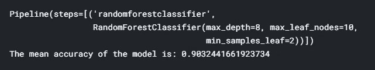

我们得到了模型的最佳参数，平均准确率为 90.3%

## 将所有参数拟合到模型中

让我们将通过超参数调整获得的所有参数拟合到实际模型中

我们有 90.3%的准确率。伟大的

# 没有任何洞察力的分析有什么用？

这是我们文章的一个简短的附录部分，展示了这个数据集的 EDA，并提出了一些策略来改善公司的营销工作。

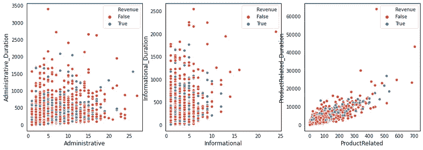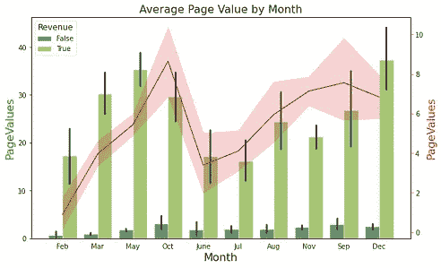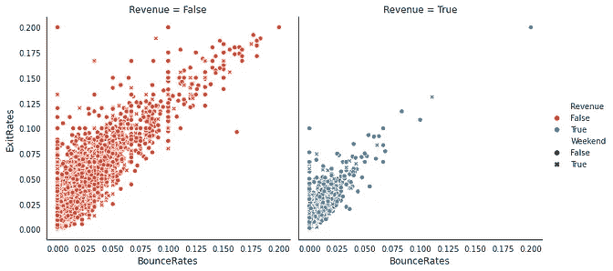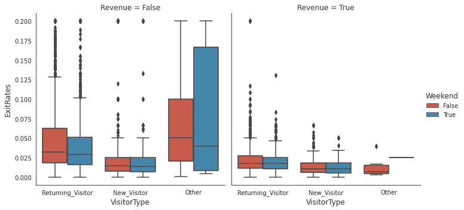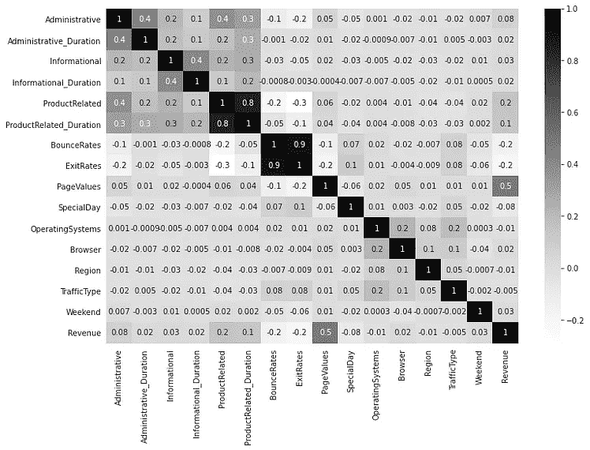

PageValue 的重要意义在于，客户会关注完全不同的产品及其推荐。因此，对推荐引擎和捆绑包的重大改进将带来更多的转化。在电子商务中包含更多利用长尾效应的产品也将带来更多的收入驱动因素。

以下是修改后的指针，可以帮助提高转化率

1.  在用户界面中遵循极简主义的方法
2.  向访问者公开产品的价格和信息
3.  通过向他们提供有针对性的广告，如折扣和优惠，提高停留时间
4.  通过更快的刷新速度和吸引人的登录页面来降低跳出率，该页面具有专为访问者提供的高度针对性的产品
5.  向每位访客发送个性化电子邮件，并通过优惠券和产品的独家访问吸引忠实访客(回头客)