# 使用 Python、R 和 Excel 的数据集营销组合模型指南

> 原文：<https://medium.com/analytics-vidhya/marketing-mix-model-guide-with-dataset-using-python-r-and-excel-4e319be47b4?source=collection_archive---------0----------------------->

# 1.0 简介

什么是营销/媒体组合模式？

根据维基百科，**营销组合建模** ( **MMM** )是对销售和营销[时间序列](https://en.wikipedia.org/wiki/Time_series)数据进行[多元](https://en.wikipedia.org/wiki/Multivariate_statistics)回归等统计分析，以估计各种[营销](https://en.wikipedia.org/wiki/Marketing)策略([营销组合](https://en.wikipedia.org/wiki/Marketing_mix))对销售的影响，然后预测未来一系列策略的影响。

**关键目的:**通过评估不同营销渠道活动的有效性，MMM 有助于更好地了解各种营销活动如何推动产品的业务指标并提高投资回报率。

**营销组合建模** ( **MMM** )和**多触点归因建模(MTA)** 有什么区别？

对于电视、广播或杂志等离线媒体，不可能跟踪个人印象或点击。MMM 模型可以使用历史数据来测量每个离线渠道与在线渠道的总属性。

在数字世界中，数据更加丰富，大多数时候，我们能够捕捉个人点击和印象水平数据。

换句话说，MMM 是一个聚合模型，而 MTA 是一个用户级模型。

MMM 和 MTA 模型能回答什么问题？

MMM 模型通常用于优化下一季度或下一年的广告金额。让 CMO 和财务团队做出支出和分配决策。并根据增量支出做出投资决策。

而 **MTA** 大部分时间是用于数字预算分配和短时间投资。此外，了解哪些数字渠道或活动有效或无效。

参见我的另一篇文章[多点接触归因营销模式——沙普利价值方法](/analytics-vidhya/the-shapley-value-approach-to-multi-touch-attribution-marketing-model-e345b35f3359)。

# MMM 的常见数据类型

基本变量:

1.  季节性:例如，圣诞节期间的销售额通常高于平均销售额。
2.  宏观经济数据:CCI、通货膨胀、失业率、国内生产总值等。
3.  产品销售价格:基础价格，平均价格。售价
4.  分销:产品销售的商店数量或地点数量。分销链会影响业务成果。例如，库存产品可能会导致销售额下降。

增量变量:

1.  广告数据:电视/广播/报纸/杂志/搜索/展示/社交媒体/赞助/加盟/内容营销等。
2.  促销数据:提供优惠的次数/天数。例如，免费送货、0% APR 或返现等价格促销没有任何广告支持，也不会推动销售。

其他:

1.  销售:没有销售变量就不可能建立 MMM 模型。通常被认为是 MMM 中的因变量。销售额可以是单位数量，也可以是收入(美元)。
2.  广告支出数据:从内部营销团队或外部营销机构获取支出数据。

# **2.0 数据准备和数据转换**

行业标准通常会选择一个**周时间段**。这是因为月度数据粒度太长，而每日级别的数据变化太大，导致准确性较差。因此，每周聚集数据是创建 MMM 模型的最佳实践。

# **滞后、遗留效应和形状效应**

让我们谈谈媒体变量的转换。在典型的决策模型中，销售对媒体变量的反应趋于线性。但是，众所周知，由于消费者反应延迟等原因，广告效果不会立即生效。

因此，我们将考虑这些对我们媒体转型的影响。

**滞后:**广告影响可能会影响到以后的某个时间，例如 1 周。

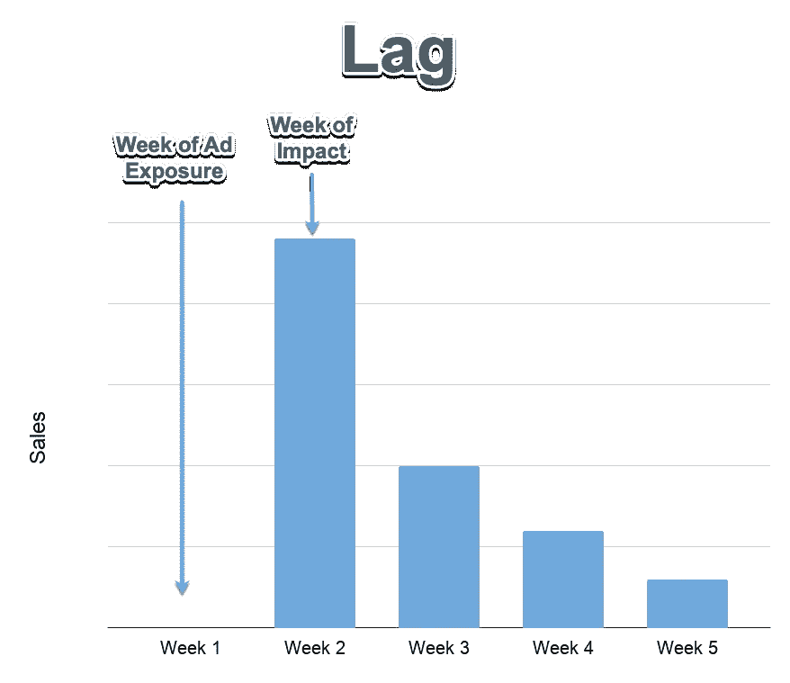

图表 1:滞后效应

**延续效应:**广告的“保留率”对广告发生后的时期有影响。衰变=1 -残留

例如，如果衰减为 0.7，公式=本周活动*0.7 +上周活动*(1–0.7)。第一行的最后一个活动将为 0。

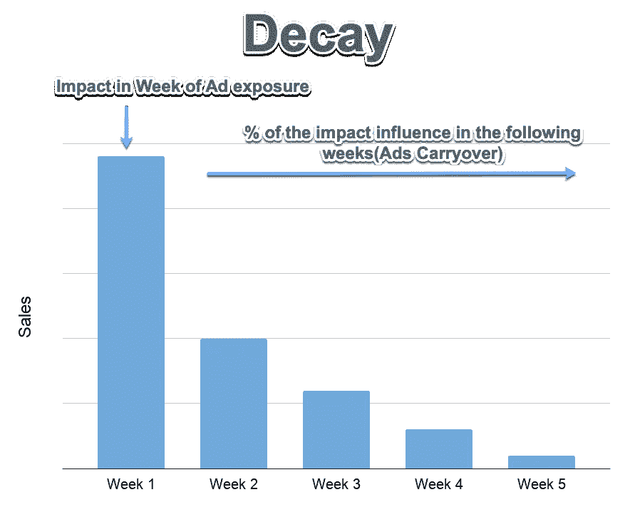

图表 2:衰变= 1-遗留效应

**曲线:**解释广告饱和水平和收益递减的反应曲线。

在我稍后给出的演示示例中，我们将使用图表 3 中下面的**凹曲线**的**功率曲线**。凹形是营销组合模型中使用最广泛的形状。

参见[文章](https://www.ashokcharan.com/Marketing-Analytics/~mx-mmm-sales-response-function.php)进一步解释为什么这种技术可以使用线性回归技术将非线性模型转换成估计模型。

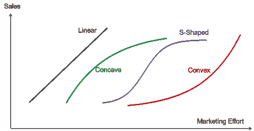

图表 3:不同销售响应函数的形状——https://www.ashokcharan.com/[的功劳](https://www.ashokcharan.com/)

我们将使用 3.2 媒体转型—电视、广播、报纸章节中的计算方法。

> **demo data advertising . CSV 等所有文件都可以在** [**这里下载**](https://github.com/yyviolin52/Media-Mix-Modeling) **。**

# 3.0 变量选择过程

**3.1 使用 VIF 检测多重共线性**

> *当回归模型中的两个或多个自变量高度相关时，会出现多重共线性。*

在真实的商业世界中，当我们构建营销组合模型时，常见的是**多重共线性**。因为营销活动通常会在同一时间进行。电视靠比例支撑，报纸可能靠杂志支撑。****

幸运的是，演示广告数据 VIF 没有超过 5，这意味着所有媒体变量都没有严重的多重共线性问题，因此我们将**在此演示中保留所有三个媒体变量**。

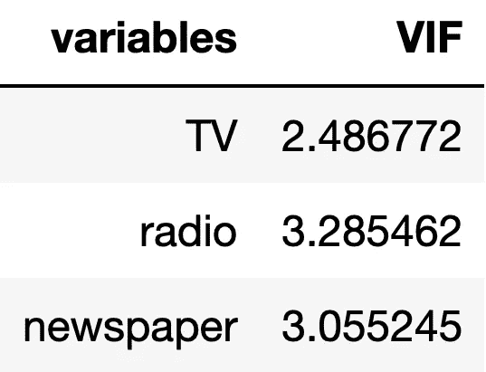

附件 8: VIF 分数

> *自变量的 VIF 分数代表该变量被其他自变量解释的程度。*
> 
> *VIF 超过 5 或 10 表示该自变量与其他变量之间存在高度多重共线性。*

**3.2 媒体转型——电视、广播、报纸**

我个人在这里使用 **python** 进行媒体转换。但是有很多其他工具可以做到这一点。例如，与 VBA 一起超越。

**我们将首先应用滞后，然后构建功率曲线，最后计算衰减值。我们之所以要给出不同参数的范围，是因为我们永远不知道哪个参数最适合我们的模型。因此，我们想尝试不同的组合。例如，我给每个参数五个不同的范围，在这种情况下，我们将有 **5x5x5 = 125 种媒体组合**。**

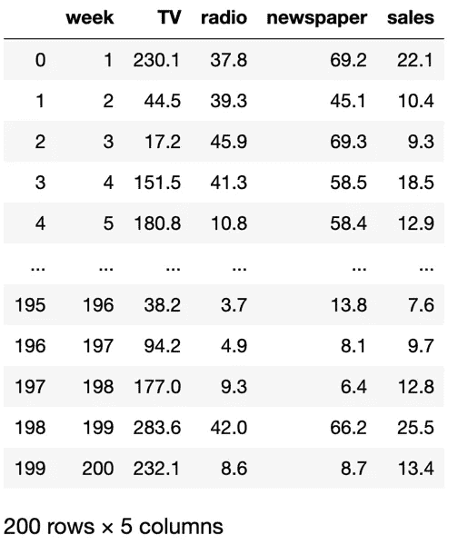

附件 4:原始数据

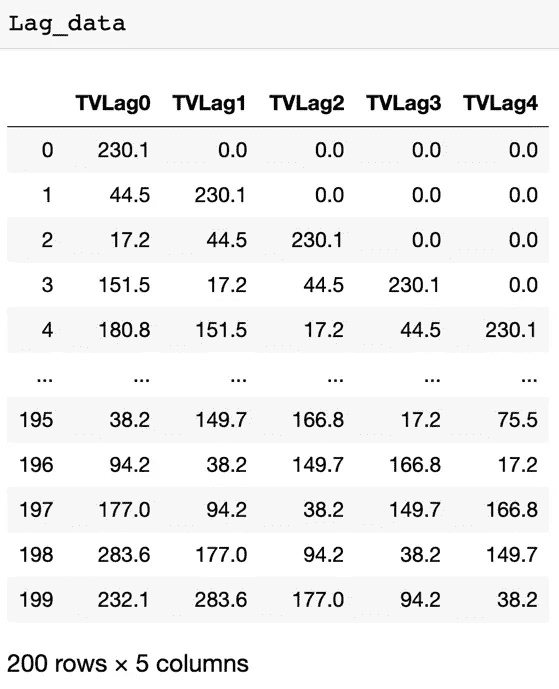

图表 5:第一次转变——滞后

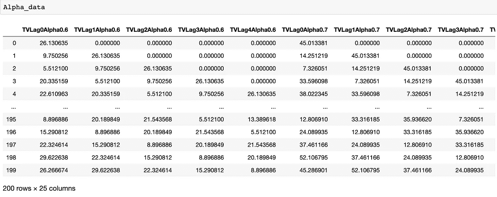

图表 6:第二次转换——应用功率曲线

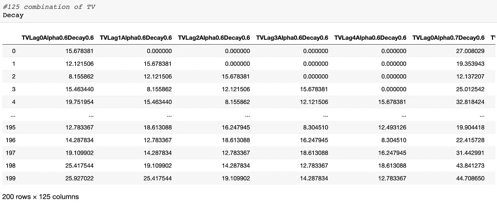

图表 7:第三次变换——计算衰减值

我们将对其余的其他媒体渠道采取同样的做法。

**3.3 通过排序最高相关性，从 125 个变换中选择前 3 个**

1.  找出媒体与销售的相关性

2.从每个媒体频道中选择前三个最高的正相关变换

我们寻找与销售有积极关联的媒体的原因是，我们通常期望广告对销售有积极的影响。高于 0.3 的相关性通常是好的，因为广告可能不总是投资。

我使用 python 来执行相关性选择，您可以使用 R 或 Excel 来进行选择。

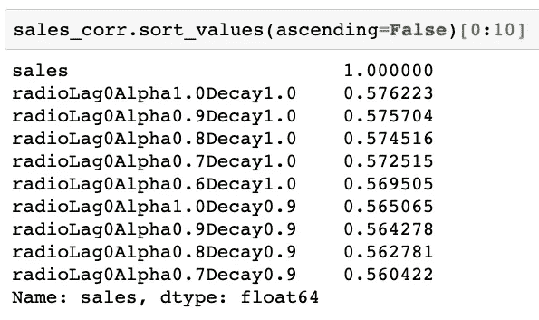

图表 8:9 大无线电变革

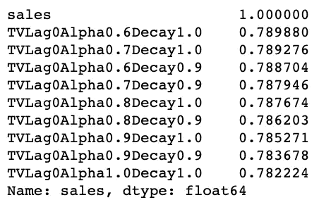

图表 9:9 大电视变革

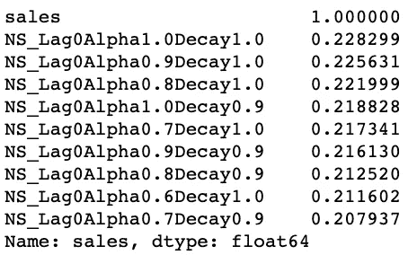

图表 10:9 大报纸变革

参见最后一个名为**‘All iterations . CSV’**的文件，我在其中合并了每个媒体频道的前 3 个媒体转换。

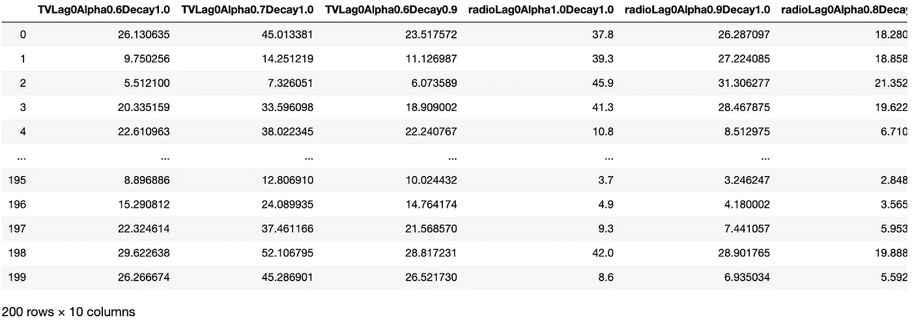

展示 11:所有迭代. csv

**3.4 在 R 中建立一个真/假矩阵**

我们将构建一个矩阵，稍后我们将应用它来生成线性回归公式。

因为我们只需要前三个变量中的一个媒体变量，所以我们可以过滤每个通道中重复变量的可能性。

这样，我们将把组合从 84 个减少到只有 3x3x3= 27 个组合。正如我们在下面的矩阵中看到的，每三列将只出现一次真**。**

**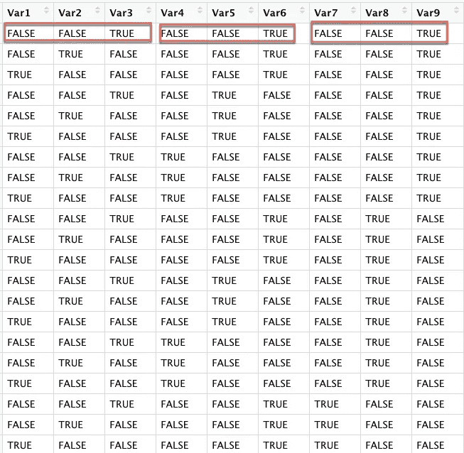**

**附件 12:矩阵**

****3.5 应用线性回归公式****

**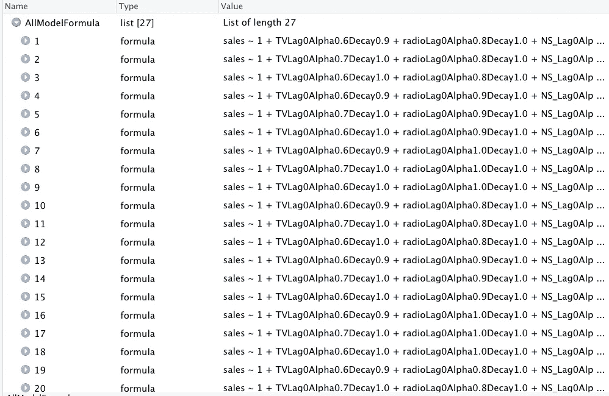**

**展示 13:应用“所有迭代”列名来生成 27 个公式**

****3.6 获取线性回归公式最终列表的结果****

**我们正在寻找的几个关键因素，模型中与销售正相关的媒体，T 值，调整后的 R 平方。**

**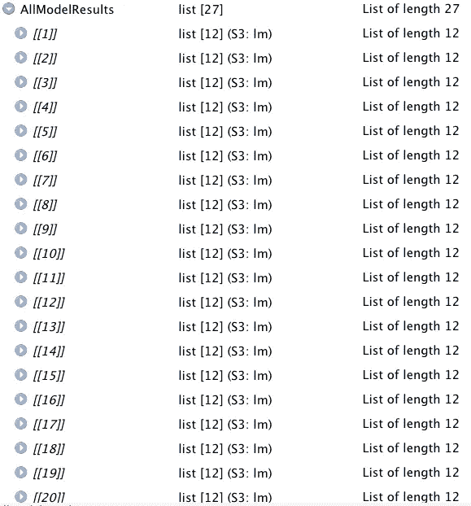**

**图表 14: 27 模型结果**

**见 [**results.csv**](https://github.com/yyviolin52/Media-Mix-Modeling) 此处。**

****3.7 选择最佳线性回归公式****

**在过滤后，只保留正的媒体相关性和相关性，我得到 2 个最终公式。我决定选择最高调整 R 平方为 0.9163961 的那个。**

****最终模型是:****

****销售~ 1(**0.5912092)**+TV lag 0 alpha 0.7 decay 1.0**(0.2761494)**+radio lag 0 alpha 0.9 decay 1.0**(0.2859621)**+NS _ lag 0 alpha 0.8 decay 1.0**(0.0009608111)**

**参见 [**Final.csv**](https://github.com/yyviolin52/Media-Mix-Modeling) 。**

****3.8 得到模型预测结果****

**通过使用最终的模型，我们得到了预测结果。**

# **4.0 模型结果(实际与模型)**

**现在我们完成了 MMM 最复杂的部分，即找到适合我们销售的模型。**

**通过观察图表，我们的模型很好地捕捉了实际销售额。**

**下载[**AVM . CSV**](https://github.com/yyviolin52/Media-Mix-Modeling)**

**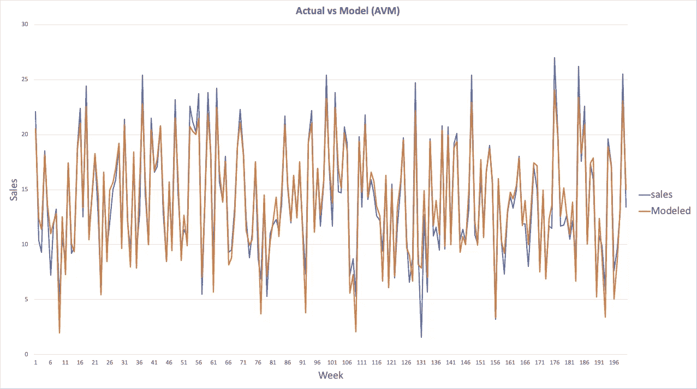**

**附件 15:实际与模型**

# **5.0 媒体增量贡献**

****5.1 贡献计算****

**让我们看看每个媒体是如何提升销量的。**

**得到**贡献=系数(来自模型)*活动(来自 final.csv)****

**正如我们注意到的，**报**的投稿非常非常有限。**

**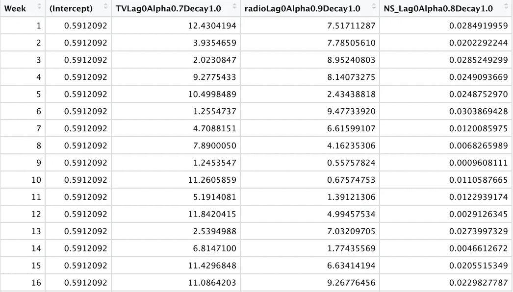**

**附件 16:贡献**

**下一步，我们将取消贡献以及媒体活动。**

**结合贡献、媒体活动和支出。**

**参见 **contribution_final.csv****

*****注:*****

1.  **为了更容易在 Tableau 中可视化，我将“第一周”更改为“2016 年 1 月 6 日”，依此类推。**
2.  ***拦截活动可以设置为 1，花费为$0。***
3.  ***假设每项活动的成本为:电视 3000 美元/项活动，广播 2000 美元/项活动，报纸 1000 美元/项活动。***

****5.1 不同媒体渠道的影响****

**媒体贡献影响同比%**

**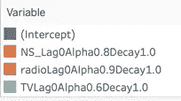****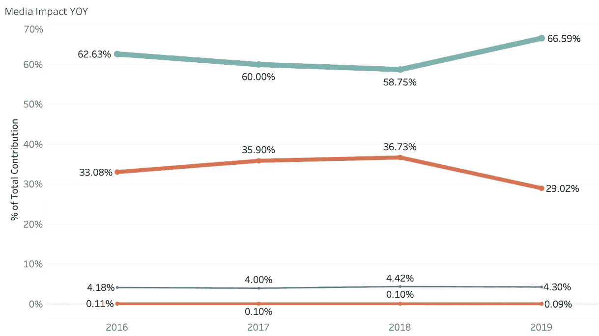**

**图表 17:媒体贡献影响同比百分比**

**在这种情况下，我们可以看到，拦截的是基础销售额(没有媒体)，报纸对销售额的贡献非常有限。请注意，这是演示数据。**

****在现实世界中，我会高度怀疑电视贡献，因为电视贡献对销售非常有影响。通常情况下，我认为 10% — 20%是正常的。****

****5.1 媒体效率&媒体效率投资回报率****

****媒介效果**是指被测活动的一个单位所获得的增量或基础量以上的额外量。**

****媒体效果=贡献(增量)/活动****

****媒体效率**，又名“投资回报”，是产生一个增量单位所需的营销支出。**

****投资回报率=收入(贡献 x 产品价格)/支出****

**我假设产品价格单位是**$ 75000**，你可能会把这个产品当成豪华车。**

**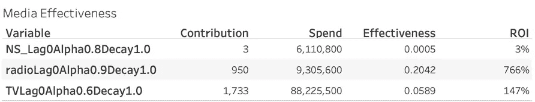**

**附件 18:媒体关键指标**

**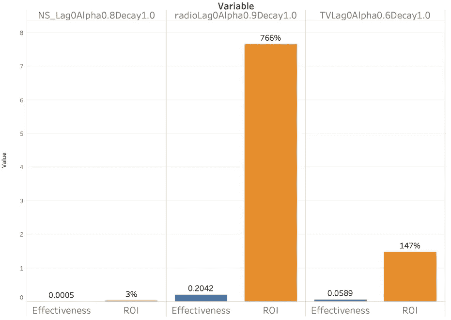**

**附件 19:媒体效果和投资回报率**

**在这里，我可以快速得出结论，电视的贡献最大(1，733)，广播的投资回报率最高(766%)和有效性最高(0.2042)，然而，报纸的投资回报率很低，只有 3%。**

# **6.0 预算优化解决方案**

**然后 CMO 和 CGO 提出了一个问题，我们如何更明智地花钱？让我们一起解决它，只要简单地使用 Excel 规划求解。**

**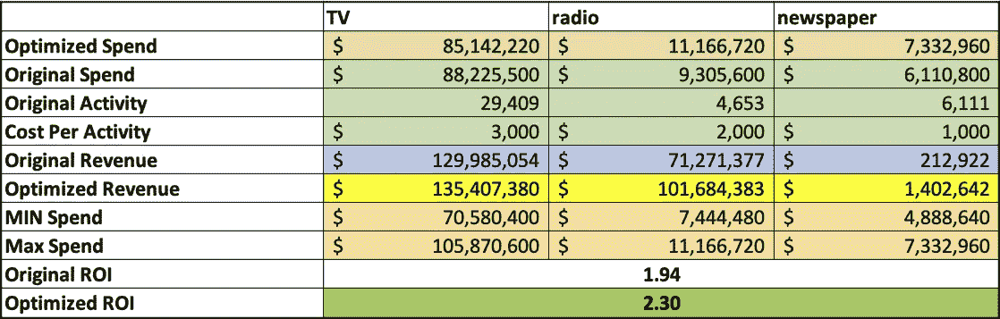**

**图表 20:优化的投资回报率**

**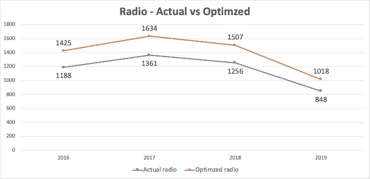**

**图表 21:无线电——实际支出与优化支出**

**我们将使用 Excel 规划求解来优化 ROI。所有媒体转换仍将保持不变。通过应用 Excel 求解器，用同样的媒体花费。我们将原来的投资回报率从 1.94 提高到了 2.30。**

**因此，我们可以将该模型应用于未来的媒体规划和销售预测。**

****求解器条件:****

1.  **目标是最大化投资回报率**
2.  **我们将改变媒体支出(优化支出)**
3.  **优化后的支出不超过或少于原始媒体预算的 20%**
4.  **支出总额应与原始金额保持一致**

**您可能会看到 [Solver.xlsx](https://github.com/yyviolin52/Media-Mix-Modeling)**

# **7.0 避免常见陷阱**

1.  ****坏数据输入，坏数据输出:**首先，好的 MMM 需要以相似的频率收集销售和营销数据。常见的错误是记录营销工作不如记录销售频繁。第二，有时数据本身是坏的，它可能得出异常值或缺失值。第三，媒体单元可能不兼容。例如，电视媒体将被计为总评分点(GRP ),而不等同于使用印象的数字世界展示广告。**
2.  ****共线性:**正如我们在前一章提到的，检查**多重共线性很重要。**因为广告商通常会同时增加/减少/暂停在多个渠道上的营销支出。例如，电视和广播支出在同一时间，金额相似，这种共线性使 MMM 很难确定电视或广播支出对销售的影响更大。**
3.  ****省略变量偏差:**例如，当产品的价格变化大幅降低或增加销售额时，但是，如果我们在模型中移除价格因素，其影响可能会错误地归因于某些营销支出中发生的同步变化，从而导致关于广告 ROI 的错误结论，进而可能误导营销策略。**

# **8.0 摘要**

**在这篇文章中，我用演示数据向你展示了 MMM 的基本知识。现实世界的情况可能更复杂。**

**作为营销专业人员，了解组织的营销环境并帮助营销团队最大限度地降低与不必要的媒体支出相关的风险是极其重要的。**

**现代广告之父约翰·沃纳梅克说过“我花在广告上的一半钱都浪费了；问题是我不知道是哪一半。”希望你能告诉 CMO/CGO，我们应该停止对哪个频道的投资，以及我们应该在哪里浪费媒体支出。**

**下面让我知道你的想法。如果你喜欢这个帖子，请点击下面的**鼓掌按钮**，别忘了在社交媒体上**分享它。****

**如果你感兴趣，也可以看看我的[多点触控归因文章](/analytics-vidhya/the-shapley-value-approach-to-multi-touch-attribution-marketing-model-e345b35f3359)。**