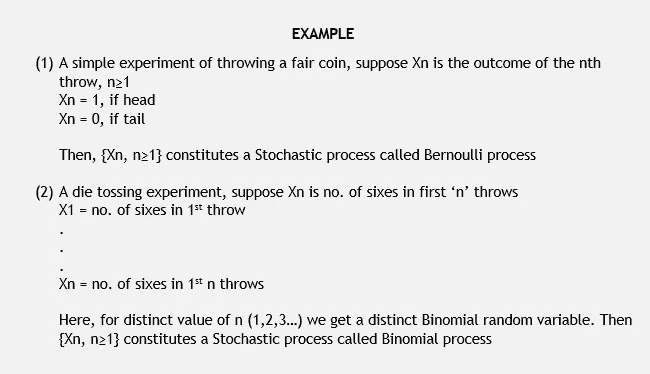
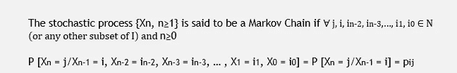
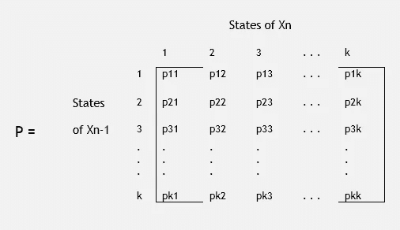
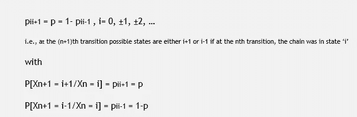
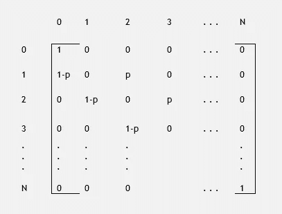
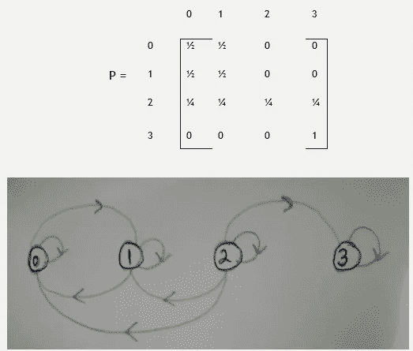
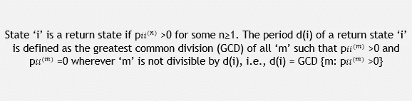

# 马尔可夫链:一个学术综述

> 原文：<https://medium.com/analytics-vidhya/markov-chain-an-academic-overview-2d8b10df783a?source=collection_archive---------20----------------------->

## 这篇文章纯粹从学术角度提供了一个基本的概述。

根据性质，分析可以大致分为三类——描述性的(告诉我们发生了什么)、预测性的(告诉我们最有可能发生什么)、规定性的(建议我们采取行动以取得结果)。在这篇文章中，我用预测分析的一个组件——马尔可夫链——进行了初步探讨。

传统上，预测分析或建模基于可用数据的历史来估计结果的概率，并试图理解潜在的路径。然而，当涉及到马尔可夫链时，情况就不一样了，它是一种在预测模型下的方法，这种方法被认为是快速的和最重要的基础，可以对当前情况下的结果或事件的概率进行估计。

这里我纯粹从学术角度分享一下马尔可夫链的概述和围绕它的常见概念。但是在开始讲马尔可夫链之前，这里先简单介绍一下什么是随机过程。

一个**随机过程**是一族在时间上有序的[随机变量](https://en.wikipedia.org/wiki/Random_variable)，描述了一些物理过程随时间的演化，即随机变量的集合{X(t)，t ∈ T}是一个随机过程，使得对于每个 t ∈ T，X(t)是一个随机变量。

*索引‘t’或以其他方式称为索引参数可以是时间、距离、长度等。并且 X(t)是过程在‘t’的状态。t 是参数空间*

马尔可夫链是参考随机过程的无记忆特性设计的，随机过程是任何过程的未来状态的条件概率分布仅依赖于且仅依赖于那些过程的当前状态。然后由数据科学家用来定义预测。

一维随机过程可分为四类过程。

1.  离散时间，离散状态空间*(例如:滚动骰子)*
2.  离散时间，连续状态空间*(例如:某一天的降雨量/温度)*
3.  连续时间、离散状态空间*(例如:按时间‘t’划分的到达人数、出生人数)*
4.  连续时间、连续状态空间*(例如:心电图、血压)*

**什么是状态空间和参数空间？**

**状态空间**是随机变量 X(t)可以假设的所有可能值的集合，状态空间是离散的，它包含有限数量的点，否则是连续的。

索引参数的可能值的集合被称为**参数空间**，其可以是离散的，也可以是连续的。

# 马尔可夫链

如果 Xn = j，则称该过程在时间‘n’处于状态‘j ’,或者是第 n 次转换的结果。因此，上述等式可以解释为，对于马尔可夫链，给定过去状态 Xo、X1、Xn-2 和当前状态 Xn-1，任何未来状态 Xn 的[条件分布](https://en.wikipedia.org/wiki/Conditional_probability_distribution)独立于过去状态，而仅取决于当前状态和经过的时间。

等式中的值 pij 是初始处于状态‘I’的过程在下一次转移中将处于状态‘j’的条件概率，该概率被称为 ***一步转移概率*** 。

> 然而，可以注意到，转移概率可以独立于或不独立于‘n ’,并且在这种情况下被称为同质或稳定转移概率。如果它依赖于 n，那么它是非齐次的。

在有“k”个状态的马尔可夫链中，会有 k2 个概率。矩阵形式的一步转移概率，称为 ***转移概率矩阵*** (tpm)。下面是具有非负元素且其阶=状态数(单位行和)的马尔可夫链的 TPM‘P’。

# 随机漫步

想象一个赌博游戏，假设一个赌徒在每次游戏中要么以概率“p”赢得 1 美元，要么以概率“q”输掉 1 美元。假设这个赌徒在破产(' 0 ')或获得$N 的财富时退出游戏。

这种情况可以用转移概率和马尔可夫链的概念来解释。其中假设马尔可夫链的状态空间是整数 i = 0，1，2，…被称为是一个随机行走模型，如果对于某个数 0 < p < 1

在一个过于简化的版本中，我们可以把上述随机行走的概念想象成一个在直线上行走的个体，他在每个时间点以概率‘p’向右或以概率‘q’向左走一步。赌博示例是有限状态随机行走，具有两个吸收障碍“0”和“N”，因此，如果 Xn 表示第 N 次游戏中游戏者的财富，则{Xn，n≥1]是具有以下 tpm 的马尔可夫链

# 马尔可夫链的转移图

它在可视化马尔可夫链方面有很大的帮助，并且对于研究像链的不可约性这样的性质也是有用的。

如果状态‘j’可从状态‘I’访问(表示为 i → j)。*顶点‘j’和‘I’通过指向‘j’的有向弧线连接。*一个图，其弧权为正，且弧权之和为 1，称为随机图。马尔可夫链的转移图是一个随机图。

> 状态‘3’是此马氏链的三类吸收状态(0 ← → 1，2，3)。在马尔可夫链中，一旦达到吸收状态，就不能离开。对于状态‘I’当 *Pi* ， *i* =1 时，其中 P 是马尔可夫链{Xo，X1，…}的转移矩阵

# 马尔可夫链的性质

通常对特定状态或整个马尔可夫链有各种各样的描述，可以允许进一步理解链的行为。

***(I)通信状态***——如果我们说状态‘I’和‘j’彼此可访问，那么它们形成通信状态。用 i ← → j 表示。通信关系满足以下条件

**(a)** 每个状态‘I’都与自身通信 **(b)** 如果 i ← →j 则 j ← → i **(c)** 如果 i← →j 且 j ← →k 则 i← →k

***【II】周期性***——周期 d(i)=1 的状态‘I’被称为**周期性**状态而‘I’被称为**非周期性**如果 d(i) > 1 当

周期性是一种类别属性，即属于同一类别的不同状态具有相同的周期。例如，如果状态' I '有句点' d '，状态' I '，' j '进行通信，则状态' j '也有句点' d '。

***(III)循环和瞬态*** -如果随机变量 Tjj 是粒子第一次返回状态‘j’的时间，其中 Tjj = 1，并且如果粒子在‘j’中停留一个时间单位，那么如果 P[Tjj < ∞]=1，则状态‘j’是循环的，如果 P[Tjj < ∞] < 1，则状态‘j’是瞬态的

> 马尔可夫链可以用来解决许多问题，从生物学到预测天气，从研究股票市场到经济学。如果可以使事件序列符合马尔可夫链，则可以使用马尔可夫链的概念来估计马尔可夫链假设。

如果你喜欢读这篇文章，或者相信其他人可能喜欢，请分享并鼓掌以示支持。也请随意发表评论。您可以在[*LinkedIn*](https://www.linkedin.com/in/palakhanna/)*上找到我，并可以查看我的*[*Tableau Public*](https://public.tableau.com/profile/palak.khanna#!/)*个人资料和我的* [*博客*](https://www.instagram.com/data.chatter/) *。*