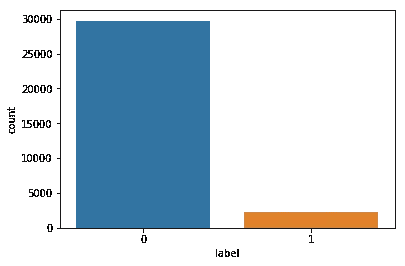
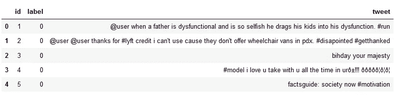
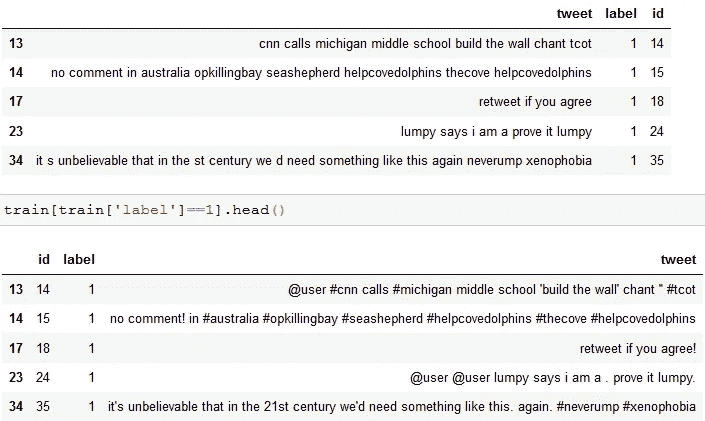
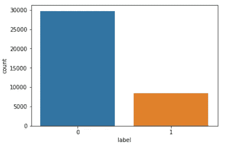

# 马尔可夫链自动 Tweets 生成器对不平衡数据集进行重采样

> 原文：<https://medium.com/analytics-vidhya/markov-chain-auto-tweets-generator-to-resample-imbalanced-dataset-b83055b8a1bb?source=collection_archive---------6----------------------->

## **利用马尔可夫链对数据集中的少数民族进行重新采样，证明了有希望的结果！**


不平衡数据集的示例:灰苹果占多数，而红苹果占少数

不平衡的语料库或数据集对监督机器学习人员来说一直是一个挑战。不平衡意味着并非数据集中的所有类都具有相同的大小，可能会偏向一个或多个类(多数)而不是其他较少出现的类(少数)。

在情感分析[挑战](https://datahack.analyticsvidhya.com/contest/practice-problem-twitter-sentiment-analysis/)中，训练数据集不平衡。该挑战旨在检测推文中的仇恨和辱骂言论。训练数据集包含人工判断的推文，0 表示没有仇恨或辱骂，1 表示没有。然后，使用训练数据集来预测测试数据集推文。

> 这是一个完整的 Python 工作示例

首先导入必要的库:

```
import pandas as pd, textblob, string
pd.set_option('display.max_colwidth', -1) #To show the whole tweet field
import numpy as np
import random
from sklearn.model_selection import train_test_split
from sklearn.pipeline import Pipeline
from sklearn.feature_extraction.text import TfidfVectorizer, CountVectorizer, TfidfTransformer
from sklearn.naive_bayes import MultinomialNB
from sklearn import metrics,svm
import seaborn as pl
import re
from nltk.tokenize import WordPunctTokenizer
from bs4 import BeautifulSoup
```

让我们探索数据集

```
#Import Training and Testing Data
train = pd.read_csv('train.csv')
print("Training Set:"% train.columns, train.shape, len(train))
test = pd.read_csv('test_tweets.csv')
print("Test Set:"% test.columns, test.shape, len(test))
#Percentage of Positive/Negative
print("Positive: ", train.label.value_counts()[0]/len(train_cl)*100,"%")
print("Negative: ", train.label.value_counts()[1]/len(train_cl)*100,"%")
'''
Training Set: (31962, 3) 31962
Test Set: (17197, 2) 17197
Positive:  83.45735868130633 %
Negative:  6.295807475218332 %
'''
#Show a bar chart to explore the difference in classes
pl.countplot(train["label"])
```



这两个类别之间的巨大差异(积极的推文与消极的推文)

# 特征工程

首先，我们需要清理数据集，如果我们打印前五条推文，我们可以看到以下内容:

```
train.head()
```



推文需要清理，我们需要删除用户提及，#标签，特殊字符等。

```
tok = WordPunctTokenizer()
pat1 = r'@[A-Za-z0-9]+'
pat2 = r'https?://[A-Za-z0-9/]+'
combined_pat = r'|'.join((pat1, pat2))def tweet_cleaner(text):
    soup = BeautifulSoup(text, 'lxml')
    souped = soup.get_text()
    stripped = re.sub(combined_pat, '', souped)
    try:
        clean = stripped.decode("utf-8-sig").replace(u"\ufffd", "?")
    except:
        clean = stripped
    letters_only = re.sub("[^a-zA-Z]", " ", clean)    
    # During the letters_only process two lines above, it has created unnecessay white spaces,
    # I will tokenize and join together to remove unneccessary white spaces
    words = tok.tokenize(letters_only)    
    sentence=[]
    for word in words:
        sentence.append(word)
        sentence.append(" ")
    words="".join(sentence).strip()    
    return words
nums = [0,len(train)]
clean_tweet_texts = []
for i in range(nums[0],nums[1]):
    clean_tweet_texts.append(tweet_cleaner(train['tweet'][i]))
nums = [0,len(test)]
test_tweet_texts = []
for i in range(nums[0],nums[1]):
    test_tweet_texts.append(tweet_cleaner(test['tweet'][i]))train_clean = pd.DataFrame(clean_tweet_texts,columns=['tweet'])
train_clean['label'] = train.label
train_clean['id'] = train.id
test_clean = pd.DataFrame(test_tweet_texts,columns=['tweet'])
test_clean['id'] = test.id
```

让我们对比一下清洗后的五条负面推文:



清洁前后的推文

# 马尔可夫链自动推文生成

为了减少训练数据集中多数类的偏差，我们需要对少数类进行上采样。我在[这篇文章](/@muabusalah/re-sampling-imbalanced-training-corpus-for-sentiment-analysis-c9dc97f9eae1)中测试过采样和欠采样技术。但后来我决定通过应用马尔可夫链从现有的推文中形成新的负面推文。

[**马尔可夫链**](https://brilliant.org/wiki/markov-chains/) 是一种数学模型，描述了一系列学术上可能发生的事件，其中每个事件的概率只取决于前一个事件达到的状态。

要构建这个链，需要将文本中的每个单词插入到字典中，其中的关键字是前一个单词，每次都要增加内部字典中该单词的计数器。这将生成一个字典，其中每个键指向所有跟随它的单词，以及实例的数量。出现的次数越多，这个词出现的机会就越大。

```
#constructing the normalized mapping (Outer Dictionary)
tempMapping = {}
'''tuple of words) -> {dict: word -> *normalized* number of times the word appears following the tuple}
Example: {('cnn', 'calls'): {'michigan': 1.0}
Contains the set of words that can start sentences'''
mapping = {}
starts = []
'''We want to be able to compare words independent of their capitalization. This is not strong case here as all data set consists of tweets which are normalized to small letter.'''def fixCaps(word):
    # Ex: "FOO" -> "foo"
    if word.isupper() and word != "I":
        word = word.lower()
        # Ex: "LaTeX" => "Latex"
    elif word [0].isupper():
        word = word.lower().capitalize()
        # Ex: "wOOt" -> "woot"
    else:
        word = word.lower()
    return word#Create Dictionary keys
def toHashKey(lst):
    return tuple(lst)
'''Returns the tweets, split into a list of words by adding . to the end of each tweet, there are no punctuation.'''
def wordlist(data):
    split_it = '. '.join([text for text in data])
    wordlist = [fixCaps(w) for w in re.findall(r"[\w']+|[.,!?;]", split_it)]    
    return wordlist'''addItemToTempMapping -- adds "word" to the "tempMapping" dict under "history".
tempMapping (and mapping) both match each word to a list of possible next words.
Given history = ["the", "rain", "in"] and word = "Spain", we add "Spain" to
the entries for ["the", "rain", "in"], ["rain", "in"], and ["in"].'''
def addItemToTempMapping(history, word):
    global tempMapping
    while len(history) > 0:
        first = toHashKey(history)
        if first in tempMapping:
            if word in tempMapping[first]:
                tempMapping[first][word] += 1.0
            else:
                tempMapping[first][word] = 1.0
        else:
            tempMapping[first] = {}
            tempMapping[first][word] = 1.0
        history = history[1:]
# Building and normalizing the mappingdef buildMapping(wordlist, markovLength):
    global tempMapping
    starts.append(wordlist [0])
    for i in range(1, len(wordlist) - 1):
        if i <= markovLength:
            history = wordlist[: i + 1]
        else:
            history = wordlist[i - markovLength + 1 : i + 1]
        follow = wordlist[i + 1]
        '''if the last elt was a period, add the next word to the start list'''
        if history[-1] == "." and follow not in ".,!?;":
            starts.append(follow)
        addItemToTempMapping(history, follow)
    # Normalize the values in tempMapping, put them into mapping
    for first, followset in tempMapping.items():
        total = sum(followset.values())
        # Normalizing here:
        mapping[first] = dict([(k, v / total) for k, v in followset.items()])# Returns the next word in the sentence (chosen randomly),
# given the previous ones.
def next(prevList):
    sum = 0.0
    retval = ""
    index = random.random()
    # Shorten prevList until it's in mapping
    while toHashKey(prevList) not in mapping:
        try:
            prevList.pop(0)
        except:
            prevList=random.choice(starts)
    # Get a random word from the mapping, given prevList
    for k, v in mapping[toHashKey(prevList)].items():
        sum += v
        if sum >= index and retval == "":
            retval = k
    return retvaldef genSentence(markovLength):
    # Start with a random "starting word"
    curr = random.choice(starts)
    sent = curr.capitalize()
    prevList = [curr]
    # Keep adding words until we hit a period
    while (curr not in "."):
        curr = next(prevList)
        prevList.append(curr)        
        # if the prevList has gotten too long, trim it
        if len(prevList) > markovLength:
            prevList.pop(0)
        if (curr not in ".,!?;"):
            sent += " " # Add spaces between words (but not punctuation)
        sent += curr
    return sent
```

现在让我们生成新的负面推文:

```
#extracting racist/sexist tweets
negativeTweets=train_clean[train_clean['label']==1]
newlyGeneratedTweets=pd.DataFrame()
#Repeat with the New Sentences for 3 times
for i in range(3):
    data = negativeTweets['tweet']
    markovLength = 2
    numberofsentences=data.size
    buildMapping(wordlist(data), markovLength)
    newTweets = []
    for i in range(numberofsentences):
        newTweet=genSentence(markovLength)
        # Sentence should have more than 10 chatachters
        if len(newTweet) > 15:
            newTweets.append(newTweet)
    d={'tweet':newTweets,'label':1}
    df=pd.DataFrame(data=d)
    newlyGeneratedTweets=newlyGeneratedTweets.append(df)
    newlyGeneratedTweets=newlyGeneratedTweets.reset_index()
    newlyGeneratedTweets=newlyGeneratedTweets.drop(['index'], axis=1)
    print(newlyGeneratedTweets.shape)
'''
(2057, 2)
(4101, 2)
(6160, 2)
'''
```

我选择生成大约 6k 条推文，并将它们添加到原始训练数据中，原因是不会遇到[过拟合](https://elitedatascience.com/overfitting-in-machine-learning)的情况，在这种情况下，对训练数据集的预测是完美的，但当涉及到测试数据时，性能不会那么好。

我通过使用[**GridSearchCV**](/datadriveninvestor/an-introduction-to-grid-search-ff57adcc0998)**微调参数来增强我的分类方法，但是我没有将它包括在这个例子中，我还尝试了不同的分类器，其中表现最好的是 [**MultinomialNB**](https://scikit-learn.org/stable/modules/naive_bayes.html)**

```
train_cl=train_clean.append(newlyGeneratedTweets)
#train_cl=train_cl.append(hateTweets)
train_cl=train_cl.drop(['id'], axis=1)
#Percentage of Positive/Negative
print("Positive: ", train_cl.label.value_counts()[0]/len(train_cl)*100,"%")
print("Negative: ", train_cl.label.value_counts()[1]/len(train_cl)*100,"%")
pl.countplot(train_cl["label"])
```

****

**现在少数民族增加到 22%左右**

**你可以删除小的推文，比如少于 10 或 125 个字符的。现在让我们分割训练数据并应用分类器来看看我们的方法是否工作良好**

```
# Remove small tweets
train_cl=train_cl[train_cl['tweet'].str.len()>15]
x_train, x_test, y_train, y_test = train_test_split(train_cl['tweet'],train_cl['label'], test_size=0.33, random_state=42)
pr=Pipeline([('vect', CountVectorizer(ngram_range=(1, 2))),
                     ('tfidf', TfidfTransformer(use_idf=True, norm='l2')),
                     ('clf', MultinomialNB(alpha=0.02))])
pr.fit(x_train, y_train)
predictions = pr.predict(x_test)
f1Score=metrics.f1_score(y_test,predictions)
print(f1Score)
```

**[f1 得分](/@muabusalah/twitter-hate-speech-sentiment-analysis-6060b45b6d2c)结果是压倒性的，为 0.9703465523401215，但当我们应用测试数据时，情况并非如此:**

```
#Now working with Real challenge Data
train_x=train_cl['tweet']
valid_x=test_clean['tweet']
train_y=train_cl['label']pr=Pipeline([('vect', CountVectorizer(ngram_range=(1, 2))),
                     ('tfidf', TfidfTransformer(use_idf=True, norm='l2')),
                     ('clf', MultinomialNB(alpha=0.02))])
pr.fit(x_train, y_train)
predictions = pr.predict(valid_x)
d={'id':test['id'],'label':predictions}
df=pd.DataFrame(data=d)
df.to_csv("test_predictions_MultiNomialNB_Markov.csv", index=False)
```

**将结果提交到竞赛页面后，我能达到的最好结果是:0.752655538694992，这超过了其他方法，我尝试了[完全随机化树](/@muabusalah/twitter-hate-speech-sentiment-analysis-6060b45b6d2c)和 [AllKNN](/@muabusalah/re-sampling-imbalanced-training-corpus-for-sentiment-analysis-c9dc97f9eae1) 。**

**完整代码可在 [gihub](https://github.com/mabusalah/TwitterSentimentAnalysis/blob/master/MarkovChainTweetAutoGeneration.ipynb) 上获得。**