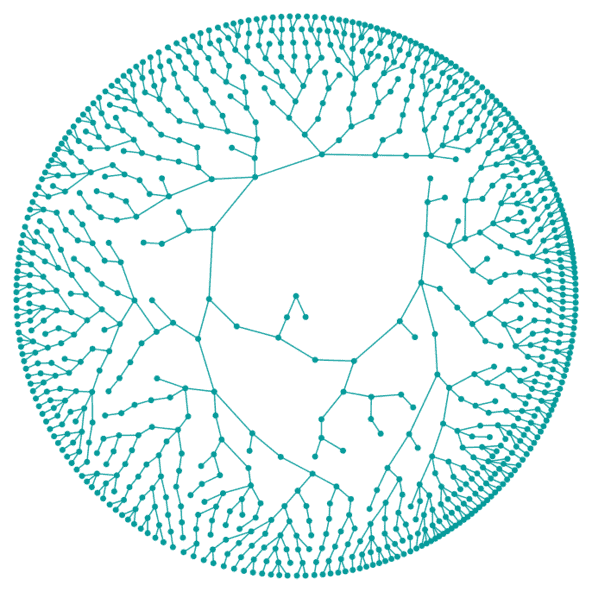

# 马尔可夫链蒙特卡罗

> 原文：<https://medium.com/analytics-vidhya/markov-chain-montecarlo-28dcde238e37?source=collection_archive---------1----------------------->

## 用 Python 进行可视化解释

马尔可夫链可以定义为一个随机过程 Y，其中 t 时刻每个点的值只取决于 t-1 时刻的值。这意味着我们的随机过程在时间 t 有状态 x 的概率，给定它所有过去的状态，等于在时间 t 有状态 x 的概率，只给定它在 t-1 的状态。