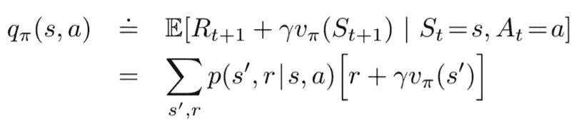

# 马尔可夫决策过程和贝尔曼方程

> 原文：<https://medium.com/analytics-vidhya/markov-decision-processes-and-bellman-equations-724abbd0a664?source=collection_archive---------9----------------------->

在[之前的帖子](/@theperceptiveagent/reinforcement-learning-machines-learning-by-interacting-with-the-world-64e5862dbf19)中，我们深入到强化学习的世界，了解了该领域一些非常基本但重要的术语。今天，我想讨论如何将一个任务框架化为一个 RL 问题，并讨论贝尔曼方程。当试图解决 RL 问题时，贝尔曼方程是绝对必要的。因此，我对这个话题的写作格外小心。

# RL 任务的类型

所有的 RL 任务都可以分为两种:
**1。情景任务:**通过上一篇文章中学习走路的例子，我们可以看到代理必须学会自己走到目的地。当代理成功到达目的地时会发生什么？由于这就是任务的全部内容，现在代理可以再次从起始位置开始，并尝试更有效地到达目的地。这是一个阶段性任务的例子。在这样的任务中，代理环境分解成一系列情节。情节任务在数学上更容易，因为每个动作只影响随后在情节中收到的有限数量的奖励。
**2。继续任务:**我相信读者们会熟悉像地铁冲浪者和神庙逃亡这样没完没了的跑步游戏。现在，想象一个代理试图学习玩这些游戏来最大化分数。但是，这些游戏没有尽头。这是一个持续任务的例子。另一个例子是一个代理，它必须将传入的 HTTP 请求分配给世界各地的各种服务器。只要服务器在线，该任务就将继续，并且可以被认为是一个持续的任务。

# 马尔可夫决策过程——未来取决于我现在做什么！

在强化学习中，所有问题都可以被框定为**马尔可夫决策过程(MDPs)** 。所有 MDP 的一个基本属性是未来状态仅依赖于当前状态。这是因为当前状态应该拥有关于过去和现在的所有信息，因此，未来只取决于当前状态。

用更专业的术语来说，未来和过去是**有条件独立的，**给定现在。

马尔可夫决策过程中典型的主体-环境相互作用。(资料来源:萨顿和巴尔托)

让我们看一个 MDP 的例子:

有三个状态(绿色圆圈)和两个动作(橙色圆圈)以及两个奖励(橙色箭头)的简单 MDP 的例子。[来源](https://en.wikipedia.org/wiki/Markov_decision_process)

在上图中，有三个州:S₀、S₁和 S₂，每个州有两个可能的操作:a₀和 a₁.箭头上的数字代表转移概率。例如，如果代理从 S₀州开始并在 a₀采取行动，则代理有 50%的概率到达 S₂州，还有 50%的概率返回 S₀.州在此 MDP 中，在 S₂拿下 a₁或在 S₁.拿下 a₀可获得 2 个奖励

# 贝尔曼方程

强化学习和动态编程中使用的值函数的一个基本属性是它们满足如下所示的递归关系:

价值函数的贝尔曼方程。(资料来源:萨顿和巴尔托)

我们知道，一个状态的价值是从该状态到最终状态的总预期回报。也可以这样想:如果我们在状态 *s* 采取一个动作 *a* 并在状态*s’，*结束，那么状态 *s* 的值就是在状态 *s* 采取动作 *a* 所获得的奖励与状态*s’*的值之和。

类似地，对于 Q 值:

## 贝尔曼期望方程

贝尔曼方程的这种递归更新特性便于状态值和动作值函数的更新。当代理按照策略π从一个状态前进到另一个状态时:

递归属性允许状态值和动作值函数从一个状态到另一个状态。([来源](https://lilianweng.github.io/lil-log/2018/02/19/a-long-peek-into-reinforcement-learning.html#key-concepts))

## 贝尔曼最优方程

如果我们只考虑最优值，那么我们只考虑最大值，而不是通过遵循策略π获得的值。

[来源](https://lilianweng.github.io/lil-log/2018/02/19/a-long-peek-into-reinforcement-learning.html#key-concepts)

很明显，如果代理熟悉环境的动态，找到最佳值是可能的。但是，对于大多数问题，转移概率 **Pᵃₛₛ'** 和 **R(s，a)** 是未知的。尽管如此，贝尔曼方程构成了许多 RL 算法的基础。

# 动态规划—在已知环境模型的情况下寻找最佳策略

如果环境的模型是已知的，[动态规划](https://en.wikipedia.org/wiki/Dynamic_programming)可以与贝尔曼方程一起使用，以获得最佳策略。这需要两个基本步骤:

## 政策评价

计算策略 **π** 的状态值 **Vπ** 。这叫做**政策评估**。

其中 **π(a|s)** 是在策略 **π** 下，在状态 ***s*** 中采取行动 ***a*** 的概率，期望值由 **π** 下标，表示它们以 **π** 被遵循为条件。

## 政策改进

假设我们已经为任意确定性策略 **π** 确定了价值函数 **Vπ** 。对于某些状态*我们想知道是否应该改变策略，确定性地选择一个动作*≦***【π(s)***。
一种方法是在*中选择 ***a*** ，此后遵循现有策略 **π。*****

****

**假设选择一个动作***a***≦***π(s)***并遵循现有策略 ***π*** 而不是选择当前策略建议的动作，那么可以预期，每次遇到状态 ***s*** 时，选择动作 ***a*** 将总是优于这导致了更好的总体政策。这就是*政策改进定理*。**

## **策略迭代**

**一旦一个策略 ***π*** 已经使用 **V *π*** 进行了改进，以产生一个更好的策略***【π’***，然后我们可以计算**V*【π’***，并再次对其进行改进，以产生一个更好的***π】***因此，我们可以获得一系列单调改进的策略和值函数:**

****

**策略迭代以获得最佳策略**

**比方说，我们有一个策略π，然后通过贪婪地采取行动产生一个改进的版本π’。这个改进的π’的值肯定会更好，因为:**

****

**[来源](https://lilianweng.github.io/lil-log/2018/02/19/a-long-peek-into-reinforcement-learning.html#key-concepts)**

**这是这一个。我没有详细讨论动态编程主题，因为本系列将更加关注无模型算法。
在接下来的教程中，我们来说说**蒙特卡罗**方法。**