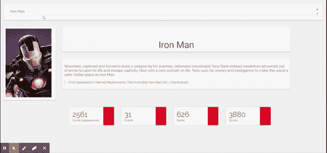

# 漫威宇宙仪表盘第 1 部分

> 原文：<https://medium.com/analytics-vidhya/marvel-universe-dashboard-part-1-dd97d80f7990?source=collection_archive---------17----------------------->

大家好，

由于 COVID 19 的爆发，我们正面临封锁，我决定用我的技能创造一些有趣的东西。这是我的 Github 上的文件的链接。

我最近在 Medium 上看到一篇关于一些 API 的[文章](/better-programming/a-curated-list-of-100-cool-and-fun-public-apis-to-inspire-your-next-project-7600ce3e9b3)，在那张列表上，我看到了漫威的 [API](https://developer.marvel.com/) 。当我看到 API 的那一刻，我决定我将创建一个漫威宇宙的仪表板。



这里是相同的 GIF。

因为我喜欢 Python，所以我决定利用[Dash](https://dash.plot.ly/)——一个用于创建仪表板的库。

在系列文章的这一部分中，我将讨论收集数据的第 1 部分。现在你可能想知道，既然我们已经有了 API，为什么我们还需要收集数据。嗯，有两个原因:

1.  我一天可以进行的 API 调用是有限的(3000 个 API 调用)。因此，为了避免不必要的调用 API，我决定捕获一些数据。
2.  根据我的经验，多次调用 API 可能会降低仪表板的速度

说了这么多，让我们来谈谈第 1 部分。

在探索 API 时，我遇到了一个端点，它可以呈现字符列表，每次调用最多 100 个字符。我在一个 excel 文件中捕获了每个角色的名字和 id。

```
import requests
import pandas as pd
import hashlib
import time

public_key = "your public key"
private_key = "your private key"
ts = str(time.time())
hash = hashlib.md5(ts+private_key+public_key).hexdigest()

count = 1
offset = 0
while count<16:

    id = []
    character_name = []
    comics = []

    url = "https://gateway.marvel.com:443/v1/public/characters?limit=100&offset=%s&ts=%s&apikey=yourpublickey&hash=%s" % (
    offset,
    ts, hash)

    req = requests.get(url)

    try:
        for i in req.json()["data"]["results"]:
            id.append(i["id"])
            character_name.append(i["name"])
            comics.append(i["comics"]["available"])

        a = {"id": id, "name": character_name,"comics":comics}

        df = pd.DataFrame.from_dict(a)
        df.to_excel("%s.xlsx" % (count))

        offset = offset + 100
        count += 1
        print offset
    except:
        print req.status_code
```

上面的代码将必要的数据保存在一个 excel 文件中，我将进一步使用它来填充我的仪表板中的下拉列表。

*是的，漫威的 API 要求我们创建一个公钥和私钥的散列以及一个令牌，这个令牌对于每次调用都是随机的，在本例中是一个时间戳。关于这一点更多的可以在这里找到*[](https://stackoverflow.com/questions/55549492/how-to-send-timestamp-and-md5-hash-for-marvel-api-request)**。**

*因为代码会产生 15 个不同的 excel 文件，所以编写了另一段代码来将这些文件合并到一个单独的文件中。*

```
*import pandas as pd
import glob

path = 'C:\Users\Akul Chhillar\Desktop\Marvel Dashboard/' # use your path
all_files = glob.glob(path+"*.xlsx")

li = []

for filename in all_files:
    df = pd.read_excel(filename)
    li.append(df)

frame = pd.concat(li, axis=0, ignore_index=True)

frame.to_excel("consolidated.xlsx")*
```

*上面这段代码将创建一个名为 Consolidated 的 excel 文件，其中包含所有漫威字符的名称及其唯一的 id。*

*这部分到此为止。在[下一部分](/@akulchhillar/marvel-universe-dashboard-part-2-c5a502201b91)中，我将讨论我是如何创建仪表板的其余部分的。*