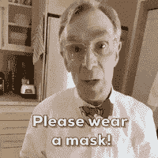
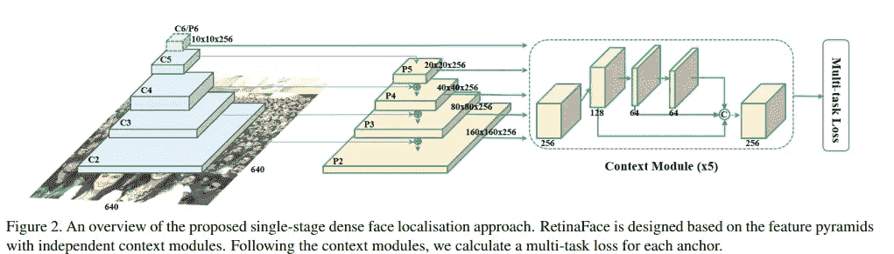
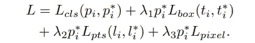
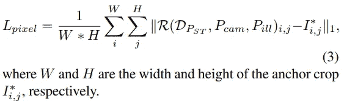
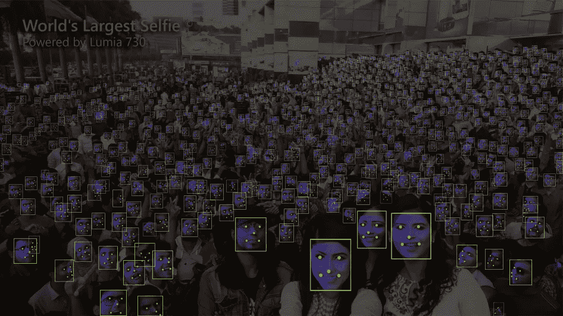

# 使用深度学习的掩模检测

> 原文：<https://medium.com/analytics-vidhya/mask-detection-using-deep-learning-2958503d42b1?source=collection_archive---------16----------------------->

> 请戴口罩！

读者你好，就像我之前的[篇](https://heartbeat.fritz.ai/monitoring-social-distancing-using-people-detection-ae53212c5375)一样，这一篇也和我们目前 COVID 19 的可怕处境有关。正如标题所示，我将解释如何通过使用深度学习在视频馈送上建立一个面具检测系统。基本上，你将能够检测到某人是否戴着面具，并可以进一步使用它来产生一个触发器。

该系统可在工作场所用于监控员工是否戴有口罩。它也可以用在商场、车站等地方，不时地发布公告，提醒人们不要戴口罩。

我们检测帧中的掩模的最终产品将包括两个主要步骤。**一个**、**检测一帧中的**张人脸，**两个**、**对检测到的人脸进行分类**，判断其是否戴面具。

为了进行面部检测，我们将使用一种称为 **RetinaFace** 的架构，这是用于检测图片中面部的最先进模型，并进一步将每个面部分为**遮罩**或**无遮罩**我们将使用 **ResNet** 架构。因为我相信，如果你知道你在用什么，你会更舒服地使用它。因此，我将首先解释这两种架构，然后讨论它的实现并提供代码。

在这里，我将解释一下 **RetinaFace** 架构，在我的[下一篇](https://medium.com/p/ab7a2cb6aaf1/edit)文章中，我将解释一下 **ResNet** 架构，并将详细讨论如何使用 Python 组合和实现这两个模型。

# **视网膜面**

早些时候，人脸检测是使用两级检测器完成的，这两级检测器有一个区域提议网络，然后提议的区域被发送到另一个网络，以找到人脸周围的方框。如果你不知道单级和两级检测器，你可以看看我之前的文章，我已经解释了一些。

# 体系结构

RetinaFace 是第一个单级检测器，在检测小脸和高度遮挡的脸时表现非常好。在我的一篇文章中，我解释了 CNN 架构在**物体检测**、[T3、retina net](https://heartbeat.fritz.ai/monitoring-social-distancing-using-people-detection-ae53212c5375)中的最新发展。这个 RetinaFace 体系结构与那个体系结构类似，但是有一些特定于面部检测的变化。同样在 RetinaFace 中，我们使用来自 Resnet 152 主干的**FPN**(**F**feature**P**y ramid**N**network)。还是那句话，如果你不了解 FPN 和**感受野**，可以在这里翻翻我之前的文章[。](https://heartbeat.fritz.ai/monitoring-social-distancing-using-people-detection-ae53212c5375)

摘自 RetinaNet 纸

从现在开始，我假设你知道 FPN。因此，这里他们使用了不同层的 Resnet 的输出，这些层具有不同的感受域，这使得检测不同大小的脸成为可能。他们不再仅仅使用层的输出来定位和移动脸部的方框，而是在每个输出的基础上增加了一层计算，他们称之为**上下文模块**。

## **语境模块**

上下文模块的概念不是由他们引入的，这已经被早期的研究者使用，他们声称在人脸检测架构中这种类型的添加具有更好的准确性。在上下文模块中，他们只是通过使用一种叫做**D**eformable**C**on volution**N**et wok(**DCN**)的东西来增加感受野。这些 DCN 类似于 CNN，但是在 DCN 有很少的偏移参数，这些参数不会对内核施加约束，使其仅查看固定形状的窗口，该窗口在几乎所有情况下都是方形的(3×3 大小的内核一次只能查看 3×3 大小的方形窗口)。要了解更多关于 DCNs 的信息，您可以从这篇解释精美的文章[中获得概述。基本上，在上下文模块中，正如你在上面的图像中看到的，它使模型更容易学习不同的面部方向，同时增加每个输出的感受域，并且随着我们增加计算量和剩余连接，它增加了它可以合并的上下文信息。](https://towardsdatascience.com/review-dcn-deformable-convolutional-networks-2nd-runner-up-in-2017-coco-detection-object-14e488efce44)

他们在架构中使用的一个更重要的东西是**网格解码器**。这部分架构非常复杂，很难深入研究，但是我将概述一下它最终的作用。

## **网状解码器**

这部分架构有点独特。这适用于面部的三维结构。数学上，3D 面可以表示为 V ∈ R( n×6)，其中 V 是顶点的集合，每个顶点可以用 6 个数字表示，它们是(x，y，z)空间坐标和(R，G，B)颜色坐标。可以使用 3D 渲染器将人脸的这种表示转换为 2D 图像，这是一种复杂的函数，因此我们不需要深入研究这一点(*如果您有兴趣，可以通过本* *白皮书的第 3.2 节来了解函数*)。因此，我们的架构包括从预测的面部框生成 128 维向量的部分。该 128 维向量被认为是该面部的形状和文本信息，并被进一步传递到网络(**网格解码器**)，该网络将该向量解码成 6 维向量，该 6 维向量是该面部的 3D 表示。该预测输出然后被发送到渲染器功能，该渲染器功能将其转换成 2D 图像，并且使用逐像素差异将获得的图像与原始图像进行比较。

这种类型的结构和损失函数结合了关于结构中的人脸的 3D 结构的信息，这是非常重要的，因为我们希望模型在给定的图像中定位人脸。

现在，我们对架构有了一个了解。接下来，我们将研究损失函数，它可能是任何神经网络中第二重要的部分。

# 损失函数

他们使用的损失函数是 4 种损失的组合，如下图所示。

图 1

1.  **分类损失**:为人脸分类损失 Lcls(pi，p* i)，其中 pi 为主播 I 为人脸的预测概率，p*i 为正面主播 1，负面主播 0。分类损失 Lcls 是二进制类(人脸/非人脸)的软最大损失。
2.  **盒子回归损失**:由 Lbox(ti，t* i)给出，其中 ti = {tx，ty，tw，th}i，t*i = {t*x，t*y，t*w，t*h }i 分别表示正锚关联的预测盒子和地面实况盒子的坐标。这是一个平滑的 L1 损失。
3.  **面部界标回归丢失**:我们的模型根据面部周围方框的形状和位置信息，同时生成面部的 5 个界标(左眼、右眼、左嘴唇、右嘴唇和鼻子)。然后使用平滑 L1 损失(Lpts)将这些预测的界标与每个面部的实际注释界标进行比较。
4.  **密集回归损失**:这是我们上面讨论的来自网格解码器的损失，它通过对渲染输出进行逐像素差分，将面部的 3D 信息合并到模型中。计算这一损失的实际函数是:

取自纸张

**图 1** 显示了组合损耗函数，从中可以看出有一些λ(λ)参数。这些被称为损失平衡参数，可以确保我们想要包括多少损失。

所以，现在我们可以把所有的部分组合在一起了。我们有一个架构，它吐出一些预测，然后使用上面解释的损失函数将这些预测与图像的真实标签进行比较。然后，使用 SGD 的变体对该损失函数进行优化，以训练整个网络最终预测面部周围的框以及面部上的 5 个界标。您可以在下图中看到**视网膜表面**的结果。

# 摘要

总结所有步骤:给定一个图像，我们通过 ResNet 架构传递该图像，以从网络的各个层获得 **FPN** 输出，该网络充当特征提取器。在这些输出之上，我们添加了**上下文模块**，通过使用 **DCN** 增加了感受野和上下文信息。这些上下文模块通过在它们上面有一些子网给出了 5 个界标点、类标签和回归参数。我们有许多预定义的锚框集合，它们与 FPN 所有输出的上下文模块的输出相关。使用上下文模块的回归输出给出的值调整这些锚框集。然后，将这些输出与图像中所有人脸的注释值(包括类别、边界框坐标和 5 个地标的位置)进行比较，并使用上述公式计算损失。

计算并添加到最终损失中的另一个损失是**密集回归损失**，该损失有助于将人脸的形状和纹理信息包含在模型中。然后使用损耗平衡参数将所有这些损耗合并。然后对误差进行反向传播，并训练权重。

综合所有损失，确保在模型调整其参数后，不同类型的信息被输入模型进行学习。

我们现在了解了 RetinaFace 是如何工作的。因此，为了进行面具检测，我们将使用 RetinaFace 提取所有面部，然后使用 ResNet 架构将检测到的面部分类为两类，即面具/无面具。在我的下一篇文章中，我将解释一点关于 ResNet 架构，我们在计算机视觉任务中几乎到处都在使用它。然后我将解释如何使用代码实现这一切，对于一个端到端的系统。

在那之前，注意安全！戴口罩！

# 参考

[视网膜人脸:野外单阶段密集人脸定位](https://arxiv.org/abs/1905.00641)

# 附加链接

1.  [利用深度学习实现面具检测](https://medium.com/p/ab7a2cb6aaf1/edit)
2.  [如何利用深度学习追踪人](https://heartbeat.fritz.ai/how-to-track-people-using-deep-learning-35a46e9014ac)