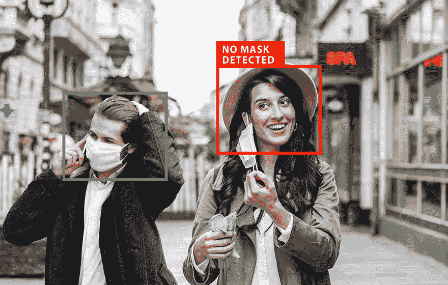
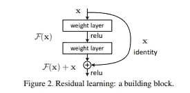
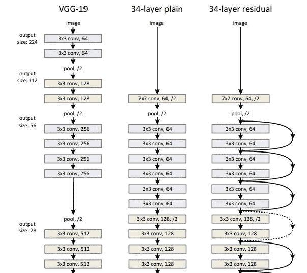
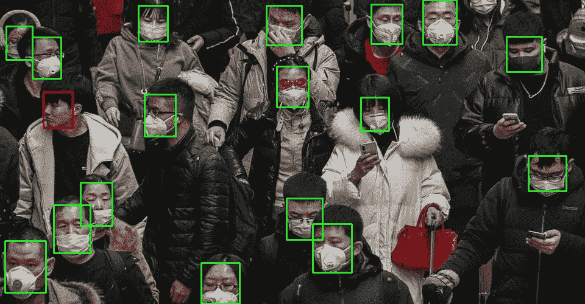

# 使用深度学习的掩模检测(第二部分)

> 原文：<https://medium.com/analytics-vidhya/mask-detection-using-deep-learning-part-ii-ab7a2cb6aaf1?source=collection_archive---------15----------------------->

读者们好，继续我之前的[文章](/@harshshrm94/mask-detection-using-deep-learning-2958503d42b1)我解释了 RetinaFace 的工作，我将解释整个面具检测管道的第二部分，即使用 Resnet 的分类，然后我将提供完成任务的代码实现。

如果你已经通过了使用深度学习的**面具检测的第一[部分](https://medium.com/p/2958503d42b1/edit)，你就知道现在我们已经使用 RetinaFace 提取了图像中的所有人脸，我也解释了其内部工作原理。**

现在，我们需要一些分类器，可以将每张脸分为“带面具的脸”或“不带面具的脸”。对于分类，我们将使用 Resnet 作为分类器，这是图像分类的最佳架构之一。为了训练分类器，我们主要需要两样东西，一个有足够数据的数据集和一个要优化的损失函数。

**数据集:**我使用了不同的公开可用数据集的组合，比如[这个](https://drive.google.com/file/d/1QspxOJMDf_rAWVV7AU_Nc0rjo1_EPEDW/view)数据集，来制作一个自定义的带遮罩和不带遮罩的图像数据集。我还使用了 [LFW](http://vis-www.cs.umass.edu/lfw/) 数据集拍摄没有蒙版的图像。我的自定义数据集有大约 18k+的带面具人脸图像和 14k+的不带面具人脸图像。我做了一些数据清理，如删除重复，模糊的图像和错误的图像。最重要的是，我使用 **RetinaFace** 从这些数据集中只提取了人脸，并对它们进行了相应的标记，因为最终我们只会对人脸进行分类。

**损失:**我们知道这将是一个两类分类任务，因此我使用了一个**二元交叉熵**作为损失函数来训练模型。

为了训练一个 resnet 模型，我使用了[**fastai**](https://www.fast.ai/)**库，因为它为各种任务提供了非常简单的接口和接近艺术状态的结果。这是一个非常易于使用的库，一旦你掌握了它，你就不会去其他任何地方训练你的深度学习模型。这个库是在 **pytorch** 之上编写的。当你开始使用它时，它就像一块块要组装的乐高积木，然后你就可以开始了。**

**正如我前面提到的，我使用 Resnet 作为分类器来对人脸图像进行分类，如果你读过我以前的文章，你会注意到我喜欢解释我们在任务中使用的东西。因此，我现在将解释一下 Resnet。**

# **雷斯内特**

**在早期，VGG 网，亚历克斯网，盗梦空间网等被认为是图像分类任务的最先进的模型。这些架构从图像中提取特征信息，并且通过使用损失函数和反向传播，它们了解图像中哪些特征对于特定任务是重要的。因此，人们开始构建更深层次的网络，希望它能够提取更多的特征，架构能够捕捉更多的信息。但是结果和预期的正好相反。在某些情况下，即使增加了更多的层，损失也会饱和并增加，这促使人们思考为什么会发生这种情况。然后出现了这种革命性的[论文](https://arxiv.org/pdf/1512.03385.pdf),它对网络的改变很小，但却改变了游戏规则。他们只是在中间添加了一个剩余块。这是两个 CNN 层之间的身份联系。**

> **那么，为什么这种身份连接有效，实际的架构是什么？**

**深层模型表现不如浅层模型的背后原因是，随着层数的增加，出现了 [**消失渐变**](https://towardsdatascience.com/the-vanishing-gradient-problem-69bf08b15484) 的问题。这意味着，一些层不能正确地学习，因为权重没有得到适当的调整。因此，为了解决这个问题，作者增加了层间跳跃连接。这意味着如果一个层的输入是 **X** ，假设卷积运算由 **f(X)** 表示，那么当前层的输出将是 **X+f(X)** 。在早期的模型中，它只是 f(X)。这种跳跃连接提供了一种梯度回流的方式。**

****

**以下是 VGG 网络和 Resnet 之间的比较。我刚刚从纸上粘贴了一个原始图像的剪影，只是为了有一个理解，信息是如何流动的。**

****

**摘自报纸**

**典型地，残差块由序列中的 2 或 3 个卷积层组成，并且输出包括第一层的输入和卷积运算和激活之后获得的输出的总和。根据 conv 的数量，有各种类型的 resnet 体系结构。像 resnet-18、resnet-34、resnet-50 等层。**

**在图像通过 resnet 中的所有层(顺序排列)之后获得的输出然后被连接到 n 个激活单元，其中 n 是分类任务中不同类别的数量(在我们的例子中是 2)。**

**这里有一件事值得注意，这是我在学习 Resnet 架构时新学到的。以前，对于一个经过训练的模型，它需要一个固定大小的图像来处理，否则它将失败，因为在架构末端的密集的完全连接的层需要一个特定大小的图像来处理。但是，这里他们使用的是**自适应平均池**，它完全解决了固定形状图像的问题。虽然，我不确定是谁引入了这个概念，但我是在阅读这篇论文时知道这个概念的。**

**现在我们对 Resnet 有了一些了解，我们也知道如何使用这个网络进行分类(之前我们看到 ResNet 被用作 FPN 的特征提取器)。接下来，我将解释如何实现**屏蔽检测**，并提供相同的代码。**

# **掩模检测的实现**

**如前所述，我们的面具检测过程包括两个阶段，首先我们必须检测人脸，然后在此基础上进行分类。对于面部检测，我们将使用[这个](https://github.com/deepinsight/insightface)库，因为他们已经为视网膜面部训练了权重。使用这个库的另一个原因是，他们有官方实现的 **InsightFace** ，这是人脸识别的最先进的模型，我将在下一篇文章中解释，在那里我将解释如何构建考勤标记系统。**

## **第一步**

**使用以下命令克隆这个包含我们的应用程序所需的所有代码的存储库:**

> **git 克隆 https://github.com/harsh2912/Mask-detection.git**

**从这个[驱动器](https://drive.google.com/drive/folders/1G6-UJuLdDPybbk-4Z3829kQNzN8bhbIj?usp=sharing)下载 RetinaFace 和 ResNet 分类的模型。在 Face_detection 文件夹下做一个目录“ **models/retinaface** ”，在那个文件夹下解压“retinaface-R50.zip”。**

**在 Mask_classification 文件夹下做一个目录“ **model** ”，把“model_clean_data.pkl”放在那个文件夹下。**

## **第二步**

**让我们假设您克隆了‘loc’文件夹中的存储库。因此，下一步是通过运行以下命令将 pwd 更改为 *Face_detection* 文件夹:**

> **cd 锁定/掩模检测/面部检测**

**RetinaFace 在 ***mxnet*** 上实现，对于使用 Resnet 的分类，我在 **pytorch** 中使用 **fastai** 的实现。因此，为了保持清洁，我们将使用两个独立的 conda 环境。**

**为了创建用于人脸检测的 conda 环境，我们将通过运行以下命令使用 Face_detection 文件夹中的 **requirements.yml** 文件:**

> ***康达环境创建-n 检测-f 要求. yml***

> ****注**:如果你不了解 conda 和虚拟环境，请阅读我之前的文章[这里](https://heartbeat.fritz.ai/changing-backgrounds-with-image-segmentation-deep-learning-code-implementation-d848648ac477)我已经解释了一些。**

## **第三步**

**我们将创建的另一个环境用于分类任务。该环境的 **requirements.yml** 文件位于 *Mask_classification* 文件夹中。**

**首先通过运行以下命令将 pwd 更改为 Mask_classification:**

> **cd 锁定/屏蔽-检测/屏蔽 _ 分类**

**然后以类似的方式创建 conda 环境，使用:**

> **conda 环境创建-n 分类-f 要求. yml**

## **第四步**

**现在我们已经创建了 conda 环境，我们将需要运行一个 **flask** 服务器，它将响应对面部图像进行分类的请求。**

> ****注意**:我们将运行一个分类服务器，我们将使用检测环境来检测人脸，然后从分类服务器获得所有检测到的人脸的响应。**

**我们将在端口 3000 上运行分类服务器，我们的检测环境将在这里 ping，以获得结果。我们可以更改端口，但是相应地，我们必须在脚本中设置请求地址。为了运行服务器，我们将使用以下一组命令:**

**首先激活 conda 环境，使用:**

> **康达激活分类**

**然后使用以下方法将 pwd 更改为 Mask_classification:**

> **cd 锁定/屏蔽-检测/屏蔽 _ 分类**

**然后使用以下命令运行 flask 服务器:**

> **烧瓶运行-端口 3000**

## **步骤五**

**现在服务器已经启动并运行，我们将运行根文件夹中的“infer.py”脚本，首先使用以下命令激活该脚本的环境:**

> **conda 激活检测**

**然后通过运行以下命令将 pwd 更改为根目录:**

> **cd 锁定/屏蔽-检测**

> ****注意**:请勿关闭服务器。在新终端中运行脚本**

**脚本“infer.py”有三个参数，分别是“is_image”、“in_path”和“out_path”**

**如果你想在图像上推断，把第一个参数设为真，否则如果你想在视频上推断，把那个参数设为假。接下来的两个参数是不言自明的，因为“in_path”指的是输入文件的路径,“out_path”是保存输出的位置。**

**激活环境后，您可以按以下方式运行脚本:**

> **python infer . py-is _ image True-in _ path path/to/image-out _ path path/to/save**

**也在路径中指定输出文件的名称。**

**我把一些样本图片放在“样本图片”文件夹中，你可以试着从这些图片开始。它将返回一个图像，在戴面具的人周围有绿色方框，在没有戴面具的人周围有红色方框。**

****

**我还加入了 jupyter 笔记本，在那里我为那些想了解详细信息的搜索者训练了分类模型。文件名为“training.ipynb”。它在根文件夹中。**

**在上面解释的仅仅五个步骤中，我们可以在视频馈送上运行屏蔽检测的推断，并且因此可以在一定程度上增加包含疫情的机会。但最终如何应对这种局面取决于我们自己。**

**注意安全！戴口罩！遵循社交距离！**

# **参考**

1.  **[用于图像识别的深度残差学习](https://arxiv.org/abs/1512.03385)**
2.  **[快速 Ai](https://www.fast.ai/) (我用来训练模型的库)**
3.  **[视网膜人脸实现](https://github.com/deepinsight/insightface)**

# **附加链接**

1.  **[使用深度学习的掩模检测(第 1 部分)](/@harshshrm94/mask-detection-using-deep-learning-2958503d42b1)**
2.  **[链接到代码实现的 github 库](https://github.com/harsh2912/Mask-detection.git)**
3.  **[型号链接](https://drive.google.com/drive/folders/1G6-UJuLdDPybbk-4Z3829kQNzN8bhbIj)**