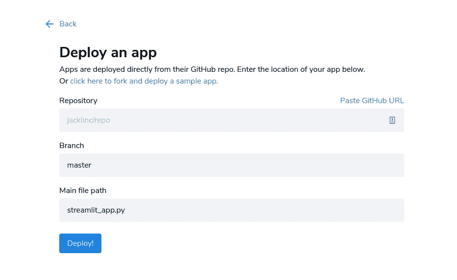
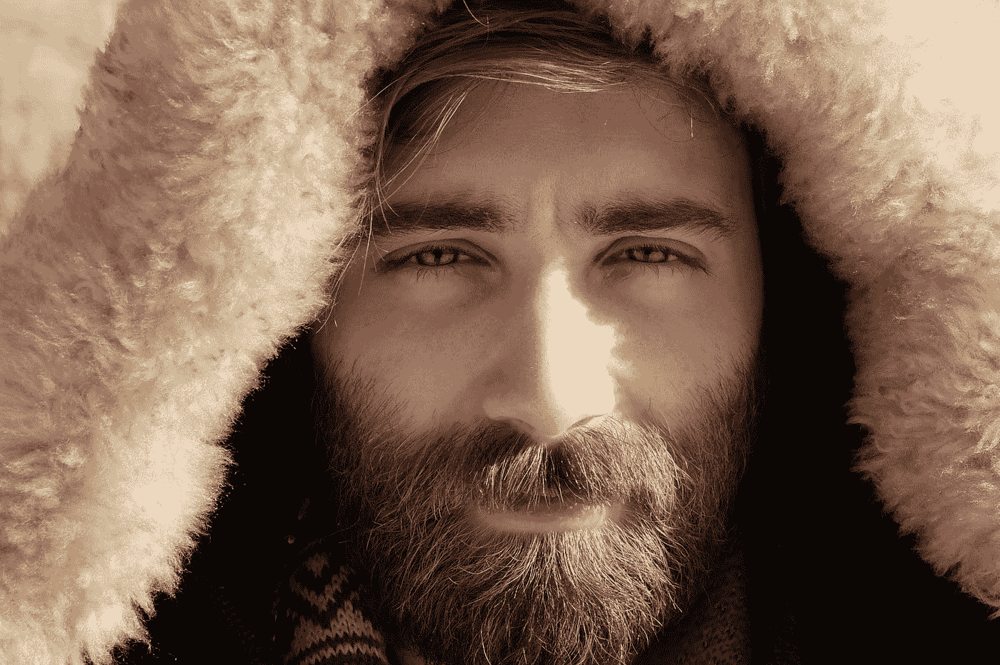

# 带 FastAI 和 Streamlit 共享的掩膜检测器

> 原文：<https://medium.com/analytics-vidhya/mask-detector-w-fastai-and-streamlit-sharing-62448b4cb7b6?source=collection_archive---------10----------------------->


在 [Unsplash](https://unsplash.com?utm_source=medium&utm_medium=referral) 上 [engin akyurt](https://unsplash.com/@enginakyurt?utm_source=medium&utm_medium=referral) 拍摄的照片

## 介绍

我想用这篇文章来强调部署一个精确的深度学习 web 应用程序是多么容易。最近开始 FastAI 课程后，我学会了图像处理的基础知识，并设法用其中一个模型构建了一个应用程序。FastAI 推荐使用 Binder，但我发现这与 Streamlit 相比非常慢。

我在一个可以使用 GPU 的 Colab 笔记本上训练模型；然后将其导出到 Streamlit。所有代码都可以在[这个资源库](https://github.com/jacklinc/covid_mask_classifier)中找到，包括示例笔记本。Streamlit 仪表盘在这里是[这里是](https://share.streamlit.io/jacklinc/covid_mask_classifier/main/src/src_bear-class.py)。

## Bing API

自动化数据收集过程是 FastAI 课程的一部分。Bing 图片搜索 API 需要在 Azure 认知服务上开发一个应用程序(这不是一个小壮举),你已经准备好了。在 Bing 上搜索图片的功能如下。

```
def search_images_bing(key, term, max_images: int = 150, **kwargs):
  params = {‘q’:term, ‘count’:max_images} 
  headers = {“Ocp-Apim-Subscription-Key”:key} 
  search_url = “https://api.bing.microsoft.com/v7.0/images/search”
  response = requests.get(search_url, headers=headers, params=params)
  response.raise_for_status() 
  search_results = response.json() 
  return L(search_results[‘value’])
```

数据组织阶段将不同的影像分类放入单独的文件夹中，用作数据标签，下面的函数将搜索词、Python 路径和数据标签作为输入。

```
def make_category(cat, path, label):                         
  if not path.exists():                           
    path.mkdir()                         
  dest = (path/label)
  dest.mkdir(exist_ok=True)
  results = search_images_bing(key, cat)
  download_images(dest, urls=results.attrgot('contentUrl'))
```

在 Jupyter 中使用“%ls”魔术命令显示文件夹结构。

## 模特培训

FastAI 使用[数据块](https://docs.fast.ai/tutorial.datablock) API，它管理数据，这样我就可以花更多的时间在建模上，而不是花更少的时间组织数据。推荐的文件夹结构如下。

```
mask_detector
├── train
│   ├── mask
│   │   ├── img_1.jpeg
│   │   └── img_2.jpeg
│   └── no_mask
│       ├── img_3.jpeg
│       └── img_4.jpeg
└── valid
    ├── mask
    │   ├── img_5.jpeg
    │   └── img_6.jpeg
    └── no_mask
        ├── img_7.jpeg
        └── img_8.jpeg
```

下面列出了使用的参数:

*   **块**:指定因变量和自变量。ImageBlock 是每个文件夹中的图像数据，CategoryBlock 是文件夹名称。
*   **get_items** :取一个函数，返回图像数据的位置。
*   **拆分器**:将数据拆分为有效数据和训练数据
*   **get_y** :用于标记数据的函数
*   **item_tfms** :将每张图像转换成合适的尺寸

```
masks = DataBlock(
  blocks=(ImageBlock, CategoryBlock), 
  get_items=get_image_files(path), 
  splitter=RandomSplitter(valid_pct=0.2, seed=42),
  get_y=parent_label,
  item_tfms=Resize(128))
```

## 简化托管

Streamlit 消除了共享数据科学项目所需的 web 开发技能。没有必要乱用 HTML 或 JS 框架；只是 Python，看看他们的[演示](https://share.streamlit.io/streamlit/demo-self-driving)。你可以在本地或者像 Heroku 这样的 PaaS 上运行 Streamlit，但是最简单快捷的方法是使用他们的测试版共享服务。



简化 it 共享应用部署

注册测试版后，包含您的 GitHub repo、branch 和 Streamlit 文件，您就可以开始部署了。

## 胡须歪斜

部署我的应用程序后，我很兴奋地看到它的性能有多好；我上传的每张照片都正常。当然，我把它发给了我的[朋友](https://github.com/FinnMcLaughlin)，他碰巧有胡子——模特不喜欢这个。我试了更多的胡子，意识到有一个问题。



照片由[弗兰克·马里诺](https://unsplash.com/@frank_marino87?utm_source=medium&utm_medium=referral)在 [Unsplash](https://unsplash.com?utm_source=medium&utm_medium=referral) 上拍摄

我已经拥有的两个类别是 mask 和 no_mask，所以我决定在数据中添加另一个标签:胡须。代码如下。

```
make_category('peoples faces with covid mask', path, 'mask')make_category('clean shaven face', path, 'no_mask')make_category('bearded face', path, 'beard')
```

在解决了胡子问题后，我意识到同样的问题可能会在不同的种族出现，因为大多数图片搜索结果都是白人男性。我开始时没有考虑到这一点，也没有考虑到我应该在未来的计算机视觉项目中加入一些东西。我推荐 FastAI 关于数据伦理的课程，对我刚才提到的内容进行扩展。

请随时纠正我可能犯的任何错误。

## 资源

*   [https://docs.fast.ai/](https://docs.fast.ai/)
*   https://coursefast.ai/(第二课)
*   [https://blog.streamlit.io/introducing-streamlit-sharing/](https://blog.streamlit.io/introducing-streamlit-sharing/)