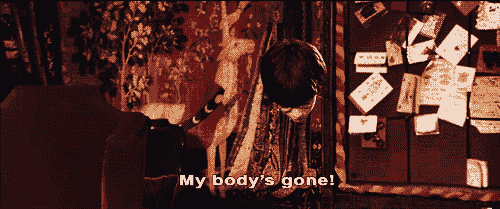

# 用 Python 在 OpenCV 中掩蔽视频中的一个区域——哈利·波特隐形斗篷示例

> 原文：<https://medium.com/analytics-vidhya/masking-an-area-in-a-video-in-opencv-in-python-harry-potter-invisible-cloak-example-a25279fdc26c?source=collection_archive---------0----------------------->

观看视频了解行动

你们大多数人都知道隐形斗篷，这是邓布利多匿名送给哈利·波特的圣诞礼物。嗯，现在可以在网上买了！但是，假设您想在购买该产品之前检查一下它穿在您身上的效果。你会怎么做？

如果你正在考虑一个答案，那么你就在正确的网页上！诀窍是使用 Python 中的 OpenCV 库。

在本教程中，我们将学习如何在 Python 中为直播视频创建一个屏蔽视频。

在开始之前，我们需要安装 OpenCV(开源计算机视觉)库，该库旨在帮助开发人员执行与计算机视觉相关的任务。我们需要为 OpenCV 库做一个 pip 安装。

```
install opencv-python
```

# 现在让我们用 Python 来构建这个系统

现在，我们已经安装了所需的库。我们将开始实现如下所示的代码。我解释了每个代码块，以帮助您理解后台发生了什么。

请随意跳到这一页的末尾，获得 Jupyter 笔记本完整代码的链接。

**第一步:**打开 Spyder

**第二步:**导入库

```
import cv2
import numpy as np
import time
```

**第三步:**将您的视频引用到您的网络摄像头

```
video_capture = cv2.VideoCapture(0)
```

**第四步:**定义视频的输出

```
fourcc = cv2.VideoWriter_fourcc(‘m’,’p’,’4',’v’)# note the lower case
frame_width = int(video_capture.get(3))
frame_height = int(video_capture.get(4))
out = cv2.VideoWriter(‘Harry_Potter.mp4’,fourcc , 10, (frame_width,frame_height), True)
```

**步骤 5:** 指定系统启动的等待时间

```
time.sleep(3)
background = 0
```

**第六步:**捕捉平时的环境。此代码是必要的，以确保您遮罩的颜色具有环境中对象的细节。这些代码在下面的多个模块中进行了解释:

**模块 1:**

```
while(video_capture.isOpened()):
    ret, image = video_capture.read()
    if not ret:
        break
    image = np.flip(image,axis=1)

    # Change to HSV
    hsv = cv2.cvtColor(image, cv2.COLOR_BGR2HSV)
```

这里，我们一次处理一帧。使用 cv2 库提取帧，cv2 库以 BGR(蓝-绿-红)颜色捕获帧，而遮罩库使用 HSV 格式。因此，我们翻转框架的颜色代码。

**模块 2:**

```
#Create masks with coordinates to detect the color
    lower_blue = np.array([94, 80, 2])
    upper_blue = np.array([126, 255, 255])
    mask_all = cv2.inRange(hsv,lower_blue,upper_blue)mask_all = cv2.morphologyEx(mask_all, cv2.MORPH_OPEN, np.ones((3,3),np.uint8))
    mask_all = cv2.morphologyEx(mask_all, cv2.MORPH_DILATE, np.ones((3,3),np.uint8))
```

此块中的代码创建带有坐标的遮罩对象来检测指定的颜色。颜色以 HSV 格式在范围中指定。在本例中，我们指定浅蓝色。有关其他颜色的代码片段，请参见下文。

**第 3 块:**

```
#Hide the blue part away
    mask2 = cv2.bitwise_not(mask_all)

    streamA = cv2.bitwise_and(image,image,mask=mask2)#Copy the masked area's original part
    streamB = cv2.bitwise_and(background, background, mask = mask_all)
```

这个块有代码删除检测到的彩色区域，并在其上添加背景流层。

第 4 块:编写代码，在你的硬盘上录制视频

```
#Write the video in the file specified in the previous block
    output = cv2.addWeighted(streamA,1,streamB,1,0)
    out.write(output)
    cv2.imshow("cloak_trick",output)
    if cv2.waitKey(25) == 13:
        break
```

**第八步:**必须发布所有拍摄的视频。

```
video_capture.release()
out.release()
cv2.destroyAllWindows()
```

# 在命令行中运行程序

下一步是将文件保存在。py 格式并在命令行/Anaconda 提示符下运行它。

我在 Anaconda 提示符下运行它，首先使用命令 cd 导航到该文件夹。

```
cd <folder path>
```

运行 python 文件

```
python filename.py
```

您将看到一个弹出窗口，视频正在播放。让视频捕捉环境 45 秒左右。之后，你可以玩蓝色的物体/夹克/运动衫甚至斗篷！



**Wohoo！你已经成功地用 Python 构建了一个隐形斗篷替换代码。**

**尝试用不同的物体和想法做视频实验，并在下面的评论区告诉我效果如何。**

如果你有任何问题，请在评论区告诉我。

# **其他颜色的附加代码片段**

```
Red color
low_red = np.array([161, 155, 84]) high_red = np.array([179, 255, 255]) red_mask = cv2.inRange(hsv_frame, low_red, high_red) red = cv2.bitwise_and(frame, frame, mask=red_mask)Blue color
low_blue = np.array([94, 80, 2]) high_blue = np.array([126, 255, 255]) blue_mask = cv2.inRange(hsv_frame, low_blue, high_blue) blue = cv2.bitwise_and(frame, frame, mask=blue_mask)Green color
low_green = np.array([25, 52, 72]) high_green = np.array([102, 255, 255]) green_mask = cv2.inRange(hsv_frame, low_green, high_green) green = cv2.bitwise_and(frame, frame, mask=green_mask)Every color except white
low = np.array([0, 42, 0]) high = np.array([179, 255, 255]) mask = cv2.inRange(hsv_frame, low, high) result = cv2.bitwise_and(frame, frame, mask=mask)
```

# 编码

[](https://github.com/chandravenky/Computer-Vision---Object-Detection-in-Python/blob/master/Masking%20a%20color%20in%20video_HarryPotterCloak.ipynb) [## chandravenky/Python 中的计算机视觉对象检测

### permalink dissolve GitHub 是 4000 多万开发人员的家园，他们一起工作来托管和审查代码，管理…

github.com](https://github.com/chandravenky/Computer-Vision---Object-Detection-in-Python/blob/master/Masking%20a%20color%20in%20video_HarryPotterCloak.ipynb) 

# 相关链接

[**Python 中的实时人脸检测系统— Windows 和 macOS**](/@venkatesh.chandra_75550/real-time-webcam-face-detection-system-using-opencv-in-python-windows-and-macos-86c31fddd2bc)

[**使用 OpenCV 的 Python 中的车辆检测— Windows 和 macOS**](/@venkatesh.chandra_75550/vehicle-car-detection-in-real-time-and-recorded-videos-in-python-windows-and-macos-c5548b243b18)

[**使用 OpenCV 的 Python 中的行人检测— Windows 和 macOS**](/@venkatesh.chandra_75550/person-pedestrian-detection-in-real-time-and-recorded-videos-in-python-windows-and-macos-4c81142f5f59)

[**保存 macOS 中物体识别的输出**](/@venkatesh.chandra_75550/saving-output-of-object-recognition-in-macos-opencv-python-5914bb5d9ca8)

# 去哪里找我🤓

1.  通过[LinkedIn](https://www.linkedin.com/in/venkateshchandra/)/[GitHub](https://github.com/chandravenky)/[我的网站](http://chatraja.com/)与我联系
2.  感觉大方？给我买一杯☕️咖啡