# 变形金刚自我注意机制中的掩蔽现象

> 原文：<https://medium.com/analytics-vidhya/masking-in-transformers-self-attention-mechanism-bad3c9ec235c?source=collection_archive---------0----------------------->

需要掩蔽来防止转换器的注意力机制在训练时在解码器中“作弊”(例如，在翻译任务中)。这种“防作弊屏蔽”在编码器端不存在。

我很难理解解码器是如何屏蔽的，这就是我写这篇文章的原因。希望它也能帮助其他人。

在我开始之前，理解变形金刚的一个很好的入门读物是杰伊的阿拉玛文章“[http://jalammar.github.io/illustrated-transformer/](http://jalammar.github.io/illustrated-transformer/)”。

让我们从一个例子开始:

如果我们有下面的序列作为解码器的输入:“我爱它”，那么位置 1(“I”)处的标记的预期预测是下一个位置(“love”)处的标记。类似地，对标记“我爱”的预期预测是“它”。

当使用所有先前的标记给出预测时，我们不希望注意机制共享关于在下一个位置的标记的任何信息。

为了确保做到这一点，我们在自我关注计算的 softmax 步骤之前屏蔽了未来的位置(将它们设置为`-inf`)。

下面是一个注释示例，总结了屏蔽如何与两个令牌长序列(“Hello there 例如):

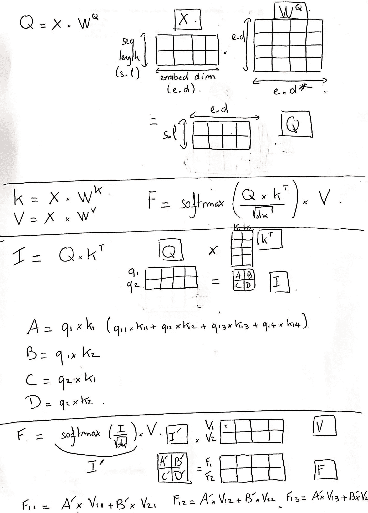

我不擅长画画

# 放大:

## 第一部分:

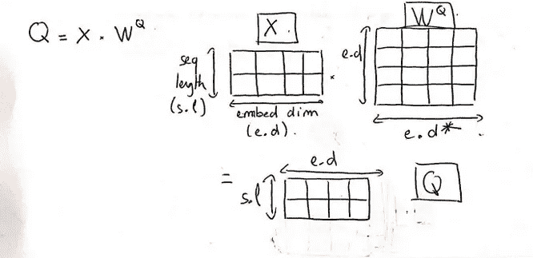

第一部分

在第一部分中，我展示了如何从 X 创建 Q 矩阵(这个过程对于 V 和 K 矩阵是相似的)。

x 的大小如下:
- 2 是序列长度
- 4 是嵌入维数

Wq 的大小如下:
- 4(嵌入维数)
- 4，因为为了简化的目的我们假设 Wq 是一个方阵。现实稍微复杂一些，但是我们不需要了解更多来理解掩蔽机制。

得到的 Q、V 和 K 矩阵具有以下大小:
- 2，这是序列长度
- 4

## 第二部分:

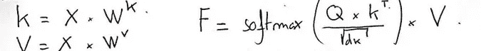

第二部分

在第二部分，我写了一个公式，总结了自我注意机制的步骤(更详细的解释见[http://jalammar.github.io/illustrated-transformer/](http://jalammar.github.io/illustrated-transformer/))。

## 第三节:

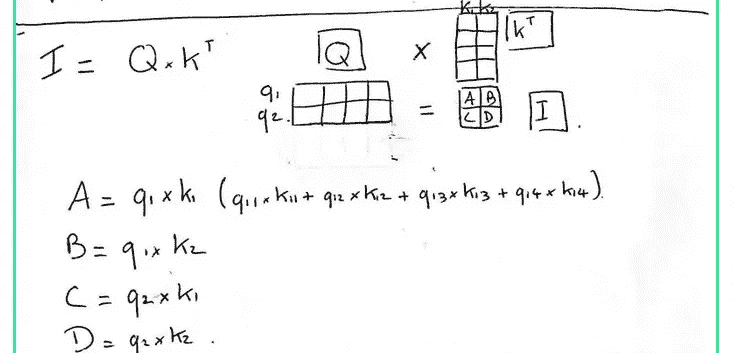

第三节

在第三节中，我展示了矩阵“I”的值，它是 Q 和 Kt 的点积的结果:A，B，C 和 d。

可以看到对来自在第一位置(q1 和 k1)嵌入令牌的值的操作结果。

这与 B 形成对比，B 的值来自于在第一和第二位置(q1 和 **k2** )的标记的嵌入。

**N.B:** q1=x1*Wq，k2=x2*Wk，其中 x1 和 x2 分别是第一个和第二个标记“hello”和“there”的嵌入。

## 第四节:

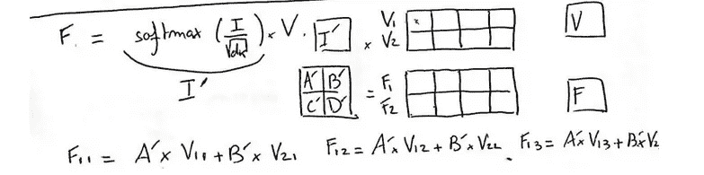

第四节

在第四部分，我做了同样的工作，分析我们最终值的组成(矩阵 F)。
它概述了如果我们不添加掩蔽机制，自我注意是如何让解码器窥视未来位置的。

softmax 操作将分数归一化，因此它们都是正的，加起来等于 1。

我们看到，如果我们想要遵守“不要向前看”的规则，我们需要将 I’矩阵的值 b’设置为零(用 I’=softmax(i/dk^(1/2))).

我们通过在 softmax 操作之前向 I 添加掩码来获得结果，如下所示:

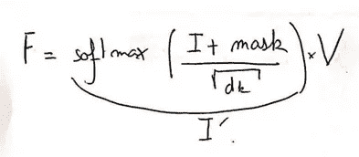

其中:

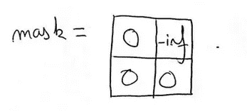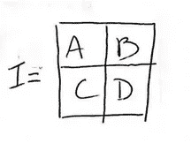

然后我们有:

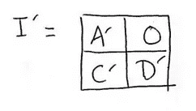

如果我们用“屏蔽开”来重复运算以获得 F:

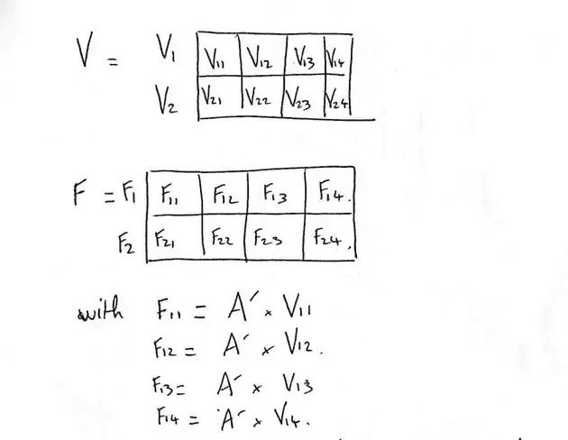

没有来自 x2/“那里”的信息

最后，我将使用 Jay 文章中的一个图像来总结在两个令牌长序列上掩蔽所发生的事情。

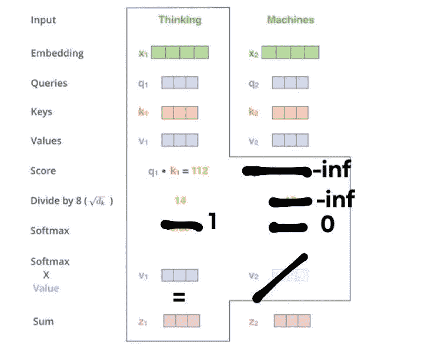

来自杰伦的文章

仅此而已。请告诉我你是否发现了什么错误，或者它是否帮助你理解了如何在下面的评论区使用屏蔽来防止“偷看”！