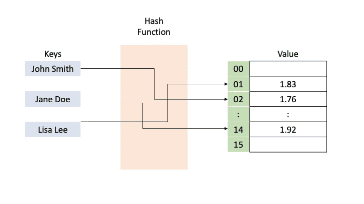

# Python 中的主词典

> 原文：<https://medium.com/analytics-vidhya/master-dictionaries-in-python-1d4b188fd317?source=collection_archive---------22----------------------->

## 更好地理解 Python 字典的哈希表

照片由[克莱门特 H](https://unsplash.com/@clemhlrdt?utm_source=medium&utm_medium=referral) 在 [Unsplash](https://unsplash.com?utm_source=medium&utm_medium=referral) 上拍摄

字典或哈希表是抽象数据类型的实现，在计算机科学中称为关联数组。字典是 Python 程序员工具箱中最复杂的工具之一。这项索赔的理由如下:

*   字典对象有键值对，它们都可以灵活地存储任何类型:整数、字符串、浮点、列表、类实例或它们的混合！
*   与查找时间为 O(n)的类似数组的列表相比，字典的查找时间为 O(1)
*   它们是可变的，也就是说，当我们需要时，我们可以添加、更改、删除键值对。并且这些操作中的任何一个都具有恒定的时间复杂度 O(1)。

散列密钥，即将密钥作为散列函数的输入，是能够以几乎恒定的时间复杂度执行所有这些任务的原因。哈希函数的输出是存储值的数组的索引。这是一个直观的表示:

***PS:每个键在字典中应该是唯一的***

考虑到它们的复杂性，了解字典对象支持的各种操作是非常重要的。在本文中，我将从零开始构建这些概念。

# **1。基本建设**

您可以通过用大括号`{}`将键值对括起来来创建字典。或者，您可以使用类构造方法`dict()`。请参见下面的代码片段以获得更好的想法:

# **2。字典理解**

如果在 python 中将键作为一个列表，而将值作为另一个列表，会怎么样呢？在这种情况下，字典的理解来拯救你！这是用下面的语法`{k[i]:v[i] for i in range(length of list containing keys or values)}`创建`dict`对象的一种方式。为了更好的理解，让我们来看看下面的代码片段:

# **3。插入/修改键值对**

字典是可变的，与其他数据结构相比，它们的主要优势之一是能够插入新的键值对，或者在**常量时间内修改预先存在的键值对中的值。**

# 4.重复

默认情况下，字典使用键是可迭代的，但是通过使用简单的 hacks，我们可以使用它们的值以及键-值对进行迭代。

# **5。排序**

在 python 中，默认情况下不可能对字典进行排序。但是，我们可以使用 python 中的`lambda`函数，通过使用键或值作为排序参数来获得 dictionary 的排序实现。以下代码片段应该能让您有所了解:

属性返回一个元组列表，其中每个元组由一个键值对组成。在每个元组中，键表示为索引 0，值表示为索引 1。

# 6.接近

使用相关的键可以很容易地获得字典的值。然而，如果我们想要获得与特定值相关联的键，这不是一个简单的任务。即使困难重重，这样做也相当简单。下面的片段向您展示了如何:

虽然从值中获取关联的键是可能的，但在开发应用程序时，它应该仅在具体情况下使用，因为我们往往会失去字典的主要功能，即能够以恒定的时间复杂度访问值，而这样做最终会使用列表，这使得关联的时间复杂度为线性 O(n)。

# 7.删除

特定的键值对可以通过各种方式从字典中删除，如下面的代码片段所示。一些值得注意的事情是:

*   属性`pop()`删除指定的键和与之相关的值。在字典的情况下，将`pop()`方法留空不会删除所谓的*‘最后一个键值对’*。这是造成字典是**无序的**(它们**做** **而不是**记录元素的位置或插入顺序)。
*   `pop()`属性返回被移除的项目，因此在需要对被移除的值进行操作的情况下非常有用。
*   `clear()`属性删除所有的键值对。
*   `del`关键字既可以用来删除特定的键值对，也可以用来删除字典对象

# 在你走之前

在本文中，我们回顾了字典的基础知识以及最常用的属性。我希望您现在对 dict 对象有了更好的理解，并且能够更轻松地在您的项目或应用程序中使用它们，并恰当地利用它们的功能。

感谢阅读！