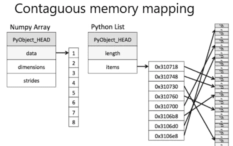
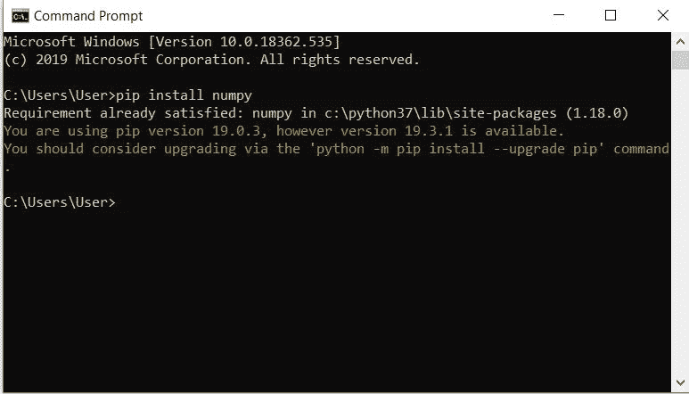
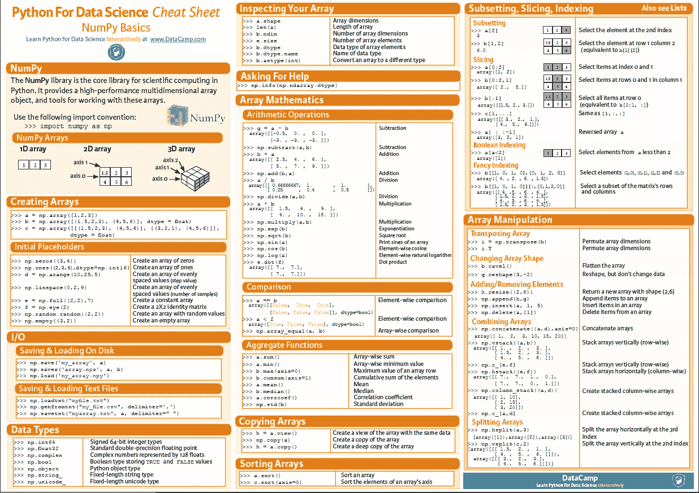

# NumPy 大师

> 原文：<https://medium.com/analytics-vidhya/master-numpy-in-45-minutes-74b2460ecb00?source=collection_archive---------9----------------------->

你们中的很多人一定在鼓吹机器学习、人工智能和计算机视觉等等，而你偶然发现了 NumPy。还有的只是为了计算想学这个。


## **NumPy 是什么？**

NumPy 代表 Numerical Python，是 Python 的一个库，用于处理大型数组和多维矩阵。它还提供了许多高级数学函数，从基本的三角函数到非常复杂的傅立叶变换。

## 为什么是 NumPy？

在 python 中使用 list 创建多维数组几乎是不可能的。此外，NumPy 在解决大型数学问题时比传统方法快得多。实际上 NumPy 是用 python 和 C 两种语言编写的，这是它速度快的一个原因。由于内存的固定类型和连续映射，NumPy 实际上很快。在门外汉的语言中，单个值不像列表中的值那样受到重视。在一个列表中，甚至有一个值具有像大小、引用计数、对象类型和对象值这样的属性。



传染记忆映射

如果你是初学者，你可能不喜欢使用 NumPy。但是，当您在做某件事情，而且事情变得很混乱时，比如通过多个阶段处理一个包含 44000 个元素数组，NumPy 就非常方便了。突然间，这成了迄今为止你所知道的最好的图书馆。



您可以使用 pip 安装功能安装 NumPy。确保您有网络，并这样做-

1.打开 cmd

2.写入 pip 安装编号

(我已经安装了 numpy，所以需求已经满足)

# 如何在 45 分钟内掌握 NumPy？

[在 numpy 上查看这个 Youtube 播放列表。](https://www.youtube.com/playlist?list=PLfH-1h7-ghYMTg2k3OpTjXWZmOs_IE_to)

要掌握任何东西，实践是关键。然而，要在最短的时间内学会，你需要聪明地学习。这里有两个聪明的屡试不爽的快速学习策略:

1.  保留一个备忘单，这个库中有很多函数和操作，记住它们是非常低效的。所以保留一个数据表。这里有一个链接，链接到 DataCamp 的一个很棒的小抄。[https://www . data camp . com/community/blog/python-numpy-cheat-sheet](https://www.datacamp.com/community/blog/python-numpy-cheat-sheet)



DataCamp 的备忘单

1.  第二个策略是聪明的实践。没有人可以不经过练习就掌握任何东西，但是聪明的练习可以减少时间和精力。运行主要功能大约需要 5 到 10 分钟(你只需要复制粘贴)。

a.首先安装 numpy，并尝试上面提到的数据表中的大多数操作。以便您了解 numpy 的基本功能。

b.现在当你有了所有的基本经验，继续解决问题。我为你精选了一些问题，由易到难。这些问题都有解答，所以你可以继续。这些问题只需要 30 到 35 分钟。

## 练习:

1.  创建一个布尔数组？

```
import numpy as np
arr = np.ones((3,3), dtype=bool)
print (arr)
```

2.创建一个所有元素都等于零数组。

```
import numpy as np 
arr = np.zeros((2,2,2))
print (arr)
```

3.写一个 NumPy 程序来创建一个 3x3 的单位矩阵

```
import numpy as np
x = np.eye(3) #'eye' sounds similar to 'I'
print (x)
```

4.编写一个 numpy 程序，将 NumPy 数据类型转换为本地 python 类型。

```
import numpy as np
x = np.float32(0) # This creates an np type float32
print (type(x))
pyval = x.item()
print (type(pyval))
```

5.写一个 NumPy 程序来反转一个数组

```
import numpy as np
x = [ 1,2,3,4,5,6,7,8,9]
x = x[::-1]
print (x)
```

6.编写一个 NumPy 程序来计算给定数组中所有元素的总和、每列的总和以及每行的总和。

```
import numpy as np
x = np.array([[0,1],[2,3]])
print("Original array:",x)
print("Sum of all elements:",np.sum(x))
print("Sum of each column:",np.sum(x, axis=0))
print("Sum of each row:",np.sum(x, axis=1))
```

7.如何从 str 的 1D 数组中提取特定的列？

```
import numpy as np
url = ‘https://archive.ics.uci.edu/ml/machine-learning-databases/iris/iris.data' #url returns a str
iris_1d = np.genfromtxt(url, delimiter=’,’, dtype=None)
print(iris_1d.shape)
```

8.写一个 NumPy 程序来计算两个给定向量的叉积。

```
import numpy as np
p = [[1, 0], [0, 1]]
q = [[1, 2], [3, 4]]
result1 = np.cross(p, q)
result2 = np.cross(q, p)print("cross product of the said two vectors(p, q):",result1)print("cross product of the said two vectors(q, p):",result2)
```

9.写一个 NumPy 程序计算给定矩阵的逆矩阵。

```
import numpy as np
m = np.array([[1,2],[3,4]])
print("Original matrix:",m)
result =  np.linalg.inv(m)
print("Inverse of the said matrix:",result)
```

10.编写一个 NumPy 程序，将形状 2 的给定数组沿第一个轴、最后一个轴和扁平数组排序

```
import numpy as np
a = np.array([[10,40],[30,20]])
print("Original array:")
print(a)
print("Sort the array along the first axis:")
print(np.sort(a, axis=0))
print("Sort the array along the last axis:")
print(np.sort(a))
print("Sort the flattened array:")
print(np.sort(a, axis=None))
```

11.如何在 numpy 中做概率抽样？

```
import numpy as np
url = 'https://archive.ics.uci.edu/ml/machine-learning-databases/iris/iris.data'iris = np.genfromtxt(url, delimiter=',', dtype='object')# Solution# Get the species columnspecies = iris[:, 4]# Approach 1: Generate Probablistically
np.random.seed(100)
a = np.array(['Iris-setosa', 'Iris-versicolor', 'Iris-virginica'])
species_out = np.random.choice(a, 150, p=[0.5, 0.25, 0.25])# Approach 2: Probablistic Sampling (preferred)
np.random.seed(100)
probs = np.r_[np.linspace(0, 0.500, num=50), np.linspace(0.501, .750, num=50), np.linspace(.751, 1.0, num=50)]
index = np.searchsorted(probs, np.random.random(150))
species_out = species[index]
print(np.unique(species_out, return_counts=True))
```

12.如何找到 numpy 数组中最频繁出现的值？

```
#for lst is the numpy array
vals, counts = np.unique(lst[:, 2], return_counts=True)
```

13.如何将所有大于给定值的值替换为给定的截止值？

```
import numpy as np
np.random.seed(100)
a = np.random.uniform(1,50, 20)# Solution 1: Using np.clip
np.clip(a, a_min=10, a_max=30)# Solution 2: Using np.where
print(np.where(a < 10, 10, np.where(a > 30, 30, a)))
```

14.如何计算 numpy 数组 2d 中每行的 min-by-max？

```
import numpy as np
a = np.random.seed(100)
a = np.random.randint(1,10, [5,3])
np.apply_along_axis(lambda x: np.min(x)/np.max(x), arr=a, axis=1)
```

*   了解**λ函数**手表:【https://youtu.be/udMgcbeu8fA】T2

15.写一个 NumPy 程序来创建一个 2d 数组，1 在边界上，0 在 n*n 大小的内部。

```
import numpy as np
n=4
x = np.ones((n,n))
print("Original array:",x)
print("1 on the border and 0 inside in the array")
x[1:-1,1:-1] = 0
print(x)
```