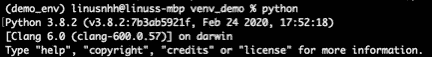
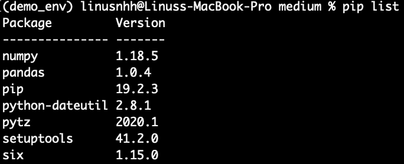

# 在不到 5 分钟的时间内掌握虚拟环境和 pip

> 原文：<https://medium.com/analytics-vidhya/master-virtual-environment-and-pip-in-less-than-5-minutes-818dcbf207e1?source=collection_archive---------20----------------------->

## 使用虚拟环境可以帮助你从一个完全的初学者变成一个更有能力的 Python 用户

*注意:本教程仅仅是关于在 Mac & Linux 上使用虚拟环境。在 windows 上使用虚拟环境的方式是不同的。*


只是自己拍的一张很酷的封面照片

当我们第一次开始学习如何编码时，我们非常关注代码是否是功能性的。你有没有遇到过这样的情况，你从 Github 复制了别人的代码，却发现代码不能马上工作？或者你升级到一个已安装软件包的新版本，并意识到这实际上破坏了你一直在做的其他项目？

如果你以前遇到过这些问题，使用**虚拟环境**可能是解决方案。在本教程中，我们将走过创建和使用虚拟环境的基础。我的目标是使这个指南简单易懂，同时包括所有关于虚拟环境的要点。

本指南分为 3 个主要部分:

1.  **为什么我们需要使用虚拟环境**
2.  **创建虚拟环境和安装包的分步指南**
3.  **虚拟环境中的注意事项**

# 1.为什么我们需要使用虚拟环境？

使用虚拟环境提供了一个空间，我们可以在这里安装特定于某些项目的软件包。

这一点非常重要，尤其是当你在一个组织中工作时，每个人都有**个不同版本的软件包安装在他们的全球环境中**。在你的机器上运行良好的代码在其他人的机器上可能不工作。

最佳实践是为每个 python 项目创建虚拟环境，以**确保每个项目都有自己的依赖关系**并且**允许其他人重新创建虚拟环境**。

# 2.为项目创建虚拟环境和安装包的分步指南

1.  在 mac 终端中导航到项目所在的文件夹。通过在命令行中键入以下内容来创建新的虚拟环境:

```
python3 -m venv demo_env
```

当我们有了 a -m，提供了 venv 这样的模块，python 就会搜索模块 venv 并执行。现在我们有了一个名为 demo_env 的虚拟环境。

2.通过键入以下命令激活环境:

```
source demo_env/bin/activate
```

虚拟环境现在被激活，因为名称将在括号中。

虚拟环境中使用的 python 版本将与用于创建虚拟环境的 python 版本相同。只需在命令行中键入“python”即可检查 python 版本。



python 版本 3.8.2 现在激活了“demo_env”

*   *请注意，我们不能在创建虚拟环境时指定 python 版本。如果我们想这样做，我们可以使用 virtualvenv。*

**3。为特定项目安装软件包**

如果我们想要查看安装在虚拟环境中的包，我们可以:

```
pip list
```

您应该只看到环境中安装的两个包，即 pip 和 setuptools。

比方说，如果我想在我的项目中使用熊猫，我们可以简单地运行:

```
pip install pandas
```

如果我们再次运行“pip list ”,我们可以看到安装包及其版本，如下所示:



使用虚拟环境的一个主要优势是它促进了协作。我们可以将包及其依赖项的列表导出到“requirements.txt”，这样其他人就可以使用 txt 文件安装具有相同依赖项的相同包。

为此，我们可以运行以下命令来创建一个 txt 文件:

```
pip freeze > requirements.txt
```

**就是这样。**现在您已经 **1)** 创建了一个名为“demo_env”的虚拟环境，并且 **2)** 在该环境中安装了软件包“pandas”。您也已经 **3)** 将关于包及其依赖项的信息导出到一个名为“requirements.txt”的文本文件中。
如果我们想停用环境，只需运行:

```
deactivate
```

停用后，如果我们想完全删除虚拟环境(即删除虚拟环境文件夹)，我们可以运行:

```
rm -rf demo_env
```

奔跑

```
ls
```

查看存储库中的所有文件和文件夹，检查虚拟环境是否已被删除，或者 requirements.txt 文件是否已创建等。

**还记得你已经创建了一个 requirements.txt 文件吗？我们可以使用该文件在新的虚拟环境中安装软件包。**因此，安装的软件包将与我们之前创建的虚拟环境具有相同的依赖关系。为此，我们可以运行:

```
pip install -r requirements.txt
```

r 表示我们将期待一个 requirements.txt 文件。

# **虚拟环境中的注意事项**

**Dos**

*   通常的做法是将虚拟环境命名为“venv”
*   将 requirements.txt 包含到源代码控制中，这样其他人就可以用它来构建自己的虚拟环境

**不要做**

*   将项目文件保存在 venv 文件夹中，因为虚拟环境经常被丢弃和重建
*   将虚拟环境提交给源代码管理；相反，你应该把“venv”包括进去。gitignore，requirements.txt 足以让其他人构建他们自己的虚拟环境

使用虚拟环境是使所有 python 项目相互独立的一种简单而有效的方法。当您处理一个新的 python 项目时，这绝对是一个重要的步骤。