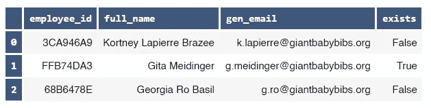
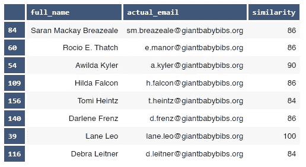

# 用 FuzzyWuzzy 搭配凌乱的熊猫专栏

> 原文：<https://medium.com/analytics-vidhya/matching-messy-pandas-columns-with-fuzzywuzzy-4adda6c7994f?source=collection_archive---------0----------------------->


rawpixel.com

在本文中，我将向您展示如何使用 Python 包 **FuzzyWuzzy** 根据**字符串相似度**来**匹配两个熊猫数据帧列**；预期的结果是将 A 列的每个值与 B 列中最接近的对应值进行匹配，然后将其放在同一行中。

为此，我将使用我个人遇到的一个混乱的真实世界案例(个人和公司信息被虚构和随机生成的数据所替代)。

现在，在解决我们的小问题之前，下面是这篇文章的内容:

*   通常，当您使用不同的数据源时，相同的实体(企业、国家、地址、电话号码、酒店房间类型、音乐专辑、运动队……)可能会有不同的写法或措辞。在这篇文章中，我们将致力于匹配全名和电子邮件。但是，您可以对遇到的任何字符串匹配问题应用相同的技术(简单地说，字符串就是文本)；
*   你可以通过下载 **Jupyter 笔记本**和**我的 [Github 库](https://github.com/kelmouloudi/MediumArticle-FuzzyWuzzy)中的数据**来跟随我。Jupyter 笔记本有更多的解释，我无法在本文中包括；
*   这是一篇非常适合初学者的文章。在 Jupyter 的笔记本中，我确保在末尾包含了一个**附录**，在那里我尽可能详细地解释了每个看起来复杂的代码片段。然而，对 Python、Jupyter 笔记本和 Pandas(这是一个用于数据处理和分析的 Python 包)的基本理解将会对你有很大的帮助。

# 问题是:


rawpixel.com

我在一家名为 Giant Baby Bibs 的公司工作，专门为巨婴制作围兜。GBB 有 200 名员工。一天，我需要列出所有员工及其电子邮件的清单。大惊喜:人力资源部门有一个包含所有员工 id 和全名的文件，但没有电子邮件，IT 部门有一个包含所有电子邮件的 CSV 文件，但没有员工 id 或姓名。

似乎这还不够混乱，IT 部门并没有一个明确的既定规则，规定电子邮件应该如何从员工的全名派生出来。例如，对于一个名叫**约翰·多伊**的员工，电子邮件可以是[j.doe@giantbabybibs.org](mailto:j.doe@giantbabybibs.org)，或者[jdoe@giantbabybibs.org](mailto:jdoe@giantbabybibs.org)，甚至[johndoe@giantbabybibs.org](mailto:johndoe@giantbabybibs.org)(特别是对于那些姓氏非常短的员工)。

现在，真正的难题出现在有中间名的员工身上。例如，对于约翰·塞巴斯蒂安·多伊来说，电子邮件可以是 jsdoe@giantbabybibs.org、j.sebastian.doe@giantbabybibs.org、T21 或 j.sebastian@giantbabybibs.org，或者是站长当时认为合适的任何变体。干得好凯文。

# 包装:

首先，让我们导入`Pandas`:

```
import pandas as pd
```

如果你没有安装`FuzzyWuzzy`，你可以在你的 Jupyter 笔记本上运行`pip install fuzzywuzzy[speedup]`或者从 PIP 或者 Anaconda 提示符下安装它。如果这样不行，你就把`FuzzyWuzzy`这样装:`pip install fuzzywuzzy`然后把`python-levenshtein`这样装:`pip install python-Levenshtein`(为了加快匹配过程)。

从`FuzzyWuzzy`开始，我们将主要需要两个模块:`process`和`fuzz`:

```
from fuzzywuzzy import process, fuzz
```

让我们也导入`matplotlib`来实现一些数据可视化:

```
import matplotlib.pyplot as plt
```

为了更好地测量，让我们添加一些 CSS 来样式化我们的数据帧，以增加轴和数据本身之间的对比(如果您不喜欢这种样式，只需删除单元格，重新启动内核并重新运行所有单元格) :

```
%%HTML
<style>.dataframe th, td:first-child{background:#3f577c;font-family:monospace;color:white;border:3px solid white;
text-align:left !important;}#codex{float:right;}</style>
```

# 数据:

这里我们有两个需要匹配的数据框或表格:

*   `hr`包含员工 id 和全名，由人力资源部维护；
*   `it`仅包含 IT 部门提取的电子邮件。

确保将“data/hr.csv”和“data/it.csv”路径更改为您的数据在机器中的位置(不要忘记从本文的 [Github 存储库](https://github.com/kelmouloudi/MediumArticle-FuzzyWuzzy)获取数据:

```
hr = pd.read_csv('data/hr.csv', encoding='unicode_escape')
it = pd.read_csv('data/it.csv', encoding='unicode_escape')display( hr.head(3) )
display( it.head(3) )
```


这里，我们在`hr`数据框架中有 200 名员工，在`it`数据框架中有 200 封电子邮件。每个员工对应一封电子邮件，反之亦然。

# “愚蠢但有点效果”的解决方案:

在施展`FuzzyWuzzy`的魔力之前，我想探索一下我在开始时曾尝试过的这个问题的解决方案。这个想法是:

1.  自动生成一封电子邮件(姑且称之为`gen_email`)，使用名字的第一个字母加上姓氏，并用点分隔。因此，对于无名氏，生成的电子邮件将是[j.doe@giantbabybibs.org](mailto:j.doe@giantbabybibs.org)。通过研究实际邮件列表，这似乎是主导趋势；
2.  将`gen_email`列与实际的`email`列进行比较，如果生成的邮件存在于实际的邮件列表中，则输出值 **True** ，如果不存在，则输出值 **False** 。真值和假值将存储在一个名为`exists`的列中。

现在，让我们在`hr`数据框架中制作`gen_email`列:

```
hr['gen_email'] = hr['full_name'].str[0] + '.' + hr['full_name'].str.split().str[1] + '[@giantbabybibs](http://twitter.com/giantbabybibs).org'
hr['gen_email'] = hr['gen_email'].str.lower()
hr.head(3)
```


现在让我们检查一下`gen_email`值是否存在于实际的`email`列表中。为此，我们将创建一个名为`exists`的附加列，如果生成的电子邮件是正确的，则接受**真**，否则接受**假**:

```
hr['exists'] = hr.apply(lambda x: x.gen_email in list(it.email), axis=1)
hr.head(3)
```



使用这种方法，我们得到了多少封邮件？

```
ax = hr.exists.value_counts().sort_values() \
    .plot(kind='barh', 
          color=['tomato', 'c'], 
          figsize=(12,1), 
          width=0.3 )
plt.xlim(0,201), 
plt.xticks(fontsize=8), 
ax.set_frame_on(False), 
plt.grid(color='white', alpha=.4, axis='x') ;
```


因此，在 200 封邮件中，我们有 148 封邮件是正确的，52 封邮件是错误的(成功率为 74%)。还不错！我们可以用`if`语句更深入地挖掘邮件生成的其他方式(没有点，使用中间名而不是姓，等等)。)，不过现在还是用 FuzzyWuzzy 吧。

# 令人厌烦的模糊不清的讲座；

让我们从`FuzzyWuzzy`的基本介绍开始。这个漂亮的包比较两个字符串 A 和 B，并输出一个比率来估计它们之间的距离。我们在这里谈论的是 **Levenshtein 距离**，这是 A 和 B 之间的距离，根据我们必须对字符串 A 进行多少更改才能将其转换为字符串 B。这些更改包括删除、添加或替换字符。我们必须做出的改变越少，A 和 B 就越相似，这导致了更高的比率。

如果你记得的话，我们从`FuzzyWuzzy`包中导入了`fuzz`和`process`。这是我们将在本文中介绍的两个主要模块:

> ***fuzz . ratio****:比较两个字符串，输出一个比值。例如:*
> 
> fuzz.ratio("外面阳光明媚！"，“外面真是阳光明媚”)
> 输出:38
> 
> ***process . extract****:它获取一个字符串 A，然后在字符串列表中为其寻找最佳匹配，然后返回这些字符串及其比率(limit 参数告诉模块我们想要返回多少个相似的字符串)。例如:*
> 
> list_of_strings = ['a '，' ab '，' c '，' cd']
> process.extract( 'aaa '，list_of_strings，limit=2 )
> Output: [('a '，90)，(' ab '，45)]

这两个模块可以使用多种方法来计算比率，从基本的 Levenshtein 比率到更复杂的加权比率。这些方法被称为**计分器**，下面是它们的使用方法:

> fuzz.ratio(…)
> 
> fuzz.partial_ratio(…)
> 
> 绒毛。WRatio(…)等。
> 
> process.extract( …，scorer=fuzz.ratio)
> 
> process.extract( …，scorer=fuzz.partial_ratio)
> 
> process.extract( …，scorer=fuzz。WRatio)等。

稍后我们会看到完整的得分者名单和他们每个人的表现。理论到此为止，让我们开始实践吧！

# 不那么无聊的模糊应用程序:

在我们的例子中，我们希望将`hr.full_name`列中的每个全名与`it.email`列中的所有实际电子邮件进行比较，因此我们将使用 **process.extract** 。

然而，我们只需要电子邮件的第一部分进行比较，因为域名部分`@giantbabybibs.org`可能会干扰比率计算。让我们在`it`数据框架内生成一个名为`username`的新列:

```
it['username'] = it['email'].str.replace('[@giantbabybibs](http://twitter.com/giantbabybibs).org', '')
it.head(3)
```


现在让我们使用 **process.extract** 来比较`hr.full_name`和`it.username`(注意，我们在计算比率后添加了域名`@giantbabybibs.org`):

```
actual_email = []
similarity = []for i in hr.full_name:
        ratio = process.extract( i, it.username, limit=1)
        actual_email.append(ratio[0][0])
        similarity.append(ratio[0][1])hr['actual_email'] = pd.Series(actual_email)
hr['actual_email'] = hr['actual_email'] + '[@giantbabybibs](http://twitter.com/giantbabybibs).org'
hr['similarity'] = pd.Series(similarity)hr.head(3)
```


模糊巫师施展了他的魔法！现在让我们简化这个数据帧，只保留`full_name`、`actual_email`和`similarity`列。姑且称之为`final_result`:

```
final_result = hr[['full_name', 'actual_email', 'similarity']]
final_result.head(3)
```


**NB** :如果`hr.full_name`有空值(不仅仅是*字符串*显示‘Null’或‘Nan’)，上面的代码应该考虑到这一点(感谢 Thomas Algenio 提出这个问题) :

```
import numpy as npactual_email = []
similarity = []for i in hr.full_name :     
    if pd.isnull( i ) :          
        matching_list.append(np.null)
        similarity.append(np.null)     
    else :          
        ratio = process.extract( i, df2.col, limit=1)
        matching_list.append(ratio[0][0])
        similarity.append(ratio[0][1]) 
...
...
```

# 审计:

这很好，但我们如何确保每个员工都匹配到正确的电子邮件呢？这样做的一个好方法是格式化数据帧，这样低的比率将更容易使用颜色图发现和检查。在我们的例子中，我们将使用反转的夏季色图`summer_r`，其中高比率显示绿色，低比率显示黄色:

```
final_result.head(8).style.background_gradient(subset='similarity',
                                               cmap='summer_r')
```


除此之外，我们可以通过`similarity`对`final_result`数据帧进行排序，然后检查低比率(注意，高比率并不意味着匹配正确。反之亦然)。

但是，如果你的数据框架很大(比如一百万条记录或者更多)，你能做什么呢？您可以使用**随机抽样**来控制匹配是否成功。你应该根据需要多次运行下面的代码，因为每次你都会得到一个新的随机样本来检查(这里的`random_state=9`参数确保你会得到和我一样的样本)。每次运行该单元时，移除它以获得随机样本) :

```
sample = final_result.sample( n=8, random_state=9 )
sample
```



正如我们在这里看到的，上面的随机样本显示，员工 **N 60 犯了一个特殊的错误:Rocio E. Thatch** 。会不会是因为中间名缩写？让我们看看是否还有其他像这样的员工:

```
final_result[final_result['full_name'].str.contains('.',
                                                    regex=False)]
```


你看看这个！这个过程把 4 名员工都弄错了。尽管这只是 200 封邮件中的 **4 封**错误，这意味着 98%的**成功率**，但想象一下，如果你的数据框架中有 173，000 名员工(例如像通用汽车这样的公司)，这将意味着 **3460 封错误邮件**。

为了理解为什么会出现这种错误，我们必须检查该流程使用了哪个`FuzzyWuzzy` **计分器**。计分器是一种通过比较两个字符串来生成比率的方法。是的，正如我们之前看到的，`FuzzyWuzzy`有许多不同的计分器，你可以根据你正在处理的数据类型进行选择。以下是上述得分者的名单:

*   模糊比率
*   模糊.部分 _ 比率
*   fuzz.token_set_ratio
*   fuzz.token_sort_ratio
*   fuzz.partial_token_set_ratio
*   fuzzy . partial _ token _ sort _ ratio
*   **细毛。WRatio**
*   绒毛。比率
*   绒毛。UWRatio
*   绒毛。比率

流程默认使用的是`fuzz.WRatio`。如果您想对这些计分器中的一个使用`process`,只需像这样传递它作为一个参数:

```
ratio = process.extract( column_A, column_B, limit=1,
                         scorer=fuzz.ratio )
```

接下来，我们将测试其中一些计分器，看看哪一个在我们的情况下工作得最好。开始寻找 100%的成功率吧！

# 寻找完美的模糊不清的记分员:

让我们看看所有我们能使用的`FuzzyWuzzy`计分器。我们将为它们中的每一个分配一个缩写，以便以后在字典中作为一个键使用(scorer 方法是区分大小写的。例如 fuzz.wratio 将不起作用) :

*   模糊比率
*   模糊.部分比率(PR)
*   fuzz.token_set_ratio
*   fuzz.token_sort_ratio
*   fuzz . partial _ token _ set _ ratio(PTSeR)
*   fuzz . partial _ token _ sort _ ratio(PTsoR)
*   绒毛。雷蒂奥(WR)
*   绒毛。比率(QR)
*   绒毛。UWRatio (UWR)
*   绒毛。UQR 比率

这是我们最喜欢的字典:

```
scorer_dict = { 'R':fuzz.ratio, 
                'PR': fuzz.partial_ratio, 
                'TSeR': fuzz.token_set_ratio, 
                'TSoR': fuzz.token_sort_ratio,
                'PTSeR': fuzz.partial_token_set_ratio, 
                'PTSoR': fuzz.partial_token_sort_ratio, 
                'WR': fuzz.WRatio, 
                'QR': fuzz.QRatio,
                'UWR': fuzz.UWRatio, 
                'UQR': fuzz.UQRatio }
```

还记得`hr`数据帧吗？我们将使用它的列`full_name`进行测试。我们称之为`scorer_test`:

```
scorer_test = hr[['full_name']].copy()
scorer_test.head(3)
```


现在是大秀！我们将定义一个名为`scorer_tester_function`的**函数**，它从`scorer_dict`(它只是计分器的名称)中获取一个**参数 x** ，并将`scorer_test.full_name`列与`it.email`列进行匹配:

```
def scorer_tester_function(x) :
    actual_email = []
    similarity = []

    for i in scorer_test['full_name']:
        ratio = process.extract( i, it.username, limit=1,
                                 scorer=scorer_dict[x])
        actual_email.append( ratio[0][0] )
        similarity.append( ratio[0][1] ) scorer_test['actual_email'] = pd.Series(actual_email)
        scorer_test['actual_email'] = scorer_test['actual_email'] +
                                      '[@giantbabybibs](http://twitter.com/giantbabybibs).org'
        scorer_test['similarity'] = pd.Series(similarity)

    return scorer_test
```

然后，我们将应用来自`scorer_dict`字典的不同计分器的函数。让我们从 4 名员工**开始。**WRatio(WR)弄错了:

```
scorer_tester_function('WR')
scorer_test[scorer_test.full_name.str.contains('.', regex=False)]
```


正如我们所见，**细毛。WRatio (WR)** 全名带有中间名缩写时表现很差。让我们看看其他评分者是否会纠正这一点， **fuzz.ratio (R)** 例如:

```
scorer_tester_function('R')
display(scorer_test[scorer_test.full_name.str.contains('.',
                                                    regex=False)])
display(scorer_test[81:82])
```


确实如此。 **fuzz.ratio (R)** 得到了**200 个正确**中的 199 个(99.5%的成功率)。它犯的唯一错误是针对第 81 号员工:斯特林·马洛里·阿彻。(我们在危险区！).但是，所有中间名缩写的员工都通过该评分员得到了妥善处理。

我们能做得更好吗？让我们尝试另一个计分器， **fuzz.partial_ratio (PR)** 这次，看看它是否对所有有问题的员工姓名都有效:

```
scorer_tester_function('PR')
display(scorer_test[scorer_test.full_name.str.contains('.',
                                                    regex=False)])
display(scorer_test[81:82])
```


终于！在人工检查完所有其他记录后，我在此宣布 **fuzz.partial_ratio (PR)** 以 **100%成功率**获得冠军。任务结束了！

# 射手之战(加成) :


rawpixel.com

在现实世界的应用程序中，您可能会处理大量的数据，在这种情况下，手动检查结果是不可取的。这就是为什么你需要了解每个`FuzzyWuzzy`计分器做什么，以便选择一个最适合你正在处理的数据的计分器。

为了探究评分器`FuzzyWuzzy`之间的差异，我们将使用一个测试字符串。我们想把一个朋友的**地址**和一个电话簿的**多个地址**(是的，电话簿还是一个东西！):

```
friend_address = '56 West Princess Rd. Cedar Rapids, IA 52402'phonebook = [ '9102 South St. Lake Worth, FL 33460',
              '20425 Prince Edward Road, West philadelphia, PA
               56560',
              'Wst Princess Road, Appt. 56 N°8 3rd floor, C.Rapids,
               52402 Iowa ',
              '400 Van Dyke St.Hartford, IA 26106',
              '56 Golden Star Rd, Stone Rapids, GA 52483' ]
```

现在让我们来测试一下所有的得分者。在这种情况下，我们将使用`fuzz`模块，而不是`process`。

## 1 —模糊比率(R)

```
print("Friend's address : ", friend_address, '\n', 62*'-', '\n')for address in phonebook:
    ratio = fuzz.ratio(friend_address, address)
    print(address, '\nRATIO: ', ratio, '\n')
```

> 朋友的地址:公主西路 56 号。爱荷华州锡达拉皮兹 52402
> -
> 佛罗里达州南圣莱克沃斯 9102 号 33460
> 比例:31
> 
> 宾夕法尼亚州西费城爱德华王子路 20425 号 56560
> 比例:50
> 
> Wst 公主路，Appt。衣阿华州 52402 .拉皮兹 56N 8 3 楼
> 比例:62
> 比例:400 衣阿华州范·代克圣哈特福德 26106
> 比例:39
> 比例:56 佐治亚州石拉皮兹金星路 56 号
> 比例:60

**fuzz.ratio (R)** 简单计算 **Levenshtein 距离**。如果两个字符串完全相似(包括大写和小写),它只会返回 100%,这在我们寻找精确匹配时非常有用。

## 2 — fuzz.partial_ratio (PR):

```
print("Friend's address : ", friend_address, '\n', 62*'-', '\n')for address in phonebook:
    ratio = fuzz.partial_ratio(friend_address, address)
    print(address, '\nRATIO: ', ratio, '\n')
```

> 朋友的地址:公主西路 56 号。爱荷华州锡达拉皮兹 52402
> -
> 9102 佛罗里达州南圣莱克沃斯 33460
> 比例:29
> 20425 宾夕法尼亚州西费城太子路 56560
> 比例:49
> Wst 公主路 Appt。衣阿华州 C .拉皮兹 52402 号 8 楼 56 号
> 比例:51
> 比例:400 衣阿华州范·代克圣哈特福德 26106
> 比例:41
> 比例:56 佐治亚州斯通拉皮兹金星路 56 号
> 比例:61

**fuzz.partial_ratio (PR)** 考虑它所比较的字符串的子集，然后根据它们的相似性返回一个比率。例如，如果将**道恩·约翰逊**与**道恩**进行比较，它将返回 100%的比率:

```
fuzz.partial_ratio('Dwayne The Rock Johnson', 'Dwayne')
Output: 100
```

然而，在我们的例子中，它被愚弄了，因为第五个地址与朋友的地址有共同的词，如`56`、`Rd.`和`Rapids`。所以，也许这不是这个特殊任务的最佳记分员。

## 3 — fuzz.token_sort_ratio (TSoR):

```
print("Friend's address : ", friend_address, '\n', 62*'-', '\n')for address in phonebook:
    ratio = fuzz.token_sort_ratio(friend_address, address)
    print(address, '\nRATIO: ', ratio, '\n')
```

> 朋友的地址:公主西路 56 号。锡达拉皮兹，IA 52402
> -
> 9102 南圣莱克沃斯，FL 33460
> 比例:35
> 
> 20425 西费城太子道，PA 56560
> 比例:65
> 
> Wst 公主道，Appt。衣阿华州 C .拉皮兹市 56 号 8 楼 3 楼 52402】比例:75
> 比例:400 衣阿华州范·代克圣哈特福德 26106
> 比例:38
> 比例:56 佐治亚州石拉皮兹市金星路 56 号
> 比例:57

这是一个令牌方法。令牌方法的优点是可以忽略大小写和标点符号(所有字符都被转换成小写字符)。在使用**fuzz . token _ sort _ ratio(TSoR)**的情况下，在对字符串应用基本的 **fuzz.ratio (R)** 之前,“标记化”的字符串(每个单词都被转换成一个标记)按字母数字顺序排序，因此两个字符串中单词的顺序并不重要(与之前的非标记方法不同)。在这种情况下，这个得分手表现得非常好。

## 4 — fuzz.token_set_ratio(TSeR):

```
print("Friend's address : ", friend_address, '\n', 62*'-', '\n')for address in phonebook:
    ratio = fuzz.token_set_ratio(friend_address, address)
    print(address, '\nRATIO: ', ratio, '\n')
```

> 朋友的地址:公主西路 56 号。爱荷华州锡达拉皮兹 52402
> -
> 9102 佛罗里达州南圣莱克沃斯 33460
> 比例:35
> 宾夕法尼亚州西费城太子路 20425 号 56560
> 比例:65
> Wst 公主路 Appt。衣阿华州 52402 .拉皮兹 56N 8 3 楼
> 比例:77
> 比例:400 范·代克圣哈特福德，衣阿华州 26106
> 比例:43
> 比例:56 佐治亚州石拉皮兹金星路
> 比例:60

这是目前给定任务的最佳比例。**fuzz . token _ set _ ratio(TSeR)**与**fuzz . token _ sort _ ratio(TSoR)**相似，只是它忽略了重复的单词(因此得名，因为在 Math 和 Python 中的`set`是不包含重复值的集合/数据结构)。它还对比较的两个字符串共有的标记进行配对比较。

## 5—fuzz . partial _ token _ sort _ ratio(PTSoR):

```
print("Friend's address : ", friend_address, '\n', 62*'-', '\n')for address in phonebook:
    ratio = fuzz.partial_token_sort_ratio(friend_address, address)
    print(address, '\nRATIO: ' ,ratio, '\n')
```

> 朋友的地址:公主西路 56 号。爱荷华州锡达拉皮兹 52402
> -
> 9102 佛罗里达州南圣莱克沃斯 33460
> 比例:33
> 20425 宾夕法尼亚州西费城太子路 56560
> 比例:61
> Wst 公主路 Appt。衣阿华州 C .拉皮兹 56 N 8 号 3 楼
> 比例:71
> 爱荷华州范·代克圣哈特福德 400 号 26106
> 比例:42
> 佐治亚州斯通拉皮兹金星路 56 号 52483
> 比例:56

**fuzz . partial _ token _ sort _ ratio(PTSoR)**与**fuzz . token _ sort _ ratio(TSR)**的工作原理相同，但它在标记化和排序后使用了 **fuzz.partial_ratio (PR)** 方法，而不是普通的 **fuzz.ratio (R)** 方法。

## 6—fuzz . partial _ token _ set _ ratio(PTSeR):

```
print("Friend's address : ", friend_address, '\n', 62*'-', '\n')for address in phonebook:
    ratio = fuzz.partial_token_set_ratio(friend_address, address)
    print(address, '\nRATIO: ', ratio, '\n')
```

> 朋友的地址:公主西路 56 号。锡达拉皮兹，IA 52402
> -
> 9102 南圣莱克沃斯，FL 33460
> 比例:33
> 
> 20425 西费城太子道，PA 56560
> 比例:100
> 
> Wst 公主道，Appt。衣阿华州 C .拉皮兹市 56 N 8 号 3 楼 52402】比例:100
> 
> 400 衣阿华州范·代克圣哈特福德 26106
> 比例:100
> 
> 佐治亚州石拉皮兹市金星路 56 号 52483
> 比例:100

与**fuzz . token _ set _ ratio(TSR)**相同，但在标记化和设置(消除重复)后，不使用 **fuzz.ratio (R)** ，而是使用 **fuzz.partial_ratio (PR)** 。这里我们看到它太宽容了，在这种情况下没有用。

## 7 —模糊。雷蒂奥(WR):

```
print("Friend's address : ", friend_address, '\n', 62*'-', '\n')for address in phonebook:
    ratio = fuzz.WRatio(friend_address, address)
    print(address, '\nRATIO: ', ratio, '\n')
```

> 朋友的地址:公主西路 56 号。爱荷华州锡达拉皮兹 52402
> -
> 9102 佛罗里达州南圣莱克沃斯 33460
> 比例:38
> T4 20425 宾夕法尼亚州西费城太子路 56560
> 比例:62
> Wst 公主路 Appt。衣阿华州 52402 .拉皮兹 56N 8 3 楼
> 比例:73
> 爱荷华州范·代克圣哈特福德 400 号 26106
> 比例:44
> 佐治亚州石拉皮兹金星路 56 号 52483
> 比例:64

这是与 **process.extract()** 一起使用的默认计分器。这个记分员， **fuzz。WRatio (WR)** (代表加权比率)，试图得到一个比标准的 **fuzz.ratio (R)** 更好的比率。根据源代码，它是这样工作的:

1.  取两个处理过的字符串的比率(fuzz.ratio)
2.  运行检查以比较字符串的长度

*   如果其中一个字符串的长度是另一个字符串的 1.5 倍以上，则使用 partial_ratio 比较-将部分结果缩放 0.9(这确保只有完整结果才能返回 100)
*   如果其中一根弦的长度超过另一根弦的 8 倍，则按 0.6 的比例缩放

3.运行其他比率功能

*   如果使用部分比率函数，则调用 partial_ratio、partial_token_sort_ratio 和 partial_token_set_ratio 根据长度按比率缩放所有这些函数
*   否则调用 token_sort_ratio 和 token_set_ratio
*   所有基于标记的比较都被缩放 0.95(在任何部分标量之上)

4.从这些结果中取最大值，对其进行舍入，并将其作为整数返回。

我告诉你这是魔法！

## 8 —模糊。UWRatio(UWR):

与 **WR** 相同，但是它考虑了 Unicode。在这种情况下，它输出比 **WR** 略低的比率，因为**字符**强制使用 Unicode 编码(它不在朋友的地址中，使得分数略低)。

## 9 —模糊。QRatio(QR):

根据源代码， **QR** 代表速动比率，因为如果处理后任一字符串为空，它会缩短比较过程。

## 10 —模糊。UQRatio(UQR):

与 **QR** 相同，但代表 Unicode 速动比率(就像 **WR** 也有 Unicode 版本一样)。

# 判决结果是:

正如我们所看到的，最佳性能评分器随着应用程序的变化而变化。在将全名比作电子邮件的情况下， **fuzz.partial_ratio (PR)** 是正确的选择。对于地址，**fuzz . token _ set _ ratio(TSeR)**是表现最好的计分器，不仅因为它给出了正确地址的最高比率，还因为正确地址和最接近的错误地址的比率之间的差异是最高的(12 分)。

无论如何，在确定匹配字符串的最佳方法之前，使用`FuzzyWuzzy`需要一些试验。

我希望这篇文章不要太长，我只是想尽可能多地介绍一些有用的内容。如果你需要一个代码片段的解释，一定要下载 Jupyter 笔记本并查看附录。