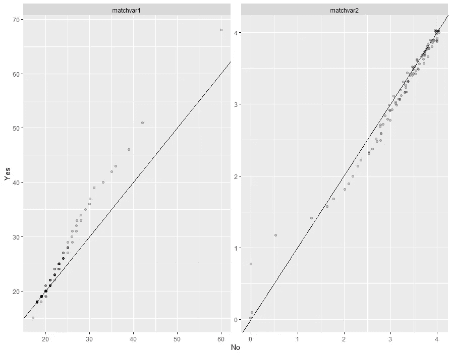

# R 中受控分析的匹配样品

> 原文：<https://medium.com/analytics-vidhya/matching-samples-for-controlled-analyses-in-r-e7091ae2320?source=collection_archive---------17----------------------->


这段代码展示了使用 tidyverse 获取匹配样本进行分析的不同方法。这些信息包括多人的贡献。

# 为什么匹配？

如果你想分离出一个效果并进行分组比较，我们需要排除任何其他干扰。比如说你有两个人。一个人得到辅导，另一个人没有，然后他们都参加同样的测试。我们想知道辅导课是否有效。我们不能简单地比较这两个人的考试成绩。我们必须*控制*个人层面的变量，这些变量可能对不同的考试分数负责，以便隔离辅导课程的影响。一些个人层面的差异可能会影响一个人在这项测试中的表现，包括先验知识、平均绩点、学生时代等。我们很少能分离出一种影响(这就是为什么拥有好的研究方法如此重要，但我们并不总是有这个选择)。相反，我们可以用几种不同类型的匹配来近似:

您还可以使用以下内容，这些内容不在本文件中讨论。

1.  倾向得分匹配
2.  替代方案:分层样本

我将逐一介绍这些，以及如何在 r 中执行它们。

**配什么:**

这实际上是针对你的业务问题或研究问题的。然而，我在下面描述了我的方法:我的方法，尤其是当处理大量数据时，是从查看我*可能*想要匹配的变量开始。我将使用下面的代码来计算每个潜在匹配变量的水平组合下每组有多少人。

```
data %>%
group_by(group, matchvar1, matchvar2, matchvar3) %>% 
summarise(n=n()) %>%  
ungroup()
```

如果我注意到我的**控制**组中很少有人有特定的级别组合，那么就很难将他们与我的**目标**组匹配。如果某个组合的**目标**组的人比**控制**组的人多，尤其如此，除非你可以使用替换。使用替换通常是针对你的假设的。

让我们更具体一点:假设我们在性别和种族上进行匹配。

您的小组细分如下所示:

最后一行表明没有多少控件有这种特殊的变量组合。如果不使用替换，将不可能用相同的变量组合(斜体)匹配目标组中的 99 个人。在这种情况下，我可能会考虑将我未知的性别群体浓缩为女性或男性，或者根本不使用性别。

# 1.艰难的比赛:

严格匹配从目标群体中寻找最像他们的人。例如，如果您的目标组中有一个人是 22 岁的西班牙裔女性，那么这个过程将遍历对照组中的每个人，直到找到匹配的人。这个严格的匹配标准创建了一个比较组，该比较组完全由与目标组中的人尽可能相似的人组成。

**如何准备数据:**

*   您需要有一个转换成数值的分组变量。
*   您将需要所有匹配的变量也是数字。
*   如果数据帧中有任何 NA，则 GenMatch 无法运行。
*   你控制的人越多，你匹配的可能性就越大，你就可以匹配更多的变量！
*   更多信息请查看我的存储库管理。

**如何进行比赛:**

这是你需要的全部代码。我选择在每一行旁边使用注释来解释代码中发生了什么。我使用 [GenMatch](https://www.rdocumentation.org/packages/Matching/versions/4.9-7/topics/GenMatch) 函数如下:

```
matches.df = GenMatch(data$group, 
                   data[,c("var.1", "var.2", "var.3")], 
                   exact = c(T, F, F), 
                   caliper = c(0, 1, 0.5), 
                   replace = T, ties = F)
```

然而，这是我的代码通常最终的样子:

```
library(Matching)

matches.df = GenMatch(data$group, #define your grouping variable 
                               Match.ready%>% #pipe in dataframe
                                 #You can do some manipulating of variables for the match that you don't
                                 #want saved in your dataframe here. 
                                 mutate(
                                 #if you haven't releveled your variables you can use case_when
                                   matchvar1 = case_when(matchvar1 == "level1" ~ 1,
                                                         matchvar2 == "level2" ~ 2,
                                                         T ~ 2), 
                                  #if your var only has 1 important level. Example = gender                               
                                   ,matchvar2 = ifelse(matchvar2 == "level1", 1, 0)
                                   #if you like the way your variables are leveled you can do this:
                                   matchvar3 = as.numeric(as.factor(matchvar3)))%>%
                                   #select all variables you want to match on
                                 dplyr::select(matchvar1, matchvar2, matchvar3,
                                               matchvar4, matchvar5, matchvar6),
                               #each true/false matches 1/0, respectively
                               #each one represents a parameter for each of the 6 variables
                               #see documentation on ?Matching for more information
                               exact = c(T,T,T,
                                         F,F,F),
                               caliper = c(0,1,.5,
                                           0,1,.5),
                               replace = F, ties = F)
```

**如何拉出匹配的个人:**

首先，您将定义一个名为 matched.df 的新数据帧。您希望将其绑定到您的原始数据帧，以便您可以保留所有旧信息。您可以使用 bind_rows()函数来实现这一点。使用索引找出唯一匹配的人。

```
matches.df = bind_rows(
                        data[unique(maches.df$matches[,1]),],
                        data[unique(matches.df$matches[,2]),])
```

另一种方法是这样的:

```
library(dplyr) 
library(tibble) 

data = data %>% 
  rownames_to_column("row.id") %>% 
  filter(row.id %in% matches$matches[,1:2])
```

现在您有了一个名为 matched.df 的数据框架，可以用来进行分析！

# 2.松散的匹配:

**如何准备数据**

把你的分组变量分成两列:我通常用 yes 和 no。这里有一个:

1.  基于组分成两个数据帧
2.  为每个变量创建一个新变量
3.  把他们绑在一起

```
yes <- data %>% 
    dplyr::select(c("id.yes")) %>% 
    mutate(Group = 1) %>% 
    rename(id = "id.yes") %>% 
    distinct_all()
  no <- data %>% 
    dplyr::select(c("id.no")) %>% 
    mutate(Group = 0) %>% 
    rename(id = "id.no") %>% 
    distinct_all()
  all.matched <- rbind(yes, no)
```

现在我们要做一个松散的匹配:

```
matched.df <- matched.df%>% 
  # Start with the group of interest
  filter(Group == 1) %>%
  inner_join(matched.df %>%
               filter(Group == 0),
             by = c("matchvar1", "matchvar2", "matchvar3", "matchvar4", "matchvar5", "matchvar6")) %>%
  # Filter out rows that don't meet our criteria for fuzzy matching.
  # if you are matching on a numeric value where you don't need to have an exact match you can use the code with abs()
  # an example of this is age. If it doesn't matter that much that one person is 38.88 years old vs 38.22
  # manipulate the <= 1 to make it more or less granular or you can bin your data before you do the match
  filter(abs(matchvar1.x - matchvar1.y) <= 1 & 
    abs(matchvar2.x - matchvar2.y) <= 1) %>% 
  # Keep IDs. Used in filter later
  dplyr::select(id.group = ID.yes, matchvar1.yes = matchvar1.x, 
                matchvar2.yes = matchvar2.x, 
                id.no = ID.y, 
                matchvar1.no = matchvar1.y,
                matchvar2.no = matchvar2.y)

# acceptable matches.
matched.terms.df = students.raw.df %>%
  semi_join(bind_rows(matches.df %>%
                        dplyr::select(ID = IDsacm, GPA = GPAsacm #, ft = term.code.SACM
                        ),
                      matches.df %>%
                        dplyr::select(ID = IDnot, GPA= GPAnot #, ft = term.code.not
                        )),
            by = c("ID"))
```

# 如何评估你的比赛:

对于您想要进行的任何类型的匹配，您可以创建一个可视化来查看您的匹配有多“好”。

```
library(ggplot2)
ntiles = seq(0, 1, 0.01),
matched.df%>%
  mutate(Group = ifelse(Group == 1, "Yes", "No"),
         matchvar1 = as.numeric(as.factor(matchvar1)),
         matchvar2 = as.numeric(as.factor(matchvar2)),
         matchvar3 = as.numeric(as.factor(matchvar3)),
         matchvar4 = as.numeric(as.factor(matchvar4)),
         matchvar5 = as.numeric(as.factor(matchvar5)),
         matchvar6 = as.numeric(as.factor(matchvar6))
         ) %>%
  dplyr::select(Group, matchvar1, matchvar2, matchvar3,
                matchvar4, matchvar5, matchvar6) %>%
  gather(predictor, value, -Group) %>%
  mutate(predictor = case_when(predictor == "matchvar1" ~ "Matched Variable 1",
                                predictor == "matchvar2" ~ "Matched Variable 2",
                                 predictor == "matchvar3" ~ "Matched Variable 3" )) %>%
  group_by(predictor, Group) %>%
  summarize(ntile = list(ntiles),
            ntile.value = list(quantile(value, ntiles))) %>%
  unnest(cols = c(ntile, ntile.value)) %>%
  ungroup() %>%
  dplyr::select(ntile, Group, predictor, ntile.value) %>%
  spread(Group, ntile.value) %>%
  ggplot(aes(x = No, y = Yes)) +
  geom_point(position = "jitter", alpha = 0.2) +
  geom_abline(slope = 1, intercept = 0) +
  facet_wrap(~ predictor, ncol = 2, scales = "free") +
  scale_x_continuous("No") +
  scale_y_continuous("Yes")
```

这将产生一个大致如下的图形。



完美匹配的集合将遵循 x=y 线。我们假设第一个变量是年龄。y 轴上有 Group ==“是”, x 轴上有 Group ==“否”。这意味着在组== "是"的人比在组== "否"的人更老。

# 需要考虑的事项:

*   你的兴趣小组失去了多少人？例如，如果您的治疗组中有 500 人，您希望您的匹配返回尽可能多的人。
*   如果你失去了很多人或者得到了一个参数化错误，你可能需要减少你试图匹配的变量的数量。
*   “控件”的数量越多，匹配的选项就越多。

*最初发表于*[*【https://github.com】*](https://github.com/lsouthard/Matching)*。*