# 人工神经网络背后的数学

> 原文：<https://medium.com/analytics-vidhya/math-behind-artificial-neural-networks-42f260fc1b25?source=collection_archive---------9----------------------->

近来，人工神经网络在许多应用中被认为是有用的，如预测、分类、识别、翻译等等。当前的例子是一个简单的人工神经网络在给定输入数的情况下预测输出的应用。

我们将考虑一个机器的例子，它接收输入 A、B、C 并产生一个输出。该示例包括用一组数据(训练数据)训练人工神经网络，以及用一组不同的数据(测试数据)测试该网络，该组数据以前没有被馈送过。在这种情况下，数据是从具有不同实验设置的实验中收集的。例如，给定输入设置 A=1，B=1，C=1，产生输出=1，必须使用不同的实验设置进行多次运行才能获得数据。采集的数据必须分为两组——训练集(用于训练神经网络，测试集——用于测试训练好的神经网络的性能)，训练与测试数据的比率一般为 80:20。

人工神经网络类似于人的神经网络，由处理信息的相互连接的神经元组成。人工神经网络的体系结构如下图所示，分为三层:输入层，通过它输入信息；隐藏层，连接处理信息的输入层和输出层；输出层，传递输出。

下面是输入 A、B、C 和标有“目标”的输出的样本数据集。我只显示了 10 行数据，一般来说，需要更多的数据集来训练网络。

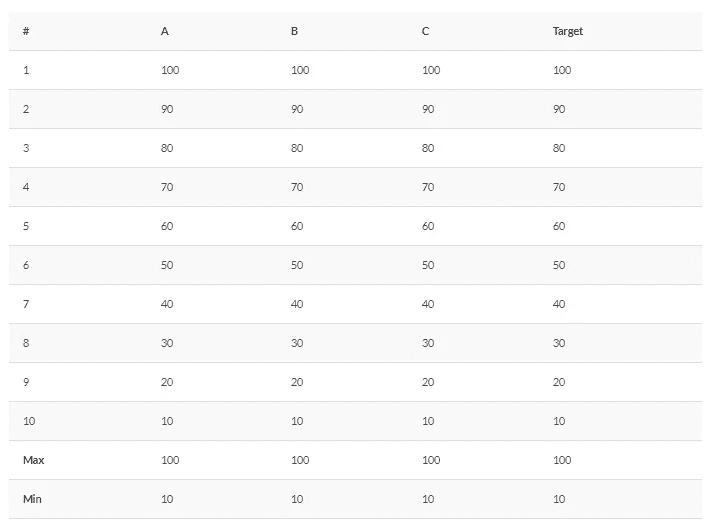

对于当前示例，不需要对输入进行归一化，但是当输入具有不同的尺度时，必须对输入进行归一化。

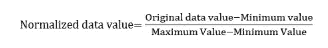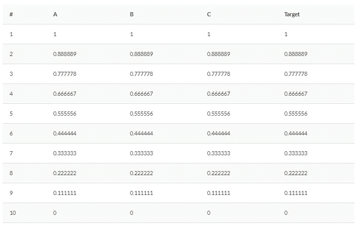

下面显示了一个简单的前馈反向传播人工神经网络，具有一个输入、隐藏和输出层。

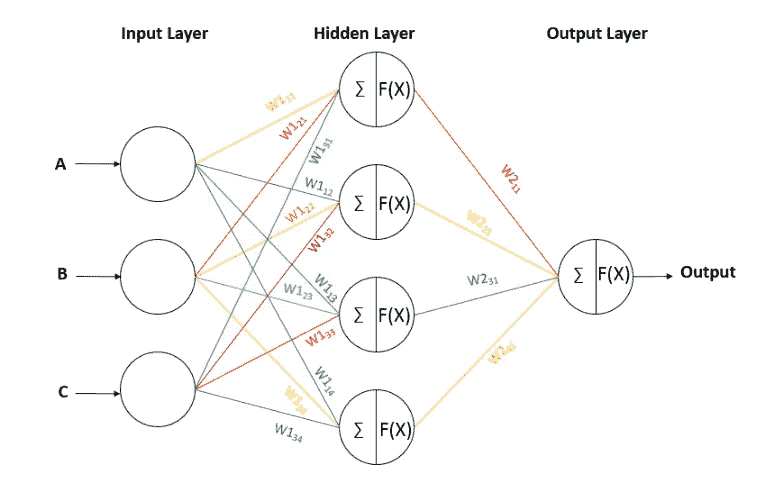

为了更好地理解，让我们考虑只输入上表中第一行的一个输入集，A=1，B=1，C=1，输出目标=1。一旦选择了架构，就必须初始化连接不同层的突触的权重。我们可以随机初始化权重，或者选择较小的值开始。这里，我将所有连接的权重初始化为 0.1，使下面的讨论中的数学变得简单。

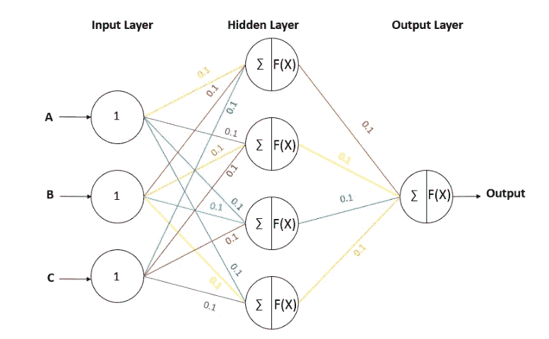

**正向传递和反向传播**

训练包括两个步骤:前向传递:输入通过网络进入输出层，产生输出。反向传播:误差反向传播到调整权重的网络中。

**向前传球:**

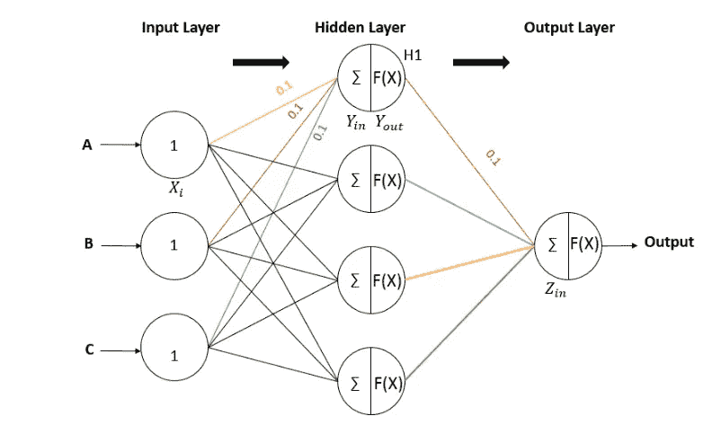

下面是一个简单的神经元，它有两个功能

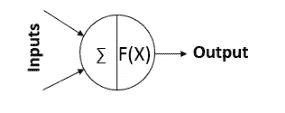

1.每个节点上具有各自权重的输入值的总和。

2.使用激活函数 F(X)激活输入信号。很少有像 sigmoid、ReLu、tanh 等这样的激活函数。实际上，当前示例在两层中的节点处使用 sigmoid 激活函数。

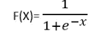

让我们只考虑隐藏节点 1 的计算，H1 在上面的 ANN 图中，隐藏层 1 的值= (1 * 0.1) + (1 * 0.1) + (1 * 0.1) = 0.3

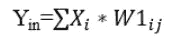

应用 sigmoid 激活函数= sigmoid(0.3)= 1/(exp(0.3)+1)= 0.57

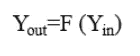

在每个隐藏节点进行类似的计算，并将值传递到输出层。输出层中节点值，

输出节点的值=(0.57 * 0.1)+(0.57 * 0.1)+(0.57 * 0.1)+(0.57 * 0.1)= 0.228

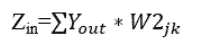

应用 sigmoid 激活函数= sigmoid(2.28)= 1/(exp(2.28)+1)= 0.56

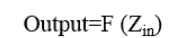

**反向传播:**

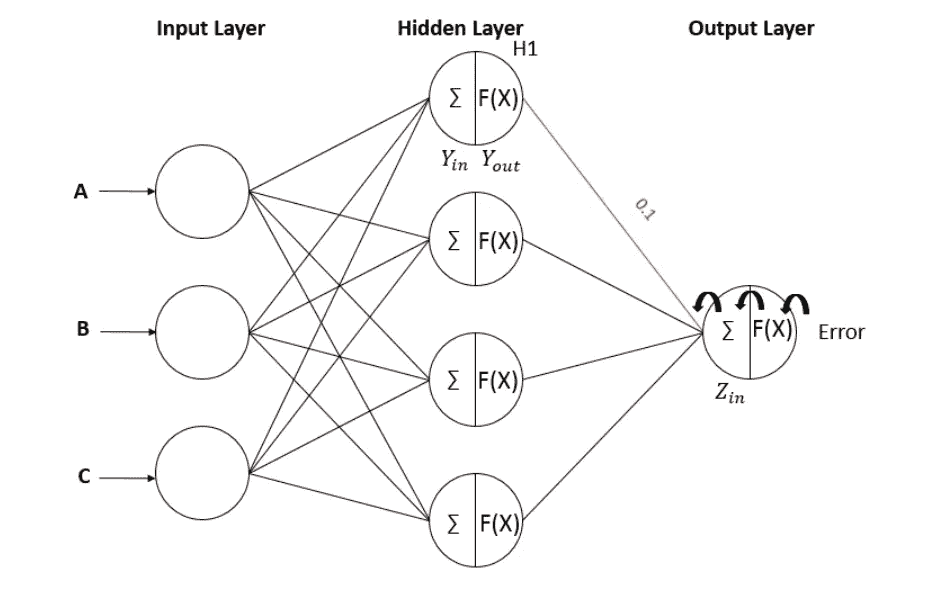

误差是网络预测值(输出)与原始值(目标)之间的差值，误差值为误差= 0.5 *(1–0.56)= 0.0968。此处的误差值仅针对一个数据点进行计算。误差通常在所有数据点上计算一次，甚至成批计算。

输出节点的误差传播:

仅与一个权重相关的误差变化如下所示，该权重是连接隐藏层中的节点 H1 与输出层的权重。

等式左侧的项下面是连接隐藏输出层的权重必须更新的变化，以最小化误差，从而使输出值与目标值匹配。通过应用链式法则，我们得到:

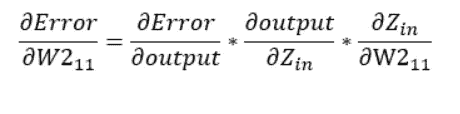

拆分并计算上式中的每一项:

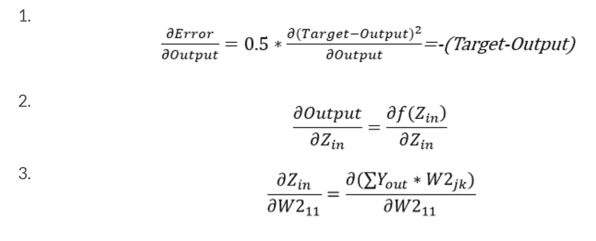

将所有项 1、2、3 分组以获得误差信息

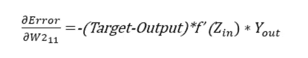

输出节点处的权重必须更新的误差信息是

= -(1–0.56) * 0.246 * 0.57 = -0.0617

隐藏节点处误差信息的类似计算:

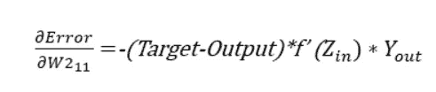

拆分并计算上式中的每一项:

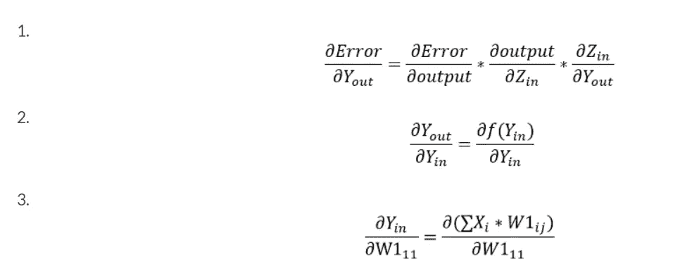

对上述所有项进行分组，得到隐含层的误差信息，

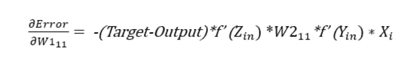

误差项=-(1–0.56)* 0.246 * 0.1 * 0.245 * 1 =-0.00265

权值通过隐藏层和输出层中每个节点的误差信息进行更新

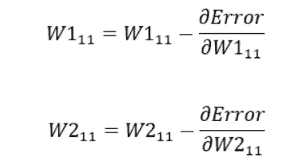

第一次迭代后更新的权重，连接输入隐藏层的权重

= 0.1-(-0.00265 )

更新了连接隐藏输出层的权重，

= 0.1-(-0.00617)

利用新更新的权重，前馈传递和反向传播迭代，直到权重稳定在特定值，以最小化使输出值匹配目标值的误差。该算法对数据表中的所有行进行迭代，最后人工神经网络以特定的权重稳定下来，为预测做好准备。训练后的最后一步是将输入数据输入到经过训练的神经网络中，以获得预测结果。

本文提供了对人工神经网络的基本理解，然而还有许多概念需要探索，如偏差、学习速率、激活函数、动量因子、使神经网络健壮和有效的结构..

请报告任何错误。感谢您的阅读。