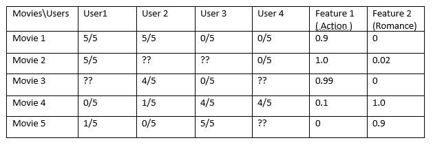
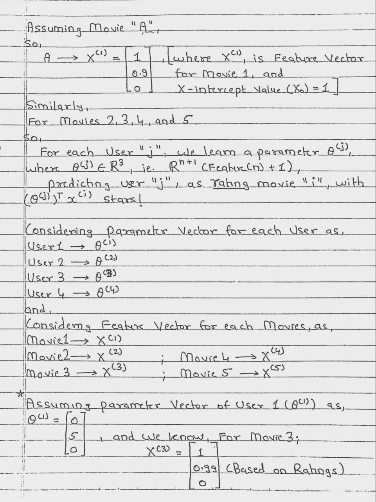
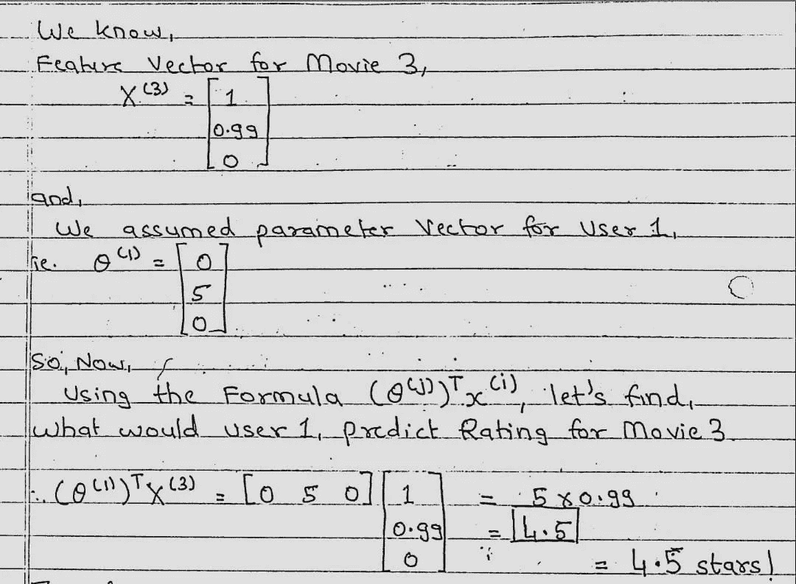
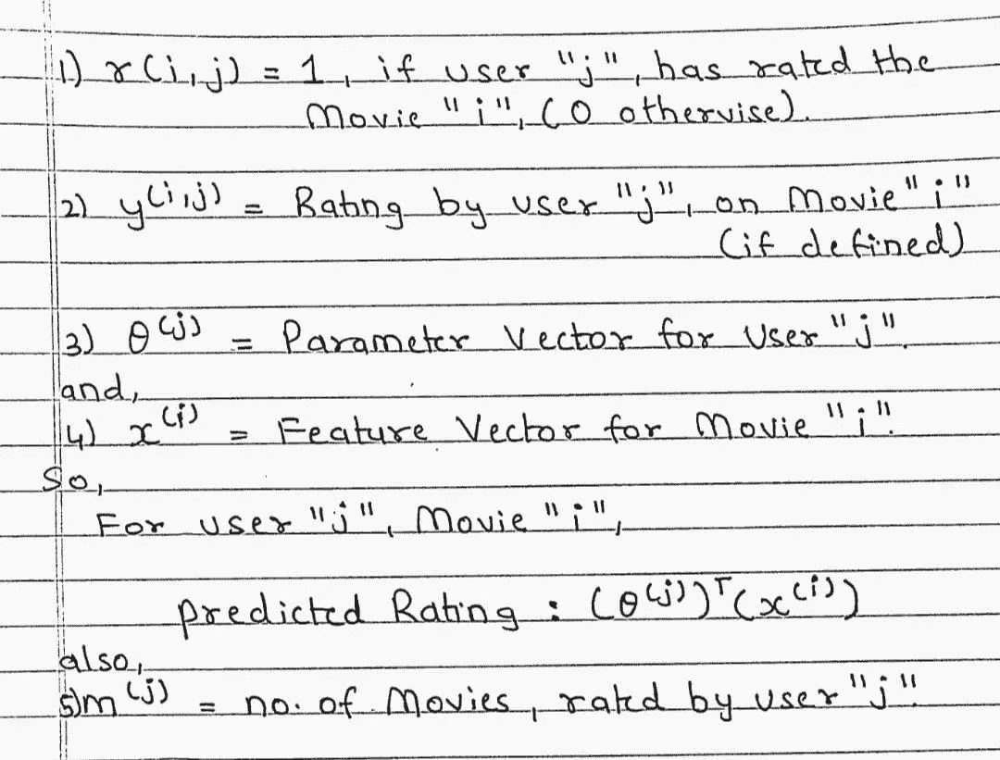
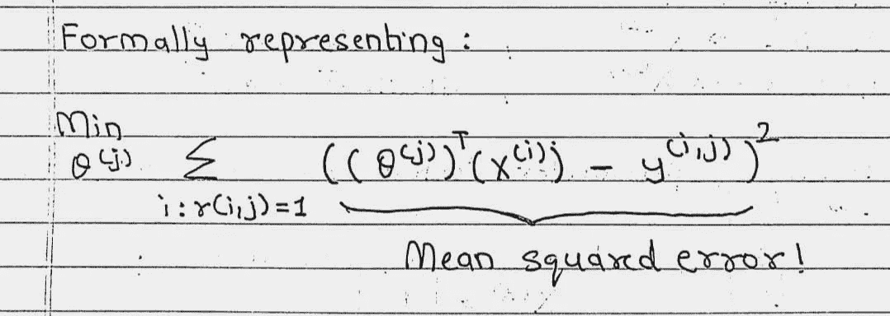
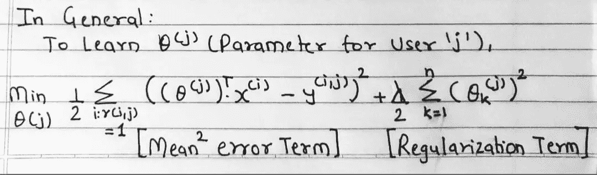
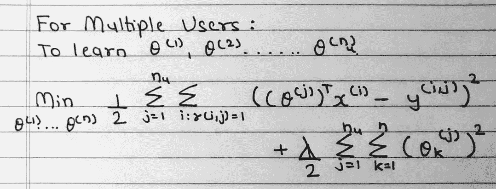

# 基于内容的推荐系统背后的数学。

> 原文：<https://medium.com/analytics-vidhya/math-behind-content-based-recommendation-system-a7e440c96fa?source=collection_archive---------8----------------------->

**基于内容的推荐系统背后的概念:**

首先，我想给出关于基于内容的推荐系统的直觉，比如它在实际操作中是如何工作的，稍后我们将跳到它背后的数学部分！

假设，我们有用户 1，他看过电影 1(动作片)给它的评分是 5/5，电影 2(爱情片)给它的评分是 4/5，电影 3(动作片)给它的评分是 5/5。

现在，如果用户 2 观看电影 6(动作片)的评分为 5/5，而电影 7(爱情片)的评分为 5/5，那么基于内容的推荐系统最有可能根据与这两个用户相关的评级和电影类型为用户 2 推荐动作片 1 或动作片 3。

简而言之，这些算法试图推荐与用户过去喜欢或现在正在检查的项目相似的项目。

简单来说，这就是基于内容的推荐系统的工作原理，但是理解每种算法背后的数学原理也是非常重要的，所以让我们深入了解这种算法背后的数学原理。

**算法背后的数学:**

所以，让我们从一个简单的例子开始，假设下面的数据，

那么问题来了，如何才能推荐用户未知的评分呢！？

根据以上数据，我们可以看出。电影 1、电影 2 和电影 3 更倾向于动作片，而电影 4 和电影 5 更倾向于爱情片，我们还可以得出结论，用户 1 和用户 2 更喜欢动作片而不是爱情片！对于用户 3 和用户 4，反之亦然。

在哪里，

n(U)=用户数量=4，

n(M)=电影数量=5，以及

n(特征)=2，即(动作和浪漫)

让我们考虑电影 1，假设 X 截距值为 X(0)=1，考虑特征值，我们可以将电影 1 的特征向量写成矩阵(3，1)的向量为[1 0.9 0]，类似地，电影 2、3、4 和 5 也有特征向量。

现在，对于每个用户“j”，学习参数θ(j)= =真实 Number^(3(即(特征(2)+1)，因此通过使用

(Theta^(j))^(T)*x^(i)，我们可以使用每个用户的参数向量θ(I)来找到电影(I)的评级，其中(I)是用户的数量。

让我们用更好的概念表述来理解这一点，

因此，基于这些假设值，对于用户 1 的参数向量，让我们预测电影 3 的评级，

基于下面给出的计算！

因此，根据计算，我们看到，用户 1 对电影 3 的预测评级大约是 4.5 颗星！

但是，在这里，我们“假设”了用户 1 的参数向量，那么我们如何获得实际的参数向量，不仅是针对一个用户，而是针对我们拥有的每个用户！

在此之前，让我们先来谈谈一些我们需要了解的术语:

现在，让我们看看，我们如何预测每个用户的参数向量的实际值(**，我们之前假设的**)。

所以，要学习参数向量(Theta^(j))，这可以认为是一个线性回归问题，使实际的参数向量和预测的参数向量值尽可能接近，作为损失函数

我们可以把它正式表示为，

就像线性回归模型一样，我们希望选择特定的参数向量，以最小化均方误差项，现在，我们还可以添加正则化项，以避免过拟合，

在最小化这一项之后，我们可以得到用户‘j’的电影评级的参数向量的相当好的估计。

所以，总的来说，我们可以把这个方程表示为，

我们写了这个等式，考虑到一个用户，

现在，让我们考虑这个等式，对于多个用户，我们可以修改上面的等式，只需添加一个求和，考虑到存在“n”个用户，可以表示为:

现在，

我们可以将整个方程(即损失函数)表示为我们的“J for (Theta(1)，Theta(2)，…。θ(n)”，并且这可以乘以适当的激活函数，并且从预测的参数向量中减去，以便最小化实际和预测的参数向量之间的差异。

因此，我们将为每个用户获得更好的预测参数向量，我们将使用它来分别预测电影的评级，这就是基于内容的推荐系统的工作方式！

这是我的第一个博客，我对这个领域的第一个贡献，如果有任何更正，任何需要改进的地方，请告诉我。

**谢谢！**。