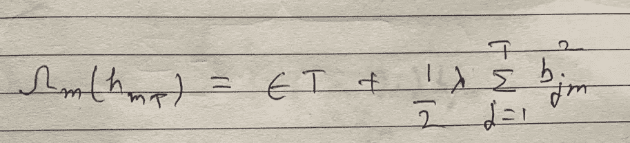

# GBM 和 XGBoost 背后的数学

> 原文：<https://medium.com/analytics-vidhya/math-behind-gbm-and-xgboost-d00e8536b7de?source=collection_archive---------0----------------------->

GBM 和 XGBoost 都是基于梯度推进的算法。但是在两种算法中构建新树的方式有很大的不同。今天，我将写下这两种算法背后的数学。

在我开始之前，让我们了解一下什么是升压。机器学习中的 Boosting 属于集成模型家族，其焦点主要是减少偏差。它意味着首先建立一个模型，找到它的残差，然后在残差上建立另一个模型。根据需要多次重复此过程。数学上可以表示如下。

假设 f(x)是你的模型，y 是实际值，gamma 是预测值，L 是损失函数。第一个模型 f0(x)在{xi，易}上建造如下:

现在，计算残差(ri = (y-gamma))并在{xi，ri}上建立第二个模型 h1(x)。将 h1(x)加到 f0(x)上，得到新的改进模型 f1(x)

反复重复以上过程。因此，在迭代 m 时方程的一般形式将是:

上述等式是升压算法的通用等式。有几种方法可以决定在 fm-1(x)中加入多少比例的 hm(x)。等式将会是这样的。

有几种方法可以计算阿尔法像平均，加权平均，adaboost 或使用梯度推进。今天，我写的是梯度推进。

现在，问题来了什么是梯度推进？梯度增强中的术语梯度来自梯度下降合并到增强中。使用基于梯度下降的方法来决定α或步长。为了计算α，在比方说迭代 m 时，计算第一伪残差(rim)并且在{xi，rim}上建立新的模型 hm(x)。伪残差的计算公式如下:

现在，计算α，使损失函数最小。

现在代入α和 hm(x)值得到 fm(x)。

在 GBM 中，算法与梯度增强中的算法相同。该模型是基于决策树的，即 f(x)和 h(x)是车树。对于有 T 片叶子的树，模型 hm(x)可以写成:

bjm 是预测值(平均值、中值、最大投票等。)在区域 Rjm(叶 j)中。如果将树的 hm(x)代入梯度推进方程，将会有 alpha 和 bjm。在 GBM 中，结合 alpha 和 bjm 来获得每个叶子的步进率。所以，在一棵有 T 片叶子的树上会有 Tα(步率)。GBM 的方程式变为:

所以，我们看到了 GBM 是如何构建的。你一定注意到了，GBM 中的步进率计算需要两步 1)计算伪残差 2)计算 alpha。此外，在 GBM 中也有过拟合的机会，这可以通过添加正则化来减少。XGBoost 将计算步进率的两个步骤合并为一个步骤，并在损失函数中添加正则项以对抗过拟合。在 XGBoost 中，每次迭代时构建的树使得每次分裂时增益最大。等等，什么？一步一步来看。

首先了解 XGBoost 中的损失函数有一个额外的调节项 omega。该损失函数用于计算最大增益，该最大增益可以在分裂每个节点时直接用于树构建过程。这就是 GBM 中的两步过程如何通过正则化简化为一步。

让我们看看在 XGBoost 树构建中 Gain 是如何计算的。从需要最小化的损失函数开始。

可以有几种类型的损失函数(等式中的 L ),如用于回归的 MSE 或用于分类的交叉熵。为了形成与损失函数无关的通用方程，L 函数的泰勒级数展开如下。

损失函数展开类似泰勒级数。所生成的常数项被删除，因为在拆分树中的一个节点时，它们对计算增益没有贡献。

树的正则项ω可以写成:

将 hm(x)的值替换为树方程，并去掉整洁度的 m(迭代次数),损失函数变为:

进一步简化方程，

我们的目标是最小化这个损失函数。如果你注意到第一项，求和项，是一个抛物线方程。可以看作是 ax + bx。抛物线的最小值将出现在 x = -a/2b 处。在我们的例子中，bj = -Gj/(Hj+lamba)。将 bj 代入损失函数，最佳损失函数变为:

当一片叶子分成两片叶子(左 L 和右 R)时，增益变为:

使用这个增益，XGBoost 构建了树结构。

我希望你喜欢这个，如果你喜欢，请鼓掌:)