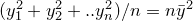
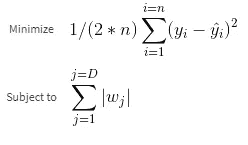

# 线性、脊形和套索回归背后的数学

> 原文：<https://medium.com/analytics-vidhya/math-behind-linear-ridge-and-lasso-regression-b9de216ebdf8?source=collection_archive---------1----------------------->

回归模型用于根据自变量/变量的值预测因变量的值。最常用的线性模型是线性回归、岭回归和套索回归。这篇文章不是要讨论这三个模型的应用，而是这些模型背后的直觉和数学。如果你想了解这些模型，可以看看我写的关于它们的其他文章。

有两种众所周知的方法来说明线性模型如何通过数据点拟合直线。

*   普通最小二乘法
*   梯度下降法。

在这篇文章中，我们将探讨梯度下降法。用于预测因变量的值的数学方程

线性模型方程

上面提到的等式是机器学习模型试图优化的。它试图为每个参数(x)选择最佳的权重集(w)。

既然线性回归模型试图优化上述方程，那么优化必须基于特定的标准，该值必须告诉算法一组权重与其他组权重相比是最佳的。该值称为成本函数，由以下等式给出

成本函数，n 为观察次数

其中 y 的实际值和预测值之间的差异称为误差项。

**均方误差原因(假设一个自变量):**

当我们用代数方法展开平方误差项时，我们得到

再次展开平方项，并对我们得到的相似项进行分组，

在这之后，一旦我们取括号中各项的平均值，我们就得到了方程。对于 *y* ，我们将看到，其余的条款是类似地达成

我们得到了等式

如果你真的观察上面的等式，很明显，除了权重(w0，w1)或系数，其余各项都是常数。因此，我们需要找到使上述等式最小化的(w0，w1)的值。为此，想象绘制 w0 和 w1，对于满足等式的 w0 和 w1 的值，将得到在最低点具有最小值的凸曲线

最低点的最小值，红点是与 w0、w1 的不同值相关的成本

这条曲线很重要，你会在下面的章节中知道为什么。

整个想法很简单，从权重的随机初始化开始，不断将其与每个要素相乘，然后对它们求和以获得预测，计算成本项，并尝试根据迭代次数或容差值迭代最小化成本项，低于该容差值迭代将停止。因此，我们为特定的数据点生成一定数量的回归线，并选择成本最低的一条。

到目前为止，我们已经为回归模型建立了一个成本函数，并且我们已经看到了如何选择成本最低的权重作为最佳拟合线。一切看起来都很好，但这里有一个小问题——随机选择 100 次迭代的权重可以给我们 100 组不同的权重和 100 条不同的线。机器可以从中挑选出最好的线，但很难说这条线是最佳拟合线，因为可能有许多组合比我们挑选的 100 条更好。

因此，我们需要找到一种方法来系统地减少重量，以达到最低的成本，并确保它创建的线确实是最佳拟合线，无论您选择其他什么线。这一点在下图中可以更好的理解。

在红点处有全局最小值的凸曲线。

如果我们将上述曲线视为与每个权重相关的一组成本，则最低成本位于红色曲线所示的最底部。我们的算法必须确保它到达那个点，而这个任务在只有有限的一组权重的情况下是困难的。因此，为了克服这一点，我们使用了机器学习中最受欢迎的优化算法之一，即梯度下降算法。

我们从一组权重开始，计算其成本，并逐步向最低点移动(用数学术语来说，全局最小值)。

向全局最小值移动的梯度下降(凸优化，曲线很重要的原因)

红点是与不同权重集相关联的成本，并且值不断最小化以达到全局最小值。这种最小化成本以达到最低值的方式被称为梯度下降，这是一种优化技术。

梯度下降通过获取成本函数的导数，将其乘以学习速率(下面解释的步长)并将其减去前面步骤中的权重，来完成向最陡下降(全局最小值)移动的任务。权重更新的公式为

权重更新。

**学习率:**

在上一段中，我们谈到了一个叫做学习率的术语(上式中的α)。这个学习率决定了我们需要沿着曲线走多远才能到达全局最小值。这个超参数的大值将确保我们的算法将超过最低成本，而非常小的值将花费时间收敛到最低成本。所以选择这个值对于机器学习模型整体来说是极其重要的。

**衍生品:**

*dw* 项是成本函数的一阶导数。它的计算方法是

一次导数

这是线性回归背后的数学。均方误差也是优选的，因为它对具有较高差异的点的惩罚比对具有较低差异的点的惩罚大得多，并且它还确保了当相等比例的负值和正值被相加时它们不会被抵消，因为在没有平方的情况下相加误差项确保了这一点。

线性回归的 GitHub 要点如下

**山脊和套索:**

岭回归和套索回归与线性回归非常相似。唯一的区别是在套索回归中增加了*L1*罚分，在岭回归中增加了*L2*罚分。添加这些惩罚项的主要原因是为了确保正则化，将模型的权重缩小到零或接近零，以确保模型不会过度拟合数据。

过度拟合是当回归模型对训练数据调整得太多而不能很好地概括时出现的问题。它也称为高方差模型，因为测试集中因变量的实际值和预测值之间的差异会很大。

那么 Ridge 和 Lasso 是如何克服过拟合问题的呢？这两种技术在它们的成本函数中都使用了一个额外的术语叫做惩罚。下面给出了这两种技术方程式

岭回归成本函数

套索回归成本

那么以上两个方程是什么，又是如何解决过拟合问题的呢？

要回答这个问题，我们需要了解这两个方程的实际推导方式。山脊的方程式是

山脊约束

我们将从扩展约束开始，这是产生约束的范数，

2 个参数 w0 和 w1 约束扩展

上式右手边的项可以是任何常数值。这为我们提供了一个圆的方程，原点为(0，0)，半径为 c。因此，岭回归的基本作用是创建一个最小化成本函数的解决方案，使得 *w0* 和 *w1* 的值只能来自圆内或圆周上的点。

人们试图最小化的等式变成:

我们需要最小化的等式

对于第二项中λ的固定值，λ与 *c* 的乘积产生一个常数项。所以本质上我们将最小化上面山脊的方程。Lambda 是一个超参数，我们可以根据自己的选择将其设置为特定值。如果它被设置为零，那么岭的方程被转换成正常的线性回归方程。

从那时起，就使用梯度下降进行优化而言，该过程类似于正常线性回归的过程。

脊函数的导数

Ridge 的 Github 要点是

**套索回归:**

当涉及到特征选择时，岭回归作为算法有一个小缺陷，即当有两个彼此高度相关的特征时，权重在这两个特征之间平均分布，这意味着将有两个具有较小系数值的特征，而不是一个具有强系数的特征。当您希望基于阈值选择某些要素时，这就成了问题。如果值较高的单个要素是单独的，则可能会被选中，但由于多重共线性，这两个要素都不会被选中，因为它们的权重是分开的。

像岭回归一样，套索回归进行正则化，即将系数缩小为零。当有大量特征来对机器学习算法建模时，这是很重要的。其方式是通过尝试最小化成本函数，即受制于约束的残差平方和。

套索约束

将这个等式扩展为 *w0* 和 *w1* ，我们得到

与岭模型类似，套索回归将约束的成本降至最低，但对于套索，当我们绘制约束点时，将有一个以(0，0)为中心创建的菱形。这背后的直觉是，我们将得到具有剩余平方和值的等高线图，这些值必定在钻石的圆周内或圆周上。因为等高线图接触菱形的端点的机会非常高，从而使某些特征的权重为零。

考虑到 Lasso 回归使用 *l1* 范数，当我们尝试更新成本函数时，其导数要么为负 1，要么为正 1，并且在点 0 处无法确定。因此，使用闭合形式方法或梯度下降来更新要素的权重是不可行的，因此 Lasso 使用一种称为坐标下降的方法来更新权重。因为它使用软阈值来获得与特征相关联的权重值。下面的代码可以更好地解释这一点:

> 请在评论部分指出任何错误。
> 
> 关于实施[脊](/@sidharths758/polynomial-regression-overfitting-and-ridge-regression-an-overview-70de53f0ccab)或[套索](/@sidharths758/least-absolute-shrinkage-and-selection-operator-lasso-regression-9132dc80654b)回归的其他文章。