# 支持向量机背后的数学

> 原文：<https://medium.com/analytics-vidhya/math-behind-support-vector-machines-642421e45b08?source=collection_archive---------5----------------------->

我们在之前的一篇关于分类的文章中已经看到了关于逻辑回归的内容。在这篇文章中，我们将看看另一种机器学习算法，即支持向量机。

支持向量机创建 n 维超平面来基于参数分离数据。如果数据有 2 个变量，那么它是一条线，3，它是一个平面，等等。

## **问题定义:**

考虑一个分类问题，有两个类。目标是找到一个超平面，以最大化点之间的间隔的方式对两个类进行分类。

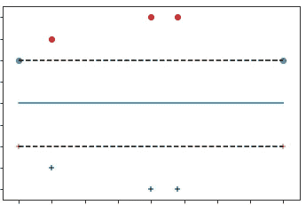

可视化支持向量

在上面的图片中，有两个类别，它们是根据描述的形状来区分的。“ *+* ”符号是一组分类为“- *1* ”的点，而“ *o* ”则用于“ *+1* ”类。蓝色和橙色的点称为支持向量。支持向量机的整个目标是最大化两条虚线之间的距离，即两个类之间的间隔，那里的街道尽可能宽。

## **直觉:**

让我们把支持向量问题中的所有点看作一个向量。即它有大小和方向。将点分类为属于正类或负类的方式是通过获取点的矢量( *x* )，将其投影到另一个矢量“ *w* ”上，该矢量垂直于图中的中线(因此中线将被称为中线)。如果投影值大于常数' *c* '，则为阳性样本，否则为阴性样本。

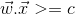

两个向量的点积，x 是输入，w 是垂直于中线的向量

上面的等式可以写成

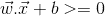

其中 c = -b

上述等式给出了支持向量机的基本直觉，其中任何等于零的值都将在超平面上。

让我们将上面的等式用于每一个正类' *+1* '和每一个负类' *-1* '

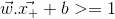

对于正类

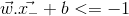

对于负类

值[-1，1]之间的距离是我们试图最大化的余量。为了数学上的方便，我们引入另一个变量' *y* '，将上述两个方程合二为一。

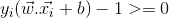

yi=+1 表示正类，yi = -1 表示负类

因此，对于街道内的任何一点，该等式转换为

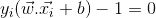

街头价值的等式 1。

让我们考虑虚线上的两点，一个在正侧，另一个在负侧，

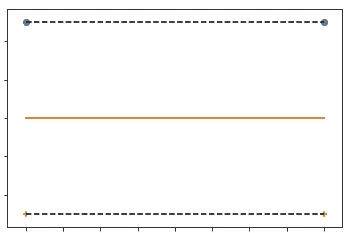

我们需要找到两条虚线或我们称之为街道之间的距离。让我们考虑一个单位法向量。由于我们使用了' *w* '作为中线的法向量，我们将把它除以它的大小，得到单位法向量。设代表正负两点的向量为

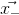

负类中点的向量

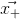

正类中点的向量

这两个点都位于街道两侧的虚线上，这意味着这两个点之间的差异，单位法线的点积就是街道的宽度。

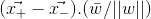

现在，将上述等式中的“ *x+* ”和“ *x-* ”的值代入等式 1，我们得到“ *x+* ”和“ *x-* ”与单位法向量“ *w* ”进行点积之前的值，给出

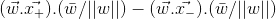

这产生了

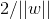

为 SVM 创造最大价值

这也可以写成最小化' *w* '

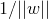

分子中的 1，因为它是一个常数值。

为了便于数学计算，我们可以将方程转换为

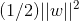

最小化支持向量机的值

现在，如果我们使用拉格朗日乘数，在等式 1 的约束下最大化上述等式，我们得到

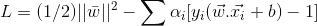

使用拉格朗日乘数，等式 2

如果我们取' *w* '和' *b* '的导数，将其设为零，并将其代入等式 2，我们得到

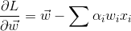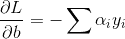

当我们将上述两个等式设为零，并将其代入等式 2 时，我们得到

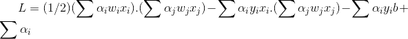

简化后给出

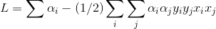

可以清楚地观察到，这个等式取决于' *x* '中样本值的点积。

到目前为止，我们已经讨论了线性可分类，即当数据集中没有数据点重叠时。然而，在实际的数据集中，这是不可能的，会有某些数据点在任何一边，我们需要我们的支持向量机模型来考虑这一点，并仍然产生最佳的超平面。

这是通过在传统的支持向量机方程中引入松弛变量来实现的。松弛变量惩罚不在超平面右侧的点。在下面的等式中，它是 eta，而 C 是一个超级参数，我们需要调整它来告诉我们对每个错误的惩罚程度。

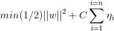

上述等式受到以下约束:

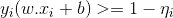

那么我们的整个 SVM 方程可以归结为:

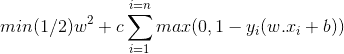

超级参数' *c* '定义了我们处罚错误的幅度。“ *c* 的值越大，模型成为硬边界分类的机会就越大。

与支持向量机相关联的损失函数被称为铰链损失，因为，如果最大值函数中的第二项的值为负，则第二项为“ *0* ”,如果最大值函数中的第二项为 0，则第二项为“ *1* ”。

> github 的要点是

> 如果你发现任何错误，请随意评论。