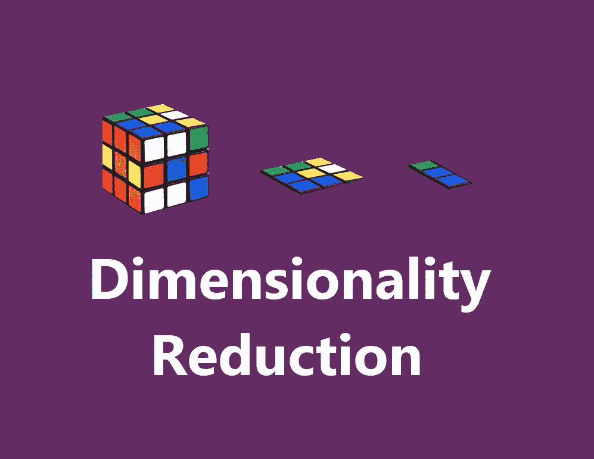

# 数学直觉与主成分分析的实现

> 原文：<https://medium.com/analytics-vidhya/math-intuition-and-implementation-of-principal-component-analysis-6f02253ceef9?source=collection_archive---------15----------------------->

理解主成分分析背后的数学以及如何获得新的特征空间..！PCA 的一站式商店…！！！

降维

# **💘维度的诅咒:**

当为训练机器提供的数据集庞大而简洁时，机器学习通常会产生奇迹。通常拥有大量数据会让…