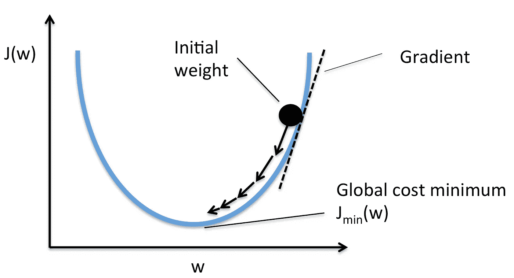
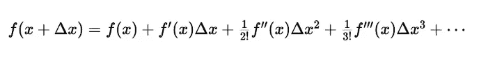

# 梯度下降学习算法的数学介绍

> 原文：<https://medium.com/analytics-vidhya/mathematical-introduction-to-gradient-descent-learning-algorithm-8f1ebbff6455?source=collection_archive---------22----------------------->

Pierre Van Crombrugghe 在 [Unsplash](https://unsplash.com?utm_source=medium&utm_medium=referral) 上拍摄的照片

# 梯度下降学习算法；

> **梯度下降**是——
> 
> →迭代优化算法
> 
> →为了找到函数的局部最小值
> 
> →采取较小的步骤
> 
> →与当前点的函数梯度的负值(梯度的相反方向)成比例。

## 损失函数:

梯度下降是通过从损失函数 J(w)中随机初始化的点开始采取小的小步来执行的，以最终达到其最小值。

*注意:这里 J(w)中的 J 代表雅可比——一阶导数向量。*

我们假设损失函数本质上是凸的(碗形的)。这有助于我们将最小值计算视为一个凸优化问题(细节超出了当前文章的范围)。

礼貌:塞巴斯蒂安·拉什卡

让我们看看损失函数是如何寻找两个参数 x 和 y 的，这里向量 v 是基本向量 x 和 y 的线性组合。

## 重量初始化:

梯度下降的第一步是随机初始化参数权重。这里，θ是初始参数值，δθ将通过梯度下降来计算步长。θ+δθ将是梯度下降一次迭代后经过的新θ。

θ= [w，b]

δθ=[δw，δb]

下面的 gif 显示了权重初始化如何影响损失收敛——在深度学习中实现了几种初始化技术来优化权重初始化(超出了当前文章的范围)。

资料来源:gfycat

## 参数更新和学习率:

然而，在实时中，我们从不直接更新δθ，我们总是考虑一个步长控制因子，即“学习率”，用希腊字母 eta (η)表示。

**学习算法方程:**

> η →学习速率(每次迭代的步长)
> 
> θnew = θ + η。Δθ

参数更新如何基于计算的梯度工作—

资料来源:gfycat

## 如何用本金的方式求δθ？

现在的问题是如何以主要的方式获得递增的步长，我们需要一个过程来帮助我们确定正确的步长，以确保损失总是递增地减少。

*   目标是在每一步得到δθ，这样损耗只会逐渐减少。

*   这就是“梯度下降”算法发挥作用的地方。

## 渐变:

梯度也被称为斜率，换句话说，增量上升超过增量运行。

> 梯度=上升/下降

为了计算增量上升和增量运行，我们利用泰勒级数展开。

## 泰勒级数:

*   如果有一个函数，并且知道该函数在点 x 的值，那么该函数在新的点 x+δx 的值可以给出如下:

因此，我们将迈出一小步δx，并确保在这一小步之后，损耗会降低。

*f(x+δx)= f(x)+某量*

让我们把损失函数方程改写成泰勒展开式。

上面给出的泰勒级数是针对标量变量的，让我们调整一下向量的方程，因为我们在梯度下降中处理向量。

*其中δθ= u；u 也被称为“变化向量”。*

由于学习率(η)值约为 0.01–0.001，因此第三至第 n 项的值非常小，可以忽略不计。

为了使新的损失低于以前的损失，下面的数量应该是负数。

方向“u”应该与梯度向量成 180 度。

> =180 →向与梯度相反的方向移动。

让我们快速总结一下梯度下降&参数更新规则。

## 完整的学习算法:

## 计算梯度怎么求偏导数？

通过获取损失函数相对于权重(*δw*)和相对于偏差(*δb*)项的偏导数来计算梯度。一阶导数将解释讨论中的点是最大值还是最小值。因此，我们假设损失函数本质上是凸的，因此梯度为零的点是最小值点。

> 微分链法则用于计算损失函数相对于权重和偏差项的偏导数

代入上式中 f(x)的值，

现在，让我们计算 sigmoid 函数的一阶导数，

将其代入∇w 方程，

这意味着∇w 可以很容易地只用 f(x)，x 和 y 来计算——不需要任何实际的导数。

类似地，我们可以看到∇b 方程简化为下面的表达式(除了∇w).的 x 项

## 两个参数梯度下降的 Python 代码:

*假设:*

*   *参数个数:2 个*
*   *历元数:1000*
*   *X = [0.5，2.5]；Y = [0.2，0.9]*
*   *eta* :学习率

> **引文**:
> 
> 文章内容和正文是基于课程材料和我对 IIT-马德拉斯大学教授 PadhAI 深度学习课程的理解:Mitesh Khapra 教授和 Pratyush Kumar 教授。
> 
> 链接:[https://padhai.onefourthlabs.in/](https://padhai.onefourthlabs.in/)