# 理解自动编码器和变分自动编码器(VAEs)的数学先决条件:初学者友好，中级兴奋，专家刷新。

> 原文：<https://medium.com/analytics-vidhya/mathematical-prerequisites-for-understanding-autoencoders-and-variational-autoencoders-vaes-8f854025390e?source=collection_archive---------2----------------------->

几天前，我弟弟走进我的房间，看到我正在写代码和学习数学教程，他带着困惑的表情问道，你现在是在学习数学还是在建立人工智能模型？我笑着回答说，人工智能是数学！！

在 [Unsplash](https://unsplash.com?utm_source=medium&utm_medium=referral) 上由 [Franck V.](https://unsplash.com/@franckinjapan?utm_source=medium&utm_medium=referral) 拍摄的照片

嗯，本质上不完全是数学，但要真正打下基础，一个人需要很好地掌握数学基础，因为 AI 不仅仅是用 Pytorch、Tensorflow 或 Keras 训练 ConvNets 或 Transformer 模型。事实上，阅读、理解和复制一篇研究论文至少需要对一些数学概念有相当的理解，包括但不限于线性代数、微积分、概率论和统计学。

人工智能对每个人都是免费的，所以无论你是否来自计算机科学、数学或工程背景都没有多大关系，事实上，这根本不重要，因为互联网现在是一个信息过剩的时代，特别是随着 MOOCs 的出现，你可以自己学习所有这些基础知识，并做得更好。我知道这一点，因为在过去的 5 年里，作为一名学习城市规划的本科生，我做过的最复杂的数学是人口均值、偏度、峰度和矩。那是在我的第一年！我现在正打算四舍五入，我从来没有上过一门需要数学的课程。我最后一次认真的数学是在高中，现在我知道的其他事情都是自学的，我只是在途中学会的。

我知道很多人都是这种情况，你想深入研究人工智能，但你觉得你没有合适的背景，所以你留在原地或进入网络开发。如果你属于这一类，没有什么可以限制你！！！

在这篇文章中，我们将讲述理解自动编码器、变分自动编码器和矢量量化变分自动编码器(VQ-变分自动编码器)所需的一些基本数学知识。具体来说，我们将着眼于:

1.  自动编码器综述
2.  概率基础
3.  期望最大化
4.  库尔巴克·莱布勒散度及其意义

自动编码器本质上是一种神经网络，其被设计成以无监督的方式学习同一性函数，使得它可以压缩和重建原始输入，并且通过这样做，它发现原始输入数据的更有效和压缩的表示。值得注意的是，这个想法起源于 20 世纪 80 年代，后来由[辛顿和萨拉胡特迪诺夫在 2006 年](https://pdfs.semanticscholar.org/c50d/ca78e97e335d362d6b991ae0e1448914e9a3.pdf)的一篇开创性论文中提出。

自动编码器广泛用于图像压缩和重建。图像重建基本上意味着自动编码器网络试图生成我们在输入阶段传递给它的任何图像。随着我们的进步，我们很快就会理解这是如何工作的。

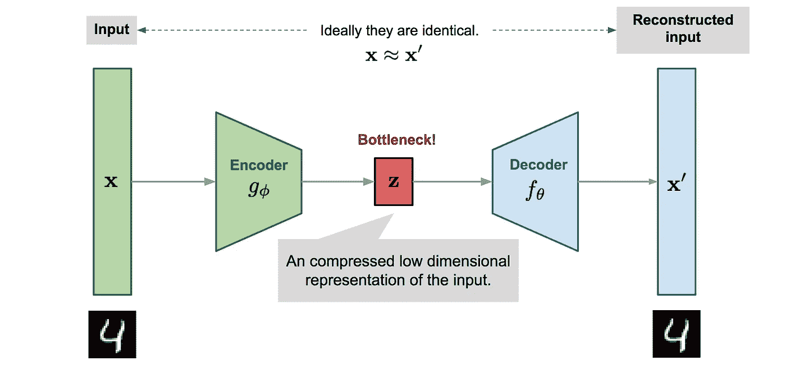

自动编码器架构的图示。来源[:李连文的博客](https://lilianweng.github.io/lil-log/2018/08/12/from-autoencoder-to-beta-vae.html#td-vae)

上图描绘了一个典型的自动编码器网络架构，为了直观地理解其工作原理，我们应该首先了解自动编码器网络包括:

*省略输入和输出(重构输入)*

1.  由 Gφ表示的编码器模块
2.  瓶颈用 z 表示
3.  由 Fθ表示的解码器模块

编码器模块接收图像的输入向量，并将其作为压缩向量“z”传递给瓶颈，然后解码器模块尝试从压缩表示中重建该输入图像。为了更好地理解，假设我们有一个大小为(28 x 28)的输入图像，按照惯例，这个图像在输入到神经网络之前必须被展平。该图像的展平表示将是(784，)并且这被传递到编码器(第一个块)。编码器的输出然后被馈送到瓶颈或潜在空间，该潜在空间应该是缩减的版本，例如，如果潜在空间中的节点数量是 8、或 16、或甚至任何数量，这仅仅意味着我们已经成功地将大小为 784 的图像压缩到仅仅 8 个节点、或 16 个节点、或任何数量。然后，解码器网络试图从瓶颈中的压缩状态重建原始(28×28)输入图像。事情就是这样的。

一旦图像被重建，您就可以将重建的图像与原始图像进行比较，计算差异，并计算可以最小化的损失。

损失的计算方法如下:

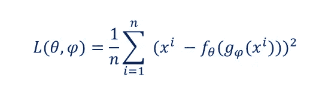

自动编码器损失函数

不要对损失函数感到惊慌，我将分解它。

如上所述，损失函数取决于“theta”和“phi ”,它们是定义编码器和解码器的参数。如前所述，根据上面的自动编码器图像，编码器由 Gφ表示，而解码器由 Fθ表示，它们只是表示神经网络的权重和偏差。

因此，在等式中，我们对原始图像 x '和重建图像 Fθ(gφ(x `))之间的差异进行求和。

这种数学表示也显示了从编码器到解码器的数据流(即输入到输出)

# **变型自动编码器**

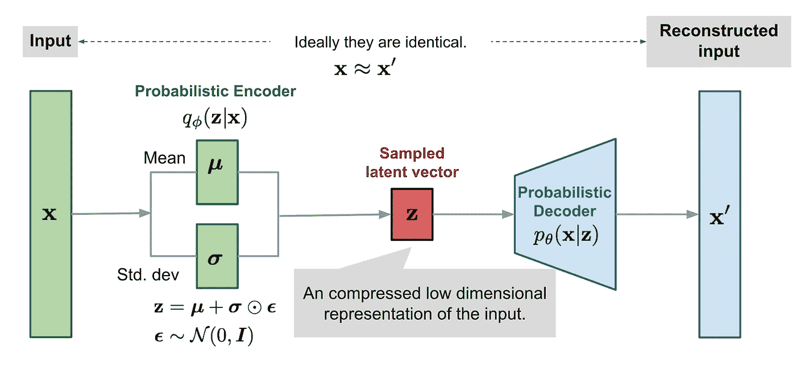

VAE 模型的图解。来源:[李连文的博客](https://lilianweng.github.io/lil-log/2018/08/12/from-autoencoder-to-beta-vae.html#td-vae)

由[金玛等人在 2013 年](https://arxiv.org/abs/1312.6114)提出的 VAE 背后的基本思想是，不是将输入映射到固定向量，而是将输入映射到分布。自动编码器和变分自动编码器在许多方面是相似的，事实上，自动编码器和变分自动编码器之间唯一的根本区别是 VAE 的瓶颈是连续的，并被两个独立的向量所取代；一个代表分布的平均值，另一个代表分布的标准偏差。

VAE 的损失函数由两个项定义，重建损失和正则项，正则项本质上是编码器分布和潜在空间之间的 KL 散度。

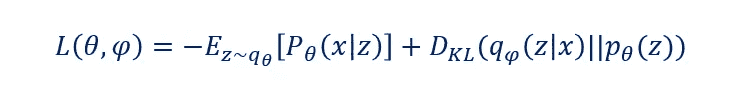

VAE 损失函数，基本上是重建损失+ KL 散度

向前看，理解自动编码器和 VAE 网络的更深层次的数学基础，如它们的损失函数，需要对一些概念有一个公平的理解，如期望最大化、条件概率、最大似然估计和 Kulback Leibler 散度，这是本文的关键。

理解 VAE 的第一个先决条件是概率论，我不会讲得太详细，但会尽可能多地解释理解这些概念所需要的。

您可能会更频繁地遇到以下术语:

P(x):这定义了随机变量 X 的概率

P(x|y):被称为条件概率，它提供了一个随机变量 x 的概率，假设 y 已经发生。给定 y，它读作 x 的 P。

这个概率概念也可以写成:

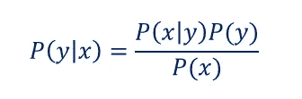

上面的表示来自于贝叶定理，其中；

P(y|x)是后验概率

p(y)是先验概率

p(x|y) / p(x)是似然比

我们还需要理解这样的全概率定理；

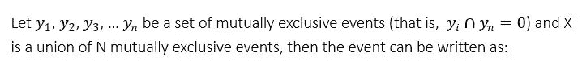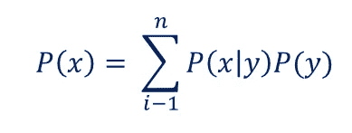

互斥事件也称为不相交，意味着它们之间没有重叠，这就是它们的交集等于零的原因。当我们进入更复杂的东西时，我们将会看到更多这样的东西，所以最好现在就解决它。

## **随机变量 X 的期望，即 E(X)**

随机变量的期望值是 X 的所有可能值的加权平均值，其中每个值根据该事件的概率进行加权，其定义为:

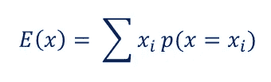

这可能有点太复杂了，但是你应该知道这个概念类似于数学平均值。为了更好的直觉，你应该[看看这个](https://www.youtube.com/watch?v=j__Kredt7vY)

让我们看一些简单的例子:

**Q1。**掷骰子一次，得到三的概率是多少？

**回答:**你猜对了！给定样本空间= {1，2，3，4，5，6}

P(x) = P(3) = 1/6。

**Q2。在掷骰子时，如果掷出的骰子是奇数，出现 3 的概率是多少？**

**答案:**这是一个条件概率即 P(x|y)，我们追求的是得到一个 x=3 的概率，给定那个 y =奇数。也就是 P(3|y 为奇数)。

既然条件是投掷是“奇数”，那么样本空间肯定要从 6 减少到 3，因为如果你从 1-6 计数，只有 3 个奇数。因此，{1，2，3，4，5，6} ==> {1，3，5}。因此，在这个缩减的样本空间中出现 3 的概率是 1/3，其中 3 是我们在缩减的样本空间中的样本总数。这是我能找到的解释条件概率的最简单的例子。

如果我们观察正确，在第一个例子中，有一个 3 即 P(3)的概率是 1/6，但在第二个例子中，概率变成了 1/3。这说明了什么？

再次，你猜对了！说明以 Y 为条件，即“奇数样本”时，得到 3 的概率增加。因此，知道 p(x)和 p(x|y)可以有不同的解释是很重要的。这就是条件概率的概念，因为“x”的概率会受到“y”的很大影响，如例子所示。

# **KL 发散**

Kulback-Leibler 散度(简称 D_KL)是一个概率分布与另一个概率分布如何不同的度量。对于离散概率分布 P 和 Q，P 和 Q 之间的 KL 散度定义为:

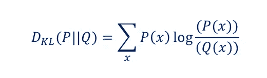

**例如:**

假设我们有两个概率分布，P & Q。我们想找出两个概率之间的差异，我们可以简单地应用 KL 散度，如下所示。

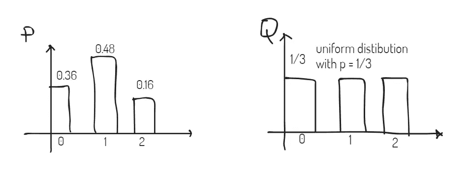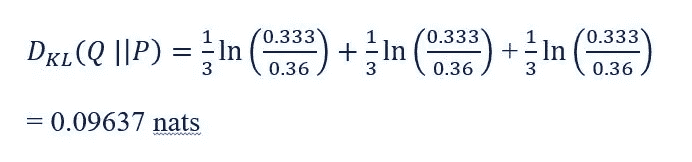

Medium 实际上不支持数学符号，这就是为什么方程必须在别处求解，然后我把它作为图像粘贴在这里。为了解释上面的计算，我们有一个均匀概率为 1/3 的分布 Q，即 **≈** 0.333，还有一个随机变量 x 等于 0 时概率为 0.36 的分布 P，随机变量 x 等于 1 时概率为 0.48，随机变量 x 等于 2 时概率为 0.16。

这两种分布之间的差异可以使用 KL 散度来计算，因此我们要做的是像上面一样代入 KL 散度方程中的值，并求解 0.09673 nats 的答案。

“nats”只是通过使用自然对数(ln(x))获得的信息单位。

理解 KL 散度对于理解 VAE 损失函数是不可或缺的，因为它扮演着一个关键的角色——作为一个正则项。这也是为什么我额外用图形和数学来说明它。

现在，我们已经讨论了一些数学前提条件，这些条件将在下一步中派上用场，你应该看一看 [**这篇由**](/retina-ai-health-inc/variational-inference-derivation-of-the-variational-autoencoder-vae-loss-function-a-true-story-3543a3dc67ee)**[Stephen Odaibo](https://medium.com/u/f3b4e4defa62?source=post_page-----8f854025390e--------------------------------)博士撰写的关于完全从零开始推导 VAE 损失函数的说明性文章** 。

数学很有趣！