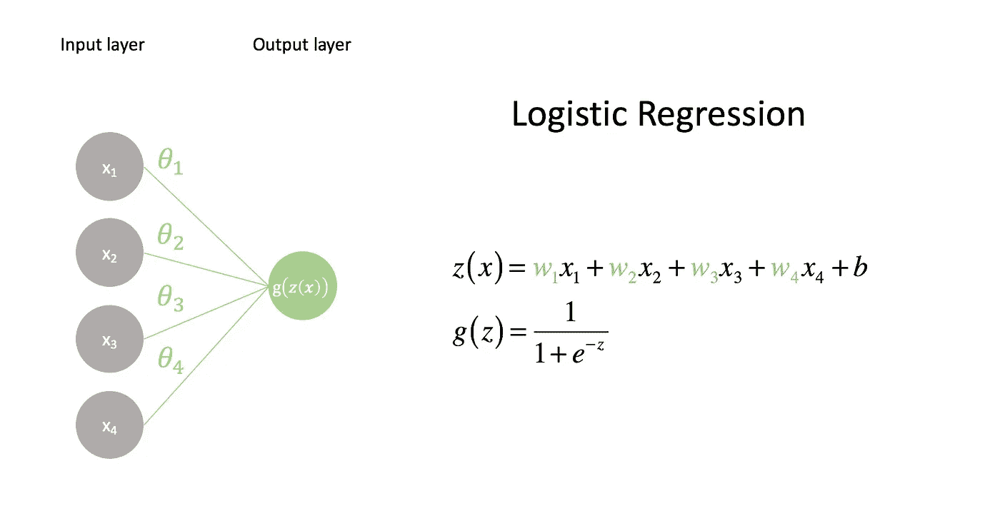
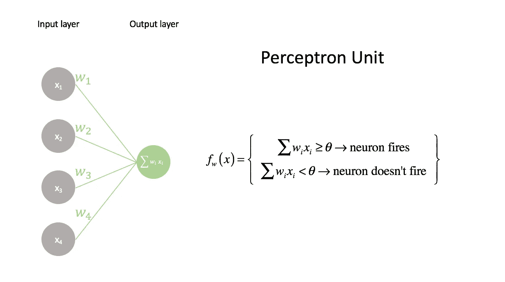
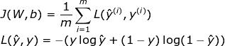
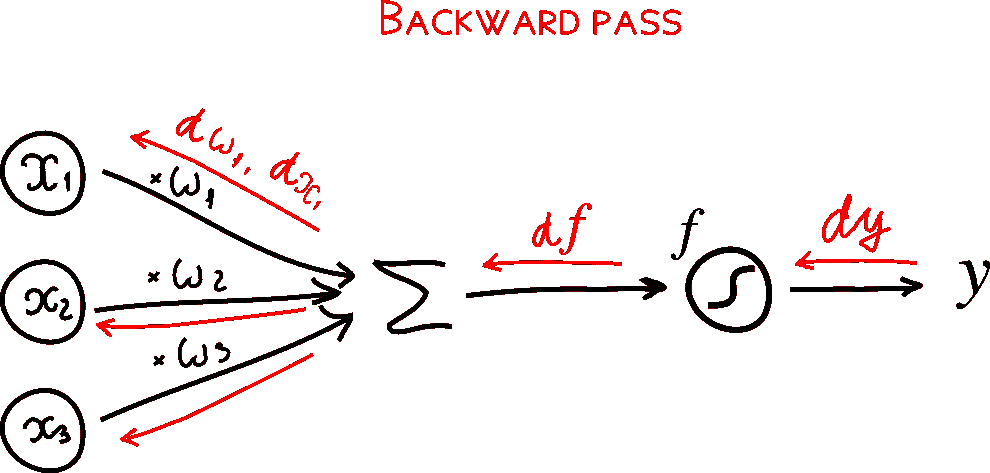
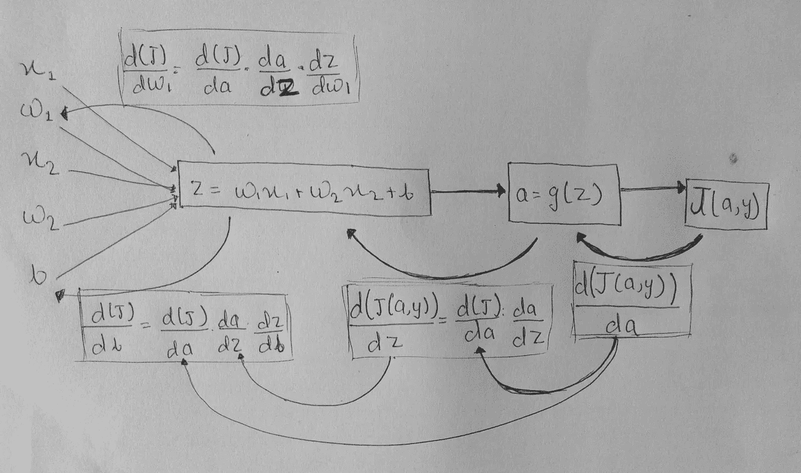
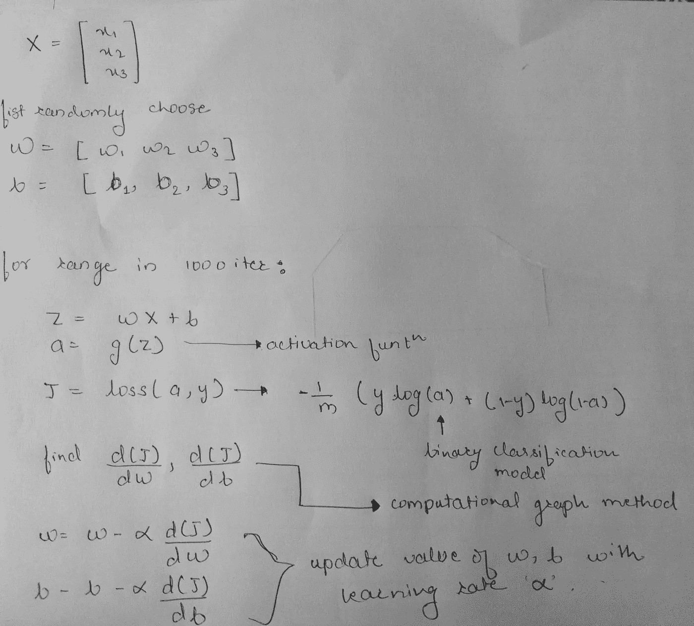
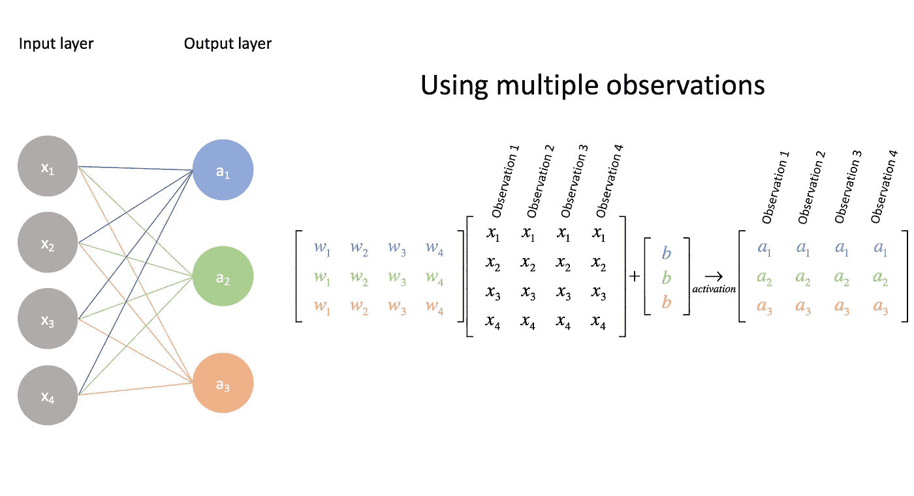
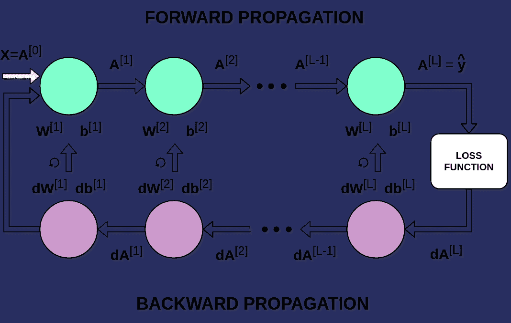

# 神经网络背后的数学和矢量化

> 原文：<https://medium.com/analytics-vidhya/mathematics-and-vectorization-behind-neural-network-b6d491fa617d?source=collection_archive---------22----------------------->

在这个拥有许多高级、专门的库和框架的时代，例如****tensor flow***或 ***PyTorch*** ，我们不需要经常担心我们的权重矩阵的大小或记住我们决定使用的激活函数的导数的公式。这篇文章旨在讨论什么是神经网络，以及我们如何在机器学习模型中表示它。随后的帖子将涵盖更高级的主题，如培训和优化模型，但我发现首先对我们实际构建的内容有一个坚实的理解，并对我们将使用的矩阵表示感到舒适，这很有帮助。*

**

# *神经元的计算模型*

*在第一步中，我们将了解单个神经元如何作为逻辑函数工作，然后向更深的方面发展，使用多层/深层网络框架计算更复杂的函数。*

*在逻辑回归中，我们用逻辑函数 **g(z)** 组成一个线性模型 **z(x)** 来构成我们的预测器。这个线性模型是特征输入**x**I 和权重**w**I 的组合。*

***z(x)**=**w1x 1+w2x 2+w3x 3+w4x 4+b**=**wTx+b***

*让我们试着想象一下。*

**

*第一层或最终层(在本例中)包含输入特征向量中每个值的节点。这些值按其对应的权重进行缩放， **w** *i* ，并与偏置项 ***b*** 一起相加。偏差项允许我们建立不固定在原点的线性模型。*

*在计算出 **z(x)之后，**然后传递给具有某个阈值 *(θ)的某个非线性激活函数。*如果输入和权重的线性组合( **z(x)** )高于阈值，则神经元触发，如果组合( **z(x)** )低于阈值，则不触发。*

**

# *损失函数*

*关于学习过程进度的信息的基本来源是损失函数值。一般来说，损失函数旨在显示我们离“理想”解决方案有多远。在我们的例子中，我们使用了二元交叉熵，但是根据我们处理的问题，可以使用不同的函数。*

****

*反向传播的主要目的是修改网络的 ***权重*** 和 ***偏差*** ，然后给出相应模型的 ***成本函数*** 的局部/全局最优值。这是在如下所示的**计算图**方法的帮助下完成的。*

**

*让我们看看整个过程是如何更新神经网络模型的权重和偏差的。*

**

# *建立一个神经元网络*

*以前的模型只能进行二元分类；然而，回想一下，我们可以通过构建逻辑回归模型的集合来执行多类分类。让我们扩展我们的“网络”来表示这一点。*

**

*这里，我们建立了三个不同的逻辑回归模型，每个模型都有自己的一组参数。花点时间确保你理解了这个矩阵表示。(这也是为什么把矩阵乘法列为先决条件的原因。)利用矩阵运算非常方便，因为它允许我们快速有效地执行这些计算。*

*上面的例子显示了对单个例子进行多类分类的情况，但是我们也可以扩展我们的输入矩阵来对一组例子进行分类。这不仅有用，而且对于我们的优化算法(在后面的文章中)在找到最佳参数时以有效的方式从所有示例中学习是必要的。*

****

# *矩阵表示*

*设***n【l】***代表 ***l*** 层的单元数。对于给定的层，我们将有一个形状为 ***(n[l]，n[L1])***的权重矩阵 ***W[l]*** 和形状为 ***(n[l]，1)*** 的偏移向量。*

*给定层的激活将是形状为 ***(n[l]，m)*** 的矩阵，其中 m 表示通过网络馈送的观察值的数量*

*感觉你有把握了吗？*

*感谢您的阅读。*