# 人工神经网络背后的数学:第一部分

> 原文：<https://medium.com/analytics-vidhya/mathematics-behind-artificial-neural-networks-part-1-2214dab225c2?source=collection_archive---------10----------------------->

在任何机器学习模型中，目标是找到该算法的成本函数，然后最小化该成本函数。简单来说，模型成本越高，算法越差，反之亦然。成本函数由一些参数组成。我们必须调整这些参数，以获得最小值。

D 导数:导数用于最小化成本函数值。如果你理解导数，那么你将很容易理解梯度下降算法，它将用于机器学习中的成本优化。

例如，让我们考虑一个成本函数 y = x +3。在下图中，y 是成本函数，x 是成本函数的参数。我们必须调整参数 x，使得 y 的值减小。这个函数 y 的导数由 dy/dx= 2x 给出。

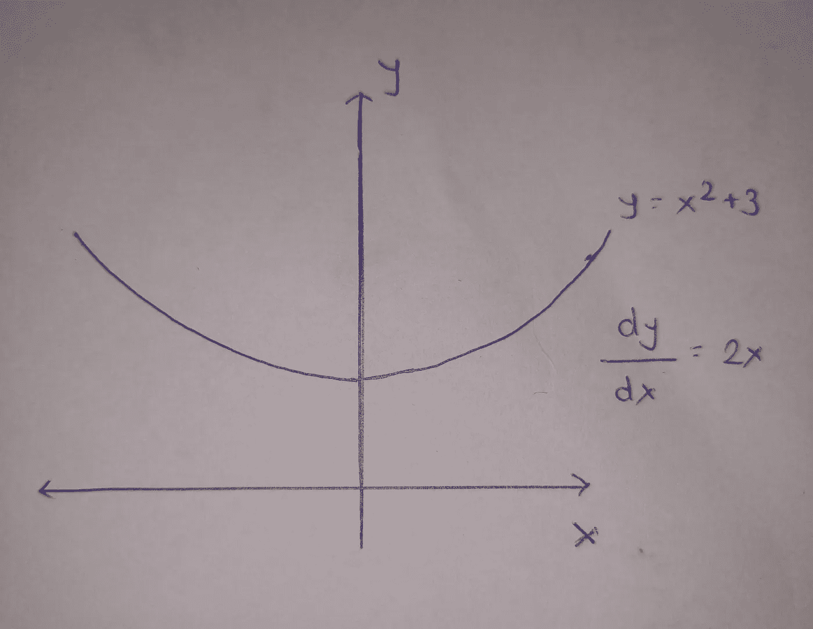

曲线在一点的导数给出了曲线在该点的斜率。如果我们取 x=3 处曲线的斜率。斜率=dy/dx=2*3=6。正斜率表示 x 的增加将导致成本函数 y 的增加。因此，降低 x 的值将降低成本函数的值。

同样，对于 x=-2，曲线在 x=-2 处的斜率= dy/dx= -2*2 = -4。这里的负斜率表明，如果我们在 x=-2 处增加 x 的值，那么 y 值将减少。

让我们考虑这个成本函数的两种情况。

## 案例 1:

考虑开始时，我们设定参数 x=5，然后 y=5 +3=28。我们希望降低这一成本。我们必须调整参数 x，使得 y(成本函数)的值降低。所以将从 x 中减去 x 的导数，即 dy/dx，但我们将 dy/dx 乘以 0.1，因为我们不想过多地减少 x 的值，否则函数值将在另一侧(x 的负侧)增加，而不是减少。我们姑且称之为 0.1 的价值学习率。

learning_rate= 0.1，x = 5，y= 5 +3 = 28

x = x - dy/dx *学习率

x = 5-(2*5) *0.1 = 5- 1 = 4 …………(x 更新为 4)

现在让我们计算成本函数:y = 4 +3 = 16+3 = 19 …(减少)

## 案例 2:

考虑开始时，我们设置了参数 x= -6，然后 y=6 +3 = 39

x = x-dy/dx *学习率

x = -6-(-6*2)*0.1 = -6+1.2 = 4.8

现在让我们计算成本函数:y = 4.8 +3 = 26…(减少)

# 逻辑回归:

在这篇博客中，我们将使用单个神经元实现逻辑回归模型。该模型用于二元分类。它使用 sigmoid 函数，即 sigma(z)= 1/(1+e^(-z)).此 sigmoid 函数返回值介于 0 和 1 之间。你可以尝试任何例子。

如果 z 太大，e^(-z)值就会太小。因此 sigma(z) =1(近似值)

如果 z 太小，e^(-z)值就会太大。因此 sigma(z) = 0(近似值)

我们可以定义分类的阈值。如果 sigma(z) > 0.5，则输入示例属于 class1，否则输入示例属于 class0 类型。这就是逻辑回归的工作原理。

逻辑回归即二元分类的代价函数由 C(a，y)给出。其中 y 是包含值 0 或 1 的实际类别向量，a=sigma(z)。

C(a，y)=-log(a)* y-log(1–a)*(1-y)

## 成本函数证明:

情况 1:如果 y=0，a=0.1。a 非常接近 y，并且使用阈值 t=0.5，模型的预测类别将是我们想要的 0。因此成本应该非常低。

成本= C(0.1，0)=-log(1–0.1)*(1–0)=-log(0.9)=-(-0.04)= 0.04..(减少)

情况 2:如果 y=0 并且 a=0.99，那么 a 根本不接近 0，并且使用阈值=0.5，预测的类将是 y=1，但是 y 是 0。因此，与上一个示例相比，成本应该更高。

成本= C(0.99，0)=-log(1–0.99)*(1–0)=-log(0.01)=-(-2)= 2..(高于上例)

因此，对于 m 个例子，成本函数将是

C(a，y)=-1/m * summation of(y * log(a)+(1–y)* log(1-a))

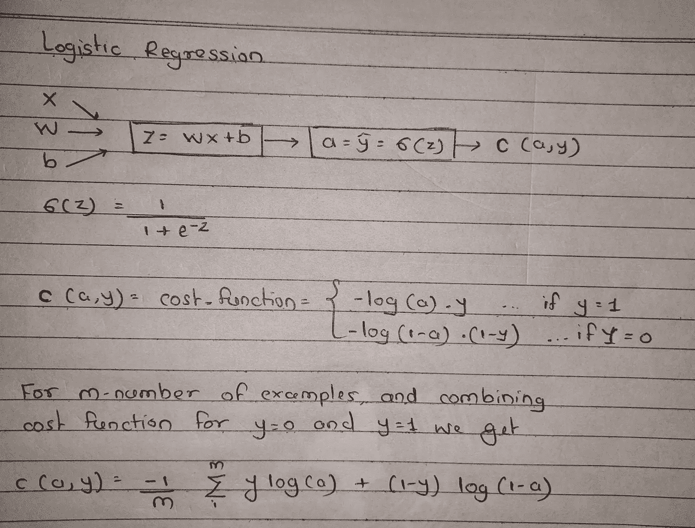

这里 X 是我们的输入特征向量。w 是权重向量，b 是标量偏差。

这里我假设你对人工神经网络(ann)有基本的理解，我将只解释数学细节。如果你理解了上面的神经网络框图，那么你就可以继续了。

现在，让我们回到衍生品。这里，C(a，y)是我们的成本函数，它是参数 a 和 y 的函数。函数“a”是参数 z 的函数，函数“z”是参数 b 和 W 的函数。最后，我们希望调整参数 W 和 b，使成本函数 C(a，y)值最小，这就是梯度下降算法的作用所在。

# 梯度下降:

这里 C 不是参数 W 和 b 的直接函数，所以我们需要在导数中使用链式法则来获得 C wrt b 的导数即 dC/dW 和 C wrt b 的导数即 dC/db。

假设 p = fun(q ), q = fun(r ),即 p 是 q 的函数，q 是 r 的函数，则间接 p 是 r 的函数。因此，通过链式法则，我们可以计算 dp/dr 为 dp/dr = dp/dq * dq/dr

注意:即使我用符号 d 表示导数。实际上不是导数，是偏导数。因为当我计算对 wrt W 的导数时，我认为所有其他参数都是常数，当我计算对 wrt b 的导数时，我认为所有其他参数都是常数。这种类型的导数称为偏导数。

我将使用这个链式法则来计算 dC/dW 和 dC/db。

z= WX+b，a =西格玛(z)，c=C(a，y)

a) dC/dW = dC/da + da/dz + dz/dW

b) dC/db = dC/da + da/dz + dz/db

在下面的手写笔记中，我计算了这些导数。

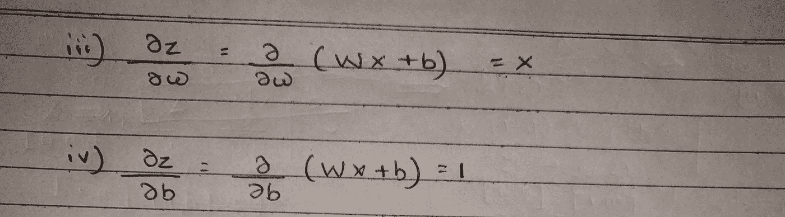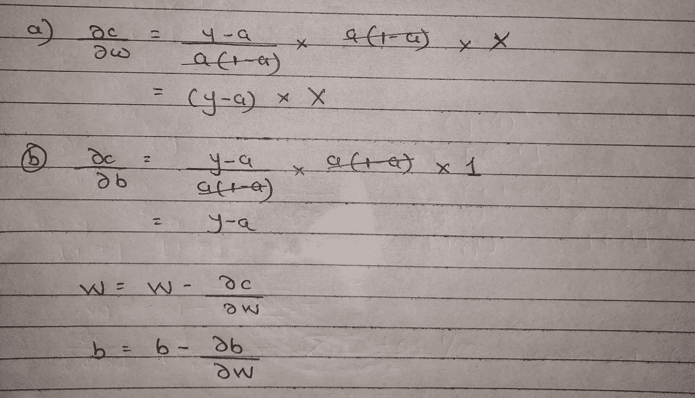

因此，我们将 dC/dW 和 dC/db 计算为

dC/dW = (y-a) * X

dC/db = (y-a)

正如我们之前在导数部分所讨论的，我们将更新参数 W 和 b，以获得最小成本函数 C 值，如下所示

W = W-dC/dW *学习率

b = b-dC/db *学习率

我们将再次计算成本函数值，并再次更新 W 和 b 向量。在获得一定的精度或迭代一定次数后，我们可以停止梯度下降算法，我们的模型就准备好了。

# 我们如何在代码中实现这一点？

我们可以通过使用大量的 for 循环在代码中实现这一点。但是我们可以用 numpy 数组向量来代替，这比循环更有效。

## 正向传播实现:

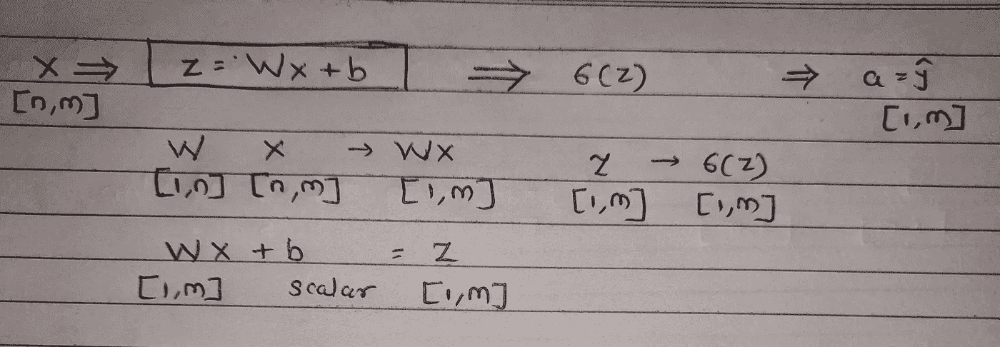

这里 X 是[n，m]个输入特征向量，它由 m 个例子组成，每个例子由 n 个特征组成。w 是[1，n]向量，因此 WX 将是[1，m]向量。只要按照上面的文字说明。

## 反向传播实现:

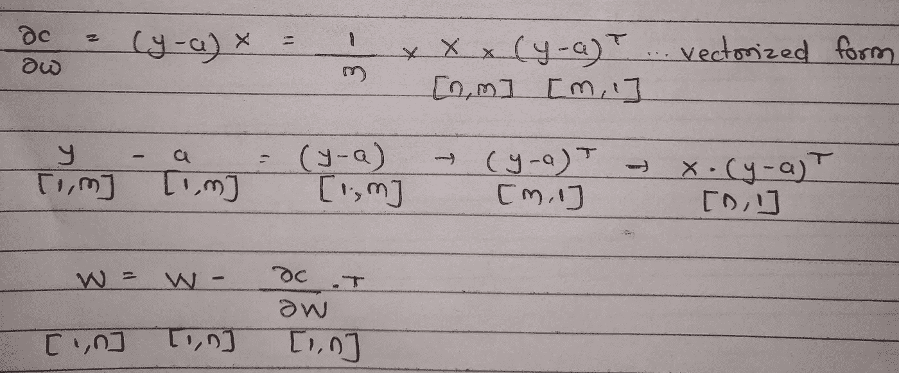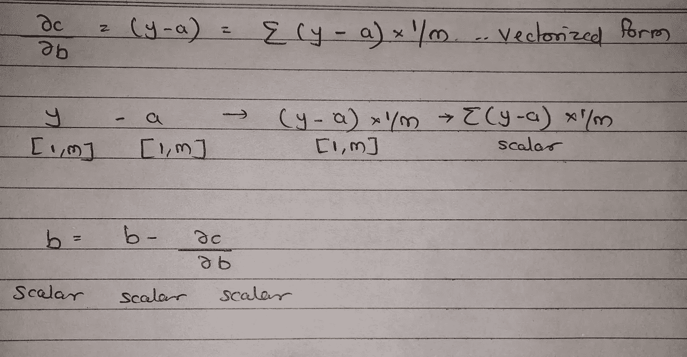

## 代码

1.  我使用 Heard Disease 数据集进行训练。它包含一个 target 列，如果 target=1 人有心脏病，如果 target=0 人没有心脏病。该数据集中有 13 个要素。

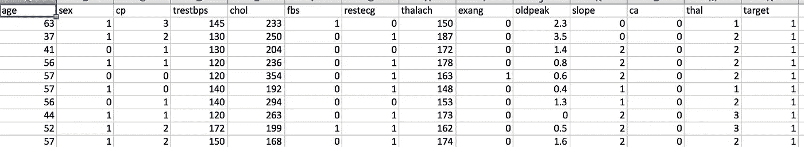

heartRawData 变量中加载的数据。数据集中有 303 个条目。

3)与标签分离的特征

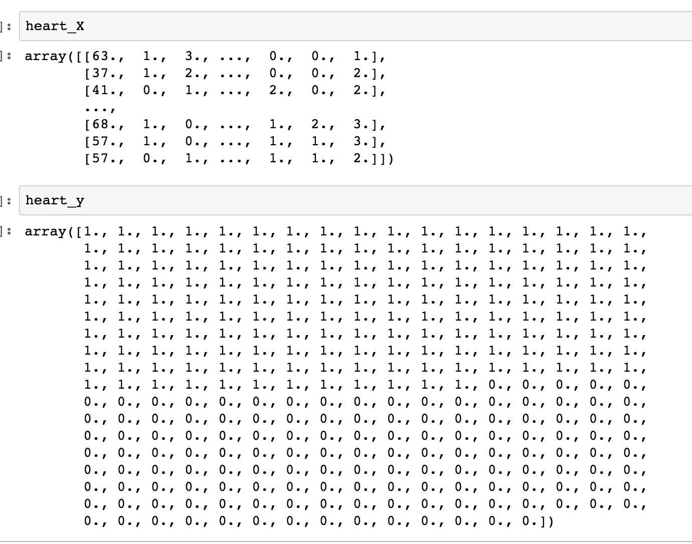

4)正向传播实现

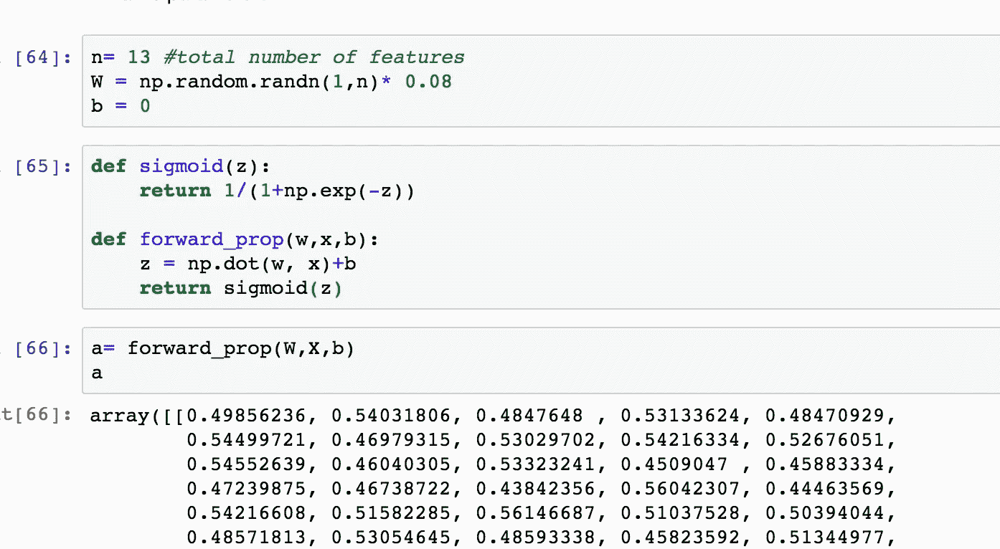

6)成本函数的实现

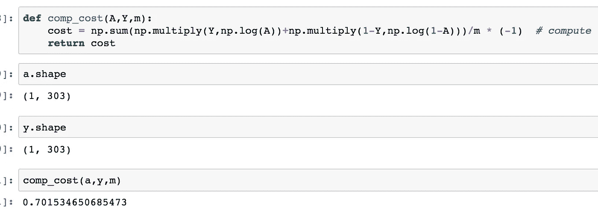

7)梯度下降实现。可以看到，随着循环的迭代，成本在不断降低。

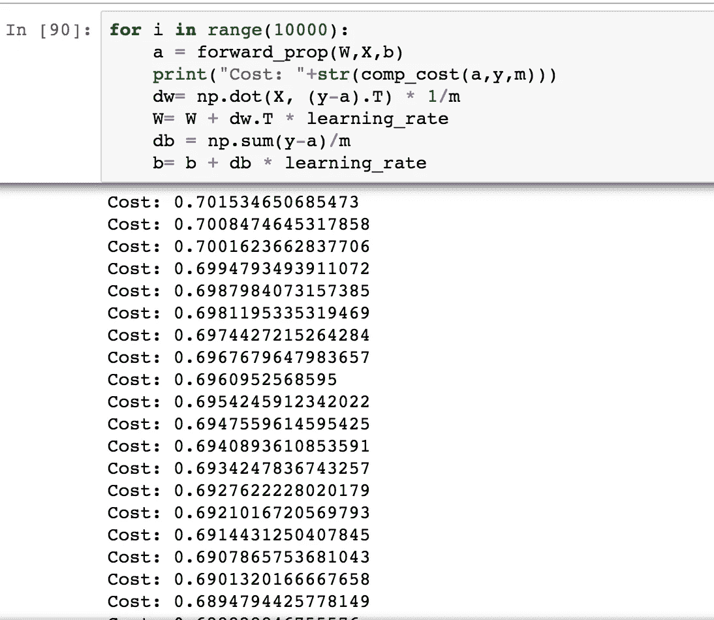

8)计算精度= 84.48 %

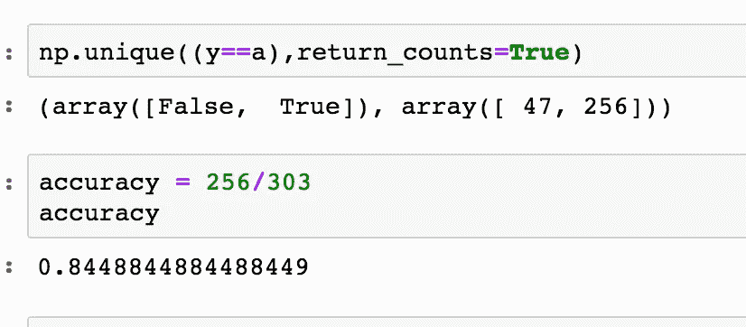

# 结尾:

在这个博客中，我们学习了导数，使用单个神经元的逻辑回归。在下一篇博客中，我将添加更多的层和每层中更多的神经元，朝着深度学习背后的数学方向前进。

谢谢大家！