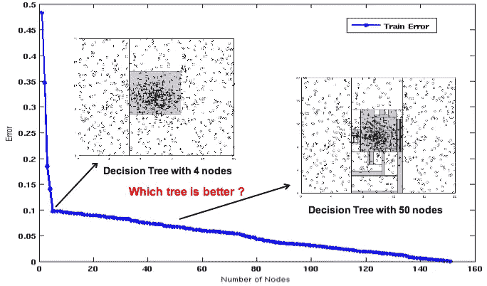

# 决策树背后的数学

> 原文：<https://medium.com/analytics-vidhya/mathematics-behind-decision-tree-73ee2ef82164?source=collection_archive---------2----------------------->

基于嵌套 if-else 分类器的决策树。它是轴平行超平面的集合，它把区域分成一个超立方体。

决策树以树结构的形式建立分类或回归模型。随着树深度的增加，它将数据集分解成更小的子集。最终的结果是一个有**个决策节点**和**个叶节点**的树。决策节点(例如，Outlook)具有两个或更多分支(例如，晴天、阴天和雨天)。叶节点(例如 Play)代表一个分类或决策。对应于最佳预测器的树中最顶端的决策节点被称为**根节点**。决策树可以处理分类数据和数值数据。

# 术语:

1.  **根节点:**它代表整个总体或样本，并进一步分成两个或更多同类集合。
2.  **拆分:**是将一个节点分成两个或两个以上子节点的过程。
3.  **决策节点:**当一个子节点分裂成更多的子节点时，则称之为决策节点。
4.  **叶/端节点:**没有子节点(没有进一步拆分)的节点称为叶或端节点。
5.  **剪枝:**当我们通过移除节点(与分裂相反)来减小决策树的大小时，这个过程叫做剪枝。
6.  **分支/子树:**决策树的一个子部分称为分支或子树。
7.  **父节点和子节点:**被划分为子节点的节点称为子节点的父节点，子节点是父节点的子节点。

# **决策树使用的算法:**

因为上述数据集在输出中包含两个类。首先找出输出中每一类的概率(P(y+)和 P(y-))。

P(y+) = 9/14，P(y-)=5/14

## 属性:

如果类的平均分布大于熵=1。如果一个阶级完全占优，那么熵=0。

如果样本是完全同质的，熵为零，如果样本被等分，则熵为一。

对于高斯分布，数据集分布广泛，因此熵最大，但小于均匀分布，因为所有值相等。

在均匀分布的情况下，数据集是均匀分布的，因此具有最大熵

*   对于尖峰分布，由于数据集分布不均匀，熵最小，接近于零。

## 基尼杂质:

基尼系数计算起来更快，因为 squire 比熵更容易计算，所以基尼系数计算起来更快。在对数计算的情况下所花费的时间比侍从要快得多。所以基尼快多了。

# 信息增益:

构建决策树就是要找到一个返回最高信息增益的属性(即最相似的分支)。首先，计算变量突变前的熵(0.94)。也不愿在休息后计算熵。

计算变量中每个类的熵值。

# DT 的构造:

*第一步*:计算目标的熵。

*第二步*:然后数据集被分割成不同的属性。计算每个分支的熵。然后按比例相加，得到分裂的总熵。从分割前的熵中减去得到的熵。结果是信息增加，或者熵减少。

*第三步*:选择信息增益最大的属性作为决策节点，按分支划分数据集，在每个分支上重复同样的过程。

*步骤 4a* :熵为 0 的分支为叶节点。

*步骤 4b* :熵大于 0 的分支需要进一步分裂。

**分裂分类变量:**

尝试打破使用所有特征，选择一个具有最大信息增益的特征。

打破每个特征，找到每个节点的信息增益，并选择具有最大 IG 的节点。

断开，直到它变成一个纯节点。

如果我们的点数很少，我们就不种树，因为过度适应会增加噪音。

如果深度小于欠配合。

**拆分数字特征:**

分类变量很容易被破坏，但数值变量却不容易。对于数字特征，首先将其按升序排序，使一个类(f1，f2…)每个 f 有两个数据集，因此计算每个 f 的 ID。然后与每个值进行比较，作为潜在的阈值，找到具有最大 IG 值的 f1，您将在该处分裂以形成决策树。

## 功能标准化:

我们不必进行特性标准化，因为这里我们只关心小于或大于。它不是基于距离的方法。

**注意:**当有 Pincode/zipcode 这样的分类变量时。数据集非常高，因为所有的都是不同的。这完全取决于排序值，其中每个排序值都是潜在的阈值。在这种情况下，我们将分类变量转换为数值变量。通过转换成数值变量，摆脱数据稀疏。在这里，每个数字被分成两部分，而在其他情况下，大量的变量可能是无用的。

(不需要规范化，不需要标准化)

## 过度拟合和欠拟合

随着深度的增加，极少数作为纯点的概率增加。所以有过度拟合的可能。如果深度增加，可解释性就会降低。因此**使用交叉验证**获得正确的深度。

Underfit 有很少的超立方体，而 overfit 有许多超立方体，这导致在超立方体中作为纯节点的点很少，即 overfit。超立方体是一个立方体。

## 训练和运行时间复杂性

如果你有一个**大数据集**，决策树可能不是一个好的选择。决策树适用于大型数据集，但维度较少。它也适用于低延迟需求。

在平衡树的最好情况下，深度应该是在 *𝑂* (log *𝑁* )O(log⁡N)，但是决策树做局部最优分裂而不太关心平衡。这意味着深度在 *𝑂* ( *𝑁* )O(N)中的最坏情况是可能的——基本上是当每个分割简单地将数据分割成 1 个和 n-1 个样本时，其中 n 是当前节点的样本数。

## **使用决策树进行回归**

不用 IG，用 MSE。计算每个节点的均方误差，取下一层的均方误差的等待和，选择减小的均方误差。

## 案例:

**不平衡数据集**:影响熵/MSE 计算。所以平衡一下

**大 d** :不好，避免一热编码。如果分类变量有很多特征。将它们转换成数字变量。

**多类分类:**你不必做一节休止符(OVR)。熵在计算中已经考虑了多类。

**决策面**:非线性、轴平行超立方体。

**功能交互:**像 f1*f2/f1 一样内置在 DT 中

**离群值:**影响树并创建不稳定的树

**可解释性:**深度不大时超可解释性

**特性重要性**:计算特性出现的次数是否很多，并因此增加很多。

为了可视化:

# 参考:

谷歌图片

应用人工智能

 [## 1.10.决策树-scikit-了解 0.21.3 文档

### 决策树(DTs)是一种用于分类和回归的非参数监督学习方法。目标是…

scikit-learn.org](https://scikit-learn.org/stable/modules/tree.html)  [## sk learn . tree . decision tree classifier-sci kit-learn 0 . 21 . 3 文档

### class sk learn . tree . decision tree classifier(criteria = ' Gini '，splitter='best '，max_depth=None，min_samples_split=2…

scikit-learn.org](https://scikit-learn.org/stable/modules/generated/sklearn.tree.DecisionTreeClassifier.html) 

#[http://home page . cs . uri . edu/faculty/hamel/courses/2016/spring 2016/CSC 581/lecture-notes/32-decision-trees . pdf](http://homepage.cs.uri.edu/faculty/hamel/courses/2016/spring2016/csc581/lecture-notes/32-decision-trees.pdf)