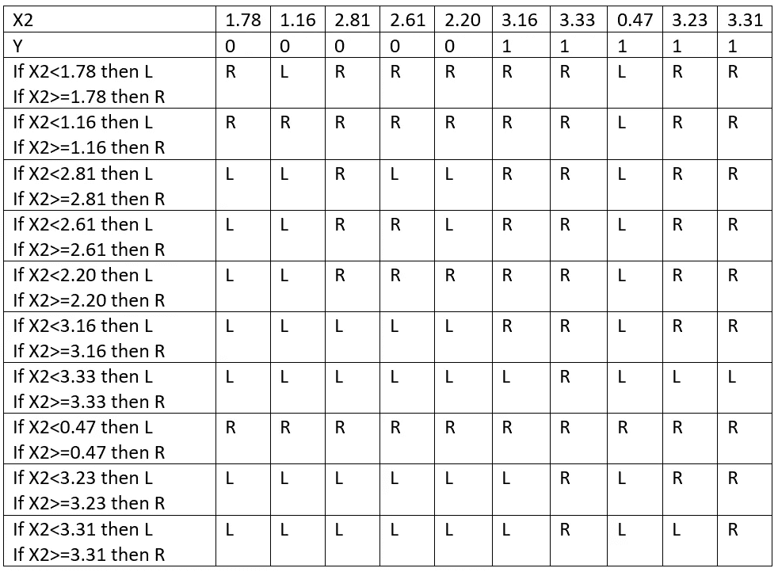

# 决策树算法背后的数学

> 原文：<https://medium.com/analytics-vidhya/mathematics-behind-decision-tree-algorithm-6c5167bdde54?source=collection_archive---------28----------------------->

分类和回归树或简称 CART 是 Leo Breiman 引入的一个术语，指可用于分类或回归预测建模问题的决策树算法。传统上，这种算法被称为决策树。

**购物车模型表示:**

购物车模型的表示是一棵二叉树。这类似于数据结构中的二叉树。每个节点代表一个输入变量(x)和该变量上的一个分割点。树的叶节点包含用于进行预测的输出变量(y)。

资料组

给定数据集的散点图

通过在数据中寻找分裂点来学习购物车模型。拆分点是单个属性的单个值，例如，X1 属性的第一个值 2.77。在分割点分割数据包括将节点上的所有数据分成两组，分割点的左边和分割点的右边。成本函数用于评估分配给分裂每一侧的训练数据的混合类别。在分类问题中，使用基尼指数成本函数。

**基尼指数成本函数**

我们计算分割点的基尼指数如下:

对于每个类(k)，对于每个组(左和右)，其中 p 是给定组中给定类的训练实例的比例。我们总是有两个组，一个左组和一个右组，因为我们使用的是二叉树。从我们的数据集中我们知道我们只有两个类。因此，我们可以将数据集中任何分割点的基尼指数计算为以下各项之和:

第一步是选择一个将成为我们决策树根节点的拆分。我们将从第一个候选分割开始，它是 X1 属性和第一个实例中 X1 的值:X1 = 2.77

如果 X1 < 2.77 THEN LEFT

IF X1 <= 2.77 THEN RIGHT

Similar do it for all and table is formed as

R ->向右而 L ->向左

在 X1 = 6.64 时出现最小 GINI(在 X1 处分开)= 0(纯 GINI 指数)

在 X1 = 6.64 处分离

类似地，我们在 x2 处对此进行计算，可以得到:

最小(GINI(在 X2 分开)= 0.277，这出现在 X2 = 3.16

在 x2 = 3.16 时分割

**测试数据集**

我们现在可以使用训练数据通过取 X1 = 6.64 来预测新已知的测试数据集，并计算准确度。

同样，这是一个完美的分类或 100%准确。