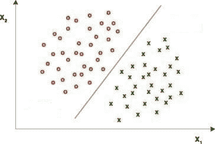
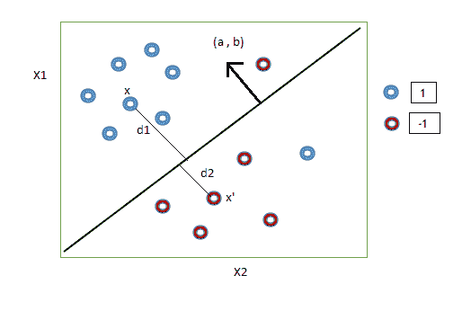
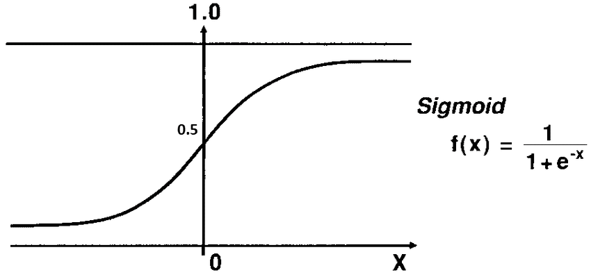
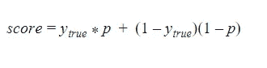
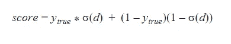
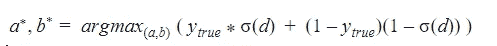
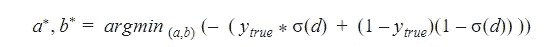
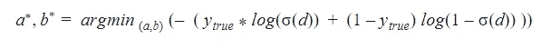
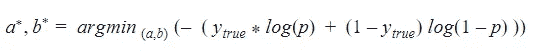
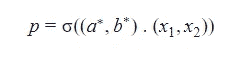

# 逻辑回归背后的数学

> 原文：<https://medium.com/analytics-vidhya/mathematics-behind-logistic-regression-bba91062fa78?source=collection_archive---------7----------------------->

# 什么是逻辑回归？

逻辑回归是一种简单的分类算法，其中输出或因变量为[分类](https://en.wikipedia.org/wiki/Categorical_variable)。例如:

*   将电子邮件分类为垃圾邮件或非垃圾邮件
*   来预测病人是否患有癌症

逻辑回归为此使用逻辑函数，因此得名。这个算法可以被认为是一个回归问题，即使它做了分类。因为逻辑回归不只是给出类别，而是可以告诉我们一个数据点属于每个类别的概率。我们将在接下来的会议中了解细节。

# 几何直觉

我们都知道如何训练逻辑回归，以及如何使用训练好的模型进行预测。但是这个算法背后的核心数学概念是什么？是怎么训练出来的？让我们从几何角度来理解这个算法背后的数学。

考虑一些数据在二维空间中的分布。数据有两个独立的属性 X1 和 X2。这意味着每个数据点在这个二维空间中的位置取决于 X1 和 X2 的值。现在，我们可以看到有两种类型的数据点——红色和绿色。有一条线把这些点分开。所以我们可以说，这条线是一个模型，可以将这些数据点分类为红色或绿色。逻辑回归就是寻找最佳的直线或平面，将数据点分成不同的类别。因此，数据应该几乎是线性可分的，以便使用直线或平面进行分类。

*给定一组点，我们如何找到这条线？给定这一行，我们如何获得对应于每个数据点的类，而不用可视化它？*

**模型预测**

目前，让我们假设我们得到了如上图所示的分隔或分类一组数据点的完美线条。现在我们如何得到每个数据点对应的类呢？

我们稍微修改一下上图。

我们把这条线的方程取为 y=ax1+bx2+c 其中 c 是截距。现在我们忽略 c，等式变成 y=ax1+bx2。

在这个方程中(a，b)可以看作是 y 线的垂直向量。在上图中，我们认为正类点位于法线指向的线的一侧。现在给定(x1，x2)上的任意点 x，该点到直线的距离为

d=(a，b) **。** (x1，x2) / (||(a，b)||)

**其中(a，b)。** (x1，x2)是数据点和法向量的点积，||(a，b)||是这个向量的第二范数或者我们可以说向量离原点的欧氏距离。因此，如果(x1，x2)在(a，b)的方向上，那么点积将是正的，因此 d 将是正的，因此(x1，x2)将是类 1 或正类。

考虑点 x (x1，x2)。距离直线的距离 d1 在(a，b)方向上测量。因此，点积和 d1 将为正，输出为正类。类似地，对于点 x’，到直线的距离是 d2，这是负号。因此 x '属于负类。

现在，我们可以给出输出的概率解释，而不是仅仅给出类标签作为输出。为此，我们在这个带符号的距离上应用一个 sigmoid 函数。这个函数是一个“S”形函数，也称为逻辑函数。

为了得到概率输出，我们只取输出的 sigmoid。sigmoid 函数的输出可以被认为是点在类 1 或正类中的概率。从图中可以看出，对于 x，如果 d 为正，sigmoid(d)大于 0.5。或者输出属于正类或类 1 的概率大于 0.5。类似地，如果 d 为负，则 sigmoid(d)小于 0.5，因此 x 属于类别 1 的概率较低。我们得到的概率是数据点在正类中的概率。

总之，我们使用逻辑函数并预测输出属于正类的概率。这就是为什么这种算法被称为回归，即使它是一种分类算法。

**寻找最佳分离器**

*如何找到分隔类别的最佳直线或平面？*

让我们假设分隔类的线是 y=ax1+bx2。这里的数据是二维的。如果数据是 n 维的，那么分类的平面就是 y= a1x1 + a2x2 + a3x3 + …。+ anxn。为简单起见，我们考虑二维数据本身。

为了得到最佳线，我们需要找到最佳系数。或者换句话说，我们需要找到最佳直线的垂直向量。我们如何找到它？

我们的目标是正确分类最多的数据点。考虑一个数据点 x，如果 x 对应的实际输出 y_true 是 1，那么我们的模型输出应该是 1。如果我们使用概率分数(p)作为输出，那么输出必须接近 1。如果 y_true 为 0，那么模型预测的概率(p)应该接近 0。

换句话说，我们需要最大化类 1 的 ytrue*p 和类 0 的(1-ytrue)(1-p)。

使用 sigmoid 函数替换概率值，

其中 d=(a，b)。(x1，x2)/(||a，b||)并且符号 sigma 是 sigmoid 运算。因此，我们可以获得最佳系数:

最佳值是给出分数最大值的 a 和 b 的值。这就是为什么我们在这里使用 argmax。我们可以将上面的等式写成:

所以我们的目标是找到可以最小化这个分数的系数。这是通过求解[梯度下降算法](https://en.wikipedia.org/wiki/Gradient_descent#:~:text=Gradient%20descent%20is%20a%20first,function%20at%20the%20current%20point.)完成的。

梯度下降算法的一个主要问题是优化更容易陷入[局部最小值](http://mathonline.wikidot.com/local-maxima-and-minima-and-absolute-maxima-and-minima)。为了避免这个问题，我们引入一个单调函数到我们的得分函数中。这里使用的单调函数是对数函数。由于其[单调](https://en.wikipedia.org/wiki/Monotonic_function)行为，该对数函数不会影响分数。修改后的等式变成

我们可以这样写，

其中 p 是属于 1 类或正类的概率。这是两类分类问题中的对数损失方程。

现在，在获得最佳系数后，我们可以根据概率找到数据点的输出，如下所示:

其中(a*，b*) **。** (x1，x2)是从直线测量的 x 的有符号距离。现在，如果 p 的值大于 0.5，我们可以将其分类为 1 类，否则为 0 类。

我希望这篇文章能帮助你对逻辑回归背后的数学有一个基本的了解。如有任何疑问或建议，您可以通过 [LinkedIn](https://www.linkedin.com/in/vinitha-v-n-5a0560179/) 联系我。