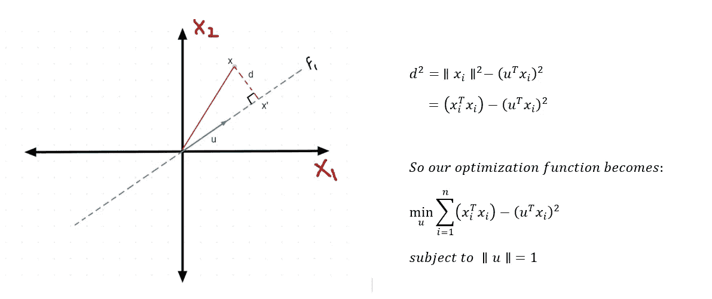
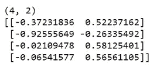

# 主成分分析背后的数学

> 原文：<https://medium.com/analytics-vidhya/mathematics-behind-principal-component-analysis-pca-1cdff0a808a9?source=collection_archive---------2----------------------->

> 在本文中，我将从数学上推导 PCA 是如何工作的，并从头开始用 python 和使用 scikit learn 实现它。


沃洛季米尔·赫里先科在 [Unsplash](https://unsplash.com?utm_source=medium&utm_medium=referral) 上的照片

**降维指的是减少数据中特征/变量数量的技术。我们对**进行降维处理

*   在 2D 图上可视化高维数据。
*   去掉相关的和多余的特征。
*   防止过度拟合数据。
*   解决维数灾难。

主成分分析是最流行的降维技术之一。PCA 背后的关键思想是**它创建新特征**并将原始数据投射到这些特征上，这些特征是原始特征的线性组合，目的是最大化数据的总变化，即保留尽可能多的信息。

# 主成分分析的几何解释

让我们试着在二维空间中理解 PCA。我们将尝试将二维数据简化为一维数据。同样的想法也可以扩展到更高的维度。我们的目标是保持具有最大传播/方差的方向。先说一个简单的案例。

**注意:在应用 PCA 之前，请始终标准化您的数据。**

假设我们有以下标准化数据:


假设您必须从 X1 和 X2 中选择一个特征，您会选择哪个特征来表示数据？根据您的看法，哪一项功能似乎更重要？解释数据最大变化的那个。这就是特征 X1。这正是 PCA 所做的。它找到具有最大扩散的特征并丢弃其他特征，目的是**最小化信息损失**。

让我们举一个稍微复杂的例子，我们不能简单地删除一个特性。


这里，特征 X1 和 X2 具有相等的分布。所以我们分不清哪个特征更重要。但是如果我们试图找到一个解释数据变化的方向(或轴),我们可以找到一条与数据非常吻合的线。所以如果我们把轴稍微旋转θ，我们得到 f1 和 f2(垂直于 f1)。然后我们可以去掉 f2，说 f1 是最重要的特性。

这正是 PCA 所做的。它获取数据并试图找到方向 f1，使得投射到 f1 上的点的方差最大。

> 请注意，我们正在通过创建新要素来转换数据。

好吧，这听起来很酷，但是 PCA 是如何找到方向的呢？PCA 利用*线性代数*和*最优化理论*的概念，寻找传播最大的方向。让我们调查一下。

# **PCA 背后的数学**

我们的目标是找到具有最大扩散的方向，并将数据点投影到该方向上。

**让我们试着找到一条线，使投影点到原点的距离最大化，即投影距离的方差最大化。**


这种方法被称为*方差最大化方法*。还有另一种方法可以构造 PCA 的优化函数。

**考虑 PCA 的另一种方式是，它拟合穿过我们数据的最佳直线，目的是最小化每个点的投影误差‘d’。**这种方法被称为*距离最小化方法*。



请注意，这两个优化问题虽然看起来不同，但却是相同的。因为(x^T *x)项独立于 u，所以为了最小化函数，我们必须最大化(u^t *u)，这与我们的第一个优化问题相同。

在使用拉格朗日乘数法解决这个优化问题之前，让我们先了解一些术语。

> 假设 X 是我们的数据矩阵，有 n 个观测值和 d 个特征。

1.  **协方差矩阵**


协方差矩阵(或方差协方差矩阵)是形状=要素数量的方阵，其对角元素是每个要素的方差，非对角元素是要素之间的协方差。

**2。特征值和特征向量**


对应于每个特征值，存在一个特征向量。所有的特征向量都是正交的。

# **解决优化问题**

让我们再来看看我们的优化问题。


**现在让我们尝试使用拉格朗日乘数法来解决我们修改后的优化问题。**

设λ是我们的拉格朗日乘数。


因此，u 是对应于最大特征值λ的协方差矩阵 S 的特征向量。

让我们把所有的步骤再写一遍:

假设我们的数据矩阵 X 有 d 个特征，我们想把它们减少到 k 个特征。

1.  列标准化你的数据。
2.  求协方差矩阵。
3.  求协方差矩阵的所有特征值和特征向量。
4.  则最大特征值λ1 对应的 v1 是方差最大的方向，λ2 对应的 v2 是方差第二大的方向，以此类推。
5.  为了获得 k 个特征，将原始数据矩阵与对应于前 k 个最大特征值的特征向量矩阵相乘。

结果矩阵是具有减少的特征的矩阵。

**我们来理解一下特征值的解释。**


# Python 中的 PCA

我将在[虹膜数据集](https://www.kaggle.com/uciml/iris)上实现 PCA。链接:

**从无到有**

```
#Importing the data
data= pd.read_csv("Iris.csv")
data.head()
```


```
X = data.iloc[:, 0:4]
y = data.species#**Step 1: Let's scale the data.**from sklearn.preprocessing import StandardScaler
X_scaled = StandardScaler().fit_transform(X)#**Step 2: Find the covariance matrix**.covar_matrix = (1 / X_scaled.shape[0]) * np.matmul(X_scaled.T,X_scaled)
print (covar_matrix.shape)
```


```
#**Step 3: Find the eigenvalues and eigenvectors.**from scipy.linalg import eigh#eigh function returns the eigenvalues in ascending order
#We specify the top 2 eigenvalues (out of 0, 1, 2, 3)values, vectors = eigh(covar_matrix, eigvals=(2, 3))
print (vectors.shape)
print (vectors)
```



```
#**Step 4: Project the original data on eigenvectors**.pca_components = np.matmul(X_scaled, vectors)
pca_data = pd.DataFrame(np.hstack((pca_components, y.to_numpy().reshape(-1, 1))), columns=["Component 1", "Component 2", "Species"])
pca_data.head()
```


```
#**Let's calculate the percentage of variation explained.** print (values.sum() / eigh(covar_matrix)[0].sum() * 100)
```


```
#**Now let’s plot the principal components.**
sns.scatterplot(x= "Component 1", y= "Component 2", hue= "Species", data= pca_data)
```


**使用 scikit 学习**

```
from sklearn.decomposition import PCA#Using the **n_components** argument
pca = PCA(n_components= 2)
pca_components = pca.fit_transform(X_scaled)pca_data = pd.DataFrame(np.hstack((pca_components, y.to_numpy().reshape(-1, 1))), columns=["Component 1", "Component 2", "Species"])
pca_data.head()
```


请注意，在 sklearn 实现中，组件被交换了。

```
print (pca.explained_variance_ratio_.sum() *100)
```


```
sns.scatterplot(x= “Component 1”, y= “Component 2”, hue= “Species”, data= pca_data)
```


感谢您的阅读。

你可以在 LinkedIn 上联系我:[www.linkedin.com/in/madhav-samariya-7a636b17a](http://www.linkedin.com/in/madhav-samariya-7a636b17a)