# 随机森林和 XGBoost 背后的数学

> 原文：<https://medium.com/analytics-vidhya/mathematics-behind-random-forest-and-xgboost-ea8596657275?source=collection_archive---------1----------------------->

# 什么是合奏？

Ensemble 的意思是集合或一组事物。

**集成学习**是一种机器学习技术，它结合了几个基本模型，以便产生一个最佳预测模型(强大的模型)。

集成方法允许我们考虑决策树的样本，计算在每次分割时使用哪些特征或询问哪些问题，并基于样本决策树的聚合结果做出最终预测。

# 集合方法的类型:

1.  *ing，或者***B***ootstrap***AGG***regating(随机森林)*
2.  *助推*
3.  *堆垛*
4.  *级联*

# ****BAGG*** ing，或***B***oot strap***AGG***regation:*

*所有采样都是在替换采样时完成的。每个模型都是根据不同的数据子集构建的。如果模型随着训练数据的变化而变化很大，则该模型被称为具有高方差。因此 bagging 是一个在不影响偏差的情况下减少模型方差的概念。*

*装袋=DT +行取样*

*Bagging 是 Bootstrap 过程在高方差机器学习算法(通常是决策树)中的应用。*

*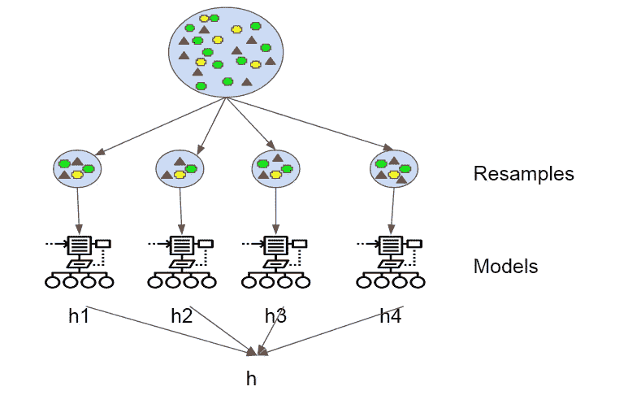*

*通过为每个模型获取一个小样本数据集，聚合模型不会有太大变化，因为它只影响数据集的一小部分。*

*典型的聚合运算是均值/中值。在回归的情况下是平均值/中值，在分类问题的情况下是多数投票。最终的聚集步骤是最终的模型(h)。*

*采用一组低偏差和高方差模型(h1、h2、h3、h4…)并将其与 bagging 结合。你会得到低偏差和减少方差的模型(h)。深度非常高的决策树。*

*当使用决策树进行打包时，我们不太担心个别树会过度拟合训练数据。出于这个原因并且为了效率，单独的决策树生长得更深(例如，在树的每个叶节点处很少训练样本),并且不修剪这些树。这些树将具有高方差和低偏差。当使用 bagging 组合预测时，这些是子模型的重要特征。*

*随机森林最流行的 Bagging 模型，现在每天用于低偏差和高方差数据集。*

## ***随机森林:***

*随机森林以决策树为基础进行行抽样和列抽样。模型 h1、h2、h3、h4 与仅装袋相比，差异更大，因为采用了柱取样。*

*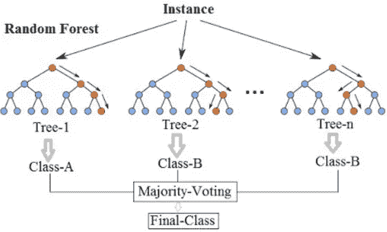*

*随着基础学习者数量(k)的增加，方差会减小。当 k 减小时，方差增加。但是偏差在整个过程中保持不变。k 可以通过交叉验证找到。*

*随机森林= DT(基础学习者)+ bagging(带替换的行抽样)+特征 bagging(列抽样)+聚合(平均值/中值，多数投票)*

*这里我们希望我们的基础学习者是低偏差和高方差的。所以训练 DT 到全深度长度。我们不担心深度，我们让它们增长，因为最终方差会减少。*

*对于模型 h1，建模中未使用的(D-D′)数据集在包外数据集。他们用于 h1 模型的交叉验证。*

**让我们看看实现随机森林的步骤:**

***1** 。假设在训练数据集中有 N 个观察值和 M 个特征。首先，从训练数据集中随机抽取一个样本进行替换。*

***2** 。随机选择 M 个特征的子集，并且使用给出最佳分裂的特征来迭代地分裂节点。*

***3** 。这棵树长到最大。*

***4** 。重复上述步骤，并基于来自 n 棵树的预测的集合给出预测。*

***训练和运行时间复杂性***

*训练时间= O(log(nd)*k)*

*运行时间= O(深度*k)*

*Space = O(存储每个 DT*K)*

*随着基础模型数量的增加，训练运行时间也会增加，因此请始终使用交叉验证来找到最佳超参数。*

***代码:***

*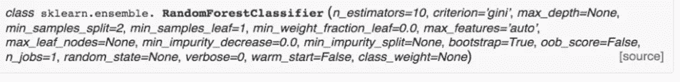**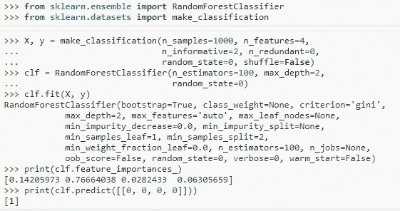** [## 3.2.4.3.1.sk learn . ensemble . randomforestclassifier-sci kit-learn 0 . 21 . 3 文档

### class sk learn . ensemble . RandomForestClassifier(n _ estimators = ' warn '，criterion='gini '，max_depth=None…

scikit-learn.org](https://scikit-learn.org/stable/modules/generated/sklearn.ensemble.RandomForestClassifier.html) 

## **极度随机化树:**

极端随机化树= DT(基础学习者)+ bagging(带替换的行抽样)+特征 bagging(列抽样)+聚合(均值/中值、多数投票)+选择阈值时的随机化

再增加一个级别以减少差异，但偏差可能会略有增加。但这种方法在现实生活中并不多见。

 [## 3.2.4.3.3.sk learn . ensemble . extractreesclassifier-sci kit-learn 0 . 21 . 3 文档

### class sk learn . ensemble . extractree classifier(n _ estimators = ' warn '，criterion='gini '，max_depth=None…

scikit-learn.org](https://scikit-learn.org/stable/modules/generated/sklearn.ensemble.ExtraTreesClassifier.html) 

**案例:**

1.  除了在 RF 中，方差影响任何数量的基学习者(K)之外，所有情况下的决策树对于随机森林也是相同的。
2.  在决策树的情况下，特征重要性仅在一个模型上，但是在 RF 中，我们也考虑所有 k 个基本学习者模型(k)。

**注**:所有情况下的决策树同样适用于随机森林。

# 增压:

***助推*** *是另一种创建预测值集合的集成技术。在这种技术中，学习者是按顺序学习的，早期的学习者将简单的模型与数据拟合，然后分析数据中的错误。换句话说，我们拟合连续的树(随机样本),并且在每一步，目标都是解决来自先前树的净误差。*

这在高偏差和低方差基础模型和加法组合的情况下有效。我们将努力减少偏见。

当一个输入被一个假设错误分类时，它的权重会增加，以便下一个假设更有可能将其正确分类。通过在最后组合整个集合，将弱学习者转换成更好执行的模型。

**注意:**在 RF 中，我们无法将损耗降至最低，因为我们没有使用它。但是在梯度推进中，我们可以最小化任何损失

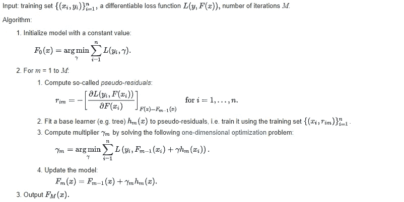

这里 L(y，F(x))是损失函数(对数损失、线性损失、兴损失等)，M 是基本模型的数量。所有都是按顺序完成的，因此 GBDT 没有并行化，所以甚至比 RF 需要更多的时间训练。

梯度提升是具有高偏差和低方差模型的基础学习器。这里我们将使用深度值非常低的梯度推进决策树。

## [**正规化靠收缩**](https://www.appliedaicourse.com/lecture/11/applied-machine-learning-online-course/3092/regularization-by-shrinkage/4/module-4-machine-learning-ii-supervised-learning-models)

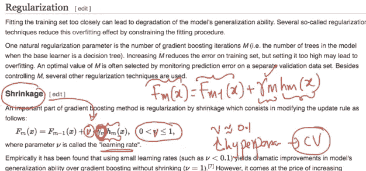

随着 v 的降低，模型的权重降低。如果 v 增加，你过度拟合的机会增加。务必对基础模型的数量(M)和收缩参数(v)进行交叉验证。

随着 M 的增加，偏差当然会减少，但方差也会增加。所以用正规化。在收缩中，我们简单地将“v”乘以第二项。因此将“游戏”减少常数“v”。随着“v”减小，过度拟合的机会减少，因此方差减小。**M 和“v”都用于偏差-方差权衡。**

**训练和运行时间复杂度**

训练时间= O(log(nd)*k)

运行时间= O(深度*k)

Space = O(存储每个 DT* k)

## XGBoost

XGBoost:增强+随机化

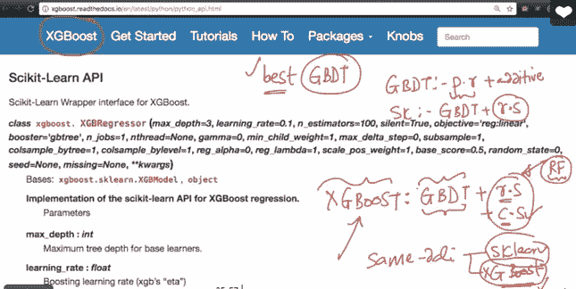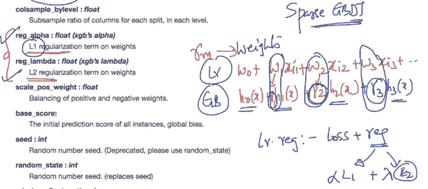

[https://xgboost . readthedocs . io/en/latest/python/python _ API . html # module-xgboost . sk learn](https://xgboost.readthedocs.io/en/latest/python/python_api.html)

[https://sci kit-learn . org/stable/modules/generated/sk learn . ensemble . gradientboostingclassifier . html](https://scikit-learn.org/stable/modules/generated/sklearn.ensemble.GradientBoostingClassifier.html)

[https://github . com/dmlc/xgboost/blob/master/demo/guide-python/sk learn _ examples . py](https://github.com/dmlc/xgboost/blob/master/demo/guide-python/sklearn_examples.py)

## Adaboost:

主要用于图像处理和人脸检测问题。在每一个阶段，它给那些被错误分类的点更多的权重。

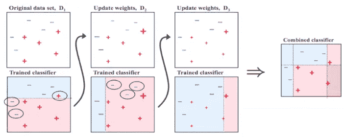 [## 助推

### 有很多很多方法来解释 boosting:作为指数损失最小化，作为一个特征选择算法，作为…

alliance.seas.upenn.edu](https://alliance.seas.upenn.edu/~cis520/wiki/index.php?n=lectures.boosting) 

您可以调整参数来优化算法的性能，我在下面提到了用于调整的关键参数:

*   **n_estimators:** 它控制弱学习者的数量。
*   **learning_rate:** 控制弱学习者在最终组合中的贡献。在 learning_rate 和 n_estimators 之间有一个折衷。
*   **base_estimators** :它有助于指定不同的 ML 算法。

# 堆叠模型:

第一次独立训练每个型号(C1、C2、C3……)

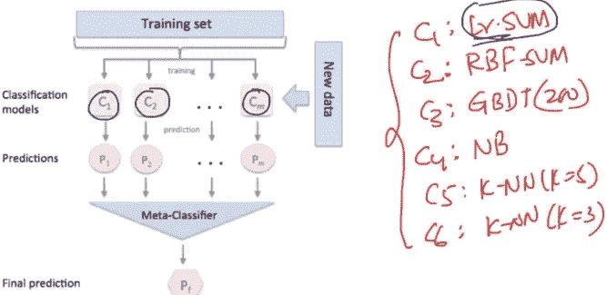

元分类器可以是逻辑的、RF 的或任何的。

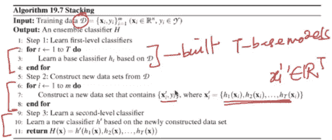 [## 堆叠分类器

### 用于堆叠的集成学习元分类器。分类器导入堆栈分类器堆栈是一个…

rasbt.github.io](http://rasbt.github.io/mlxtend/user_guide/classifier/StackingClassifier/) 

# 级联分类器:

这种模式主要用于错误发生的成本非常高的情况。广泛用于信用卡公司检测欺诈交易。或者医学领域来检测罕见问题以拯救生命。

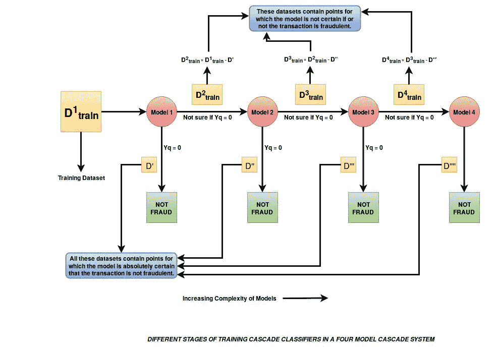

第二步中的数据集训练是第一步建模中未使用的(D-D1)数据集。

============大团圆结局=================

# 参考:

谷歌图片

应用人工智能

 [## 逻辑损失函数的梯度

### 我想问一个与此相关的问题。我在这里找到一个为 xgboost 写自定义损失函数的例子…

stats.stackexchange.com](https://stats.stackexchange.com/questions/219241/gradient-for-logistic-loss-function)*