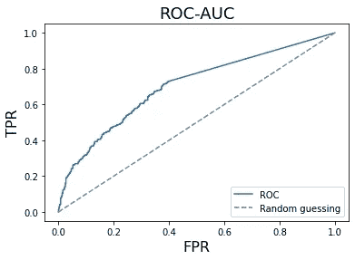

# ROC-AUC 解释背后的数学

> 原文：<https://medium.com/analytics-vidhya/mathematics-behind-roc-auc-interpretation-e4e6f202a015?source=collection_archive---------2----------------------->

## ROC-AUC 最常用解释之一的数学解释

ROC 曲线的图示

## 动机

当我在网上了解数据科学和机器学习时，我经常发现自己想知道一些常用技术背后的数学原理。虽然我大部分时间都能在网上找到它(感谢…