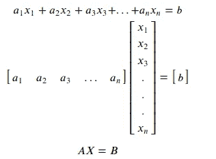
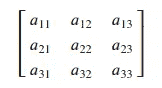
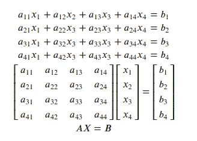
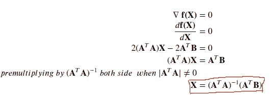

# 机器学习的数学

> 原文：<https://medium.com/analytics-vidhya/mathematics-for-machine-learning-4bbbfa0904f4?source=collection_archive---------17----------------------->

## 第二部分(线性代数与矩阵)

图— 1

在我的[***Part—1***](/analytics-vidhya/mathematics-for-machine-learning-part-1-matrix-1652ca095af3)*中我讲过矩阵和矩阵运算。在这篇博客中，我将讨论那些对机器学习(ML)很重要的线性代数概念，以及更多的矩阵概念，如秩、矩阵的伴随、矩阵的逆等。如果你对矩阵很熟悉，那么继续阅读博客，否则我会推荐你浏览*第一部分*博客。*

# *介绍*

*线性代数是研究线性方程的数学分支。在一个方程中，主要有三项——**变量**(***X******=【X _ 1，x_2，x_3，…】***)，**系数**(***A******=【A _ 1，a_2，a_3，…)。]*** )和**一个常数项**(***B =【B】***)。所有变量的次数都为 ***1 或 0*** 的方程称为线性方程。每个等式可以用一行和一列向量的乘法来写，即( ***AX = B*** )。*

**

*这里 ***A*** 是系数的行向量 ***X*** 是变量的列向量。*

> ***注:**线性方程中的任何变量都可以有 1 次或 0 次。但必须至少有一个变量的次数为 1。*

# *超平面*

*超平面是一种几何实体，其维数比其周围空间的维数小一。*

***例子:***

*   ***一条线**是一维的( ***1*** )，其周围空间是二维的( ***1+1*** )。*
*   ***一个平面**是二维的( ***2*** )，其周围空间是三维的( ***2+1*** )。*
*   ***k 维的其他超平面**(***k***)及其周围空间是( ***k+1*** )维的。 ***(k > 2)。****

> ***注:**超平面的方程永远是线性方程。*

## *线条*

*数学家引入了直线或直线的概念来表示直的物体(没有曲率)。线条没有任何宽度和深度。~ [*维基百科*](https://en.wikipedia.org/wiki/Line_(geometry)) 。*

*直线的方程只有两个变量。表示一个线性方程有多种形式，但我将只讨论三种形式:**斜率形式、截距形式和一般形式**。从一种形式转换成另一种形式非常容易。*

***一般形式:**这是最简单的形式之一，这个形式看起来与上图非常相似。所以可以很容易地写成矩阵形式。下面等式中的' ***a'*** 和' ***b'*** 分别是变量***【x】***和***【y】***的系数。***‘c’***是常数项。*

**

***A** 和 **X** 分别是行向量和列向量。*

*使用系数项可以找到该表格中直线的斜率。 ***【斜率=-a/b】****

> *数学上，斜率是与 x 轴*形成的角度的切线，角度从 x 轴逆时针方向测量。**
> 
> **直观地说，斜率衡量***【y】***在***【x】***变化时变化的快慢。**

********

**图 2(一般形式)**

**如果你想在***【a】【b】***&***【c】***[**中看到线条是如何随着变化而变化的，点击这里**](https://www.desmos.com/calculator/bfq07wwlrf) 来玩吧。**

****斜坡形式:**这是最流行也是最简单的形式。这种形式有两个主要术语:第一个是 y 截距术语(***【c】***)，第二个是斜率术语(***【m】***)。**

********

**图— 3(斜坡形式)**

**如果你想看当斜率和截距项改变时线是如何变化的， [**点击这里**](https://www.desmos.com/calculator/dxj0nifojy) 。**

****截距形式:**当我们有 ***x & y 轴截距*** 或者我们需要找到轴截距时，就使用这种形式的方程。在下面的等式中***‘a’&‘b’***分别是 ***x & y 轴截距*** 。**

********

**图 4(截距形式)**

**如果您想查看线条变化时***【a】【b】***&***【c】***的变化， [**点击这里**。](https://www.desmos.com/calculator/hfg58s1j4q)**

**下图显示了如何将直线的一般形式转换为斜率和截距形式。同样，也可以进行其他转换。**

****

****两线夹角:**设第一、二条线的斜率分别为***‘m _ 1’&‘m _ 2’***。那么两条线之间的角度可以用下面的公式得到。**

********

**图— 5(两条线之间的角度)**

**如果想看以上线条之间的角度在***【m _ 1】&【m _ 2】***变化 [**时如何变化，点击此处**](https://www.desmos.com/calculator/zxyx1amse4) 。**

**为了找到较小的角度，我们使用这个公式。**

****

**通过使用上面的公式—**

*   **如果直线之间的***【θ】***为 ***0*** ，则直线平行或相同，如果不是同一条直线，则平行线不相交。**

****

*   **如果***【θ】***两条直线之间的角度为 ***90 度，则它们将是垂直的。*****

****

****两条直线的交点:**有多种方法可以找到两条直线的交点，但我将在本博客的后面部分只讨论一种方法 ***即*矩阵方法**。**

## **飞机**

**平面是一个二维平面，它无限延伸，厚度为零。——[*维基百科*](https://en.wikipedia.org/wiki/Plane_(geometry))**

**平面方程有三个变量***【x，y，z】***它们对应的系数***【a，b，c】***称为方向比/方向余弦(如果是单位向量)和一个常数项(***‘d’****)*。一般来说，方向比用***【l，m，n】表示。*** 方向比始终是单位矢量(幅度为 ***1*** 的矢量)。我将在我的下一篇博客*中详细讨论矢量。***

************

***[图](http://mathworld.wolfram.com/NormalVector.html) — 6***

***如果变量的系数是方向比，那么常数项 ***|d|*** 就是平面到原点的最短距离。过原点的平面会有一个常数项等于 ***0。*** 方向比/方向余弦与平面的法向量 ***(n)*** 相关。***

> *****注**:直线/矢量的方向余弦定义为直线/矢量与 **x，y & z 轴**所成角度的余弦。例如 **z 轴**的方向余弦将为 **< cos(90)，cos(90)，cos(0) > = < 0，0，1 > *。******z 轴*** 垂直于 xy 平面，所以 xy-pane 的方程为—***

******

> ***两个向量之间的角度可以用它们之间的点积来求出。设 **n_1 & n_2** 为两个向量，那么它们之间的角度将为—***

******

*****两平面间的夹角:**平面间的夹角***(θ)***与平面的法向量之间的夹角***(φ)***为补角。***

******

***[图—](https://qr.ae/TWoSig) 7(两个平面之间的角度)***

***两个平面的法向量***(n _ 1&n _ 2)***之间的角度可以使用上述概念找到，这里它们之间的角度将是***φ。因此，法线已知的两个平面之间的角度为—******

******

*****平面相交:**具有平行法向量的平面是平行或重叠的平面。如果两个平面的法向量不平行，则这两个平面的交线总是一条直线。三个平面的解决方案将在本博客的后面部分讨论。***

> *****注意**:我将互换使用线性方程和超平面术语。所以不要迷茫。***

# ***矩阵的逆***

***如果你知道如何找到矩阵的逆矩阵，那么你可以跳过博客的这一部分，跳到下一部分。要求矩阵的逆矩阵，我们必须知道如何求矩阵的行列式和伴随式。***

## ***矩阵的行列式***

***矩阵的行列式存在当且仅当矩阵是方阵。设**T5 一 T7 是一个方阵。*****

***计算一个方阵的行列式 ***A*** 阶 ***2*** 非常容易。第一行 ***a*** 的第一个元素将乘以既不在 ***a 的行中也不在列中的那个数，*** 因此 ***a*** 将乘以***d***(***d***是 ***a*** 的余因子)然后添加乘积(即 ***ad +(-bc)*** )。***

******

***现在我们可以找到 2 阶矩阵的行列式。使用同样的方法，我们可以找到一个 3 阶矩阵的行列式。**Figure-8**展示了如何找到第一行中每个元素的余因子。这些余因子将被用来寻找行列式。术语 ***(-1)^(i+j)*** 是存在的，其中***‘I’是第 I 个*** 行，***【j】是第 j 个*** 列。这里 ***i，j = {1，2，3}。******

***************

图— 8(第一行各元素{a，b，c}的余因子)*** ******

***图 9(三阶方阵的行列式)***

***上例中使用了 ***i = 1*** 和 ***j = {1，2，3}*** 。***

***同理，我们可以计算 4 阶或更高阶矩阵的行列式。***

******

***图—10(4 阶方阵的行列式)***

> ***使用任意行或任意列都可以找到方阵的行列式。选取任意列或行，将所选行/列的每个元素乘以其对应的余因子，然后将它们相加。***

## ***矩阵的伴随矩阵***

***矩阵**的伴随矩阵*A*是矩阵**的余子式*A*的转置矩阵。在 **Figure — 8** 中，我已经展示了如何找到矩阵第一行中每个元素的余因子。同样的，我们可以找到矩阵中其他元素的余因子。*******

************

***图— 11(上述矩阵的余因子 ***A*** )***

******

***图 12(余因子矩阵)***

******

***图 13(矩阵 A 的伴随矩阵)***

***有 **3 步**求方阵的逆矩阵。让我们来看一下 ***一个*** 是一个方阵。***

*****第一步** : 计算矩阵的行列式*。矩阵的行列式(必须是方阵)用***【det(A)***或 ***|A|*** 表示。如果 ***|A| = 0*** 那么*就是**不可逆**。*****

******第二步**:计算 ***A.*** 的伴随****

*****第三步**:用下面的公式计算 ***A*** 的倒数。***

************

***图 14(求矩阵逆矩阵的流程图)***

# ***矩阵的秩***

***在讨论线性方程组及其解之前，最好先知道矩阵的秩是什么。***

***Rank 是线性无关行的最大数量或线性无关列的最大数量。我将把线性无关的行数称为矩阵的**行秩**，把线性无关的列数称为矩阵的**列秩**。但是一个矩阵的秩总是唯一的并且大于等于 ***0。*** 我会在 ***这篇博客中详细讨论这个概念。******

******

> *****注:**所有行和列线性无关且行秩等于该矩阵列秩的矩阵称为**满秩矩阵**。***
> 
> ***如果矩阵中没有元素，矩阵的秩将为零(即**空矩阵**)，否则矩阵的秩将大于或等于 1 。***

# ***线性方程组及其解***

***它是一个或多个线性方程的集合。线性方程组可以用矩阵形式表示。一个系统可以有相同数量的方程和变量，也可以有不同数量的方程和变量。***

******************

***图 15 (a)***

******

***图 15 (b)线性方程组***

***图 15 显示了如何将线性方程组写成矩阵形式 ***(AX = B)。******

******

***设矩阵 **A，X & B** 的顺序分别为 ***(m，n)，(n，1) & (m，1)*** 。根据 ***m & n.*** 这里的 ***m*** 是方程(或行)的数量 ***n*** 是变量(或列)的数量。***

## ***情况 1: m = n***

******m = n:*** 等式和变量个数相等。***

******

*   ***如果 ***A*** 是满秩矩阵，这意味着它的所有行和列都是线性无关的，并且这个矩阵的**行秩**和**列秩**相等。所以这样矩阵的行列式永远不是*(即 ***|A|不是 0*** *)。*所以这个系统的解将是 ***X =逆(A) B*** 。它会有一个独特的解决方案。****

******

*   ***当 ***A*** 不是满秩矩阵也就是说 ***|A| = 0*** 有两种可能——**一致和不一致的情况。**在这种情况下，对应于该线性方程组的超平面是平行的或重叠的。***

*****相容情况:**在这种情况下，超平面是重叠的，因此这种线性方程组有无限可能的解。***

******

***上面的两个方程是相同的，因为第二个方程可以通过将第一个方程乘以 ***2*** 得到，或者第一个方程可以通过将第二个方程乘以 ***1/2*** 得到。当我们绘制两条线时，它们会重叠。所以这个线性方程组会有无穷多个解。***

******

*****不一致的情况:**在这种情况下，超平面相互平行或者至少有一对超平面平行，这意味着它们的系数成比例。这种类型的线性方程组没有解。***

******

***在上面的例子中，前两个方程可以相互推导。所以前两个方程是一样的。第三个方程/超平面平行于前两个方程/超平面。第四个方程/超平面将与上述所有方程相交。但是作为一个整体系统，他们没有解决方案。***

> *****注:**在相容的情况下，所有方程都可以相互推导。***
> 
> ***在不一致的情况下，所有的方程不能相互推导，而在少数情况下，一些方程可以从其他方程推导出来，反之亦然**，但不是所有的方程**。***

## ***案例 2: m > n***

***在这种情况下，方程的数量大于变量的数量，通常，这种类型的线性方程组没有解。***

******

***所以为了找到这类线性方程组的解，我们将找到 ***X*** 使得 ***(AX-B)*** 最小，这意味着 ***E (=AX-B)*** 的每个元素都非常接近于 ***0。******

******

***现在我们的目标将是最小化 ***(* 转置( *E)E)。******

******

***为了最小化 ***f(X)*** 我们将区分***f(X)***w . r . t .***X***并将其设置为等于 ***0*** 。然后计算*x 的值****

********

> ******注:**上述解法只有当且仅当 ***|(转置(A)A|*** 不是 ***0*** 即矩阵 ***(转置(A)A)*** 可逆。****

## ****案例— 3: m < n****

****In this case, the number of equations is less than the number of variables and this type of system of linear equations has **无限解**。为了得到一个最接近原点的解，我们可以优化一个约束问题。为了解决约束优化问题，我们使用**拉格朗日函数。我不打算解释这个功能是如何工作的，因为这个博客已经太长了。我会在我的 ***博客里详细解释这个功能。*********

***为了得到最接近原点的解我们需要 ***最小化((transpose(X)X)/2)*** 其中服从 ***AX = B.*** 使用拉格朗日函数概念这将问题看起来像这样—***

******

***为了解决上述问题，我们可以对***f(X)***w . r . t .***X***进行微分，并将其设置为等于 ***0。******

******

***上面的方程有两个变量，让我们用两边的 ***和*** 来预乘——***

******

***现在我们有了***λ***的值，它可以用来计算 ***X*** ，这将最接近这种类型的线性方程组的原点。这个解被称为**最小范数解**。***

************

***图 16(线性方程组求解流程图)***

# ***结论***

***线性方程中的变量有度 ***1。*** 所有超平面都有一个线性方程。一组线性方程构成一个线性方程系统，其解可以使用矩阵的逆的概念来计算。矩阵的逆矩阵可以用矩阵的行列式和伴随矩阵的概念来求。如果线性方程组的系数矩阵*是满秩矩阵，则总有唯一的解，否则系统可能无穷或无解，这分别取决于它是相容还是不相容的情况。****

# ****参考****

*   ****[https://en . Wikipedia . org/wiki/Line _(geometry)](https://en.wikipedia.org/wiki/Line_(geometry))****
*   ****[http://mathworld.wolfram.com/NormalVector.html](http://mathworld.wolfram.com/NormalVector.html)****
*   ****[https://stattrek.com/matrix-algebra/matrix-rank.aspx](https://stattrek.com/matrix-algebra/matrix-rank.aspx)****
*   ****[https://en . Wikipedia . org/wiki/Rank _(线性代数)](https://en.wikipedia.org/wiki/Rank_(linear_algebra))****
*   ****【https://en.wikipedia.org/wiki/System_of_linear_equations ****