# 机器学习的数学

> 原文：<https://medium.com/analytics-vidhya/mathematics-for-machine-learning-part-1-matrix-1652ca095af3?source=collection_archive---------17----------------------->

## 第 1 部分:矩阵和矩阵运算

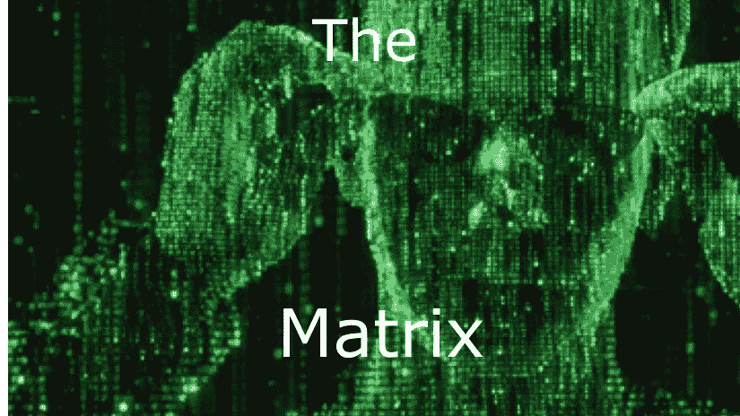

[图— 1](https://cdn1us.denofgeek.com/sites/denofgeekus/files/styles/main_wide/public/matrix_2.jpg?itok=p-5QXQxj)

在过去的几个月里，我正在学习机器学习(ML ),我认为需要一些基础数学来理解 ML 的概念，然后你就可以开始了。在这个博客中，我将讨论矩阵，我会试着涵盖 ML 所需的大部分主题。在接下来的几天里，我会写几篇关于**线性代数**和**微积分**的博客

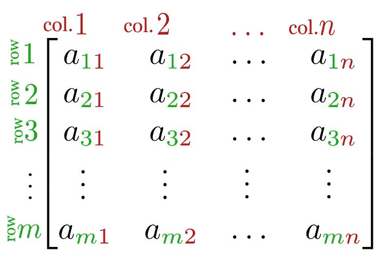

[图— 2](https://upload.wikimedia.org/wikipedia/commons/b/bf/Matris.png)

# **简介**

矩阵是数字的矩形阵列。上述矩阵有 ***m*** 行和 ***n*** 列。这个矩阵的每个元素可以用 **a_ *ij*** 来表示，其中 ***i*** = 1，2，3，…。m 和 ***j*** = 1，2，3，…n .我们可以说上面的矩阵有一个**阶 *(m×n)。*** 如果一个矩阵只有一列，则称之为**列向量**，如果只有一行，则称之为**行向量。**因此，列向量的顺序将是***【m×1】***，行向量的顺序将是***【1×n】****。*

# 特殊类型的矩阵

## **相等矩阵**

两个矩阵 **A** 和 **B** 如果两个矩阵的阶相同且对应的元素相等，则可以称为**等矩阵**。例如设**A =【A _ ij】，B =【B _ ij】**两个矩阵的阶是***(m×n)******A _ ij = B _ ij；*∀一世，j .**

## **零矩阵**

所有元素都是零的矩阵叫做零矩阵。

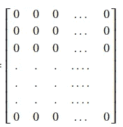

图 3(零矩阵)

## **方阵**

行数和列数相等的矩阵称为方阵。在一般情况下，方阵的阶只由一个数来表示，而不是两个数，例如设***A*=【A _ ij】**是一个方阵，这个矩阵在 ***n*** 上有一个阶，这意味着 ***(n×n)*** *的阶。* ***a_11，a_22，a_33* …。**称为矩阵的**对角元素**(即所有元素 ***a_ij*** 其中 ***i = j*** 都是矩阵的对角元素)。这些元素也称为主对角线元素。但我只称它们为对角线元素。

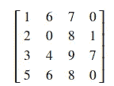

图— 4(正方形矩阵)

*   **对角矩阵:**除对角元素外所有元素为零的矩阵。这样的矩阵称为对角矩阵。如 If***a _ ij = 0***for***I≠j***。

> **注**:一个矩阵要成为对角矩阵，其对角元素中至少要有一个非零元素，非对角元素必须为零。

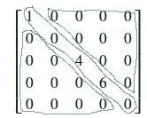

图 5(对角矩阵)

*   **单位矩阵:**所有对角元素都为 1 的矩阵称为单位矩阵即***A _ ij = 1******其中******I = j******和******A _ ij = 0******其中***

*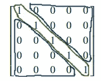*

*图 6(单位矩阵)*

***三角矩阵:**上三角或下三角矩阵的矩阵称为三角矩阵。*

*   ***上三角矩阵:**对角线元素以下所有元素都为零的矩阵(即***A _ ij = 0 for I>j***)。*

*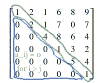**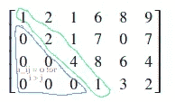**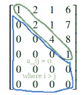

图 7(上三角矩阵)* 

*   ***下三角矩阵:**对角线元素以下所有元素都为零的矩阵(即***A _ ij = 0 for I<j***)。*

*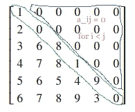**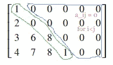**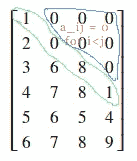

图 8(下三角矩阵)* 

# *矩阵运算*

## ***矩阵的转置***

*当矩阵的所有元素都是实数时，矩阵的转置被定义。设***A =【A _ ij】***是一个矩阵那么这个矩阵的转置将是***B =【B _ ij】***其中***B _ ij = A _ Ji；*∀一世，j .***

*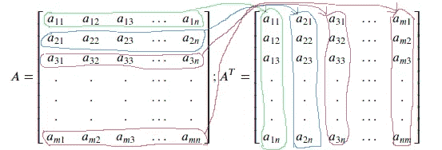*

*图 9(矩阵的转置)*

## ***矩阵的加法***

*只有当矩阵具有相同的顺序时，它们才可以相加。设***A =【A _ ij】***和**B =【B _ ij】**是两个矩阵，如果我们要这两个矩阵那么这两个矩阵必须有相同的阶并且它们的加法将是**C = A+B =【C _ ij】**其中**C _ ij = A _ ij+B _ ij； *∀一世*j .***

*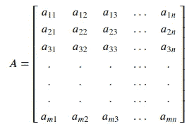**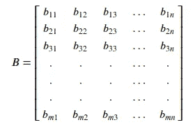**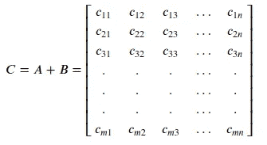

图— 10(同阶的两个矩阵 ***A 和 B**** *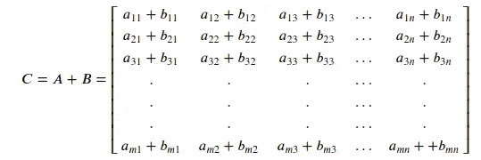*

*图 11(上述两个矩阵(A 和 B)的添加)*

## ***将标量乘以矩阵***

*矩阵的标量乘法是将每个元素乘以标量。如果***A =【A _ ij】***是矩阵那么***k * A =【k * A _ ij】***； ***∀一世****

*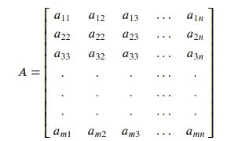**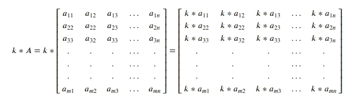

图 12(标量乘矩阵)* 

# *矩阵乘法*

*设***A =【A _ ij】***和***B =【B _ ij】***为两个矩阵。两个矩阵相乘用 ***AB*** 表示，它也是一个矩阵***C =【C _ ij】***。*

> ***注:**只有当且仅当**A 中的列数= B 中的行数**时，A 和 B 的乘法才是可能的*

*如果矩阵 A 的顺序是 ***(m×n)*** ，那么矩阵 B 的顺序将是 ***(n×r)*** *。* 这里 m 和 r 可以是任意正整数。矩阵 ***C*** 的顺序会是 ***(m×r)*** 。*

*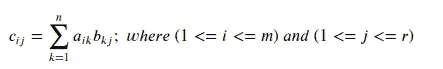**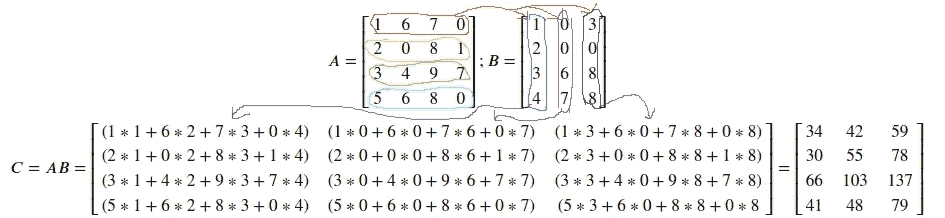*

*图 13(矩阵乘法)*

# *矩阵的逆*

*一个方阵 ***A*** 会有逆如果存在一个矩阵 ***B*** 使得 ***AB = BA = I*** (其中 ***I*** 表示单位矩阵)。这里的 ***B*** 被称为 ***的逆 A*** 。A、***B、***I、*矩阵的顺序相同。但是矩阵的逆矩阵(如果存在的话)是唯一的。所以我们可以写:**

**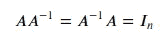**

> **设 A 和 B 是可逆矩阵**

**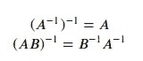**

# **一些更特殊的矩阵**

**设 A 是一个方阵，每个元素为实数。**

## **对称矩阵**

**如果 A 的转置等于 A，则 A 是对称矩阵。**

**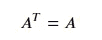**

## **反对称矩阵**

**如果 A 的转置等于-A，则 A 是反对称矩阵。**

**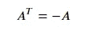**

## **正交矩阵**

**如果一个 的 ***转置和一个****的相乘等于一个**转置和一个***【I】***的相乘。***

**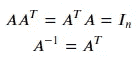**

> **正交矩阵的转置是正交矩阵的逆矩阵。即，如果 A 是正交矩阵，则 A 的转置等于 A 的逆矩阵。**

# **结论**

**在这个博客中，矩阵的基础已经讨论过了。这里讨论的概念对于理解与矩阵相关的其他主题非常重要，如特征值、特征向量等。欲了解更多矩阵请阅读 [***本博客***](/analytics-vidhya/mathematics-for-machine-learning-4bbbfa0904f4) 也。**

## **参考**

*   **由 Svjo —自己的工作，CC BY-SA 4.0，[https://commons.wikimedia.org/w/index.php?curid=79728977](https://commons.wikimedia.org/w/index.php?curid=79728977)**
*   **[http://home . iitk . AC . in/~ arlal/book/NP tel/pdf/book linear . html](http://home.iitk.ac.in/~arlal/book/nptel/pdf/booklinear.html)**
*   **[https://cdn 1 us . denofgeek . com/sites/denofgeekus/files/styles/main _ wide/public/matrix _ 2 . jpg？itok=p-5QXQxj](https://cdn1us.denofgeek.com/sites/denofgeekus/files/styles/main_wide/public/matrix_2.jpg?itok=p-5QXQxj)**