# 主成分分析的数学

> 原文：<https://medium.com/analytics-vidhya/mathematics-of-principal-component-analysis-f877ec0c11d2?source=collection_archive---------11----------------------->

安托万·道特里在 [Unsplash](https://unsplash.com?utm_source=medium&utm_medium=referral) 上拍摄的照片

# 一.导言

先说一个基本问题——什么是代数？

在小学时，我们学过加法、减法、乘法等。我们称之为算术。基本上，对数字的运算或处理叫做算术。当这些运算或操作涉及抽象符号(如字母、希腊符号)时，它们被称为代数。

代数的使用可以追溯到公元前 1600 年的巴比伦人和埃及人，如果我们认为抽象符号进入简单算术的原因一定是由于过度的贸易和商品交易。

然后是几何学和希腊人，形成了毕达哥拉斯定理，从而拓宽了代数。

现在有许多数学领域以代数命名，如初等代数、抽象代数、线性代数等。这里我们讨论的主题是线性代数。

# 一.线性代数

线性代数是对线性方程或组合的研究，涉及一组称为矩阵的数字或符号。在现代数学中，线性代数是对线性方程和向量空间的研究(只不过是对矩阵的更广泛的看法)。

向量空间被定义为集合 V，在集合 V 上有两个运算，一个是加法，另一个是标量乘法，使得以下性质成立:

1.€ V

2.(x+y)+z = x+(y+z) x，y，z€ V

3.存在一个元素 0€V，使得 x+0 =x，对于每个 x€V

4.对于每个 x€V，存在-x€V，所以 x+(-x)=0

5.λ(x+y) = λx+λy，对于所有的 x，y€V 和λ是标量

6.(λ+ )x = λx+ x 对于所有的 x€V 和标量，λ

7.(λ )x = λ( x)对于所有的 x€V 和标量，λ

8.1x = x)适用于所有 x€V

v 是实向量空间，当标量属于实数时，是复向量空间，当标量属于复空间时。

利用上述性质，我们可以很好地证明一组(m×n)矩阵是一个向量空间。

# 1 —矩阵和矩阵上的代数

矩阵及其代数是专业人员日常活动的一部分。我们使用数组进行各种操作，例如解线性方程组，使用 PCA 优化和降低维数等。

大多数情况下，软件不费吹灰之力就解决了我们的需求，有时我们对此缺乏基本的理解。本文试图给出 PCA 背后的线性代数的基本理解。

首先，什么是矩阵？

m×n 矩阵是 m 行 n 列的数组。一个 3×2 矩阵可以表示为

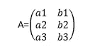

# 1.1-矩阵的类型

## 1 . 1 . 1-正方形矩阵

列数等于行数的矩阵称为方阵。

## 1 . 1 . 2-零矩阵

所有元素为零的矩阵称为零矩阵。例如

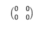

## 1.1.3 —单位矩阵

所有对角元素都是 1，其余元素都是 0 的方阵称为单位矩阵。用 I 表示的单位矩阵 id。

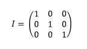

## 1 . 1 . 4-对角矩阵

对角矩阵是方阵或矩形矩阵，对角元素不为零，其余元素为零。下面给出了一个 3×3 对角矩阵

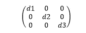

## 1.1.5 —三角形矩阵

上三角矩阵或下三角矩阵是对角线上方或下方分别具有非零元素的方阵。

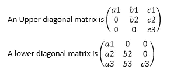

# 1.2-矩阵的添加

矩阵只有在维数相同时才能相加，2×2 矩阵的加法如下:

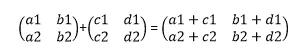

# 1.3-矩阵乘法

矩阵乘以标量也称为点积，如下所示:

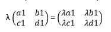

两个矩阵的矩阵乘法要求第一个矩阵的列数等于第二个矩阵的行数。

m×n 矩阵乘以 n×k 矩阵产生 m×k 矩阵。一个 3×2 矩阵和一个 2×3 矩阵相乘产生一个 3×3 矩阵，如下所示:

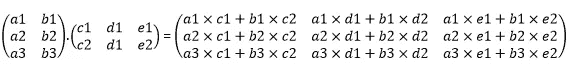

单位矩阵 I 和相同维数的矩阵 A 的乘积返回矩阵 A。

A×I = A = I×A

# 1.4 —矩阵的转置

当我们交换矩阵的行和列时，得到的矩阵称为 A 的转置，用 AT 表示。

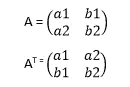

如果方阵 A 具有 AT = A 的性质，则称 A 为对称矩阵。并且如果方阵 A 具有 AT =-A 的性质，那么 A 被称为**斜对称**矩阵

如果 AT = AT A = I，则方阵 A 称为**正交矩阵**

# 1.5 —矩阵的行列式

任何大型矩阵都很容易理解，如果它可以被理解为其列的线性组合，或者换句话说，它可以被视为矩阵分解。

矩阵的行列式是矩阵分解的第一步，这个函数有助于将 n×n 矩阵看作其列的线性组合。

数学上，行列式被定义为将 n×n 矩阵映射到满足以下性质的标量的函数

1.如果一个行列式(Det)的任意 2 行或 2 列互换，则该行列式改变符号。

2.单位矩阵的行列式为 1。

3.如果一个行列式的一行或一列的每个元素都乘以一个常数 k，那么它的值就会乘以 k。

4.如果一个行列式的一行或一列的元素表示为两个或两个以上元素的和，那么这个行列式就可以表示为两个或两个以上行列式的和。

2×2 矩阵的行列式为

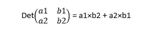

3×3 矩阵的行列式可由下式给出

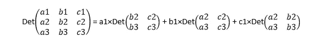

一个 n×n 方阵 A 是**可逆的**，如果存在一个 n×n 矩阵 B 使得，A.B = I = B.A .这个矩阵 B 称为 A 的逆，用 A-1 表示。

求一个 2x2 矩阵的逆矩阵:把 a1 和 b2 的位置对调，把负数放在 b1 和 a2 前面，把所有的东西除以行列式(a1b2-a2b1) ≠0。

# 2 —特征值和特征向量

特征值即特征向量是主成分分析的关键，帮助我们理解降维。让我们来看看定义:

n×n 矩阵 A 的特征值是一个标量λ，对于这个标量λ，存在一个非零的 n×1 矩阵使得 Ax = λx，列矩阵 x 称为与λ相关的特征向量。标量是 A 的特征值当且仅当 det(A-λIn)= 0。

从上面的定义中，我们可以看到，一个 n×n 矩阵分解成它的特征值和特征向量并没有丢失重要的信息。

# 3 —主成分分析(线性)PCA

主成分分析通过从数据中提取有用的信息并形成称为主成分(PCs)的新变量来降低多变量数据的维度，这解释了数据的大多数变化。当数据在变量之间具有高度相关性时，这种方法特别有用。主成分来自数据中原始变量的线性组合。PC 的数量可能小于或等于原始数据中变量的数量。

设 A 为 m×n 矩阵，需要用主成分分析法降维。(由于一个多元数据由不同的尺度组成，建议对矩阵进行标准化。)，我们按照下面的步骤得到 x 的新主成分。

1.计算协方差矩阵 C = AAT-A 的协方差矩阵是一个 n×n 矩阵，由作为矩阵对角元素的变量中的方差和作为非对角元素的变量之间的协方差组成。由于 PCA 的目标是解释数据的最大方差，因此创建协方差矩阵正好满足了这一目标。

2.协方差矩阵 C 上的特征分解——如第 IV 节中所定义的，该协方差矩阵现在可以分解成它的特征值和特征向量

C=λX，

其中λ由特征值组成，X 是特征向量矩阵。X 是一个 n×n 矩阵，X 的列称为主分量或载荷。并且矩阵 X 的列按照它们相应的特征值排序。

3.如何降维？—从特征向量矩阵 X 中，我们可以选择能够解释最大方差(r

4.投影矩阵的创建 P = AY——投影矩阵表示原始矩阵到较小维度的投影。p 是 m×r 矩阵

我们现在可以研究使用虹膜数据执行 PCA。

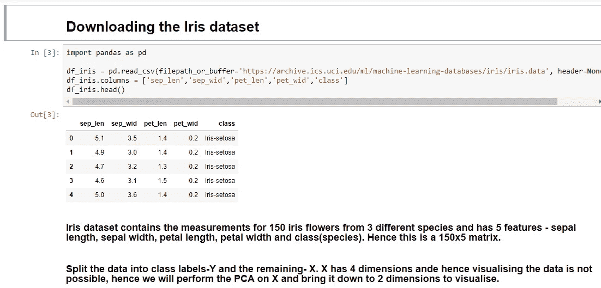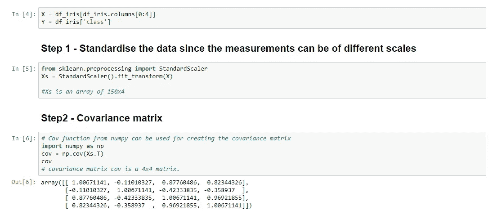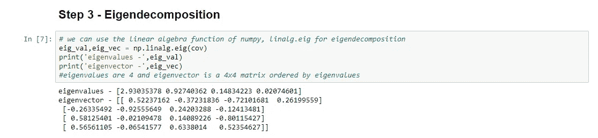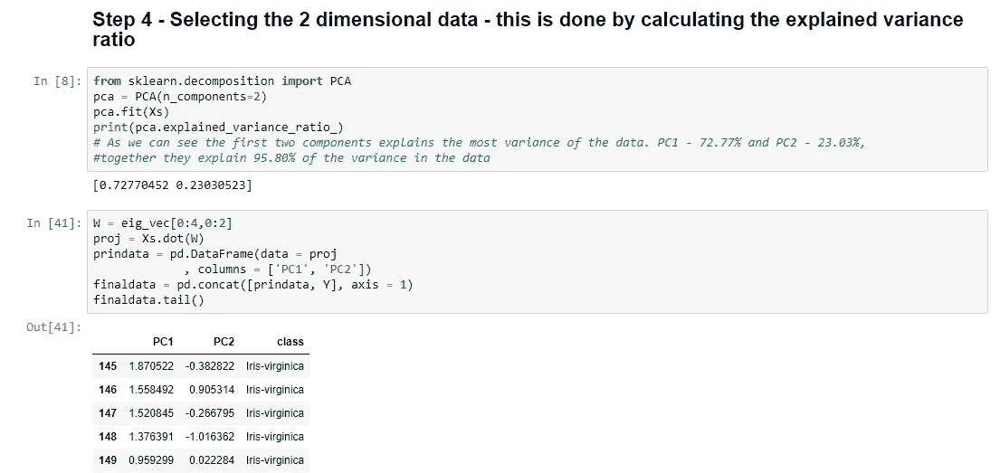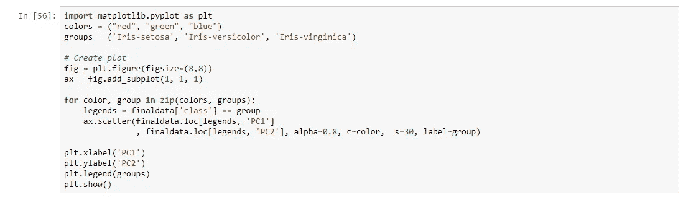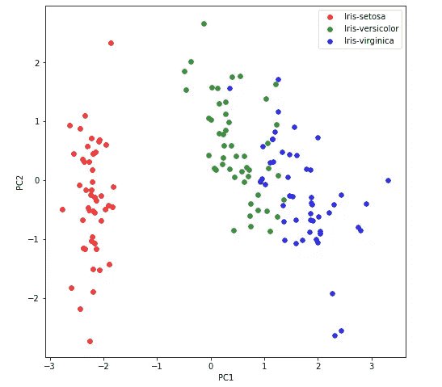

现在我们可以看到多维数据是如何变成二维的，并且可以被可视化。这就是主成分分析的力量

请在下面我的 github 库中找到 python 代码

 [## bijular/数据科学

### 此时您不能执行该操作。您已使用另一个标签页或窗口登录。您已在另一个选项卡中注销，或者…

github.com](https://github.com/bijular/datascience/blob/master/PCA.ipynb)