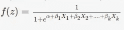
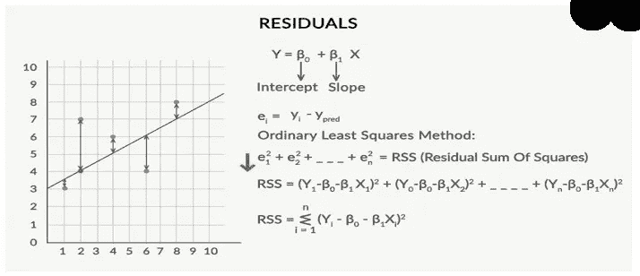
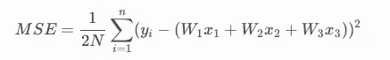
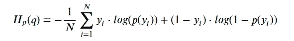

# 数学和数学和…

> 原文：<https://medium.com/analytics-vidhya/maths-and-maths-and-27802d170a9b?source=collection_archive---------19----------------------->

现在，通过我以前的文章，你非常了解我的愿望:)正如我所承诺的，我会回来帮助有类似愿望的人。

不要认为我的标题不完整，因为在机器学习的旅程中，数学传奇永远不会结束。:)

如果您以前没有安装过，请访问下面的链接，这样我们就能在同一页上了:)。

[https://medium . com/@ nirmal . maheshwari/a-common-aspirating-data-scientist-93 DCA 12d 2298](/@nirmal.maheshwari/a-common-aspiring-data-scientist-93dca12d2298)

让我们深入研究线性和逻辑回归模型的**数学**，如果你在学生时代不熟悉或不喜欢数学，这将是任何模型中最重要和最难理解的部分。舒服地坐好，因为这将会是一篇很长的阅读。

# **数学方程式**

## 线性回归

Y = β0+β1X1+β2X2+…+βnXn

这个模型的意义在于，人们可以很容易地解释和理解边际变化及其后果。例如，如果 xi 的值增加 1 个单位，保持其他变量不变，y 值的总增量将为βi。从数学上讲，截距项(0)是所有预测项设置为零或不考虑时的响应。

## **逻辑回归**

这里使用的函数是 Sigmoid 函数。

逻辑回归是一个概率分类器，Sigmoid 函数返回我们试图预测的类的概率，这也称为逻辑函数。

逻辑函数

不要担心，我们将在一段时间内以更易于解释的形式带来上面的等式。

# **最佳拟合线**

通过最小化 RSS(残差平方和)的表达式找到最佳拟合线，RSS 等于图中每个数据点的残差平方和。从因变量的实际值中减去因变量的预测值，即可得到任何数据点的残差:

残差

# 最佳拟合 s 形曲线

现在，似然函数的概念出现在寻找最佳查找曲线的画面中。这里最适合的是当我们试图最大化点的概率的乘法时。

让我们考虑一个例子，我们需要发现一个人是否有糖尿病。所以让 P1、P2、P3、P4、P6 的人没有糖尿病，P5、P7、P8、P9、P10 有糖尿病。

下面是上面例子的似然函数

(1 P1)(1 P2)(1 P3)(1 P4)(1 P6)(P5)(P7)(P8)(P9)(P10)

因此，它是概率的乘积，取决于人的类别，对于非糖尿病人来说，可能性是 1-P，对于糖尿病人来说，可能性是 P，因此，为了找到最佳曲线，我们试图最大化这个可能性函数。这也被称为最大似然估计( **MLE** )

MLE 选择那些使似然函数最大化的未知参数组(估计量)。寻找最大似然估计的方法是使用微积分，将逻辑函数对未知参数的导数设置为零，求解它将得到最大似然估计。对于二项式模型，这很容易，但是对于逻辑模型，计算就复杂了。计算机程序用于推导逻辑模型的最大似然估计。
(这是回答这个问题的另一种方法。)
MLE 是一种估计数学模型参数的统计方法。如果因变量假设为正态分布，MLE 和普通平方估计对于线性回归给出相同的结果。最大似然法没有对独立变量做任何假设。

# 赔率和**对数赔率**

虽然上面我们已经为逻辑回归定义了方程，但是，这不是很直观。换句话说，P 和 x 的关系如此复杂，以至于很难理解两者之间存在什么样的趋势。如果你以固定的间隔增加 x，比如说 11.5，那会如何影响概率？会不会也按某个规律的间隔增加？如果没有，会怎么样？

所以我们提出了一个新的方程，它是从 sigmoid 曲线方程推导出来的。

Logistic 模型= α+β1X1+β2X2+…。+βkXk

上述模型给出的结果为 logits，也称为对数概率。

赔率通常被定义为事件发生的概率与事件不发生的概率之比，当我们对等式两边取对数时，它就变成了对数赔率。

Alpha 是逻辑回归模型中的基线。它是当所有属性(X1，X2，…，…)都满足时实例的对数概率。Xk)是零。在实际场景中，所有属性为零的概率非常低。在另一种解释中，α是当不考虑任何属性时实例的对数概率。

β是在保持所有其他属性固定或不变(控制变量)的情况下，特定属性单位变化的对数优势变化值。这就是我们如何解释逻辑回归模型的结果。

# **成本函数**

## **线性回归**

均方误差被用作线性回归的成本函数。我们使用梯度下降来最小化成本函数，但我们将在优化部分讨论。

多元线性回归成本函数

## **逻辑回归**

在逻辑回归中，我们使用 sigmoid 函数并执行非线性转换来获得概率。平方这个非线性变换将导致具有局部最小值的非凸性。在这种情况下，使用梯度下降找到全局最小值是不可能的。由于这个原因，MSE 不适合逻辑回归。交叉熵或对数损失用作逻辑回归的成本函数。在逻辑回归的成本函数中，有把握的错误预测会受到严重惩罚。自信的正确预测得到的回报更少。通过优化这个成本函数，实现了收敛。

对数损失/二元交叉熵

其中 **y** 为**标号** ( **1** **糖尿病患者**和 **0** **为** **非糖尿病患者**),**p(y)**为所有 **N** 点的预测**为糖尿病的概率**。

看这个公式，它告诉你，每增加一个**绿色**点( *y=1* ，它就把 *log(p(y))* 加到损失上，也就是 **log 患糖尿病的概率**。反之，它加上 *log(1-p(y))* ，即**非糖尿病概率的对数** ( *y=0* )

# 在逻辑回归模型的情况下，决策边界是线性的还是非线性的？

决策边界是一条将目标变量分成不同类别的线。决策边界可以是线性的，也可以是非线性的。在逻辑回归模型的情况下，决策边界是一条直线。

Logistic 回归模型公式= α+1X1+2X2+…。+kXk。这清楚地代表了一条直线。逻辑回归只适用于直线能够区分不同类别的情况。如果直线不能做到这一点，那么非线性算法应该用来达到更好的效果。

# **一个线性回归的残差之和接近什么值？证明。**

线性回归的残差之和为 0。线性回归假设误差(残差)正态分布，平均值为 0，即

Y=βX+ε

这里，Y 是目标或因变量，是回归系数的向量，

x 是包含作为列的所有特征的特征矩阵，

ε是剩余项，使得ε∞N(0，σ2)。

因此，所有残差的总和就是残差的期望值乘以数据点的总数。因为残差的期望值是 0，所以所有残差项的和是 0。

**注** : N(0，σ2)是具有均值μ和标准差σ2 的正态分布的标准符号。

在这两个模型中仍然有很多东西，不要着急，但我们肯定会在用 Python 或 R 创建模型的过程中，或者在验证/解释或优化过程中，研究 p 值、VIF、AIC、BIC、Rsquare 等东西。

在那之前，请不要挂断，并在评论区给你的意见，以便我改进一些东西，或者如果你想让我在问题中包括一些东西。

不要忘记，这必须是一个有抱负的数据科学家的准备问题库。:)