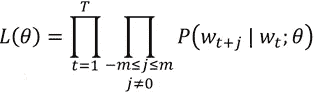

# Word2Vec 的数学优先解释

> 原文：<https://medium.com/analytics-vidhya/maths-behind-word2vec-explained-38d74f32726b?source=collection_archive---------0----------------------->

**演职员表**:https://thegradient.pub/nlp-imagenet/

# **简介**

> Word2Vec 已经成为自然语言处理中各种 ask 的垫脚石。

当我开始学习 Word2Vec 算法时，我发现很多资源只关注实现，而没有涉及太多细节。

然而，当解决一个现实世界的项目时，理解底层算法和它所基于的数学假设以及实现代码是有帮助的，这就是我们将在这个博客中讨论的。

在这篇博客中，我们将以数学为先深入 Word2Vec，揭开这个美丽算法内部工作的一些最复杂的细节。

**注:**本博客受到了 [**这门**](http://web.stanford.edu/class/cs224n/) 令人惊叹的斯坦福 NLP 课程的高度激励。

# **什么是 Word2Vec？**

在深入 Word2Vec 算法之前，我们首先需要了解什么是单词嵌入，为什么它很重要？

> 单词嵌入是一种将一段文本转换成我们的机器可以阅读的数字格式的方法。

在 Word2Vec 出现之前，有几种算法用于以数字的形式表示文本。最常见的算法之一是计数矢量器，它为我们提供了文本的本地化表示。让我们考虑下面的例子:

假设我们的词汇表中有 5 个单词，我们想用一个向量来表示“快乐”和“愉快的”。这将是计数矢量器的输出:

在上表中，如果一个单词出现在文本中，我们将得到 1，否则值将为零。我们也可以对整个句子这样做，方法是输入特定文档中单词的计数，并将 rest 保持为零。但是这种方法有两个问题。

首先，虽然 happy 和欢快是相似的，但是这两个向量之间没有相似性的概念，因为它们是正交向量。

第二，当我们有一个大型语料库时，这些向量在本质上非常稀疏，当我们的词汇中有数百万个单词时，这些向量变得非常低效。有一些改进的算法，如 TF-IDF，但它仍然面临上述两个问题。

> Word2Vec 算法解决了这些缺点。它基于分布语义学的思想，这意味着我们可以通过理解一个单词的同伴(上下文)来理解一个单词的意思。

因此，为了学习单词的表示，我们将尝试学习特定单词出现的上下文，并希望这个单词的向量与上下文单词的向量相似。这将是一个分布式的表示，因为现在，这个词的意义分布在所有的维度上。这将解决我们上面讨论的两个问题。

现在的问题是我们如何做到这一点？

## **跳格算法**

该算法背后的主要思想是，首先，我们将为词汇表中的每个单词随机初始化向量。

之后，我们将遍历每个位置 ***t*** ，我们将该位置的中心词定义为 ***c*** ，其上下文词定义为 ***o*** 。为了识别上下文单词，我们将定义一个大小为 ***m*** 的窗口，这意味着我们的模型将把位置 ***t-m 到 t+m*** 的单词视为上下文。

学分:[斯坦福 CS224N](http://web.stanford.edu/class/cs224n/)

一旦我们在位置 t 有了所有的上下文单词，我们将尝试最大化给定中心单词的上下文单词的可能性，即，我们将计算给定中心单词的我们的模型预测上下文单词的概率，并且我们将尝试最大化该概率。这种可能性可以用以下公式表示:

为了使这个方程的形式易于求导，并使之成为一个最小化问题，我们将只取方程的对数，并乘以-1 来计算-ve 对数似然。

注意，现在乘法将变成求和，因为我们已经取了对数。

现在的问题是，给定中心词，我们如何计算上下文词的概率？

为此，我们将用两组向量来表示每个单词， ***Uw*** 和 ***Vw*** 。当 **w** 是上下文词时，我们将使用 ***Uw*** ，当 **w** 是中心词时，我们将使用 ***Vw*** 。使用这两个向量，我们的中心词 **o** 和上下文词 **c** 的概率方程将如下所示:

正如我们所看到的，这是 softmax 函数的一个例子。在分子中，我们有单词 **o** 和 **c** 的点积，它捕捉了这两个向量之间的相似性。相似度越高，概率就越高。分母为我们提供了一种方法来归一化整个词汇表中的概率值，使其总和为 1。

现在我们已经有了损失函数，接下来是训练模型的部分。如果我们看看上面的似然方程，我们可以看到方程θ中只有一个模型参数。这是一个长向量，包含所有单词的长度为 ***d*** 的 **v** 和 **u** 向量。

我们将使用梯度下降算法下山，并慢慢地改变所有的权重，以最大化我们的可能性。我们将通过对我们的损失函数相对于 U 和 v 求导来获得我们必须移动以改变权重的方向。如果您不熟悉链规则和梯度下降算法，请分别参考 [**此**](https://www.kdnuggets.com/2017/04/simple-understand-gradient-descent-algorithm.html) 和 [**此**](/@14prakash/back-propagation-is-very-simple-who-made-it-complicated-97b794c97e5c) 链接。

先说***J(θ)***w . r . t***Vc:***的导数

由于 ***J(θ)*** 是一个比值，取对数就要取上面带负号的分母。所以，我们可以这样表示我们的导数:

让我们把方程分成两部分，分别求解。

对于第一部分，由于 log(exp(x)等于 x，我们可以将其写成:

如果不清楚它是如何变成 ***Uo*** 的，试着按元素求导。如果我们对 w.r.t ***Vc1*** 求导，结果将是 ***Uo1*** ，因为只有这一项才会有 ***Vc1*** 。对所有元素都这样做，我们会得到一个向量 ***Uo1*** 到 ***Uon*** 相当于 ***Uo。***

现在让我们进入等式的第二部分。对 log(x)求导，并在总和内移动导数，我们将得到这一项:

对 exp(x)项求导，并重新排列求和符号，将得到该项:

如果我们仔细观察上面的项，可以发现求和中的项与我们上面定义的概率项相同，因此可以写成:

综合起来，我们可以写出:

这个等式有一点非常有趣。第一部分是上下文单词的当前表示。

第二部分是根据我们的模型对上下文单词应该看起来像什么的预期，因为我们采用所有上下文单词的当前表示，并将它们与它们在当前模型中的概率相乘。

所以基本上，我们减去实际的和预期的表示，得到我应该移动的方向，改变我的权重向量 ***Vc*** ，这样我可以最大化可能性。

以同样的方式向前移动，我们还可以计算出**T5【J(θ)**wrt 对 ***Uw 的导数。*** 对于 ***Uw，*** 会有两种情况，一种是 w 是上下文词，一种是 w 不是上下文词。这将是两种情况下衍生产品的输出:

## W ≠ O:

## **W = O:**

一旦我们有了这两个导数，我们就可以在 SGD 方程中使用它们来更新权重。

然而，这种方法有一个问题。正如我们所见，在分母中，我们必须取所有单词点积的指数，当我们有大量词汇时，这是非常耗时的。我们将需要训练数百万的重量，这是不可行的。

所以，为了增加训练时间，一种叫做*的新方法被采用。在这种方法中，我们将在一个步骤中只更新一小部分权重。我们将选择几个单词，即不在上下文窗口中的单词，并且我们将以这样的方式改变我们的权重，即最大化真实上下文单词的概率，并且最小化出现在中心单词周围的随机单词的概率。这改变了损失函数，现在我们试图最大化下面的等式:*

**

*其中 K 是负样本的数量。*

*为了选择随机单词，我们使用一元分布，其中更频繁的单词更有可能被选择。*

*为了最大化上述项，我们再次需要对损失函数相对于权重进行求导，在这种情况下，它将是 ***Uw、Uk 和 Vc。*** 按照与上面类似的方式做这件事，我们会得到以下三个等式:*

**

*计算出所有导数后，现在我们可以一点一点地更新我们的权重向量，并获得一个向量表示，它将把出现在相似上下文中的单词指向相同的方向。*

*Word2Vec 算法还有各种更高级的变体，如斯坦福开发的**、脸书开发的[***fast text***](https://fasttext.cc/)*等。****

***我希望这篇文章能让您很好地理解 Word2Vec 模型是如何被训练的，以及到底发生了什么。在下一篇文章中，我们将使用 Word2Vec、主题建模和 TF-IDF 来识别相似的句子，并将比较每个模型的结果。***

***谢谢大家！！***