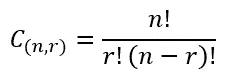
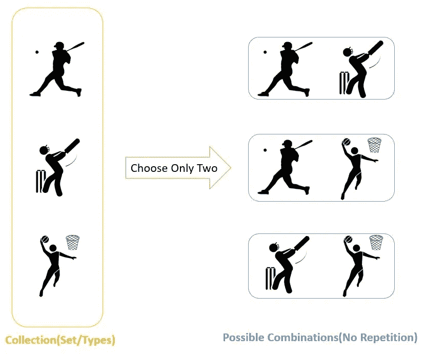
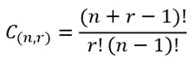
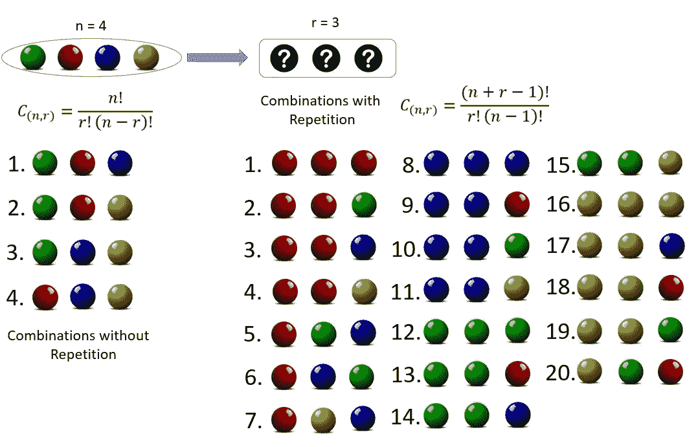
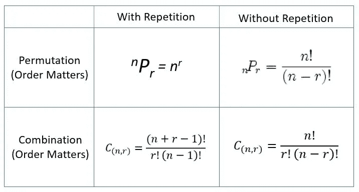

# 数据科学数学与统计第二部分:组合

> 原文：<https://medium.com/analytics-vidhya/maths-stats-for-data-science-part-ii-combinations-a324cfb6071d?source=collection_archive---------20----------------------->

在上一篇文章中，我们学习了[排列](/@adig16948/maths-stats-for-data-science-part-i-permutations-7573f4228e26)。今天我们将看到组合。

**组合**可以被视为过滤排列，它过滤掉所有的“重复的”，或“过多的项目”。

“我的水果沙拉是苹果、葡萄和香蕉的混合物”。
我们不在乎水果的顺序，它们也可以是“香蕉、葡萄和苹果”或“葡萄、苹果和香蕉”，
同样是水果沙拉。

考虑一下上一篇文章中的储物柜排列问题。
我们有由 4 位数字组成的储物柜密钥。储物柜可以通过排列这些数字来打开:[2，3，4，5]。我们有 24 个不同的组(排列)。但是一旦我们过滤掉过多的项目，组合只有一个:2345。

> 因此，我们可以将组合定义为元素的集合，其中的顺序无关紧要。
> 基于排列，我们通过划分‘r！’来过滤出相同的组合得到密码。

**我们有两类组合题:**
1。无重复/替换组合
2。结合重复/替换

**1。无重复/替换的组合**

没有重复的组合意味着以这样的方式选择元素/对象，即没有元素/对象可以被多次使用。

假设，我们有 50 名板球运动员，但我们只能选择 20 名参加英格兰巡回赛。在这里，顺序并不重要，显然，没有球员可以被选择多次。那么，有多少种方法可以选出 20 名板球运动员呢？

组合公式[无重复]

50C20 = 50！/ [20!* (50–20)!] = 47,129,212,243,960.
可以有 47，129，212，243，960 种不同的方式。

这里有一个更直观的例子来说明组合是如何工作的。假设你必须从三项活动中选择两项:板球、棒球和篮球。

因此，我们可以选择[棒球、板球]、[棒球、篮球]或[板球、篮球]。因此，可能的组合如下:
**3 C 2 = 3！/[2!x (1)！]= 3.**也就是说，可以通过 3 种不同的方式从 3 项活动中选择任意 2 项活动。

**2。与重复结合:**

在前面的例子中，没有相同的玩家或活动被重复选择。

****

这意味着每次从“n”个不同对象的集合中选取一个元素(“r”)后，都要将它放回该集合中。考虑一个彩色球的例子，你从袋子里拿出一个球，记住你抽到了哪个球，然后把它放回袋子里。因此，我们可以再次选择我们之前抽出的球。

重复组合

在下面的例子中，我们有四个球:绿色、红色、蓝色和黄色。我们必须从中选择三个。
为了说明“有重复的组合(CWR)”和“无重复的组合(CWoR)”之间的区别，让我们尝试下面的方法:
对于 CWoR:让我们挑选球，使得每个球可以被抽取一次。
对于 CWR:我们可以多次选择其中一个球。

因此，对于 CWoR: 3 个球可以用 4 种不同的方式选择
，对于 CWR: 3 个球可以用 20 种方式捡起。

我想，你现在已经清楚排列组合的概念了。

**现在，如何识别一个给定的问题是排列还是组合问题？**
很简单。只要记住遵循技巧。
1。排列用于列表(顺序问题)，组合用于组(顺序无关紧要)2。著名的笑话的区别是:“密码锁”应该真正被称为“排列锁”

为了帮助你们轻松记忆排列组合公式，我为你们准备了一个矩阵..

它将帮助您解决以下问题-

**让我们练习几个排列组合的例子:**

**问题 1 :** 用单词“德里”的 3 个字母可以组成多少个单词？
**解决方案:**“德里”这个词有 5 个不同的单词。
因此，所需字数= 5 P 3 = 5！/ (5–3)!
= >要求字数= 5！/ 2!= 120 / 2 = 60

**解法:**在这类题型中，我们假设所有元音都是单个字符，即“IE”是单个字符。
所以，现在我们的单词里一共有 5 个字符，分别是 D，R，V，R，IE。
但是，R 出现 2 次。
= >可能的排列数= 5！/ 2!= 60
现在两个元音可以排列成 2！= 2 种方式。元音总是在一起的可能单词总数= 60 x 2 = 120

**问题 3 :** 从给定的 15 个选项中，我们可以用多少种方法选出一个 4 人小组？
**解法:**可能的选择方式数= 15 C 4 = 15！/ [(4 !)x (11！)]
= >可能的选择方式数=(15 x 14 x 13 x 12)/(4 x 3 x 2 x 1)= 1365

**问题 4 :** 从 6 个成员中选出 3 个男孩，从 5 个成员中选出 2 个女孩，可以用多少种方式组成一个 5 人小组？
**解法:**6 中可选出 3 个男生的方式数= 6 C 3 = 6！/ [(3 !)x (3！)] = (6 x 5 x 4) / (3 x 2 x 1) = 20
可以从 5 中选出 2 个女生的方式数= 5 C 2 = 5！/ [(2 !)x (3！)] = (5 x 4) / (2 x 1) = 10
因此，组的方式总数= 20 x 10 = 200

**问题 5 :** 使用单词“DRIVER”中的字母，使得所有元音从不在一起，可以组成多少个单词？
**解法:**我们假设所有元音都是单个字符，即“IE”是单个字符。
所以，现在我们的单词里一共有 5 个字符，分别是 D，R，V，R，IE。
但是，R 出现 2 次。
= >可能排列数= 5！/ 2!= 60
现在两个元音可以排列成 2！= 2 种方式。
= >元音始终在一起的可能单词总数= 60 x 2 = 120
同样，可能单词总数= 6！/ 2!= 720 / 2 = 360
因此，元音从不在一起的可能单词总数= 360–120 = 240

**结论:**
我希望你能发现这些关于[排列](/@adig16948/maths-stats-for-data-science-part-i-permutations-7573f4228e26)和组合的帖子，对你下次从事排列和组合的工作，或者只是为数据科学面试做准备有用。
如果以上有什么不清楚的地方或者我做错了什么，欢迎留言评论。在计算概率时，排列和组合很有用。这就是我们接下来要去的地方。概率！