# Matplotlib 101

> 原文：<https://medium.com/analytics-vidhya/matplotlib-4aa9ee8804fb?source=collection_archive---------9----------------------->

*   [**Matplotlib**](https://matplotlib.org/contents.html) 是 Python 中一个惊人的可视化库，用于数组的 2D 绘图。
*   **matplotlib.pyplot** 是一个命令风格函数的集合，使 matplotlib 像 MATLAB 一样工作。
*   [*笔记本*](https://github.com/namratesh/Machine-Learning/blob/master/16_Dec_Matplotlib.ipynb) *可以在这里找到*

让我们从安装开始。

> **pip 安装 matplotlib**

## 导入 Matplotlib

**直方图:**使用不同高度的条形以图形方式显示数据

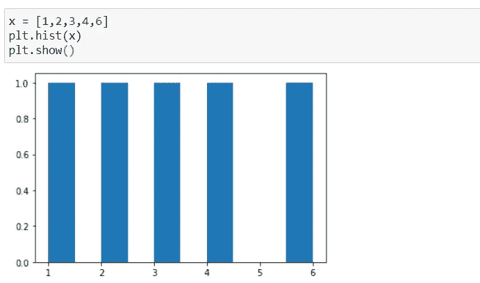

*   **plt.hist** 用于绘制直方图

**条形图:**使用不同高度的条形图显示数据的图形。

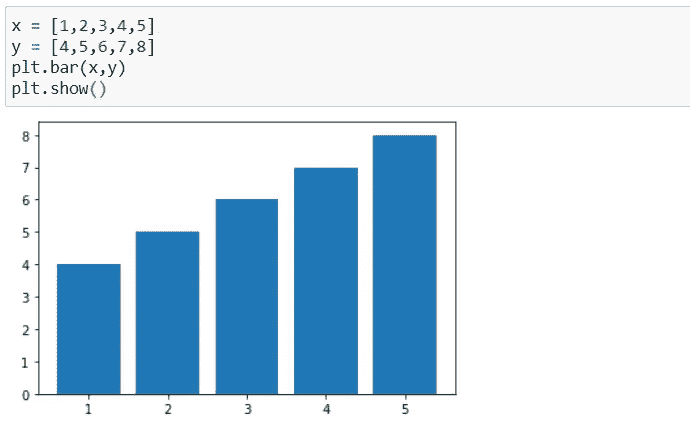

*   **plt.bar** 用于绘制条形图。

**散点图:**显示两组数据之间关系的点图

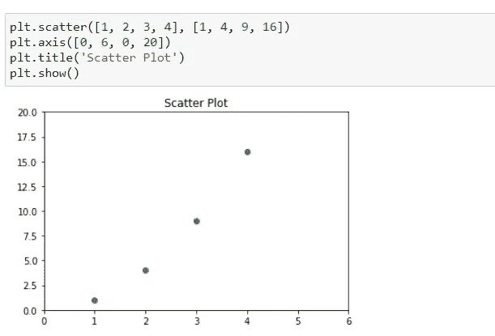

*   **散点图**用于绘制散点图
*   过去常常给我们的地块加标题

**线图:**显示沿着数字**线**的数据频率的图形

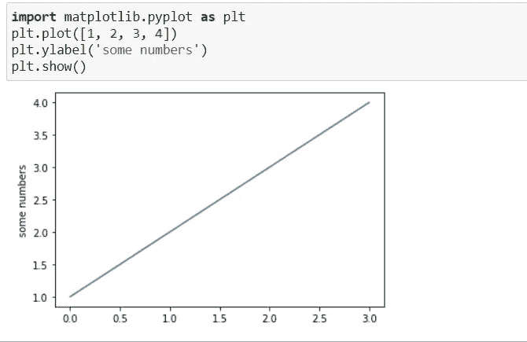

*   plt.plot([1，2，3，4)]，我们在这里传递值。
*   plt.ylabel 用于给出 y 轴上的水平
*   plt.show 用于显示绘图

**带第三个参数**

*   对于每个 x，y 参数对，都有一个可选的第三个参数，它是表示绘图颜色和线型的格式字符串。

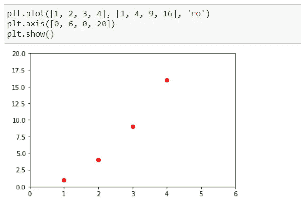

*   如果 matplotlib 只限于处理列表，那么它对于数字处理来说将毫无用处。通常，我们会使用 numpy 数组。事实上，所有序列都在内部转换成 numpy 数组。

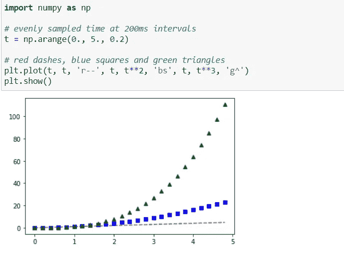

**控制线属性**

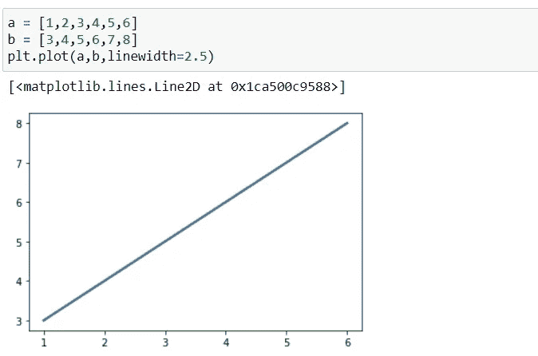

*   ***线宽*** 用于控制线条的宽度。

**饼状图:**一个饼状图(或称圆形图)是一个圆形的统计图形，它被分成若干个切片，以说明数字比例。

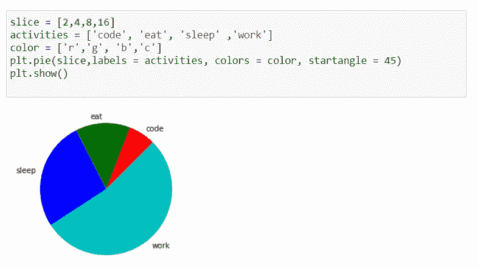

*   切片用于任务的百分比。
*   activities 用于提供活动名称。
*   在绘图中给颜色的颜色。
*   **plt.pie** 用于绘制饼图。

**子图**

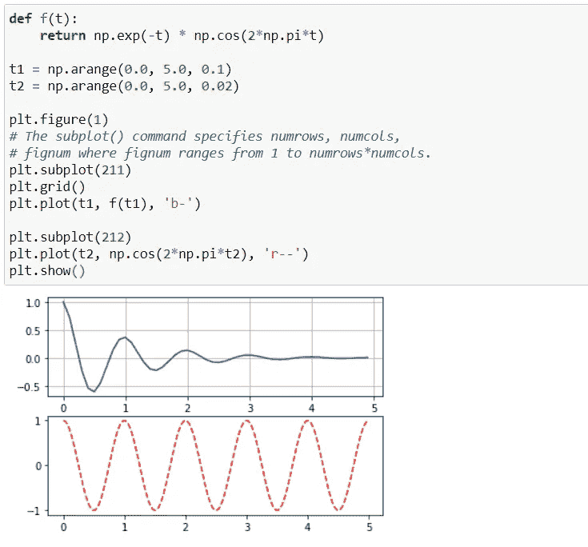

*   **plt.subplot** 创建子剧情

**使用文本**

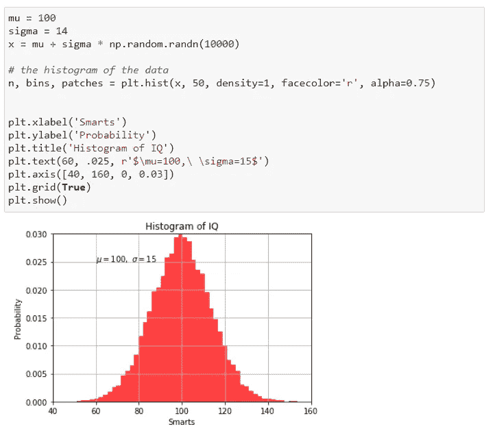

*   也可以使用分类变量创建一个图。Matplotlib 允许您将分类变量直接传递给许多绘图函数。

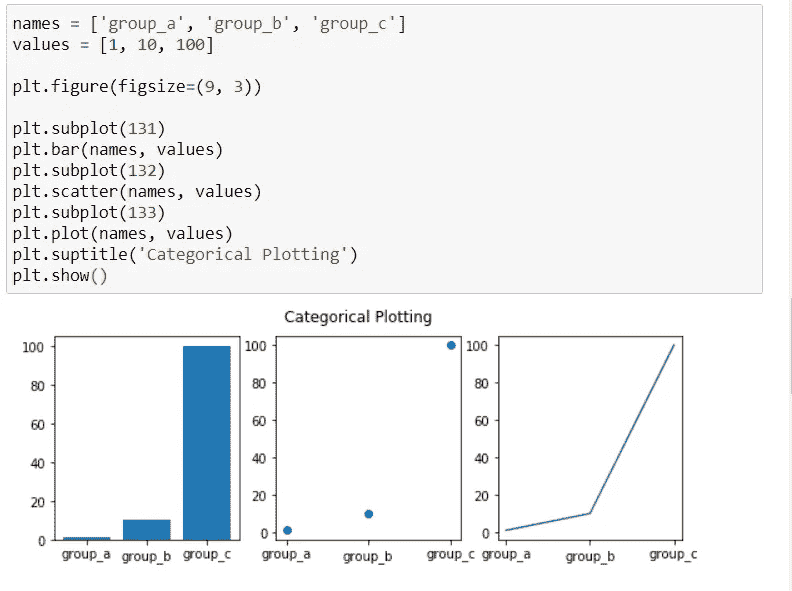

*   Matplotlib 允许我们提供这样一个带有数据关键字参数的对象。如果提供了，那么我们可以用对应于这些变量的字符串生成图。

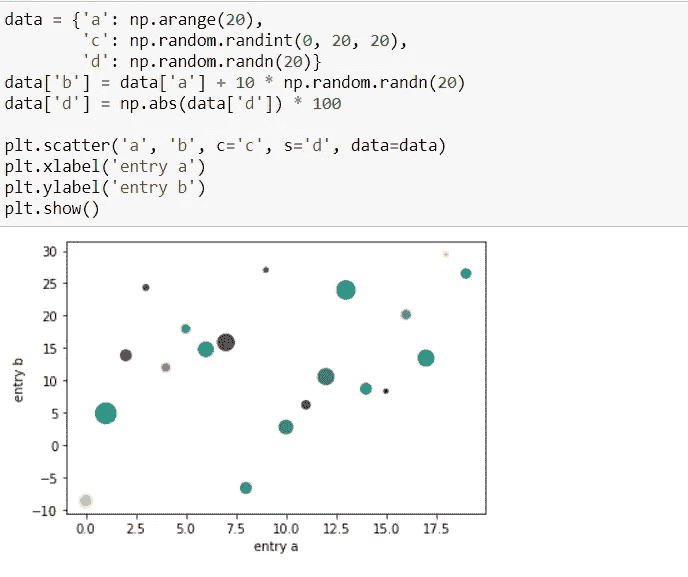

欢迎建议！！！