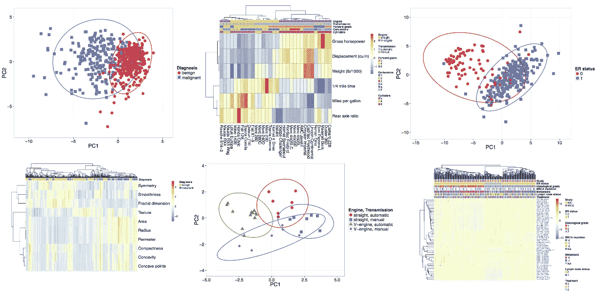
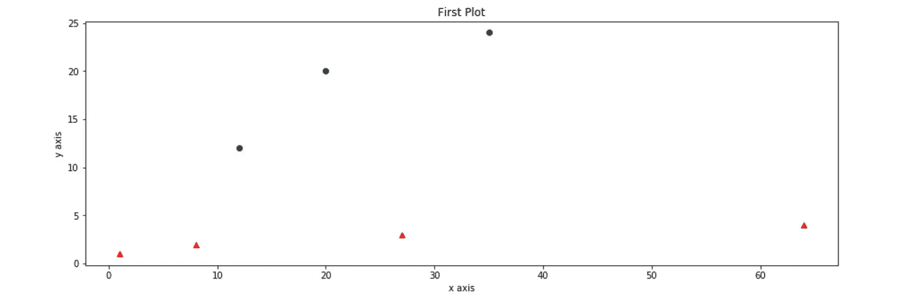

# Matplotlib 备忘单📊

> 原文：<https://medium.com/analytics-vidhya/matplotlib-cheat-sheet-1429dfea99bb?source=collection_archive---------3----------------------->

## 第一部分



随着时间的推移，你将能够轻松地创建这样的情节。

这是使用熊猫绘图库 Matplotlib 创建绘图的零到英雄备忘单。这不是一个包罗万象的小抄，但是一旦你看了两三遍，你应该对你的初学绘图能力相当有信心。

我们的第一个阴谋📉

```
**import pandas as pd
import matplotlib.pyplot as plt
import numpy as np**
```

让我们首先创建一个尽可能简单的情节。然后看看我们能做些什么修改。下面的图只是将 x 轴和 y 轴的三个输入作为任意数组，并绘制它们。注意每个图像下的代码指定了每个绘图是如何创建的。

如果你正在编写代码，一定要在代码末尾添加 *plt.show( )* 以便查看你的绘图。继续复制你在下面看到的。第一个括号包含 x 坐标，而第二个括号包含 y 坐标。


注意，我们的第一个代码块初始化了必要的库，而我们的第二个代码块创建了我们的 plot。

接下来，我们将为我们的图指定一个标题，以及 x 轴和 y 轴的标签。


我们也可以改变图表的大小。查看图片下方的附加代码，我们将把这些代码添加到现有的代码块中，或者对我们的代码进行任何修改，以改变我们的可视化效果。


plt.figure( figsize = ( 15，5))

之前利用 *plt.plot* 我们传入了两个参数。一个数组用于 x 坐标，另一个数组用于 y 坐标。请注意，我们绘制的点的默认颜色和外观是一条蓝线。我们可以传递第三个参数，允许我们改变线条的颜色和/或将线条变成点。**‘g’**为绿色**‘r’**为红色。**【go】**表示绿点**【ro】**表示红点。


plt.plot( [ 12，20，35 ]，[ 12，20，24 ]，' g' ) — — — —尝试两者————PLT . plot([ 12，20，35 ]，[12，20，24 ]，' r)


plt.plot( [ 12，20，35 ]，[ 12，20，24 ]，' yo' ) — — — —两个都试试————PLT . plot([ 12，20，35 ]，[12，20，24 ]，' go ')

通过在 *plot( )* 方法中传递多个参数，也可以在同一个图中绘制多组数据



**x = np.arange( 1，5)
y = x * * 3**
PLT . plot([ 12，20，35 ]，[12，20，24 ]，' go '， **y，x，'r^'** )

*np.arange* 返回给定区间内均匀分布的值。对于我们的图*，np.arange* 给了我们四个 x 值，然后设置 y 等于每个 x 值的立方值。

现在让我们在一个图形中创建多个图。这可以通过使用*子情节()*方法来完成。*子情节()*方法带三个参数 *nrows()* 、 *ncols()* 和 *index* 。这些参数指示子情节的行数、列数和索引号。让我们创建一个有两个并排支线剧情的图形。我们希望我们的身材看起来像下面的图像。


plt.figure( figsize = ( 15，5 ) )
plt.subplot( 1，2，1)—**1，2，1 表示 1 行 2 列位置 1**
plt.plot( [ 1，2，3，4 ]，[ 1，4，9，16 ]，' go' )
plt.title('第一个子 plot ')
PLT . subplt plot(1，2，2)—**1，1 1 表示 1 行 2 列位置 1**
plt.plot( x，y，'r^' )
plt.title('第二个子图' )
plt.suptitle('我的子图')

如果我们希望我们的图在一个垂直的行中，我们所要做的就是将 *plt.subplot ()* 参数改为(2，1，1)和(2，1，2)。2 行 1 列，位置 1 或位置 2。


创建两个支线剧情是相当容易的，但是当我们尝试创建更多支线剧情时，上面的方法就变得乏味了。为了克服这一点，我们可以使用 *plt.subplots( )* 方法。该方法创建两个对象(图形和轴)，并允许我们给它们分配任意变量名(图& ax)。然后，我们将变量分配给 subplot 方法，该方法指示行数、列数和图形大小。(这指定了我们想要创建多少个地块)。


x = np.arange( 1，5 )
y = x**3
fig，ax = plt.subplots( nrows = 2，ncols = 2，figsize = ( 6，6 ) )
ax[ 0，1 ]。剧情([ 1，2，3，4 ]，[ 1，4，9，16 ]，' go' )
ax[ 1，0 ]。plot( x，y，'r^' )
ax[ 0，1 ]。set_title( 'Squqres' )
ax[ 1，0 ]。set _ title(' Cubes ')
PLT . show()

在[第 2 部分](/@mulbahkallen/matplotlib-cheat-sheet-51716f26061a)中，我们将使用 pyplot 绘制不同类型的图。
条形图、饼状图、直方图等等。