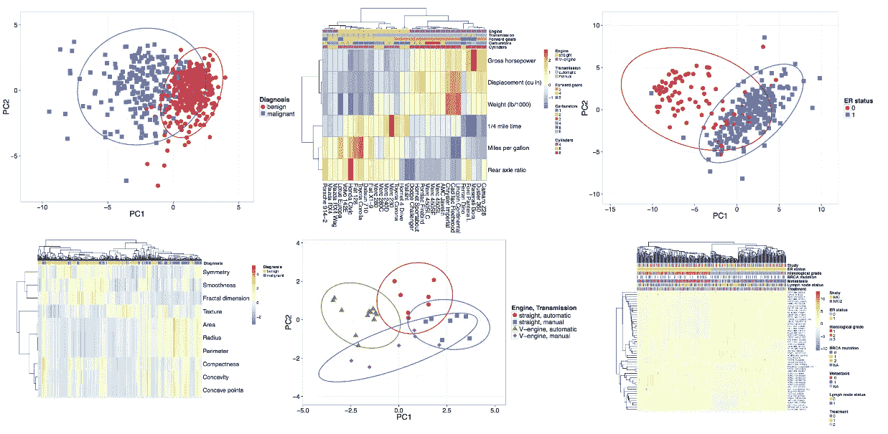
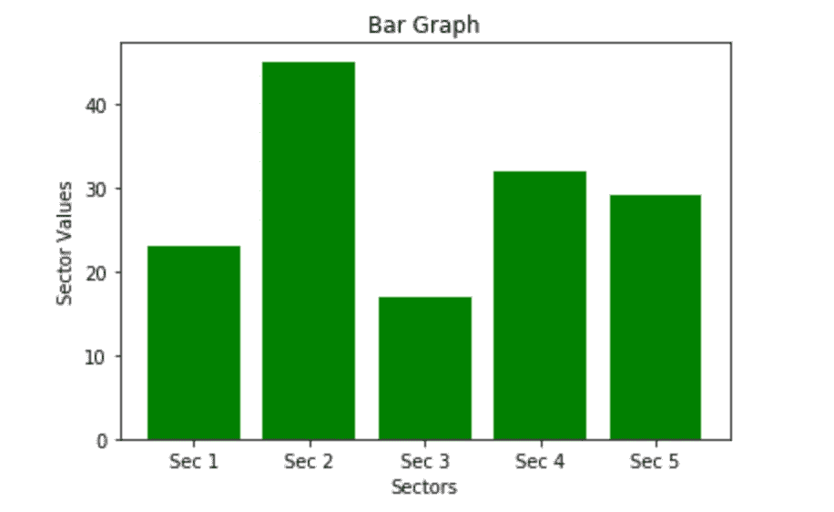
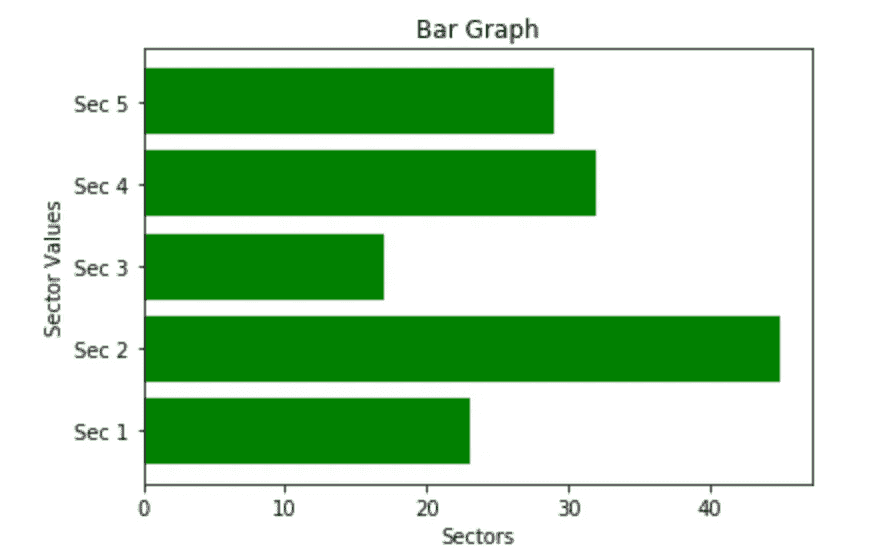
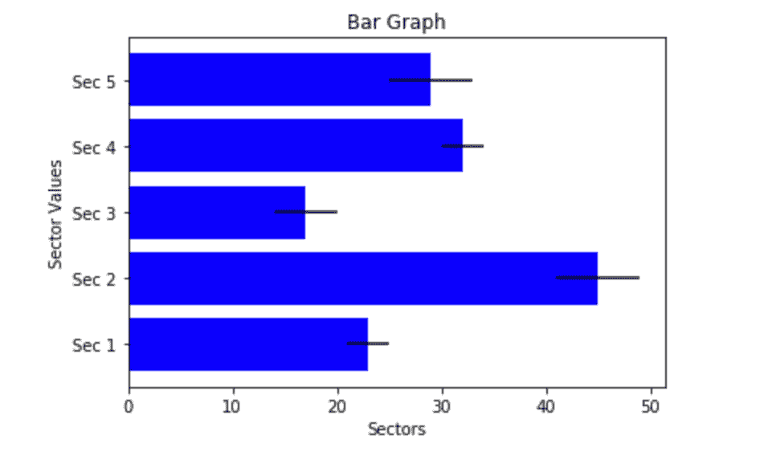
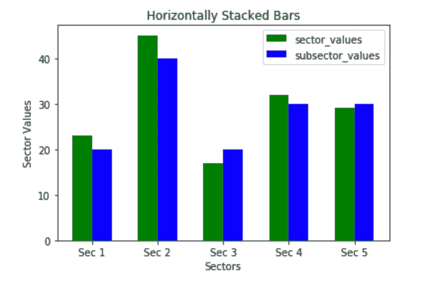
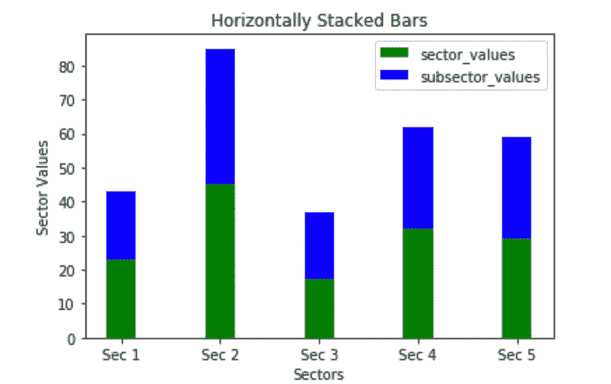
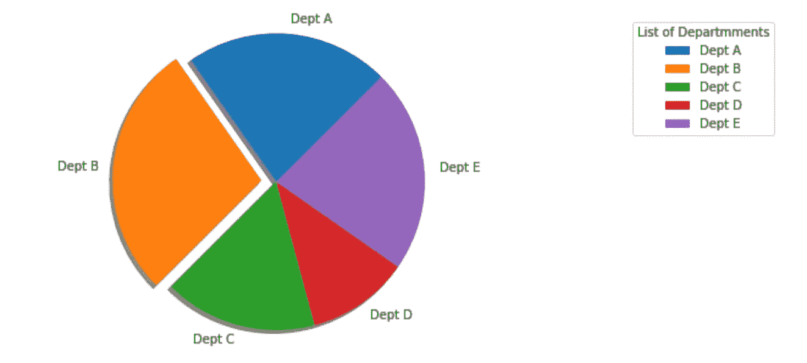
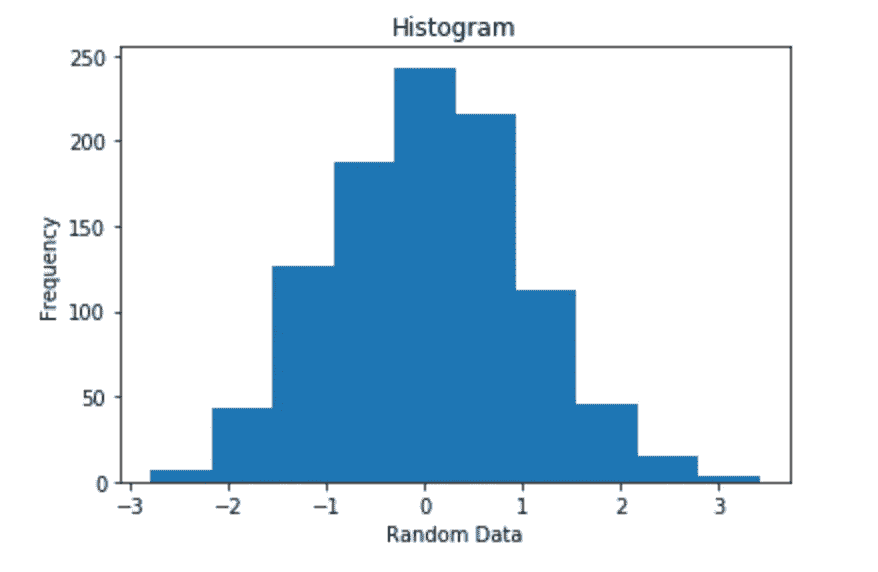
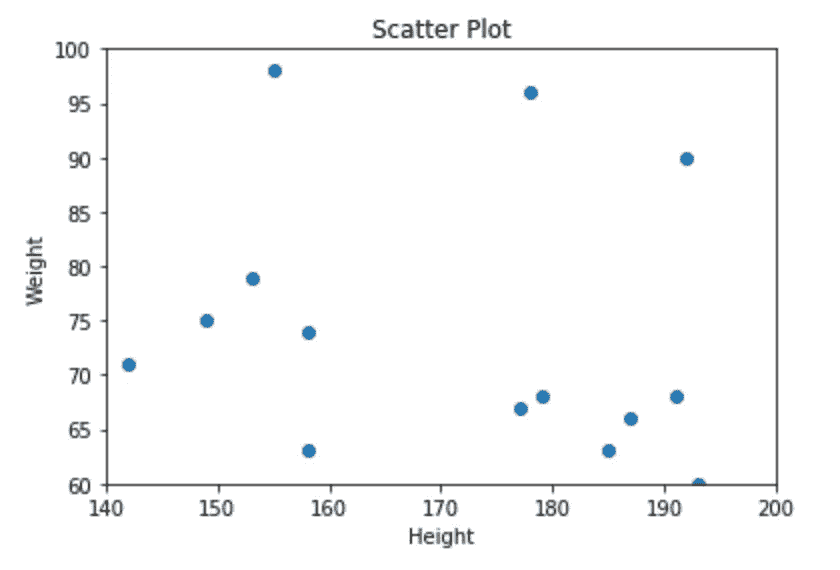
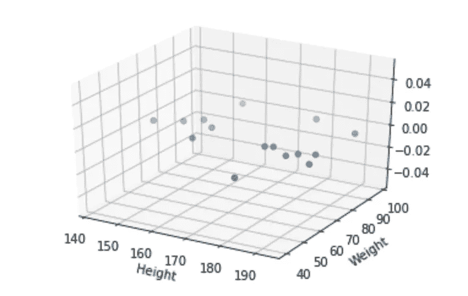

# Matplotlib 备忘单📊

> 原文：<https://medium.com/analytics-vidhya/matplotlib-cheat-sheet-51716f26061a?source=collection_archive---------7----------------------->

## 第二部分



最常见的图形类型是条形图，因为它易于查看分类数据。条形图很容易构建，只需要几个参数。



sectors = [ 'Sec 1 '，' Sec 2 '，' Sec 3 '，' Sec 4 '，' Sec 5' ]
sector_values = [ 23，45，17，32，29 ]
plt.bar( sectors，sector_values，color = ' green ')———**PLT . barh for horizontal Graph**
PLT . title('条形图')
PLT . xlabel(' Sectors ')
PLT . ylabel(' Sector Values))
PLT . show()

使条形图水平就像 *plt.barh()一样简单。*让我们给我们的图再添加一个属性，以便描述方差的大小。



**在您的代码中添加以下代码** variance =[2，4，3，2，4]
plt.barh( sectors，sector_values，xerr = varience，color = 'blue ')

*xerr=* 允许我们指出每个扇区值的变化量。如果需要的话，yerr= 也是一种选择。

接下来，我们将创建一个堆积条形图。看起来这个图有很多代码，但是尽你所能慢慢地浏览它，并且记住我们在创建每个图时所采取的所有步骤。



```
sectors = [‘Sec 1’,’Sec 2',’Sec 3',’Sec 4',’Sec 5']
sector_values = [ 23 , 45 , 17 , 32 , 29 ]
subsector_values = [ 20 , 40 , 20 , 30 , 30 ]index = np.arange(5)
width = 0.30plt.bar(index, sector_values, width, color = ‘green’, label = ‘sector_values’)plt.bar(index + width, subsector_values,width, color = ‘blue’, label = ‘subsector_values’)plt.title(‘Horizontally Stacked Bars’)
plt.xlabel(‘Sectors’)
plt.ylabel(‘Sector Values’)plt.xticks(index + width/2 , sectors)plt.legend(loc = ‘best’)
plt.show()
```

无需对我们的代码做太多修改，我们可以通过在 plt.bar()方法中指明我们想要放在顶部的 *bottom =* sector_values，将我们的条形图一个接一个地堆叠起来。确保去掉 *width* 变量和任何在我们的代码中调用它的实例。



index = NP . arange(5)
PLT . bar(index，sector_values，width，color = 'green '，label = ' sector _ values ')
PLT . bar(index，subsector_values，width，color = 'blue '，label = 'subsector_values '，bottom = sector_values)

接下来，让我们创建一个饼图。这很容易通过使用 *pie( )* 方法来完成。我们将从一个简单的图表开始，然后添加修改属性使其更加独特。同样，不要被这个图表需要的大量代码淹没。



plt.figure( figsize=( 15，5 ) )
hospital_dept = [ 'Dept A '，' Dept B '，' Dept C '，' Dept D '，' Dept E' ]
dept_share = [ 20，25，15，10，20 ]
Explode = [ 0，0.1，0，0，0，0]—**分解我们 Plo 的橙色部分** t
plt.pie( dept_share，explode = Explode，labels = hospital_dept，shadow =) start angle = 45)
PLT . axis(' equal ')
PLT . legend(title = "部门列表"，loc= "右上")
plt.show()

直方图用于绘制连续数据集中分数出现的频率，该连续数据集中的分数已被划分为称为箱的类。为了创建数据集，我们将使用 numpy 函数 *np.random.randn.* 这将生成具有正态分布曲线属性的数据。



x = NP . Random . randn(1000)
PLT . title(' Histogram ')
PLT . xlabel(' Random Data ')
PLT . ylabel(' Frequency ')
PLT . hist(x，10)——————**将我们随机生成的 x 值绘制到 10 个箱中。**
plt.show()

最后，让我们谈谈散点图和三维绘图。

处理回归问题时，散点图非常有用。为了创建我们的散点图，我们将创建一组任意的身高和体重数据，并将它们彼此相对绘制。



height = np.array ( [ 192，142，187，149，153，193，155，178，191，177，182，179，185，158，158 ] )
weight = np.array ( [ 90，71，66，75，79，60，98，96，68，67，40，68，63，74，63 ]) 200 )
plt.ylim( 60，100 )
plt.scatter(身高，体重)
plt.title('散点图')
plt.xlabel('身高')
plt.ylabel('体重')
plt.show()

同样的散点图也可以在 3D 中可视化。为此，我们将首先导入 *mplot3d* 模块，如下所示:

```
from mpl_toolkits import mplot3d
```

接下来，我们需要创建变量 ax，它被设置为等于我们的投影类型。

```
ax = plt.axes( projection = ‘3d’)
```

下面的代码完全重复了您之前看到的内容。



ax = PLT . axes(projection = ' 3d ')
ax . scatter 3d(身高，体重)
ax.set_xlabel('身高')
ax.set_ylabel('体重')
plt.show()

如果你已经走了这么远，你应该为自己感到骄傲。我们只讨论了 matplotlib 的基本功能，但是，正如你已经注意到的，在如何创建和执行情节方面有一点趋势。查看 [Matplotlib 示例图](https://matplotlib.org/3.1.1/tutorials/introductory/sample_plots.html)页面，以查看 Matplotlib 能够处理的更多图。

接下来我们将讨论 [Seaborn](/@mulbahkallen/seaborn-cheat-sheet-c933f473bf95) 。