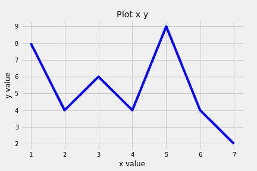
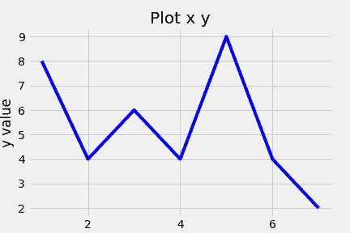
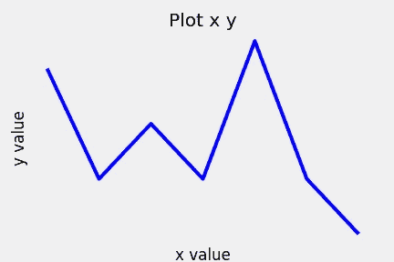
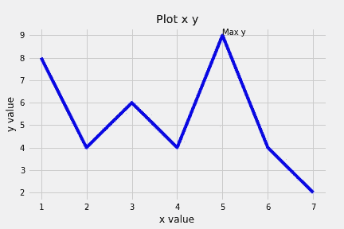
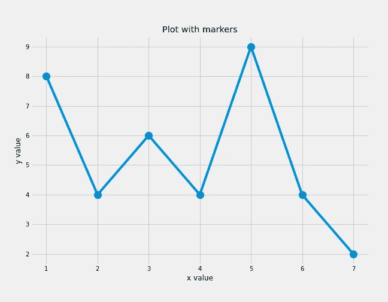
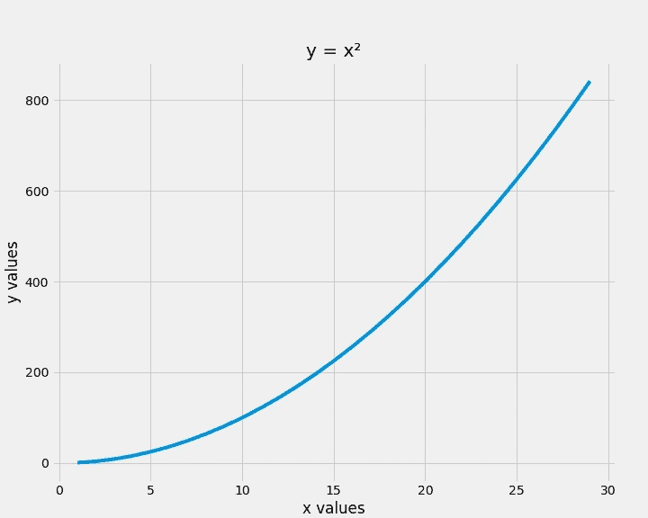
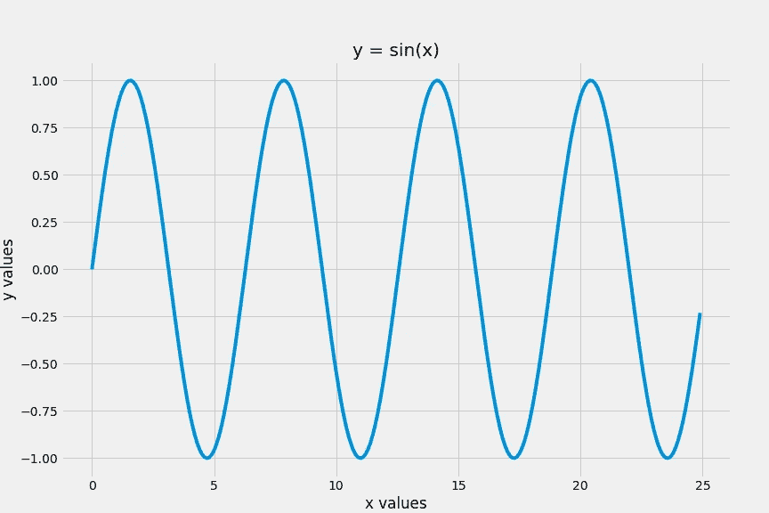
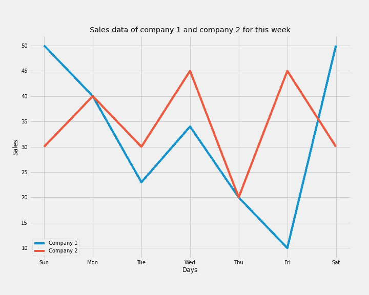
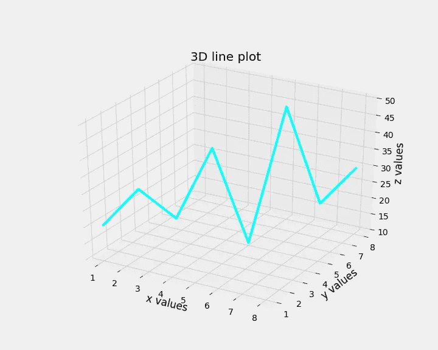

# Matplotlib 线图-何时以及如何使用它们

> 原文：<https://medium.com/analytics-vidhya/matplotlib-line-plots-when-and-how-to-use-them-836c44fdd0f0?source=collection_archive---------7----------------------->

线图是表达两个变量之间关系的好方法。为了前任。价格与产品质量。

*维基百科说一个线图是:*

折线图、折线图、折线图或曲线图是一种将信息显示为由直线段连接的一系列数据点的图表，这些数据点被称为“标记”。

这些也用于表示数据在一段时间内的趋势。

***【x，y】***

x 和 y 是数组。

# 导入必要的库

```
import matplotlib.pyplot as plt
from matplotlib import style
style.use(‘fivethirtyeight’)
```

# ***基本剧情***

```
x = [1, 2, 3, 4, 5, 6, 7]
y = [8, 4, 6, 4, 9, 4, 2]plt.plot(x, y, 'b')     # 'b' specifies blueplt.xlabel("x value")   # sets the label for x-axis of the plotplt.ylabel("y value")  # set the label for y-axis of the plotplt.title("Plot x y")  # sets the title of plotplt.show()
```



线形图

# 在图中设置刻度

您可以使用以下方式设置 x 轴和 y 轴上的刻度位置:

***PLT . x ticks(list _ ticks)***

***【PLT . yticks(list _ ticks)***

这里，list_ticks 是轴上的刻度位置列表。

如果我们传递一个空的列表，那么记号将被删除。

```
plt.plot(x, y, ‘b’) # ‘b’ specifies blueplt.xlabel(“x value”) # sets the label for x-axis of the plotplt.ylabel(“y value”) # set the label for y-axis of the plotplt.title(“Plot x y”) # sets the title of plotplt.xticks([2, 4, 6]) # sets ticks for x-axisplt.show()
```



**去除蜱**

```
plt.plot(x, y, 'b')     # 'b' specifies blueplt.xlabel("x value")   # sets the label for x-axis of the plotplt.ylabel("y value")  # set the label for y-axis of the plotplt.title("Plot x y")  # sets the title of plotplt.xticks([]) # removes ticks in x-axisplt.yticks([]) # remove ticks in y-axisplt.show()
```



无刻度线图

# ***添加注解***

注释是与图中特定点相关的额外信息。

*plt.text(x 坐标，y 坐标，注释字符串)*

我们可以通过指定数据点的坐标和注释文本的字符串来添加注释。

```
plt.plot(x, y, 'b') # 'b' specifies blueplt.xlabel("x value") # sets the label for x-axis of the plotplt.ylabel("y value") # set the label for y-axis of the plotplt.text(5, 9, "Max y") # (5, 9) is the data point to annotateplt.title("Plot x y") # sets the title of plotplt.show()
```



带注释的线图

# **地块中的标记**

图中的标记用于显示图中的数据点。

标记的大小和样式可以自定义，以美化情节。

```
plt.figure(figsize = (9, 7)) 
plt.plot(x, y, marker = 'o', markersize = 12)
plt.xlabel("x value")
plt.ylabel("y value")
plt.title("Plot with markers")
plt.show()
```



带标记的折线图

**其他标记样式**

"."对于点
“o”表示圆
“v”表示三角形 _ 下
“^”表示三角形 _ 上

# 绘制数学曲线

线图也用于绘制数学关系。

在数学中，我们有很多函数，如果你不熟悉的话。

你可以把函数想象成一台机器，它接受一个输入数字，并根据某种规则在输出中给出另一个数字。

*f(x) = x+3*

运筹学

*y = x+3*

*f(1) = 1+3 = 4*

*这里 1 是输入，4 是输出。*

在 python 中，我们对数据使用 numpy 数组，对数学运算使用 numpy 函数来绘制这些函数。

**绘制 x 的平方**

```
import numpy as np
import matplotlib.pyplot as pltx = np.arange(1, 30, 1) # creating array [1, 2, 3....., 29]y = x*x   
plt.figure(figsize= (10, 8))
plt.plot(x, y)
plt.title("y = x\u00b2")
plt.xlabel("x values")
plt.ylabel("y values")
plt.show()
```



**绘制正弦曲线**

```
import numpy as np
import matplotlib.pyplot as pltx = np.arange(0, 25, 0.1) # creating array [0, 0.1, 0.2,...., 24.9]y = np.sin(x)

plt.figure(figsize= (12, 8))plt.plot(x, y)plt.title("y = sin(x)")plt.xlabel("x values")
plt.ylabel("y values")plt.show()
```



# **堆积折线图(用于比较)**

假设我们有两家公司和他们一周的销售数据，我们想比较这些公司的表现。

在这种情况下，在一个图中使用两个折线图似乎很自然。

> 图例:这用于区分两条线图。

**语法和功能:**

***plt.plot(x1，y1，label = label _ text 1)# plot 1***

*x1 和 y1 定义数据点*

*label_text1 是第一个图的标签*

***plt.plot(x2，y2，label = label _ text 2)# plot 2***

*label_text2 是第二个图*的标签

**PLT . legend()**

用于在绘图中显示图例。

```
days = ["Sun", "Mon", "Tue", "Wed", "Thu", "Fri", "Sat"]company1 = [50, 40, 23, 34, 20, 10, 50] # sales of company1
company2 = [30, 40, 30, 45, 20, 45, 30] # sales of company 2plt.figure(figsize = (10, 8))plt.plot(days, company1, label = "Company 1") # line chart company 1plt.plot(days, company2, label = "Company 2") # line chart company 2plt.xlabel("Days")
plt.ylabel("Sales")
plt.legend() # using legend to differentiate the graphs of companiesplt.title("Sales data of company 1 and company 2 for this week")
plt.show()
```



堆积折线图

# 三维线图

当特征受两个变量影响时，使用 3D 图。

数学上，我们可以说函数依赖于两个变量。

为了前任。

***f(x，y) = x+y***

运筹学

**z = x+y**

为了制作 3D 绘图，我们需要导入一个 *mplot3d 工具包。*

导入之后，我们需要将 *projection="3d"* 参数传递给 axes 函数。

```
from mpl_toolkits import mplot3d
import matplotlib.pyplot as pltplt.figure(figsize = (10, 8))ax = plt.axes(projection=”3d”)plt.title(“3D line plot”)
# Data for a three-dimensional line
xline = [1,2,3,4,5,6,7,8]
yline = [1,2,3,4,5,6,7,8]
zline = [20, 30, 20, 40, 10, 50, 20, 30]ax.plot3D(xline, yline, zline, ‘cyan’)ax.set_xlabel(“x values”)
ax.set_ylabel(“y values”)
ax.set_zlabel(‘z values’)plt.show()
```



三维绘图

**参考文献:**

[https://en.wikipedia.org/wiki/Line_chart](https://en.wikipedia.org/wiki/Line_chart)https://en.wikipedia.org/wiki/Annotationhttps://matplotlib.org/3.1.1/api/markers_api.htmlhttps://numpy.org/doc/stable/reference/routines.math.html