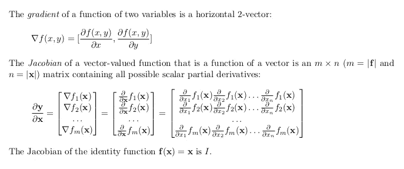
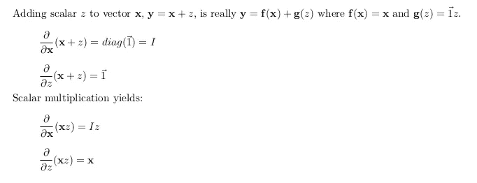

# 用于深度学习的矩阵演算(第一部分)

> 原文：<https://medium.com/analytics-vidhya/matrix-calculus-for-deeplearning-part1-3e52e7f22f58?source=collection_archive---------27----------------------->

2020 年 5 月 29 日

学分:基于特伦斯·帕尔和杰瑞米·霍华德的论文[深度学习所需的矩阵演算](https://explained.ai/matrix-calculus/index.html)。感谢这篇论文。

这篇论文对初学者很友好，但是我想写这篇博客来记录一些要点，这样可以更好地理解这篇论文。当我们学习一些稍微困难的主题时，我们发现用我们所学的方法向一个初学者解释是困难的，他可能不知道那个领域的任何事情，所以这个博客是为初学者准备的。

深度学习就是线性代数和微积分。如果你试图阅读任何深度学习论文，矩阵微积分是理解这个概念的必要组成部分。可能是单词*需要*可能不是正确的单词，因为 Jeremy 的课程显示了如何在只有最低水平的微积分的情况下成为世界级的深度学习实践者，请查看 [fast.ai](https://course.fast.ai/) 了解课程。

我以三篇博客的形式写下了我对纸的理解。这是第一部分，并检查该网站的两个以上的部分。

深度学习基本上是使用多层神经元。每个神经元是做什么的？？

# 介绍

每个神经元对输入应用一个函数并给出一个输出。神经网络中单个计算单元的激活通常使用边权重向量 **w** 与输入向量 **x** 加上标量偏差(阈值)的点积来计算:

z(x) = **w** **x** + b

粗体字母是矢量。 **w** 是矢量

函数 *z(x)* 被称为该单元的仿射函数，后面是一个校正的线性单元，它将负值剪裁为零:max(0，z(x))。这种计算发生在神经元中。神经网络由许多这样的单元组成，组织成称为层的多个神经元集合。一层单位的激活成为下一层单位的输入。当输入、权重和函数被视为向量时，数学变得简单，而价值流可以被视为矩阵运算。

这里使用的最重要的数学是*微分*，计算变化率和优化损失函数以减少误差是主要目的。训练阶段就是选择权重 **w** 和偏置 *b* ，这样我们就能得到所有 N 个输入 **x** 的期望输出。为此，我们最小化损失函数。为了减少损失，我们使用 SGD。测量输出相对于重量变化的变化与计算输出 w.r.t 重量 **w** 的(偏)导数是一样的。所有这些都需要激活(x)相对于模型参数 **w** 和 *b* 的偏导数(梯度)。我们的目标是逐渐调整 **w** 和 *b* ，使所有 **x** 输入的总损失函数不断变小。

# 标量导数规则

解决问题所需的基本规则

# 偏导数

神经网络是多个参数的函数，所以我们来讨论一下。\ xy 的导数是什么(x 和 y 相乘)？？这取决于我们是相对于 x 还是 y 变化，我们一次计算一个变量的导数，给出两个导数，在这种情况下，我们称之为偏导数。用δ符号代替 *d* 来表示。\关于 *x* 的偏导数只是通常的标量导数，只是将方程中的任何其他变量视为常数。

# 矩阵计算

我们会看到如何计算 f(x，y)的梯度

f(x，y)的梯度只是它的偏导数的向量。\梯度向量组织特定标量函数的所有偏导数。如果我们有两个函数，我们也可以通过堆叠梯度将它们的梯度组织成一个矩阵。当我们这样做时，我们得到雅可比矩阵，其中梯度是行。

为了更普遍地定义雅可比矩阵，让我们将多个参数组合成一个向量自变量:f (x，y，z)f(**x**)

设 **y** = f ( **x** )是 m 个标量值函数的向量，每个函数取长度为 n = |x|的向量 **x** \其中|x|是 x 中元素的基数(计数)

y₁= f₁(x)= 3 倍₁x₂

y₂ = f₂(x) = 2x₁ + x⁸₂

雅可比矩阵是所有 m × n 个可能偏导数(m 行 n 列)的集合，是 m 个梯度相对于 **x.** 的叠加

恒等函数 **f** ( **x** ) = **x** ，其中 fi ( **x** ) = x i，具有 n 个函数，并且每个函数具有保存在单个向量 **x** 中的 n 个参数。因此，雅可比矩阵是一个方阵，因为 m = n

# 向量的逐元素运算

在深度学习中，了解元素智能操作非常重要。对于元素式二元运算，我们简单地说就是将一个运算符应用于每个向量的第一项以获得输出的第一项，然后应用于输入的第二项以获得输出的第二项，依此类推。我们可以用符号 y = f (w) O g(x)来概括基于元素的二元运算，其中 m = n = |y| = |w| = |x|

# 涉及标量展开的导数

当我们将标量乘或加到向量上时，我们隐式地将标量扩展为向量，然后执行元素级的二元运算。例如

(符号-> 1 代表一个适当长度的向量。z 是任何不依赖于 x 的标量，这很有用，因为对于任何 x，I，∂z/∂x=为 0，这将简化我们的偏导数计算

# 向量和归约

对向量的元素求和是深度学习中的重要操作，例如网络损失函数。\设 y = sum( **f** ( **x** ))。请注意，我们在这里很小心地将参数保留为向量 **x** ，因为每个函数 f i 都可以使用向量中的所有值，而不仅仅是 x i。

在简单 y = sum( **x** )= [1，1 …1]的梯度中。因为对于 j，∂x i/ ∂x j = 0！= i .转置，因为我们假设默认为垂直向量。保持所有向量和矩阵的形状有序是非常重要的，否则就不可能计算复杂函数的导数。

**#博客 9**

对我有帮助的链接:特伦斯·帕尔和杰瑞米·霍华德的论文[深度学习所需的矩阵演算](https://explained.ai/matrix-calculus/index.html)。

Nikhil B 的博客

这是博客的第一部分，在博客 2 中，我会解释链式法则。

*原发布于*[*https://kirankamath . netlify . app*](https://kirankamath.netlify.app/blog/matrix-calculus-for-deeplearning-part1/)*。*