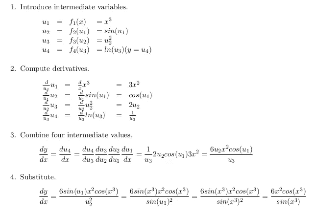
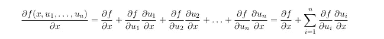
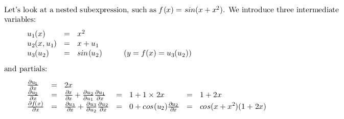
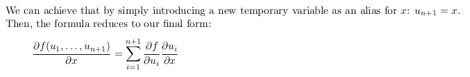
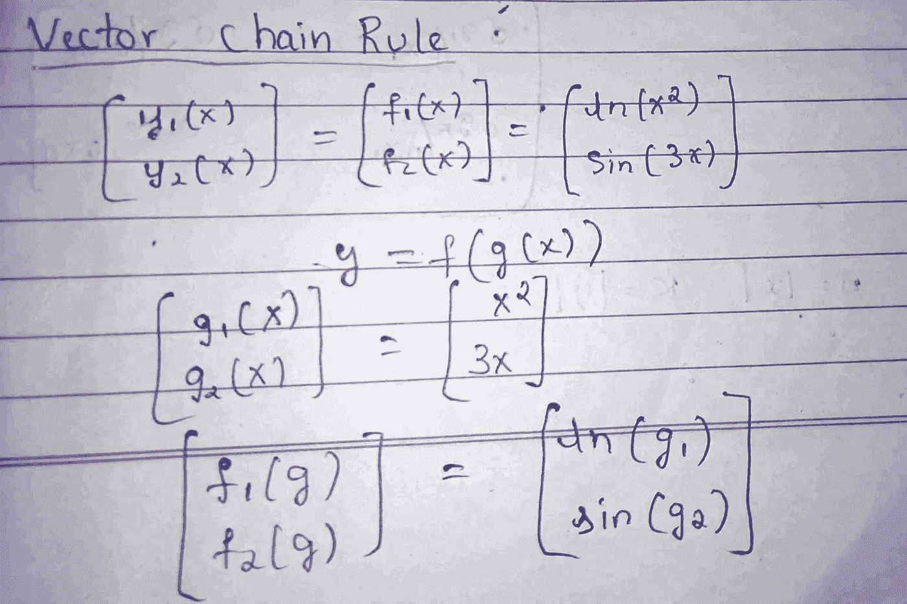
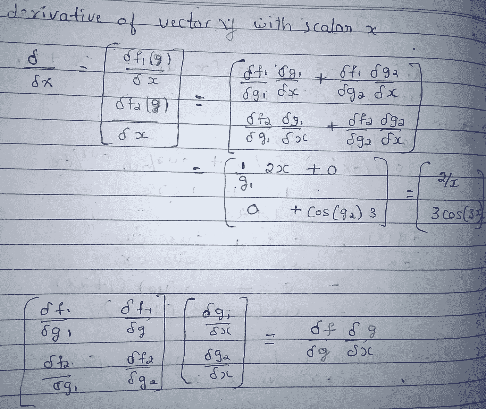
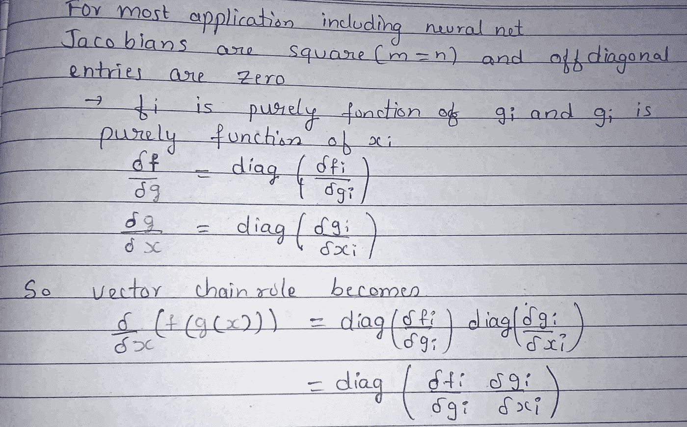

# 深度学习的矩阵演算(下)

> 原文：<https://medium.com/analytics-vidhya/matrix-calculus-for-deeplearning-part2-747451ad29e?source=collection_archive---------25----------------------->

2020 年 5 月 29 日

我们不能仅仅使用基本的矩阵运算规则来计算非常复杂的函数的偏导数，我们已经看过[博客第一部分](https://kirankamath.netlify.app/blog/matrix-calculus-for-deeplearning-part1/)。例如，我们不能直接对像 sum( **w** + **x** )这样的嵌套表达式求导，而不将其还原为标量等价。我们需要能够使用向量链规则来组合我们的基本向量规则。

在论文中，他们定义并命名了三种不同的链式法则。

1.  单变量链规则
2.  单变量全导数链规则
3.  向量链规则

当我们需要由嵌套子表达式组成的表达式的导数时，链规则就发挥作用了。链式法则通过将复杂的表达式分解成导数易于计算的子表达式来帮助解决问题。

# 单变量链规则

链规则是根据嵌套函数定义的，例如 *y=f(g(x))* 用于单变量链规则。

公式为

dy/dx = (dy/du) (du/dx)

使用单变量链规则求解有 4 个步骤

1.  引入中间变量
2.  计算中间变量相对于其参数的导数。
3.  通过将所有导数相乘来合并它们
4.  将中间变量代入导数方程。

让我们看看嵌套方程 y = f (x) = *ln* (sin(x))的例子

就是孤立地计算中间变量的导数！

但是，只有当单个变量只能以一种方式影响产出时，单变量链规则才适用。正如我们在示例中看到的，只有当 x 可以通过单个数据流路径影响 y 时，我们才能使用此链规则处理单个变量 *x* 的嵌套表达式。

# 单变量全导数链规则

如果我们对 **y = f (x) = x + x** 应用单变量链规则，我们会得到错误的答案，因为导数算子不适用于多元函数。方程中 x 的变化，既影响 y 作为加法的操作数，也影响 y 作为平方的操作数。所以我们显然不能应用单变量链规则。所以…

我们转向全微分。

也就是计算(dy/dx)，我们需要把 x 的变化对 y 的变化所有可能的贡献加起来。

全导数链法则公式

总导数假设所有变量潜在地相互依赖，而偏导数假设所有变量，但 *x* 是常数。

当你对 x 求导时，其他变量也可能是 x 的函数，所以也要加上它们的贡献。等式的左边看起来像典型的偏导数，但右边实际上是全导数。

让我们看一个例子，

总导数公式总是*对*求和，也就是对导数中的项求和。例如，给定 y = x × x，而不是 y = x + x，全导数链规则公式仍然添加偏导数项，有关更多详细信息，请参见论文中的演示。

全微分公式可以进一步简化。

当所有中间变量都是单个变量的函数时，这种考虑总导数的链式法则退化为单变量链式法则。

# 向量链规则

样本向量函数相对于标量的导数， **y** = **f** (x)。

引入两个中间变量，g 1 和 g 2，每个 f i 一个，这样 y 看起来更像**y**=**f**(**g**(x))

如果我们把这些项分开，把它们分离成一个向量，我们得到一个向量矩阵。

这就完成了链式法则。在第三部分的下一篇博客中，我们将会看到我们如何应用神经激活和损失函数的梯度并总结。

谢谢你。

有用的观点:

在 markdown 中写博客很难转换成上标和下标，所以我列出来了，你可以在 markdown 中使用(复制粘贴)

上标⁰⁴⁵⁶⁷⁸⁹ᵃᵇᶜᵈᵉᶠᵍʰᶦʲᵏˡᵐⁿᵒᵖʳˢᵗᵘᵛʷˣʸᶻ

下标₀₁₂₃₄₅₆₇₈₉ₐᵦ𝒸𝒹ₑ𝒻𝓰ₕᵢⱼₖₗₘₙₒₚᵩᵣₛₜᵤᵥ𝓌ₓᵧ𝓏

# **博客 10**

*最初发布于*[*https://kirankamath . netlify . app*](https://kirankamath.netlify.app/blog/matrix-calculus-for-deeplearning-part2/)*。*