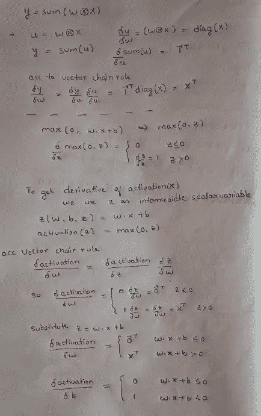
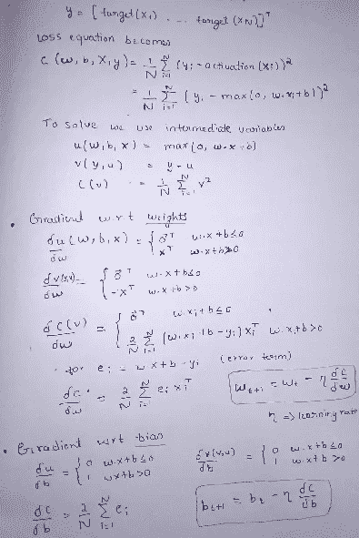

# 深度学习的矩阵演算(第三部分)

> 原文：<https://medium.com/analytics-vidhya/matrix-calculus-for-deeplearning-part3-be3f35b7deb7?source=collection_archive---------35----------------------->

2020 年 5 月 30 日

在之前的博客中，我们已经研究了雅可比矩阵、元素运算、涉及单一表达式的导数、向量和归约以及链式法则。请通过那个，[博客 1](https://kirankamath.netlify.app/blog/matrix-calculus-for-deeplearning-part1/) ，[博客 2](https://kirankamath.netlify.app/blog/matrix-calculus-for-deeplearning-part2/) 。

# 神经元激活的梯度

让我们计算单个神经网络计算单元的典型神经元激活相对于模型参数 *w* 和 b 的导数

*激活* ( **x** ) = max(0， **w** 。 **x** + b)

这代表具有完全连接的权重和 relu 的神经元。让我们计算( **w** 的导数。 **x** + b ) wrt **w** 和 b 点积 **w . x** 是元素的逐元素乘法的总和。总和的偏导数( **w** ⊗ **x** )可以通过使用中间向量变量的链式法则来计算

上面的图片使用了标量 z 上的 max(0，z)函数调用，只是说将所有负 z 值视为 0。最大值函数的导数是分段函数。当 z ≤ 0 时，导数为 0，因为 z 是常数。当 z > 0 时，max 函数的导数正好是 z 的导数，也就是 1。

当激活函数将仿射函数输出 z 裁剪为 0 时，对任何权重 w i 的导数为零。当 z > 0 时，就好像 max 函数消失了，我们只得到 z 对权重的导数。

# 神经网络损失函数的梯度

训练一个神经元需要我们对我们的损失或“成本”函数取关于我们的模型参数的导数， **w** 和 b

我们需要计算梯度权重和偏差

设 X = [x 1，x 2，…，xN ] T (T 表示转置)

如果误差是 0，那么梯度也是 0，我们已经达到了最小损失。如果 ei 是某个小的正差值，梯度就是 x 方向的一小步，如果 e 1 很大，梯度就是那个方向的一大步。我们希望减少而不是增加损失，这就是为什么梯度下降递归关系采用梯度的负值来更新当前位置。

看东西像一个向量的形状(长的或高的)，是变量标量还是向量，一个矩阵的维数。向量用粗体字母表示。读完这篇博客后，请阅读这篇文章，以获得更多的理解。

论文有独特的解释概念的方式，即从简单到复杂。当我们到达文章的结尾时，我们会自己解决，因为困难的表达是可以解决的，因为我们对简单的表达有深刻的理解。

首先，我们从 f(x)表示的简单参数的函数开始。其次，我们转向 f(x，y，z)形式的函数。为了计算这种函数的导数，我们使用相对于特定参数计算的偏导数。第三，我们移动到作为 f( **x** )的输入参数向量的标量函数，其中 f( **x** )的偏导数被表示为向量。最后，我们看到 **f** ( **x** )表示一组 f( **x** )形式的标量函数。

这是博客的最后一部分，第三部分。

谢谢你。

*最初发布于*[*https://kirankamath . netlify . app*](https://kirankamath.netlify.app/blog/matrix-calculus-for-deeplearning-part3/)*。*