# 机器学习的矩阵演算

> 原文：<https://medium.com/analytics-vidhya/matrix-calculus-for-machine-learning-e0262f0eaa8e?source=collection_archive---------0----------------------->

由于机器学习处理更高维度的数据，用一元和二元微积分知识理解算法既麻烦又缓慢。如果有人问 *x* 的导数，你会毫不犹豫地说出它的 2 *x* ，而不用运用第一原理——可微性的定义。在这里，我将提供一些技巧和窍门来执行矩阵计算，就像 *x .* 的微分一样

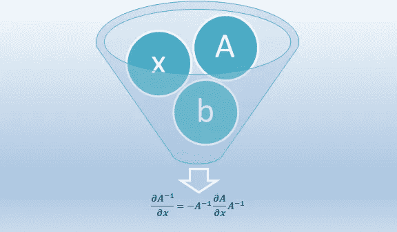

矩阵计算

# **矩阵演算的符号**

在学习阅读任何语言之前，了解字母是很重要的，对吗？所以拜托，花点时间去掌握下面的记法，这样会更容易构造单词(恒等式)，然后是句子(更复杂的方程)。

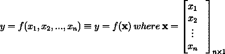

向量符号中的多元函数

**注:粗体变量是向量**。

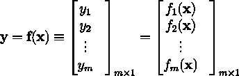

f 作为 m 个函数的向量

# **6 种常见的矩阵导数**

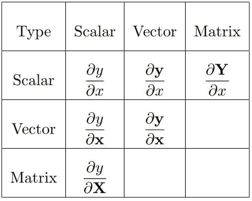

没有提到矩阵与向量和矩阵的微分，因为它可能产生二维以上的矩阵。

**矩阵微分的两种布局:分子布局和分母布局**

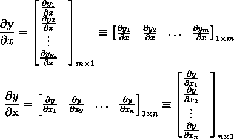

分子布局~分母布局

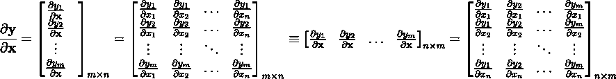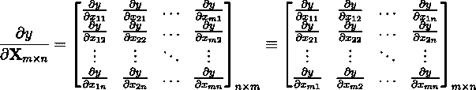

注意矩阵的维数

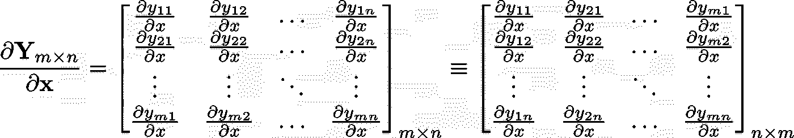

变得困惑？让我为你简化它。

**经验法则:**分子布局的维度等同于分子和分母的转置。

分母布局的维度等同于分子的分母和转置。

现在，再次回到上面的等式来理解这个技巧。

为了进一步的讨论，我们将遵循分子布局，如果你遵循分母布局，然后只需转置结果，这将在大多数情况下工作。

# 重要关系

现在，我们一步一步地构建我们的基础，这样在本文结束时，您就可以像玩魔术一样进行矩阵运算了！

**恒等式 1:** 可变矢量与恒定矢量

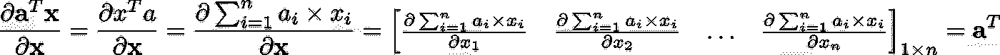

**恒等式 2:** 变量向量与常数矩阵

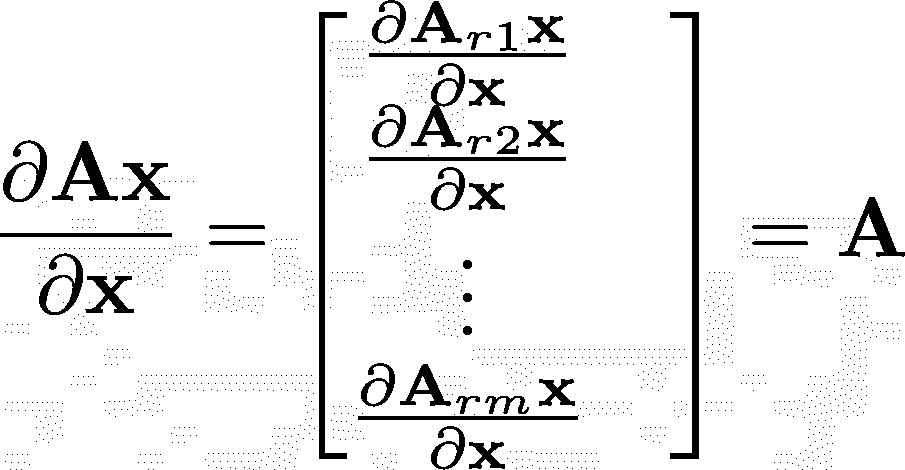

如果你不仅仅是通过看方程来理解的话，请访问我的博客查看矩阵乘法的可视化:

 [## 以四种不同的方式可视化矩阵乘法

### 如果你正在从任何教科书中学习机器学习理论，我敢打赌你在某些时候对矩阵乘法感到困惑…

medium.com](/analytics-vidhya/visualizing-matrix-multiplication-in-four-different-ways-50acd0627717) 

**恒等式 3:** 紫外线倍增法则

1.  对于矢量

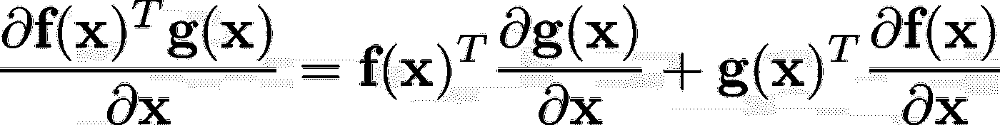

2.对于矩阵

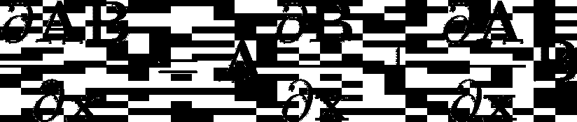

**恒等式 4:** 复合函数的微分

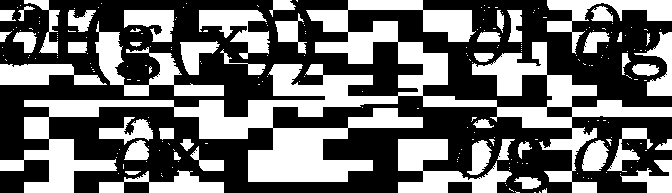

**恒等式 5:** 矩阵的逆矩阵的微分

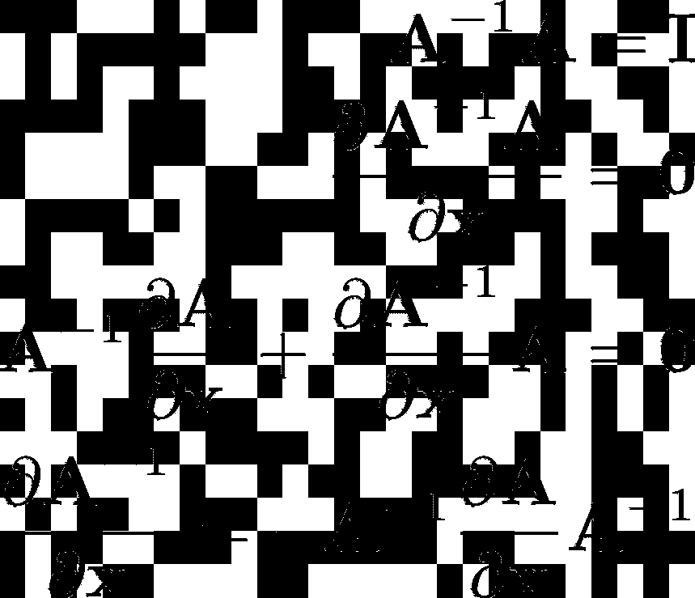

**恒等式 6:** 矩阵行列式的微分

1.  **按标量**

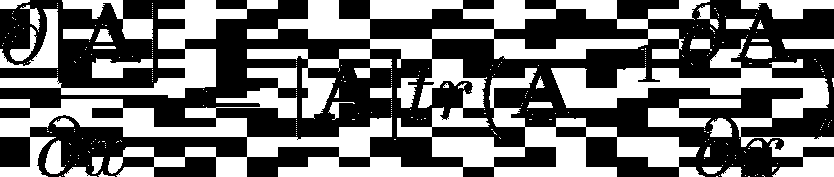

它类似于标量微分

2.**通过矢量**

将上述结果与标量和向量的微分结果相结合。

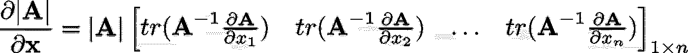

3.**通过矩阵**

将上述结果与标量与矩阵微分的结果相结合。

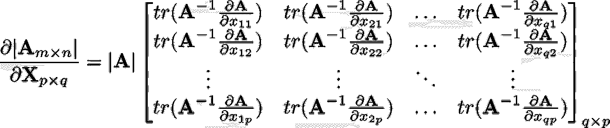

**推论**

**行列式与矩阵本身的微分**

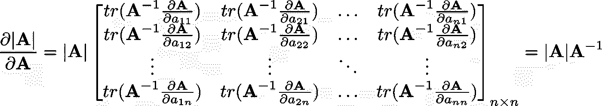

注意转置矩阵是如何再次转置的

以上三个结果可能只高出一个公式:

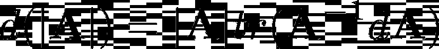

**恒等式 7:** 矩阵的微分痕迹

我们可以使用如上所示的单个表单来表示所有这三种情况

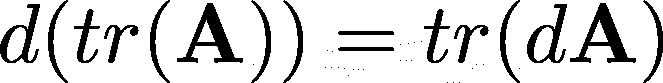

# **一些重要且常用的结果**

**带变量向量的二次表达式**

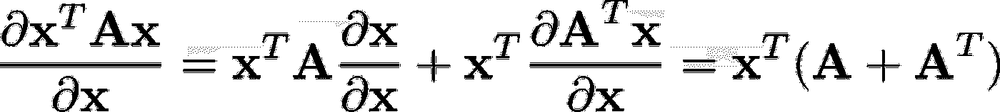

如果 A 是对称矩阵，那么，

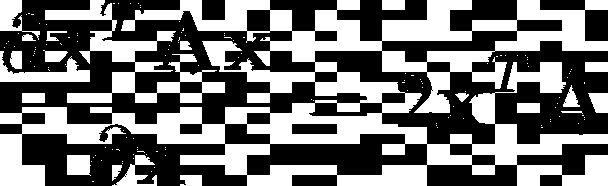

**带有 x 转置的线性表达式**

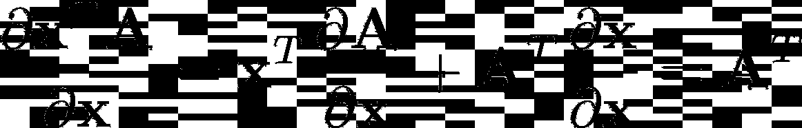

# **与机器学习相关的示例**

我们知道逻辑回归使对数损失函数最小化。现在，为了实现梯度下降，我们需要对数损失 w.r.t 参数向量的微分。

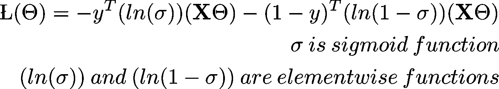

**乙状结肠功能的微分**

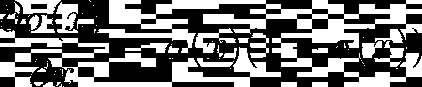

**测井曲线损失 w.r.t .参数向量的微分**

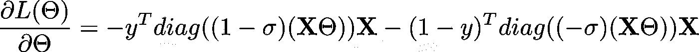

不确定对角线是如何进入画面的？让我展示给你看。

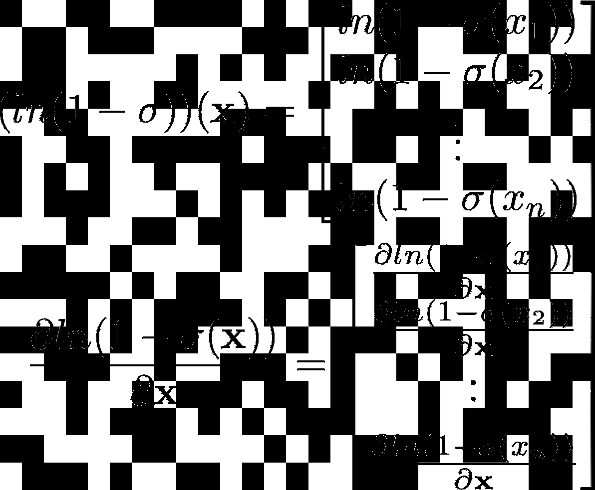

这可以简化为

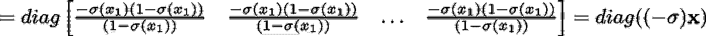

人们可以通过记住以下逻辑来避免这种冗长繁琐的想象:

**元素式函数的微分可以像标量一样进行**

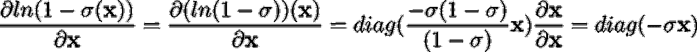

**练习**

尝试对数损失函数的二阶导数。

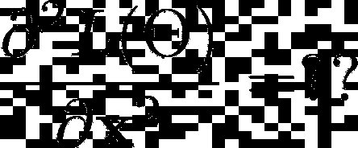

**提示:**

你需要以下身份来快速完成。甚至对数损失函数的一阶导数也可以简单地通过使用**哈达玛乘积(逐元素乘积)**的恒等式来完成

**奖金身份:**

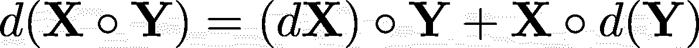

如果你觉得上面的文章有用，请分享对我作品的喜爱，它激励我为你写更多高质量的内容:)

**参考文献:**

1.  [https://medium . com/analytics-vid hya/visualizing-matrix-multi-in-four-different-ways-50 ACD 0627717](/analytics-vidhya/visualizing-matrix-multiplication-in-four-different-ways-50acd0627717)
2.  矩阵微分:Randal J. Barnes 美国明尼苏达州明尼阿波利斯大学土木工程系
3.  深度学习需要的矩阵演算:特伦斯·帕尔和杰瑞米·霍华德
4.  黑客帝国食谱:[http://matrixcookbook.com](http://matrixcookbook.com)
5.  hada mard _ product:h[ttps://en . Wikipedia . org/wiki/hada mard _ product _(matrix)](https://en.wikipedia.org/wiki/Hadamard_product_(matrices))